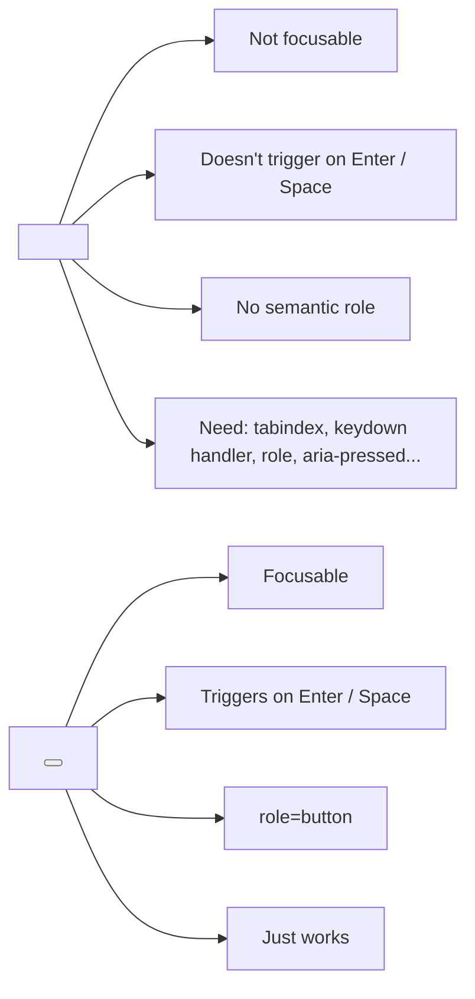
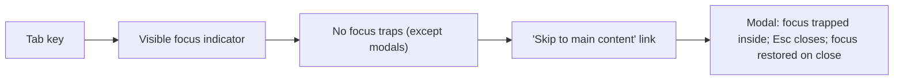
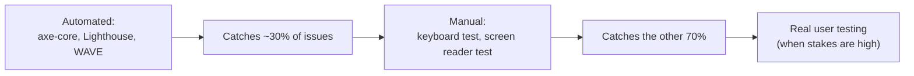

# Accessibility: WCAG, ARIA, semantic HTML, keyboard navigation, screen readers

Accessibility (a11y) means people with disabilities can use your app. Senior frontend interviews probe this seriously — at large companies it's a legal requirement (ADA, EAA, EN 301 549), and at any company it's a quality signal. **Most a11y bugs are easy to fix once you can recognise them.**

The biggest a11y mindset shift: **the page is not just for sighted users with a mouse**. Screen reader users, keyboard-only users, users with low vision, motor impairments, cognitive disabilities, and those on slow networks or small screens all interact differently.

## WCAG — the standard

The Web Content Accessibility Guidelines (WCAG) 2.1 (and 2.2) are the global standard. Three conformance levels: **A** (minimum), **AA** (legal default), **AAA** (aspirational).

WCAG organises around four principles — **POUR**:

| Principle          | Meaning                                                   |
| ------------------ | --------------------------------------------------------- |
| **P**erceivable    | User can detect the content (text alternatives, contrast) |
| **O**perable       | User can navigate and use (keyboard, no time traps)       |
| **U**nderstandable | Content is readable; UI is predictable                    |
| **R**obust         | Works with assistive tech (valid HTML, ARIA)              |

**Aim for AA** by default. Most companies and laws use this as the baseline.

## Semantic HTML — the foundation

The single biggest a11y win is using the right HTML element for the job.

```html
<!-- BAD — no semantics, requires manual ARIA + JS -->
<div onclick="submit()">Submit</div>

<!-- GOOD — button gets keyboard, focus, aria role for free -->
<button onclick="submit()">Submit</button>
```



| Element                                  | Use                                                |
| ---------------------------------------- | -------------------------------------------------- |
| `<button>`                               | Anything that triggers an action                   |
| `<a href>`                               | Anything that navigates                            |
| `<input>`, `<select>`, `<textarea>`      | Form controls                                      |
| `<label>`                                | Associate text with a form control                 |
| `<nav>`, `<main>`, `<aside>`, `<footer>` | Page landmarks (screen reader navigates by region) |
| `<h1>` to `<h6>`                         | Document outline; screen readers jump by heading   |
| `<ul>`, `<ol>`, `<li>`                   | Lists; readers say "list, 5 items"                 |
| `<table>`, `<th scope>`                  | Tabular data with header relationships             |
| `<dialog>`                               | Modal dialogs (with browser support for backdrop)  |

**Anti-pattern**: `<div role="button" tabindex="0">` everywhere. Each requires manual keyboard handling and risks being wrong. Use `<button>`.

## ARIA — only when semantic HTML can't

ARIA (Accessible Rich Internet Applications) attributes describe what an element is, what it does, and what state it's in.

**First rule of ARIA**: don't use ARIA. Use semantic HTML. ARIA fills in only where HTML doesn't have a native element (custom widgets like combobox, tree, slider).

**Second rule**: when you must use ARIA, use it correctly. Wrong ARIA is worse than no ARIA — it lies to assistive tech.

| Attribute                      | Use                                                          |
| ------------------------------ | ------------------------------------------------------------ |
| `role="..."`                   | What the element is (button, dialog, alert, navigation)      |
| `aria-label="..."`             | Accessible name when visible label not present (icon button) |
| `aria-labelledby="id"`         | Reference visible text as label                              |
| `aria-describedby="id"`        | Additional description                                       |
| `aria-expanded="true/false"`   | For collapsible sections                                     |
| `aria-controls="id"`           | Element controls another                                     |
| `aria-pressed="true/false"`    | Toggle button state                                          |
| `aria-current="page"`          | Current item in a set                                        |
| `aria-live="polite/assertive"` | Announce dynamic changes (toasts, errors)                    |
| `aria-hidden="true"`           | Hide from assistive tech (decorative icons)                  |

```html
<!-- Icon-only button — needs accessible name -->
<button aria-label="Close dialog">
  <svg aria-hidden="true">...</svg>
</button>

<!-- Collapsible section -->
<button aria-expanded="false" aria-controls="panel-1">Show details</button>
<div id="panel-1" hidden>...</div>

<!-- Live region — toasts -->
<div role="status" aria-live="polite">Saved successfully</div>
```

## Keyboard navigation

Some users only use a keyboard. Tab moves forward; Shift+Tab moves back; Enter activates buttons and links; arrow keys navigate within composites (menus, tabs, listboxes); Esc closes overlays.

**Required behaviours**:



| Component          | Keyboard behaviour                                                 |
| ------------------ | ------------------------------------------------------------------ |
| Button             | Enter / Space activates                                            |
| Link               | Enter follows                                                      |
| Form input         | Type to fill; Tab moves on                                         |
| Menu               | Arrow Up/Down moves; Enter selects; Esc closes; first letter jumps |
| Tabs               | Arrow Left/Right switches; Home/End jump to first/last             |
| Listbox / Combobox | Arrow keys; Enter selects; type-ahead                              |
| Modal              | Tab cycles within modal; Esc closes; focus restores                |

**Focus indicators**: never `outline: none` without a replacement. Tailwind's default `focus-visible:ring` is fine. The ring must be at least 3:1 contrast against the background.

**Skip links**: at the top of every page, a hidden link that becomes visible on focus and jumps past the navigation:

```html
<a href="#main" class="sr-only focus:not-sr-only">Skip to main content</a>
...
<main id="main">...</main>
```

## Screen readers

Screen readers (NVDA on Windows, VoiceOver on Mac/iOS, TalkBack on Android, JAWS) read the page aloud. They navigate by:

- **Headings** (`H` key on most readers) — page outline matters.
- **Landmarks** (`<nav>`, `<main>`) — jump to regions.
- **Lists** (`L` key) — readers announce "list, 5 items, 1 of 5: ...".
- **Form controls** — labels are essential.
- **Tables** — header cells are read with each data cell.

**Test with one**. NVDA is free; VoiceOver is built into Mac (Cmd+F5). Even 30 minutes navigating your own app with a screen reader exposes obvious bugs.

```html
<!-- Form input without label — reader says "edit text, blank" -->
<input type="email" placeholder="Email" />

<!-- With label — reader says "Email, edit text, blank" -->
<label for="email">Email</label>
<input id="email" type="email" />

<!-- Or visually-hidden label for icon-style design -->
<label for="search" class="sr-only">Search</label>
<input id="search" type="search" placeholder="Search" />
```

`placeholder` is **not** a label. It disappears on focus and has poor contrast. Always pair with a real label.

## Color contrast

WCAG AA requires:

- **Normal text**: contrast ratio ≥ 4.5:1.
- **Large text** (18pt+ regular, 14pt+ bold): ≥ 3:1.
- **UI components** (focus rings, form borders, icons): ≥ 3:1.

Tools:

- Browser DevTools' contrast checker (in the colour picker).
- WebAIM Contrast Checker.
- Axe DevTools extension.

**Do not** use colour alone to convey information. A red error icon needs an "error" label or icon shape. Colour-blind users miss colour-only signals.

## Forms

```html
<!-- Labelled, with error and instructions -->
<label for="password">Password</label>
<input
  id="password"
  type="password"
  aria-describedby="password-help password-error"
  aria-invalid="true"
  required
/>
<small id="password-help">Minimum 12 characters; at least one number.</small>
<span id="password-error" role="alert">Password must include at least one number.</span>
```

Patterns:

- Always `<label for>` (or `aria-label` for icon-only).
- Group related fields with `<fieldset>` + `<legend>` (e.g. radio group).
- Use `aria-invalid="true"` on errored fields.
- Errors announced via `role="alert"` or `aria-live="assertive"`.
- Required fields: native `required` attribute is read by screen readers.
- Don't reset focus on every keystroke; let the user finish typing.

## Images and media

```html
<!-- Decorative image — empty alt skips reader -->


<!-- Informational image -->


<!-- Complex image with detailed description elsewhere -->

<p id="arch-desc">[Detailed description]</p>

<!-- Icon as button content -->
<button aria-label="Delete">
  <svg aria-hidden="true">...</svg>
</button>
```

Video and audio:

- Captions for video (WebVTT subtitles).
- Transcripts for audio.
- Don't autoplay sound.
- Respect `prefers-reduced-motion` for animations.

## Motion and animations

```css
@media (prefers-reduced-motion: reduce) {
  *,
  *::before,
  *::after {
    animation-duration: 0.01ms !important;
    transition-duration: 0.01ms !important;
  }
}
```

Some users get motion sickness from parallax, autoplay, and large transitions. Honour the OS-level setting.

## Mobile and touch

- Tap targets at least 44×44 CSS pixels (WCAG AAA; AA is 24×24).
- Don't trap horizontal scroll.
- Test at 200-400% zoom — content should reflow, not require horizontal scroll.

## Testing



| Test                | What it catches                                     |
| ------------------- | --------------------------------------------------- |
| axe-core / jest-axe | Missing labels, contrast, ARIA misuse               |
| Lighthouse          | Audit a page; suggests fixes                        |
| Keyboard test       | Tab through page; can you reach and use everything? |
| Screen reader test  | Does what's announced match the page?               |
| Browser zoom 200%   | Does layout break?                                  |
| Color blindness sim | Are signals colour-only?                            |

**Automated tools find ~30%** of issues. Keyboard + screen reader spot-check is essential.

## Common pitfalls

- **`<div>` instead of `<button>`**. Loses keyboard, focus, semantics.
- **`outline: none`** without a replacement focus ring.
- **Placeholder as label**. Disappears on focus; poor contrast.
- **Modal without focus management**. Open modal → focus stays at trigger; user is lost. Trap focus inside; restore on close.
- **`aria-hidden` on a focusable element**. Confuses screen readers.
- **Click handlers on non-button elements** without keyboard equivalents.
- **Live regions for everything**. Constant announcement noise. Only for genuinely important updates.
- **Color-only feedback**. Red border without "error" text fails for colour-blind users.
- **Carousels with no pause** for users who can't keep up.
- **Auto-advancing content** without user control.

## Interview answers

_Q: What's the difference between `aria-label` and `aria-labelledby`?_
A: `aria-label` provides a string accessible name directly. `aria-labelledby` references the IDs of one or more elements whose visible text becomes the name. Prefer `aria-labelledby` when the label exists visibly on the page; use `aria-label` for icon-only buttons or when the visible text would be redundant.

_Q: When should you use ARIA roles vs semantic HTML?_
A: First rule of ARIA: don't. `<button>` beats `<div role="button" tabindex="0" onkeydown="...">` every time. Use ARIA only for custom widgets HTML doesn't have natively (combobox, tree, slider). When you do use ARIA, follow ARIA Authoring Practices Guide patterns exactly.

_Q: How do you make a custom dropdown accessible?_
A: Either use `<select>` (best). Or build a `role="combobox"` with `aria-expanded`, `aria-controls`, `aria-activedescendant`, full arrow-key navigation, type-ahead, Escape to close, focus restoration. Considerable work — use a vetted library (Radix, Reach, Headless UI) instead of building from scratch.

_Q: How do you announce a toast notification?_
A: Wrap it in `role="status"` (polite) for success/info, or `role="alert"` (assertive) for errors. The screen reader announces the content when it appears. Don't put toasts inside `aria-hidden` containers; they won't announce.

_Q: What's a focus trap and when do you need one?_
A: A focus trap keeps Tab key navigation inside a region. Required for modals — when open, focus must not escape into the page behind. Implement: on open, move focus to first focusable element; on Tab, wrap from last to first; on Escape, close and restore focus to the trigger. Libraries: focus-trap, Reach UI dialog.

_Q: How would you test a complex page for accessibility?_
A: Run axe in CI and on the page. Manually keyboard-navigate the entire flow — can you reach and use every interactive thing without a mouse? Test with a screen reader on the critical paths. Zoom to 200%; layout should reflow. Disable styles temporarily — does the document still make semantic sense?

_Q: How do you handle a page with thousands of dynamically-added items for screen readers?_
A: Don't announce every addition. Use `aria-live="polite"` only for status messages. For lists that grow, screen reader users navigate by item; they don't need each new item announced. If announcement matters (chat messages), throttle and summarise: "3 new messages."

_Q: What's the difference between `aria-hidden` and `display: none`?_
A: `display: none` removes from layout AND assistive tech. `aria-hidden="true"` removes from assistive tech but element still occupies layout. `visibility: hidden` removes from layout but reader still sees. Use the right one: hide visually but keep for readers (`sr-only` class), hide from readers but keep visually (`aria-hidden`), hide both (`display: none`).
