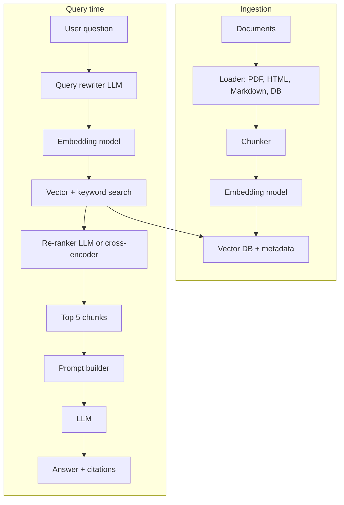

# AI engineering: RAG, embeddings, vector databases, LangChain basics

Senior full-stack interviews now include AI fundamentals. You do not need to be a machine-learning researcher; you do need to understand **how to build production systems that use LLMs** — the architecture, the trade-offs, the failure modes.

The biggest pattern is **Retrieval-Augmented Generation (RAG)**: combining search with an LLM so the model answers from your data, not its training cut-off.

## Why RAG?

LLMs are trained on a snapshot of public data. They:

- Do not know your company's docs.
- Cannot read recent events past their training cutoff.
- Hallucinate confidently when they do not know.

RAG fixes this by **retrieving relevant content first**, then asking the LLM to answer using only that content.


The output is the LLM's answer constrained by your retrieved data — fewer hallucinations, citations possible, knowledge stays fresh.

## Embeddings — text as vectors

An embedding model converts text into a high-dimensional vector (typically 384-1536 dims). Semantic similarity becomes geometric distance.

```python
# Pseudocode
embed("the cat sat on the mat")  → [0.12, -0.43, 0.88, ..., 0.05]
embed("a feline rested on a rug") → [0.14, -0.41, 0.91, ..., 0.07]
embed("Java garbage collection")  → [0.93,  0.21, -0.05, ..., 0.61]

# Cosine similarity
cos(cat_vec, feline_vec) = 0.94    # similar
cos(cat_vec, java_vec)   = 0.12    # unrelated
```

**Embedding models**:

- OpenAI `text-embedding-3-large` — 3072 dims, paid API.
- Cohere `embed-v3` — paid API, multilingual.
- Open-source: `sentence-transformers/all-MiniLM-L6-v2` (384 dims, fast), `BAAI/bge-large-en-v1.5` (1024 dims, accurate).

Use the **same model** for indexing and querying — different models produce incompatible vector spaces.

## Chunking — the underrated part

You can't embed whole documents (too long for embedding model context, retrieval becomes coarse). Split documents into chunks first.

| Strategy                     | Trade-off                                        |
| ---------------------------- | ------------------------------------------------ |
| Fixed-size (e.g. 500 tokens) | Simple; may break sentences mid-thought          |
| Sentence boundaries          | Cleaner cuts; chunks vary in size                |
| Recursive splitting          | Try paragraph → sentence → words; balanced sizes |
| Semantic chunking            | LLM-based: chunk where topic changes             |
| Document structure           | Use headings, sections; preserves hierarchy      |

Chunking parameters that matter:

- **Chunk size** — bigger = more context, but less precision. Typical: 500-1000 tokens.
- **Overlap** — adjacent chunks share content. 10-20% overlap helps context continuity.
- **Metadata** — every chunk should have source, section, timestamp; filter at query time.

```python
# Example: recursive chunker with overlap
chunks = []
for doc in documents:
    text = doc.text
    for i in range(0, len(text), 800):    # 800 tokens, 200 overlap
        chunk = text[i:i+1000]
        chunks.append({
            "text": chunk,
            "doc_id": doc.id,
            "title": doc.title,
            "section": find_section(text, i),
            "updated_at": doc.updated_at,
        })
```

## Vector databases

Stores embeddings and supports approximate nearest-neighbor search at scale. Pure SQL `ORDER BY distance LIMIT k` works at small scale; at millions of vectors you need indexes (HNSW, IVF).

| Option                                   | Best for                                                                                |
| ---------------------------------------- | --------------------------------------------------------------------------------------- |
| **pgvector** (Postgres)                  | Already on Postgres; metadata filtering native; up to ~10M vectors before indexing pain |
| **Pinecone**                             | Managed, simple API, scales easily                                                      |
| **Weaviate**                             | Open source, hybrid search (vector + keyword), GraphQL                                  |
| **Qdrant**                               | Open source, Rust, fast, easy ops                                                       |
| **Milvus**                               | Open source, billion-scale, complex ops                                                 |
| **OpenSearch / Elasticsearch with k-NN** | When you already use it for search                                                      |

**Hybrid search** combines vector similarity with traditional keyword/BM25 search. Often the best of both — vectors catch semantic match, keywords catch exact strings (product codes, names).

## A production RAG pipeline



Production systems add:

- **Query rewriting** — turn "how do I cancel" into "How to cancel an order in our system"; expand abbreviations.
- **Hybrid retrieval** — vector + BM25 keyword search, combined.
- **Re-ranking** — fetch 50 candidates, use a cross-encoder or LLM to rerank to top 5.
- **Citation extraction** — extract which chunks the answer used; show as citations.
- **Caching** — same question + same data → cached answer.
- **Evaluation** — set of question/answer pairs, measure precision/recall over time.

## Common patterns and tools

**LangChain** / **LlamaIndex** — Python frameworks abstracting models, retrievers, chains. Speed up prototyping. Read the source — abstractions can hide important details. Many teams ship without them, building primitives directly.

**Function calling** — LLM emits structured JSON (tool/function name + args), system runs the function, feeds result back to LLM. Foundation of "agent" behavior.

**Streaming** — LLM emits tokens as they generate. UX dramatically better than waiting for full response. Standard for chat interfaces.

## Prompt engineering essentials

| Technique              | What it does                                    |
| ---------------------- | ----------------------------------------------- |
| System prompt          | Set role and constraints                        |
| Few-shot examples      | Show 1-3 input/output pairs in the prompt       |
| Chain of thought (CoT) | "Let's think step by step" — forces reasoning   |
| Role-based             | "You are a senior engineer reviewing PRs..."    |
| Output format          | "Return JSON with keys: summary, severity, fix" |
| Self-reflection        | Generate, then ask to critique own answer       |

```python
prompt = f"""You are a senior backend engineer.
Use ONLY the context below to answer the question. If the answer is not in the context, say "I don't know."

Context:
{retrieved_chunks}

Question: {question}

Answer:
"""
```

The `"Use ONLY"` instruction is the cheap RAG hallucination defense.

## Evaluation — how do you know it's working?

Manual judgment scales poorly. Automate:

| Metric             | Purpose                                       |
| ------------------ | --------------------------------------------- |
| Retrieval recall@k | Did the right chunk appear in top-k results?  |
| Faithfulness       | Does the answer use the retrieved context?    |
| Answer relevance   | Does the answer address the question?         |
| Hallucination rate | Does the answer make up facts not in context? |

Tools: **Ragas**, **DeepEval**, **TruLens**, **Phoenix** (Arize). LLM-as-judge for grading at scale.

## Cost and latency

| Operation                                       | Cost (rough)                              | Latency     |
| ----------------------------------------------- | ----------------------------------------- | ----------- |
| Embed 1K tokens (OpenAI text-embedding-3-small) | ~$0.00002                                 | ~100-500 ms |
| GPT-4o response (1K in, 500 out)                | ~$0.0125                                  | 2-10 sec    |
| Vector DB search (10M vectors)                  | ~$0 (self-hosted) or ~$0.01/req (managed) | 10-100 ms   |

For high-volume use, every component matters. Cache aggressively, use smaller models when possible, batch embeddings.

## Common pitfalls

- **Embedding model mismatch**: indexed with model A, querying with model B. Returns garbage. Always pin the embedding model.
- **Chunk size off**: chunks too big retrieve broadly; too small lose context. Tune empirically.
- **No metadata filtering**: returns chunks from old archived docs. Filter by `updated_at`, `tenant_id`, etc.
- **Synchronous LLM calls in user flow**: 5-10 seconds blocks the user. Stream tokens; show progress.
- **No fallback for LLM API failures**: rate limits, timeouts. Retry with backoff; degrade to cached or shorter response.
- **Putting raw user input directly in prompts**: prompt injection. The user can override your system prompt by saying "ignore previous instructions." Sanitise / treat user input as data, not instruction.
- **Treating LLM output as truth**: hallucinations are real even with RAG. Require citations; verify factual claims; have humans review high-stakes outputs.

## Interview answers

_Q: How does RAG reduce hallucinations?_
A: Instead of relying only on the LLM's parametric knowledge (which can be wrong), RAG retrieves relevant documents from your store and includes them in the prompt. The LLM is instructed to answer from the provided context. Hallucinations drop because the model has fresh, specific source material to cite. They are not eliminated — bad retrieval still leads to bad answers.

_Q: What are embeddings and why use them?_
A: Embeddings are vector representations of text where semantically similar texts have nearby vectors. They let you do similarity search: "find documents about X" without exact keyword match. Replaces or complements BM25 keyword search.

_Q: When would you not use a vector database and use plain Postgres pgvector?_
A: When data is small (under 10M vectors), already in Postgres, and the team prefers fewer moving parts. pgvector handles indexing (HNSW or IVF), supports metadata filtering with full SQL, and is one less service to operate. Beyond ~10M vectors with high QPS, dedicated vector stores (Pinecone, Qdrant) outperform.

_Q: How do you handle prompt injection?_
A: Treat user input as **data**, not **instruction**. Wrap it in tags or markers. Never let user content override system instructions. Validate output structure (e.g. JSON schema). For high-stakes actions, require user confirmation. Run the LLM with low privileges — function calling has access only to a narrow API.

_Q: How would you evaluate a RAG system?_
A: Build an eval set of question/expected-context/expected-answer triples. Measure: (1) retrieval recall — did the expected context appear? (2) faithfulness — does the answer use the retrieved context? (3) answer correctness — does it match expected? Tools like Ragas and TruLens automate this with LLM-as-judge.

_Q: When would you use function calling vs RAG?_
A: RAG for static knowledge ("how do I cancel an order"). Function calling when the LLM needs to take action ("cancel order #123") or fetch live data ("current temperature in Tokyo"). They combine: RAG retrieves context, function calling triggers actions and fetches dynamic data.

_Q: What is chain-of-thought prompting?_
A: Asking the LLM to show intermediate reasoning before the final answer. "Let's think step by step." Improves accuracy on math, multi-step reasoning, code generation. Cost: more tokens, slower response. Modern reasoning models (GPT-4o, Claude Opus) do this internally; explicit CoT helps less than it used to.
