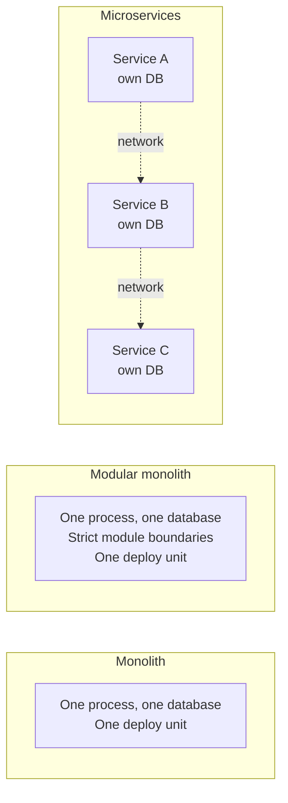
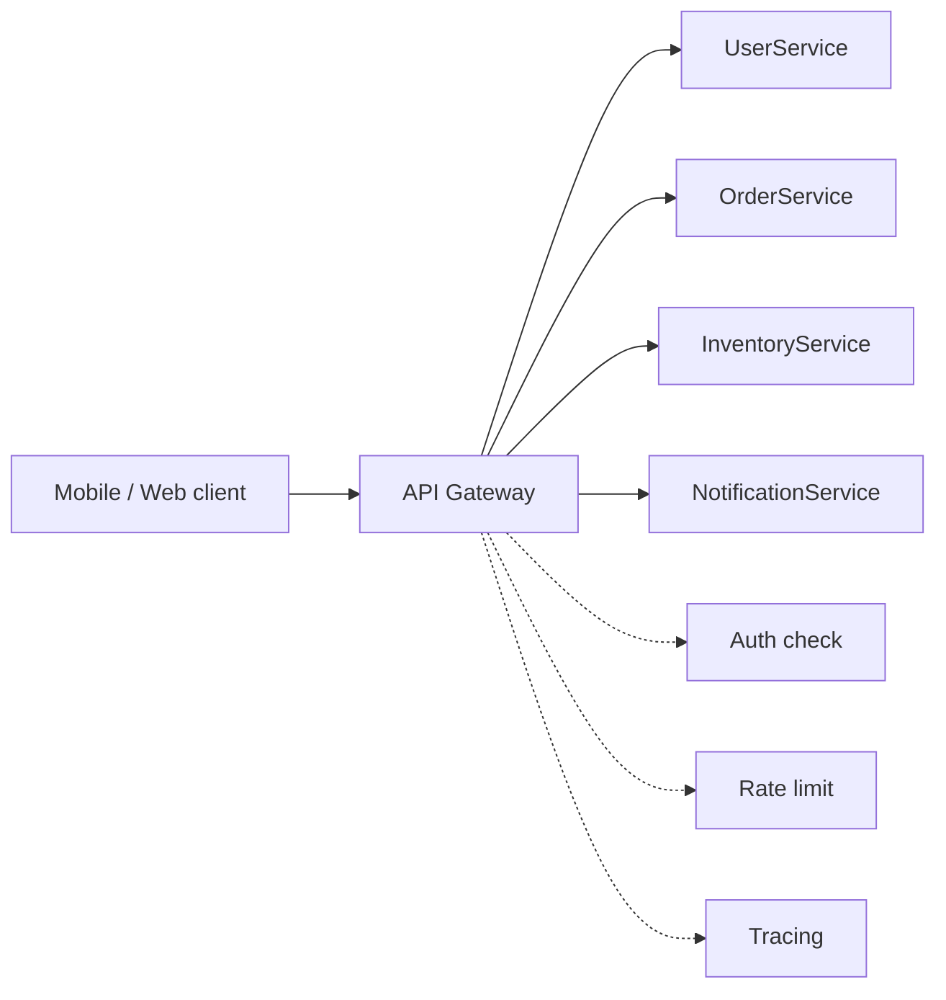
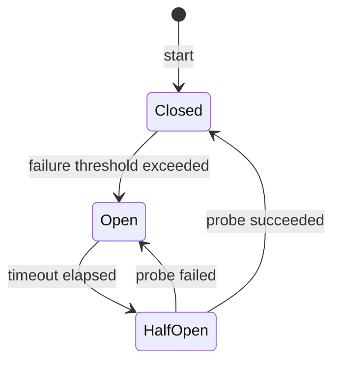
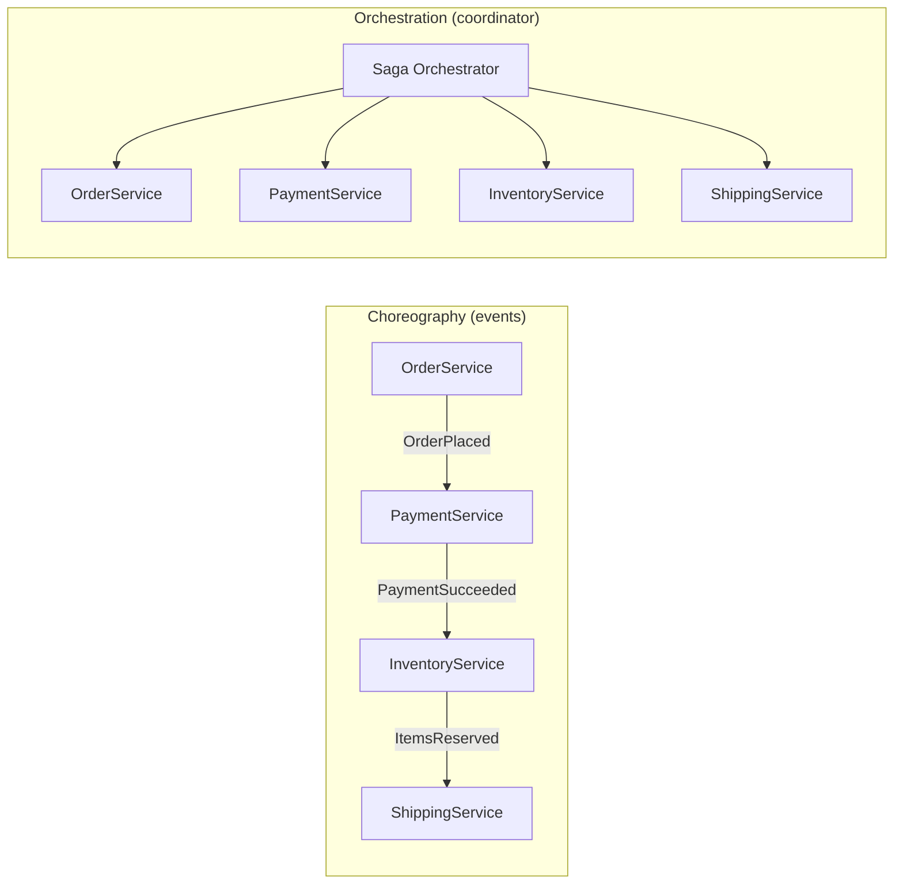
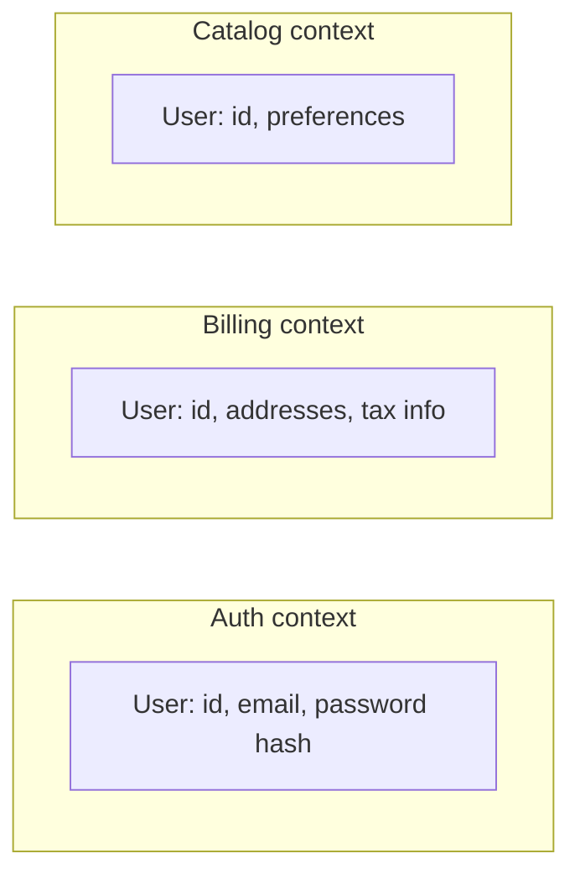

# Architecture: microservices, API gateway, circuit breaker, saga pattern

System architecture is about how big software is **decomposed**. Wrong decomposition costs years; right decomposition lets teams ship independently. Senior interviews probe whether you can recognise the trade-offs and not default to "microservices for everything."

## Monolith vs microservices vs modular monolith



| Style            | Strengths                                                  | Weaknesses                                         |
| ---------------- | ---------------------------------------------------------- | -------------------------------------------------- |
| Monolith         | Simple deploy, easy refactoring, single transaction        | Single failure surface, scaling all parts together |
| Modular monolith | Module boundaries enforced, single transaction, simple ops | Still one deploy; needs discipline                 |
| Microservices    | Team autonomy, scale parts independently, polyglot         | Network overhead, distributed data, ops            |

**The senior take**: most products start with a monolith or modular monolith. Microservices are a response to **organizational scale** (multiple teams blocking each other) more than technical scale. If two pizza teams cannot ship a single deploy unit without stepping on each other, that is when service boundaries earn their keep.

## When do microservices make sense?

| Signal                                            | Suggests                |
| ------------------------------------------------- | ----------------------- |
| 50+ engineers blocked by deploy schedule          | Microservices           |
| Different parts need different scaling profiles   | Microservices           |
| Different parts have different reliability needs  | Microservices           |
| 10 engineers, one product, one user base          | Modular monolith        |
| Complex single-transaction business logic         | Stay monolith           |
| Need polyglot stacks for different parts          | Microservices           |
| Already at "deploy weekly, release in 30 minutes" | Whatever you have works |

## API Gateway — the single front door

Microservices push complexity to the network. An API gateway centralises edge concerns so each service does not solve them.



Responsibilities:

- **Routing** — request goes to the right backend.
- **Authentication** — verify token once, pass user context to backends.
- **Rate limiting** — protect backends from abuse.
- **Aggregation** — one client request fans out to multiple backends; gateway combines responses.
- **Protocol translation** — REST in, gRPC out (or vice versa).
- **Caching** at the edge.
- **Request shaping** — strip secret headers, add correlation ids.

**Risk**: gateway becomes a god-object. Keep business logic out — the gateway routes and decorates, services own logic.

Common implementations: Kong, AWS API Gateway, Envoy + filters, Spring Cloud Gateway, Nginx with custom modules.

## Service discovery

Services in microservices change addresses (deploys, scaling, restarts). How do they find each other?

| Approach              | How                                                                   |
| --------------------- | --------------------------------------------------------------------- |
| DNS                   | Service name → DNS A record updated dynamically (Kubernetes services) |
| Client-side discovery | Client queries a registry (Consul, Eureka), picks one                 |
| Server-side discovery | Load balancer in front of services; client just calls LB              |
| Service mesh          | Sidecar proxy (Envoy) handles discovery and routing                   |

Kubernetes provides this for free via internal DNS. Outside Kubernetes, Consul or Eureka.

## Circuit breaker — fail fast, recover

When a downstream is failing, repeated calls only make it worse — and tie up your threads.



| State     | Behavior                                                   |
| --------- | ---------------------------------------------------------- |
| Closed    | Calls go through. Track failure rate.                      |
| Open      | Fail fast immediately without calling. Conserve resources. |
| Half-open | After timeout, allow one or a few probe calls.             |

```java
// Resilience4j
CircuitBreaker breaker = CircuitBreaker.of("payments", CircuitBreakerConfig.custom()
    .failureRateThreshold(50)              // 50% failures → open
    .waitDurationInOpenState(Duration.ofSeconds(30))
    .permittedNumberOfCallsInHalfOpenState(3)
    .build());

Receipt result = breaker.executeSupplier(() -> paymentClient.charge(order));
```

Pair circuit breakers with **bulkheads** (isolated thread pools per dependency) and **timeouts** (always set one, never use defaults of "infinity").

## Bulkhead pattern

If 99% of your threads are blocked on a slow dependency, healthy traffic dies too. Bulkheads isolate dependencies into separate thread pools so one slow downstream cannot starve everything.

```java
ThreadPoolBulkhead bulkhead = ThreadPoolBulkhead.of("payments",
    ThreadPoolBulkheadConfig.custom().maxThreadPoolSize(20).build());

bulkhead.executeSupplier(() -> paymentClient.charge(order));
```

## Saga — distributed transactions without 2PC

Microservices each own their data. A business operation that touches multiple services cannot use a single ACID transaction. The **saga pattern** is the answer: chain of local transactions, each with a **compensating action** for rollback.

### Two flavors



| Flavor        | Pros                                      | Cons                           |
| ------------- | ----------------------------------------- | ------------------------------ |
| Choreography  | Decentralised, no single point of failure | Hard to trace overall workflow |
| Orchestration | Easy to follow, central state, retries    | Orchestrator is a SPOF         |

### Compensation, not rollback

Every step needs a compensating action that **logically undoes** the work — refund, release inventory, cancel shipment. They are not perfect rollbacks; the world has moved on. Compensation is best-effort and idempotent.

```
Step 1: reserve inventory  → compensation: release inventory
Step 2: charge payment      → compensation: refund payment
Step 3: schedule shipment   → compensation: cancel shipment
Step 4: notify customer     → compensation: send cancellation email
```

If step 3 fails, run compensations 2 and 1 in reverse.

## Domain-driven design (DDD) — bounded contexts

DDD groups concepts by their meaning in a specific business context. The same concept can mean different things in different contexts: "User" in `Auth` is "credentials"; "User" in `Billing` is "addresses, taxes, payment methods"; "User" in `Catalog` is "preferences."

A **bounded context** is the boundary inside which one model is consistent. Bounded contexts often map to microservices.



Each context owns its data. Context boundaries are network boundaries. If you cannot define them, microservices will leak data ownership and re-create the monolith over the network.

## Common pitfalls

- **Microservices for a small team**. Network overhead, distributed transactions, ops complexity — and no benefit because no team boundaries to draw.
- **Shared database across services**. Defeats the entire purpose. If services share a DB, they are coupled at the data level even if separated at the network level.
- **Synchronous chains of 5+ services**. Each call adds latency and a failure point. Async + queues for non-critical paths.
- **No circuit breakers, no timeouts**. One slow downstream cascades into total outage.
- **Shared libraries with business logic**. Updating the library forces lock-step deploys — the worst of monolith and microservices.
- **Ignoring data locality**. Joins across services are expensive. Denormalise into each service's DB or use change-data-capture to maintain read replicas.
- **No service mesh, no tracing, no SLOs**. Microservices without observability is flying blind.

## Interview answers

_Q: When would you split a monolith into microservices?_
A: When team coordination on the monolith becomes the bottleneck — engineers blocked by deploy schedule, by other teams' bugs, by shared code conflicts. Microservices are first an organisational pattern, second a technical one. Splitting before that pain exists adds cost without benefit.

_Q: How does the saga pattern handle a failure mid-workflow?_
A: It runs the compensations for completed steps in reverse order. Each compensation is best-effort and idempotent — refund the payment, release the inventory, cancel the shipment. The world has moved on, so compensations are logical undo, not byte-for-byte rollback.

_Q: What is the difference between choreography and orchestration?_
A: Choreography: services react to events; no central coordinator. Easy to extend by adding a subscriber, hard to trace the overall flow. Orchestration: a saga manager calls services in order. Easy to trace, can retry steps, but the orchestrator is a SPOF and itself becomes complex.

_Q: When is circuit-breaker-and-retry the wrong combination?_
A: When the operation is not idempotent. A retry that succeeds on the second attempt may have actually executed twice on the server (because the first attempt succeeded but the response was lost). Always pair retries with idempotency keys at the service boundary.

_Q: How does an API gateway differ from a service mesh?_
A: API gateway sits at the **edge** between external clients and internal services. Service mesh sits **between internal services**. Gateway: auth, rate limit, aggregation, protocol translation. Mesh: mTLS, retries, traffic shaping, observability for service-to-service traffic.

_Q: Why is sharing a database across microservices an anti-pattern?_
A: It couples services at the data layer. Schema changes break multiple services. Performance issues in one service affect all of them. The "service" boundary is a fiction — they are still a distributed monolith. Each service should own its data and expose it via API.

_Q: How would you decide where to draw a service boundary?_
A: Domain-driven design: find bounded contexts where the same concept means the same thing throughout. Cross-cutting concerns (auth, search, billing) often have natural boundaries. Conway's Law: the architecture mirrors the organisation, so service boundaries should match team boundaries. If a single team owns five services, those should probably be one service.
