# Arrays: static vs dynamic, Kadane, Boyer-Moore, Dutch National Flag

Arrays are the simplest data structure: a contiguous block of memory where every element sits at a known position. Most senior interview problems that look complex still reduce to "scan an array and keep one or two pointers honest." The job is to find the **invariant** — the rule that must stay true as you scan — and code it without bugs.

## Static vs dynamic arrays

| Property        | Static array (`int[10]`)     | Dynamic array (`ArrayList`, `Vector`, `[]` in JS) |
| --------------- | ---------------------------- | ------------------------------------------------- |
| Capacity        | Fixed at creation            | Grows on demand                                   |
| Index access    | `O(1)`                       | `O(1)`                                            |
| Append          | Not supported                | Amortized `O(1)`, occasional `O(n)` resize        |
| Insert at front | `O(n)` (must shift)          | `O(n)` (must shift)                               |
| Memory layout   | Single block, cache-friendly | Single block, but reallocates on grow             |
| Real cost       | None                         | One copy per doubling — most appends are free     |

The "amortized" word matters. A dynamic array doubles capacity on overflow, copies old elements, then has free space for the next n appends. Average cost stays `O(1)`, even though one specific append is `O(n)`.

## Kadane's algorithm — maximum subarray sum

The problem: given `nums = [-2, 1, -3, 4, -1, 2, 1, -5, 4]`, find the contiguous subarray with the largest sum (answer: `[4, -1, 2, 1] = 6`).

The brute force is `O(n²)`: every starting point, every ending point. Kadane brings it to `O(n)` with one observation:

> At every index `i`, the best subarray ending at `i` is either: just `nums[i]` alone, or the best subarray ending at `i-1` plus `nums[i]`.

That is the **invariant**. Code it directly:

```java
int maxSubArray(int[] nums) {
    int current = nums[0];
    int best = nums[0];
    for (int i = 1; i < nums.length; i++) {
        current = Math.max(nums[i], current + nums[i]);
        best = Math.max(best, current);
    }
    return best;
}
```

Walk through `[-2, 1, -3, 4, -1, 2, 1, -5, 4]`:

```mermaid
flowchart LR
  A["i=0  current=-2  best=-2"] --> B["i=1  current=1  best=1"]
  B --> C["i=2  current=-2  best=1"]
  C --> D["i=3  current=4  best=4"]
  D --> E["i=4  current=3  best=4"]
  E --> F["i=5  current=5  best=5"]
  F --> G["i=6  current=6  best=6"]
  G --> H["i=7  current=1  best=6"]
  H --> I["i=8  current=5  best=6"]
```



At `i=2`, `current + nums[2] = 1 + (-3) = -2`, which is worse than `nums[2] = -3` — wait, `-2 > -3`, so we keep `current = -2`. The subarray-from-scratch versus extend choice is exactly what `Math.max` resolves at every step.

**Edge case**: all-negative array like `[-3, -1, -4]`. The answer is `-1` (the single largest element). Initialise `current` and `best` to `nums[0]`, not `0`.

## Boyer-Moore voting — majority element

The problem: find the element that appears more than `n / 2` times in an array. Hash map gives `O(n)` time + `O(n)` space. Boyer-Moore gives `O(n)` time + `O(1)` space.

The intuition is **cancellation**: pair each majority element with a non-majority one and remove both. Because the majority appears more than half the time, at least one majority element survives all pairings.

```java
int majorityElement(int[] nums) {
    int candidate = 0, count = 0;
    for (int n : nums) {
        if (count == 0) candidate = n;
        count += (n == candidate) ? 1 : -1;
    }
    return candidate;
}
```

If the problem **does not guarantee** a majority exists, run a second validation pass to confirm `candidate` actually appears more than `n / 2` times.

## Dutch National Flag — three-way partition

The problem: sort an array of only three values (e.g. `0`, `1`, `2`) in `O(n)` time and `O(1)` space, in one pass. Famous from "sort colors."

Three pointers. The invariant that holds at every step:

```
[ 0 0 0 0 | 1 1 1 ? ? ? | 2 2 2 ]
          low         high
              mid scans here
```

- Everything before `low` is `0`.
- Everything between `low` and `mid - 1` is `1`.
- Everything after `high` is `2`.
- `mid` scans the unknown middle region.

```java
void sortColors(int[] nums) {
    int low = 0, mid = 0, high = nums.length - 1;
    while (mid <= high) {
        if (nums[mid] == 0) {
            swap(nums, low++, mid++);
        } else if (nums[mid] == 1) {
            mid++;
        } else { // nums[mid] == 2
            swap(nums, mid, high--);
            // do NOT advance mid — the swapped-in value is unverified
        }
    }
}
```

The subtle bug everyone hits: advancing `mid` after the `2`-swap. The element that came from `high` could be a `0` or `2` — you have not classified it yet, so leave `mid` where it is.

## Other essential array techniques

**Prefix sums** — turn range-sum queries from `O(n)` into `O(1)`:

```java
int[] prefix = new int[nums.length + 1];
for (int i = 0; i < nums.length; i++) prefix[i + 1] = prefix[i] + nums[i];
// sum of nums[l..r] inclusive = prefix[r + 1] - prefix[l]
```

**Two pointers** — works on sorted arrays or when maintaining a valid window:

```java
// Two-sum on sorted array
int[] twoSum(int[] sorted, int target) {
    int l = 0, r = sorted.length - 1;
    while (l < r) {
        int sum = sorted[l] + sorted[r];
        if (sum == target) return new int[] { l, r };
        if (sum < target) l++; else r--;
    }
    return new int[] { -1, -1 };
}
```

**Sliding window** — variable-size window with a "valid" predicate. Shrink from the left when invalid, grow on the right.

## Common mistakes

- **Using `(low + high) / 2` for binary-search midpoint**. Overflows for very large arrays. Use `low + (high - low) / 2`.
- **Initialising Kadane's `best` to `0`** when negatives are allowed. The single-element answer for an all-negative array is missed.
- **Modifying a list while iterating with an index**. Removing element `i` shifts `i+1` into position `i`, then your loop skips it. Iterate backwards or use an iterator.
- **Forgetting that `Arrays.sort` on objects is stable but on primitives is not**. Trips up problems where original order matters within equal keys.

## Interview answers

_Q: Why is `ArrayList.add` amortized `O(1)` even though resize is `O(n)`?_
A: Capacity doubles on overflow. After a resize that copied `n` elements, the next `n` adds are free. Total work for `n` appends is at most `2n` operations, so the average per add is constant.

_Q: When would you use a linked list over a dynamic array?_
A: When you do many insertions or deletions in the middle and rarely access by index. Dynamic arrays are `O(n)` for middle insert because of shifting. Otherwise prefer arrays — better cache locality, less per-element memory overhead.

_Q: Walk me through Kadane on `[5, -2, 7, -10, 4, 6]`._
A: Start `current = best = 5`. At `-2`: `current = max(-2, 3) = 3`, `best = 5`. At `7`: `current = max(7, 10) = 10`, `best = 10`. At `-10`: `current = max(-10, 0) = 0`, `best = 10`. At `4`: `current = 4`, `best = 10`. At `6`: `current = 10`, `best = 10`. Answer: `10`.

_Q: How would you solve "max product subarray" with the same idea?_
A: Track both the max-ending-here and the min-ending-here, because a negative times the running min can become the new max. Update both at each step before taking the global max.

_Q: When does Dutch National Flag generalise?_
A: Any "sort into k buckets" problem. With more buckets you need more pointers. Useful in QuickSort's partition step (Lomuto vs Hoare) and in any problem that asks you to group elements by predicate in-place.
