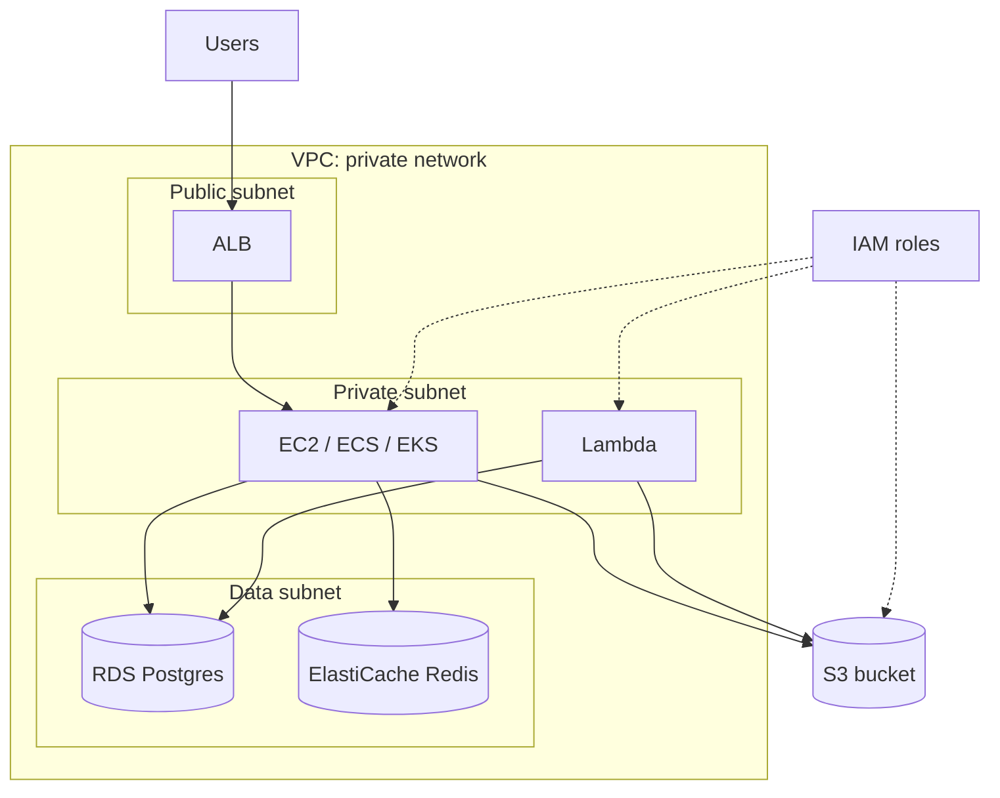
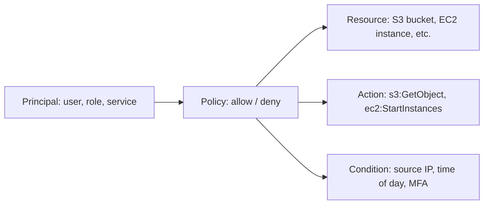
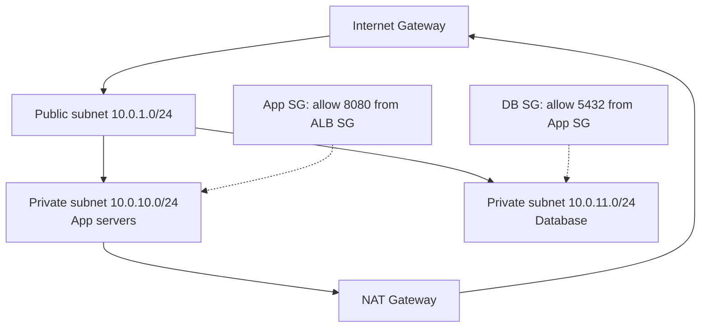

# AWS: EC2, S3, RDS, Lambda, IAM, VPC

AWS is the dominant cloud platform. Senior interviews don't expect you to memorise every service, but they do expect you to know **the core six** below, understand the trade-offs, and recognise patterns that work vs ones that get teams in trouble.



## EC2 — virtual machines

EC2 (Elastic Compute Cloud) gives you a Linux or Windows VM. You choose CPU/memory/disk; AWS gives you root access.

| Instance family  | Purpose                                      |
| ---------------- | -------------------------------------------- |
| **t** (t3, t4g)  | Burstable; cheap; for low-baseline workloads |
| **m** (m6i, m7g) | General purpose; balanced CPU/memory         |
| **c** (c6i, c7g) | Compute-optimised; web servers, APIs         |
| **r** (r6i, r7g) | Memory-optimised; databases, caches          |
| **i** (i4i)      | NVMe-attached storage; high-IO workloads     |
| **g, p**         | GPU; ML training, inference, graphics        |

Pricing models:

- **On-demand** — pay per hour. Default. Most flexible.
- **Reserved Instances / Savings Plans** — commit 1 or 3 years, save 30-70%.
- **Spot** — bid on spare capacity. Up to 90% off but can be terminated with 2 minutes notice. Great for batch jobs, fault-tolerant workloads.

**Modern reality**: most teams don't run raw EC2. Use ECS, EKS (Kubernetes), or Lambda. EC2 is the foundation but rarely the user-facing service.

## S3 — object storage

S3 stores **objects** (files), not a filesystem. Each object has a key (path-like), metadata, and bytes. Buckets are the top-level container; keys are paths within.

```python
s3.put_object(Bucket="my-bucket", Key="users/42/avatar.png", Body=image_bytes)
s3.get_object(Bucket="my-bucket", Key="users/42/avatar.png")
```

Properties:

- **Durability** — 99.999999999% (11 nines). Spread across 3+ AZs.
- **Availability** — 99.99% (Standard); lower for cheaper tiers.
- **Strongly consistent** — read-after-write since 2020. Older docs say "eventual" — outdated.
- **No size limit** total; 5 TB max per object.
- **Costs** — storage per GB, requests, egress. Egress to internet is the line item that surprises people.

| Storage class        | Use                                |
| -------------------- | ---------------------------------- |
| Standard             | Frequently accessed data           |
| Intelligent-Tiering  | Auto-tiers based on access pattern |
| Standard-IA          | Infrequent access                  |
| Glacier Instant      | Archive, milliseconds retrieval    |
| Glacier Flexible     | Archive, minutes-hours retrieval   |
| Glacier Deep Archive | Lowest cost, 12-48 hour retrieval  |

Common patterns:

- **Static website hosting** — drop HTML/CSS/JS in a bucket; serve with CloudFront in front.
- **Presigned URLs** — generate a time-limited URL the client uses to upload directly. Skips your server.
- **Lifecycle policies** — auto-archive or delete after N days.
- **Cross-region replication** — copy to another region for DR.
- **Versioning** — keep history of every object, recover deleted/overwritten.
- **Object Lock** — write-once-read-many for compliance.

## RDS — managed relational database

RDS gives you Postgres, MySQL, MariaDB, Oracle, SQL Server, or **Aurora** (AWS's high-performance fork). AWS handles backups, patches, replicas, failover.

| Concern           | RDS                                                                  |
| ----------------- | -------------------------------------------------------------------- |
| Backups           | Automated daily, point-in-time restore (35 days max)                 |
| High availability | Multi-AZ deployment — sync replica in another AZ; auto-failover ~60s |
| Read replicas     | Up to 5 (or 15 on Aurora); async                                     |
| Failover time     | Multi-AZ: ~60s. Aurora: ~30s                                         |
| Maintenance       | Automated patching during your maintenance window                    |
| Monitoring        | CloudWatch + Enhanced Monitoring + Performance Insights              |

**Aurora** is the AWS-native version. Decoupled storage from compute (storage is replicated 6 ways across 3 AZs). Faster failover, better performance, more expensive.

For most workloads: Aurora Postgres or Aurora MySQL. Standard RDS Postgres is cheaper and fine for smaller services.

## Lambda — serverless functions

Lambda runs your code in response to events without managing servers. You hand AWS a function; AWS runs it on demand.

```python
def lambda_handler(event, context):
    user_id = event["userId"]
    user = db.get_user(user_id)
    return {"statusCode": 200, "body": json.dumps(user)}
```

Triggers: API Gateway, S3 events, SQS messages, EventBridge, CloudWatch schedules, DynamoDB streams, etc.

| Property     | Behavior                                                  |
| ------------ | --------------------------------------------------------- |
| Max timeout  | 15 minutes per invocation                                 |
| Memory       | 128 MB to 10 GB; CPU scales with memory                   |
| Package size | 250 MB unzipped (50 MB zipped); 10 GB via container image |
| Concurrency  | Default 1000 per region; raises by request                |
| Cold start   | 100 ms - 1 sec depending on runtime and package           |
| Pricing      | Per-100ms execution + per-request                         |

**Cold starts** are the operational gotcha. First invocation initialises the container. JVM cold starts can be 2-5 seconds; Python and Node ~100 ms; Go ~50 ms. Mitigations:

- **Provisioned concurrency** — pre-warmed containers, no cold start. Costs more.
- **Smaller deployment packages** — faster init.
- **SnapStart** for Java — Lambda pre-initialises the JVM and snapshots it.
- **Use Go or Rust** for cold-sensitive paths.

When Lambda fits:

- Event-driven processing (S3 trigger, queue consumer, scheduled job).
- Glue between AWS services.
- API endpoints with sporadic traffic.
- Image processing, file transcoding.

When Lambda does not fit:

- Long-running tasks (over 15 min).
- High consistent traffic (EC2/ECS cheaper at scale).
- Requires persistent connections (websockets — use API Gateway WS, not Lambda directly).
- Latency-sensitive paths where cold starts hurt.

## IAM — identity and access management

The single most important AWS skill. Misconfigured IAM is the #1 cause of cloud breaches.



Core concepts:

- **User** — a human (or service account) with credentials.
- **Role** — temporary credentials assumed by EC2, Lambda, etc. Preferred over users for services.
- **Policy** — JSON document granting or denying actions on resources.
- **Group** — collection of users; attach policies to the group.

**Best practices**:

1. **Least privilege**: grant only what is needed. Start small; expand on demand.
2. **No long-lived access keys**. Use IAM roles with temporary credentials (STS).
3. **MFA for humans**. Required for production access.
4. **Service-linked roles** for AWS services to call other services.
5. **Audit with IAM Access Analyzer** and CloudTrail logs.

```json
{
  "Version": "2012-10-17",
  "Statement": [
    {
      "Effect": "Allow",
      "Action": ["s3:GetObject"],
      "Resource": "arn:aws:s3:::my-bucket/users/${aws:username}/*"
    }
  ]
}
```

The `${aws:username}` interpolation gives each IAM user access only to their own folder.

## VPC — private network

A VPC is your own private network on AWS. Subnets divide it; security groups and NACLs control traffic.



Key building blocks:

- **Subnet** — IP range within a VPC. Public (has route to Internet Gateway) or private.
- **Internet Gateway (IGW)** — connection to the public internet.
- **NAT Gateway** — lets private subnet instances make outbound internet calls.
- **Route table** — decides where traffic goes.
- **Security group** — stateful firewall, attached to instances. Allow rules only.
- **NACL** — stateless firewall, attached to subnets. Allow + deny.
- **VPC endpoints** — connect to AWS services (S3, DynamoDB) without going through public internet.

Standard pattern: ALB in public subnet → app servers in private subnet → database in private subnet (different AZ for HA). Internet egress via NAT.

## Other services worth knowing

| Service                               | Purpose                                                      |
| ------------------------------------- | ------------------------------------------------------------ |
| **CloudFront**                        | CDN — edge caching, DDoS protection                          |
| **Route 53**                          | DNS, with health-checked failover                            |
| **ALB / NLB**                         | Application / Network load balancers                         |
| **ECS / EKS**                         | Container orchestration (ECS = AWS-native, EKS = Kubernetes) |
| **DynamoDB**                          | Managed NoSQL, single-digit ms latency                       |
| **ElastiCache**                       | Managed Redis or Memcached                                   |
| **SQS**                               | Queue (at-least-once, FIFO mode for ordering)                |
| **SNS**                               | Pub/sub topics                                               |
| **EventBridge**                       | Event bus with rules and routing                             |
| **CloudWatch**                        | Logs, metrics, alarms                                        |
| **CloudFormation / CDK**              | Infrastructure as code                                       |
| **Secrets Manager / Parameter Store** | Secret storage and rotation                                  |
| **KMS**                               | Key management for encryption                                |

## Common pitfalls

- **Open security groups (`0.0.0.0/0`)** — exposes services to the internet. Tighten to specific CIDRs.
- **IAM users with long-lived keys** committed to git. Use roles + STS.
- **No backups configured**. RDS auto-backups are on by default; verify retention. S3 versioning + lifecycle for static data.
- **Single-AZ deployment** — one AZ failure takes you down. Multi-AZ for production.
- **Egress costs ignored** — S3 → internet is $0.09/GB. CloudFront in front of S3 is much cheaper.
- **NAT Gateway costs** — $0.045/hr + $0.045/GB processed. For high-egress private subnets, this adds up.
- **Lambda concurrency limits** — default 1000 region-wide. Hit a burst and you start dropping requests.
- **No infrastructure-as-code** — clicking through the console means no audit, no rollback, no review.

## Interview answers

_Q: When would you choose Lambda over ECS?_
A: Lambda for event-driven, sporadic traffic, glue between AWS services. ECS for sustained traffic, long-running connections, more predictable billing. The break-even is around constant traffic — Lambda billed per execution becomes more expensive than always-on ECS once you exceed roughly 1 req/sec sustained.

_Q: How does RDS Multi-AZ differ from a read replica?_
A: Multi-AZ is a synchronous standby in another AZ — automatic failover within ~60s, used only for HA, not load-shedding. Read replicas are async copies — used to scale read traffic, can be promoted manually for failover but with potential data lag.

_Q: How do you secure an S3 bucket?_
A: Default to private (block public access). Use IAM policies for which roles can access. For object-level public access, use presigned URLs (time-limited). Enable versioning, MFA delete on critical buckets, server-side encryption (SSE-S3 or SSE-KMS), bucket policies for access logging.

_Q: What's the difference between a security group and a NACL?_
A: Security group is stateful — return traffic is automatically allowed. NACL is stateless — return traffic must be explicitly allowed in both directions. SG attached to instances; NACL attached to subnets. Use SGs for everyday access control; use NACLs for blanket subnet-level rules.

_Q: How would you handle Lambda cold starts for a Java service?_
A: Use SnapStart — Lambda pre-initialises the JVM and snapshots it; subsequent cold starts are sub-second. Or use provisioned concurrency to keep warm instances. Or rewrite latency-sensitive paths in Go/Rust for ~50ms cold starts. Or accept cold starts on cold paths and ensure they're not user-facing critical.

_Q: How would you store and rotate database passwords?_
A: Secrets Manager. Auto-rotation supported for RDS Postgres/MySQL. Application reads the secret at startup (with caching) via IAM role. Never embed in env vars or code. For non-DB secrets, Parameter Store (cheaper, simpler) is fine.

_Q: Why might you use VPC endpoints?_
A: To connect to AWS services (S3, DynamoDB, Lambda) without traversing the public internet. Removes the need for NAT Gateway for that traffic — both cost savings and security improvement (data stays inside AWS network). For S3 and DynamoDB, the gateway endpoint is free; for others (interface endpoints), there is a small per-hour charge.
