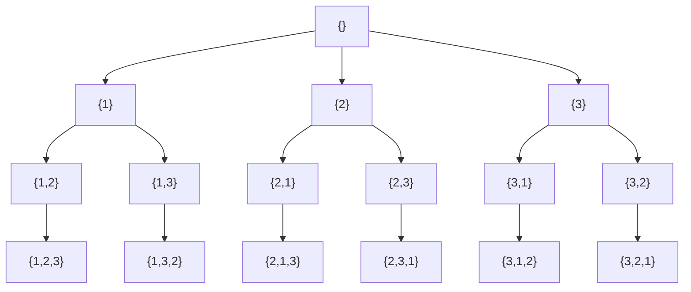

# Backtracking: N-Queens, Sudoku, subset sum, rat in a maze

Backtracking is **depth-first search through the space of partial solutions**, abandoning a branch the moment it cannot lead to a valid answer. It is the algorithmic spine of constraint problems: N-Queens, Sudoku, crosswords, scheduling, generating permutations and combinations.

The mental model: build a tree of choices. At each node, you make one choice. If that choice violates a constraint, you do not recurse — you **prune**. If you reach a complete solution, you record it. Then you **undo** the choice and try the next one.



Backtracking tree for permutations of `{1, 2, 3}`. Six leaves = six permutations.

## The template

```java
void backtrack(State state) {
    if (isComplete(state)) {
        record(state);
        return;
    }
    for (Choice c : choices(state)) {
        if (!isValid(state, c)) continue;     // prune
        apply(state, c);                       // choose
        backtrack(state);                      // explore
        undo(state, c);                        // unchoose
    }
}
```

Five questions to answer before writing code:

1. **What decision** does each level make?
2. **What state** must I track to detect conflicts?
3. **What is the base case** — when have I built a complete solution?
4. **How do I prune** — what constraint can I check before recursing?
5. **Should I mutate and undo, or copy state**? Mutation is faster but trickier.

## Generate all subsets

The simplest backtracking problem.

```java
List<List<Integer>> subsets(int[] nums) {
    List<List<Integer>> result = new ArrayList<>();
    backtrack(0, nums, new ArrayList<>(), result);
    return result;
}

void backtrack(int start, int[] nums, List<Integer> path, List<List<Integer>> result) {
    result.add(new ArrayList<>(path));         // record at every node, not only leaves
    for (int i = start; i < nums.length; i++) {
        path.add(nums[i]);
        backtrack(i + 1, nums, path, result);
        path.remove(path.size() - 1);          // undo
    }
}
```

The `start` parameter prevents revisiting earlier elements, which would generate duplicate subsets.

## Permutations

```java
void permute(int[] nums, boolean[] used, List<Integer> path, List<List<Integer>> result) {
    if (path.size() == nums.length) {
        result.add(new ArrayList<>(path));
        return;
    }
    for (int i = 0; i < nums.length; i++) {
        if (used[i]) continue;
        used[i] = true;
        path.add(nums[i]);
        permute(nums, used, path, result);
        path.remove(path.size() - 1);
        used[i] = false;
    }
}
```

For permutations with duplicates, sort the array first and add `if (i > 0 && nums[i] == nums[i - 1] && !used[i - 1]) continue` to skip duplicate branches.

## N-Queens

Place `n` queens on an `n × n` board so no two attack each other.

The trick is to recognise that **each row gets exactly one queen**, so the decision at row `r` is "which column?" Track three boolean arrays:

- `colUsed[c]` — column already taken
- `diag1[r + c]` — anti-diagonal already taken
- `diag2[r - c + n]` — diagonal already taken

```java
List<List<String>> solveNQueens(int n) {
    List<List<String>> result = new ArrayList<>();
    int[] cols = new int[n];
    Arrays.fill(cols, -1);
    boolean[] colUsed = new boolean[n];
    boolean[] diag1 = new boolean[2 * n];      // indexed by r + c
    boolean[] diag2 = new boolean[2 * n];      // indexed by r - c + n
    backtrack(0, n, cols, colUsed, diag1, diag2, result);
    return result;
}

void backtrack(int row, int n, int[] cols, boolean[] cu, boolean[] d1, boolean[] d2,
               List<List<String>> result) {
    if (row == n) {
        result.add(format(cols, n));
        return;
    }
    for (int c = 0; c < n; c++) {
        if (cu[c] || d1[row + c] || d2[row - c + n]) continue;
        cols[row] = c;
        cu[c] = d1[row + c] = d2[row - c + n] = true;
        backtrack(row + 1, n, cols, cu, d1, d2, result);
        cu[c] = d1[row + c] = d2[row - c + n] = false;
    }
}
```

Without the diagonal arrays, you would scan all earlier rows for conflicts — `O(n)` per attempted placement instead of `O(1)`. **Pruning data is what makes backtracking practical.**

## Sudoku — pruning and ordering matter

Same skeleton as N-Queens, but with an additional optimisation: pick the cell with the **fewest legal options** first. This dramatically reduces the search tree.

```java
boolean solveSudoku(char[][] board) {
    int[] cell = findMostConstrained(board);
    if (cell == null) return true;            // all filled
    int r = cell[0], c = cell[1];
    for (char d = '1'; d <= '9'; d++) {
        if (isValid(board, r, c, d)) {
            board[r][c] = d;
            if (solveSudoku(board)) return true;
            board[r][c] = '.';                 // undo
        }
    }
    return false;
}
```

The `isValid` check scans the row, column, and 3×3 box. For maximum speed, maintain three bitmasks per row, column, and box and update them on choose/unchoose — same idea as N-Queens.

## Word break (with memoization)

Backtracking + memoization is one boundary where backtracking shades into dynamic programming. If subproblems repeat, cache them.

```java
boolean wordBreak(String s, Set<String> dict, Map<Integer, Boolean> memo) {
    if (s.isEmpty()) return true;
    if (memo.containsKey(s.length())) return memo.get(s.length());
    for (int i = 1; i <= s.length(); i++) {
        if (dict.contains(s.substring(0, i)) && wordBreak(s.substring(i), dict, memo)) {
            memo.put(s.length(), true);
            return true;
        }
    }
    memo.put(s.length(), false);
    return false;
}
```

## Common mistakes

- **Forgetting to undo the choice**. The state leaks into sibling branches and silently corrupts results.
- **Recording results without copying**. `result.add(path)` shares a reference. Use `new ArrayList<>(path)` so later mutations do not mess up the recorded snapshot.
- **Pruning too late**. Always check `isValid(c)` **before** recursing, not after. Late pruning explores wasted subtrees.
- **Not deduplicating with sort + skip**. For "permutations with duplicates" or "subsets II", you must sort and add the duplicate-skip check or you generate the same answer many times.
- **Stack overflow on deep recursion**. For depth > ~10K, switch to iterative DFS with an explicit stack.

## Interview answers

_Q: How is backtracking different from plain DFS?_
A: It is DFS plus pruning plus state mutation/undo. Plain DFS visits every reachable node. Backtracking abandons branches that cannot lead to a valid solution and undoes its mutations on the way back up.

_Q: Why is N-Queens with diagonals tracking faster than checking each prior row?_
A: Diagonal lookup is `O(1)` per attempted placement when you maintain the boolean arrays. Re-scanning prior rows is `O(n)` per placement. For `n = 12` that is the difference between sub-second and many seconds.

_Q: When does backtracking benefit from memoization, turning it into DP?_
A: When the same subproblem appears down multiple branches. Word break, partition into palindromes, or "decode ways" all have overlapping subproblems indexed by string suffix or position. Without memoization they are exponential; with it they are polynomial.

_Q: How would you find only **one** valid Sudoku solution instead of all?_
A: Return a boolean from the recursion. As soon as one branch succeeds, propagate `true` up the call stack and stop exploring siblings. The early exit is the difference between solving for one and counting all.

_Q: How do you estimate the time complexity of N-Queens?_
A: Worst case `O(n!)` — `n` choices in the first row, `n - 1` in the second, etc. Pruning cuts this drastically; in practice solutions for `n = 12` run in milliseconds. The exponential bound matters when explaining to interviewers but is rarely tight in real runs.

_Q: When should I use BFS instead of backtracking for a constraint problem?_
A: When the goal is the **shortest** sequence of decisions and each decision is uniform cost. Backtracking explores depth-first; BFS finds shortest solutions. Examples: word ladder (BFS), open lock combinations (BFS). Backtracking is for "all" or "any" — not for shortest.
