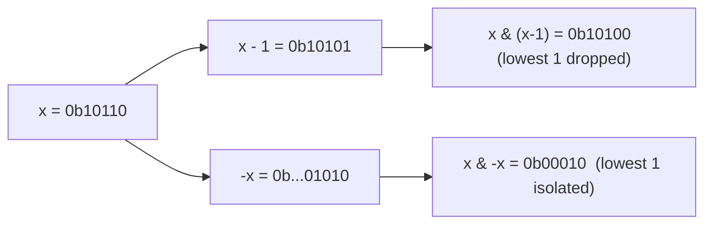

# Bit Manipulation: tricks, XOR patterns, bitmask DP, set operations

Bit manipulation treats integers as arrays of binary flags. Each bit is a yes/no, member/not-member, on/off. Operating on whole words at once gives constant-time set operations on small universes, parity tricks, and the magic behind hash tables, Bloom filters, and CPU instructions like `popcnt`.

For interviews, the goal is to read these expressions fluently, not to write them under pressure. Memorise the table; the rest is composition.

## Operator cheat sheet

| Trick                            | Expression                                | Meaning / use               |
| -------------------------------- | ----------------------------------------- | --------------------------- |
| Test bit `i`                     | `(x >> i) & 1`                            | Is bit `i` on?              |
| Set bit `i`                      | `x \| (1 << i)`                           | Turn bit `i` on             |
| Clear bit `i`                    | `x & ~(1 << i)`                           | Turn bit `i` off            |
| Toggle bit `i`                   | `x ^ (1 << i)`                            | Flip bit `i`                |
| Lowest set bit                   | `x & -x`                                  | Isolate the rightmost 1     |
| Drop lowest set bit              | `x & (x - 1)`                             | Used in Hamming weight loop |
| Is power of two?                 | `x > 0 && (x & (x - 1)) == 0`             | Single bit set              |
| Count set bits (popcount)        | `Integer.bitCount(x)`                     | Hamming weight              |
| Iterate non-empty subsets of `m` | `for (int s = m; s > 0; s = (s - 1) & m)` | Subset DP                   |



## XOR identities

XOR is the quiet superpower. Properties:

- `a ^ a = 0` — XOR with self cancels.
- `a ^ 0 = a` — identity.
- XOR is commutative and associative — order does not matter.

These give:

```java
// Find the only number appearing once when all others appear twice
int singleNumber(int[] nums) {
    int x = 0;
    for (int n : nums) x ^= n;
    return x;
}
```

XOR all `n` numbers; pairs cancel. Whatever survives is the unique value. `O(n)` time, `O(1)` space.

The harder variant: every number appears three times except one. XOR no longer cancels triples cleanly. Use two registers:

```java
int singleNumberThree(int[] nums) {
    int ones = 0, twos = 0;
    for (int n : nums) {
        ones = (ones ^ n) & ~twos;
        twos = (twos ^ n) & ~ones;
    }
    return ones;
}
```

Each bit cycles: 0 → 1 (in `ones`) → 2 (in `twos`) → 0. The bit that ends in `ones` is the lone occurrence.

**XOR of `[1..n]`** has a simple closed form (useful for "find the missing number" variants):

```java
int xorOneToN(int n) {
    return switch (n % 4) {
        case 0 -> n;
        case 1 -> 1;
        case 2 -> n + 1;
        default -> 0;
    };
}
```

## Bitmask DP — small universe enumeration

When `n ≤ 20`, you can index DP states by a bitmask of which elements are included.

**Travelling Salesman** with bitmask DP:

```java
int tsp(int[][] dist) {
    int n = dist.length;
    int[][] dp = new int[1 << n][n];
    for (int[] row : dp) Arrays.fill(row, Integer.MAX_VALUE / 2);
    dp[1][0] = 0;     // start at city 0, having visited only it
    for (int mask = 1; mask < (1 << n); mask++) {
        for (int u = 0; u < n; u++) {
            if ((mask & (1 << u)) == 0) continue;
            for (int v = 0; v < n; v++) {
                if ((mask & (1 << v)) != 0) continue;
                int next = mask | (1 << v);
                dp[next][v] = Math.min(dp[next][v], dp[mask][u] + dist[u][v]);
            }
        }
    }
    int best = Integer.MAX_VALUE;
    for (int u = 1; u < n; u++) best = Math.min(best, dp[(1 << n) - 1][u] + dist[u][0]);
    return best;
}
```

Time: `O(n² 2ⁿ)`. For `n = 18`, about 85 million iterations — runs in seconds.

**Subset enumeration** of mask `m`:

```java
for (int s = m; s > 0; s = (s - 1) & m) {
    // process subset s of m
}
// total subset iterations across all masks: O(3^n) — handy for "split into two halves" DPs
```

## Real-world use cases

- **Bloom filters**: `k` hash functions set `k` bits in a bit array. Membership check tests those bits. Compact and fast for "definitely not in set" queries.
- **Permission flags**: storing many booleans in one integer. Linux file permissions, OAuth scopes, feature flags.
- **Chess engines**: bitboards represent the board as one 64-bit integer per piece type. Move generation becomes bit shifts.
- **Compression**: variable-length encoding (Huffman, Arithmetic) packs codes at the bit level.
- **CPU intrinsics**: `popcnt`, `bsf`, `tzcnt` — modern processors have dedicated instructions for these tricks.

## Common mistakes

- **Java integer overflow on `1 << 31`**. The result is `Integer.MIN_VALUE` (negative). For 32+ bits, use `1L << bit`.
- **Operator precedence**. `(x >> i) & 1 == 0` evaluates as `(x >> i) & (1 == 0)` because `==` binds tighter than `&`. Always parenthesise: `((x >> i) & 1) == 0`.
- **Signed vs unsigned right shift**. `>>` preserves the sign bit (arithmetic shift). `>>>` shifts zero in. Use `>>>` when treating an `int` as unsigned bits.
- **Negative masks**. `~5` in Java is `-6`, not `0xFFFFFFFA`. Same bit pattern, different printed value. Mind your `toBinaryString` output.
- **Bitmask DP for `n > 25`**. The exponential explodes; switch to a different paradigm.

## Interview answers

_Q: How does `x & -x` isolate the lowest set bit?_
A: Two's complement makes `-x = ~x + 1`. Bits below the lowest 1 are unchanged by the +1; bits above are flipped by `~`. AND of `x` and `-x` keeps only the bit that is 1 in both, which is exactly the lowest set bit of `x`.

_Q: When is bitmask DP the right tool?_
A: When state can be encoded as a subset of a small universe (`n ≤ 20`) and transitions naturally extend the subset. TSP, assignment problem, partition into k subsets, count Hamiltonian paths. Bigger `n` needs a different idea.

_Q: How would you find the two numbers that appear once when all others appear twice?_
A: XOR everything → `x = a ^ b`, where `a` and `b` are the unique numbers. Find any set bit in `x` (e.g. `x & -x`) — `a` and `b` differ at that bit. Partition the array by that bit; XOR each half independently to get `a` and `b`.

_Q: Why is `Integer.bitCount(x)` faster than counting in a loop?_
A: It is implemented as a parallel "divide and conquer" count using bitmask tricks (or in JIT-compiled code, the `popcnt` instruction). Linear loop is `O(bits)`; the parallel trick is `O(log bits)`. On modern CPUs `popcnt` is one cycle.

_Q: Walk me through subset-sum with bitmask DP._
A: For `n` items, `dp[mask]` = whether the subset indicated by `mask` sums to `target`. Transition: for each item `i` in `mask`, check `dp[mask ^ (1 << i)]` for `target - nums[i]`. Or iterate masks in order and toggle bits. `O(2ⁿ * n)` time. Beats `O(n * target)` when `target` is huge but `n` is tiny.

_Q: How do bit operations show up in production code beyond interviews?_
A: Network code (parsing IP headers), database internals (Bloom filters in Cassandra/Postgres, bitmap indexes), compression libraries, hash table sizing (round up to the next power of two), GPU shaders (lots of bit packing), and concurrent algorithms (CAS-based lock-free flags).
