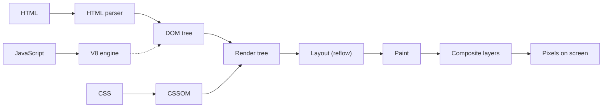
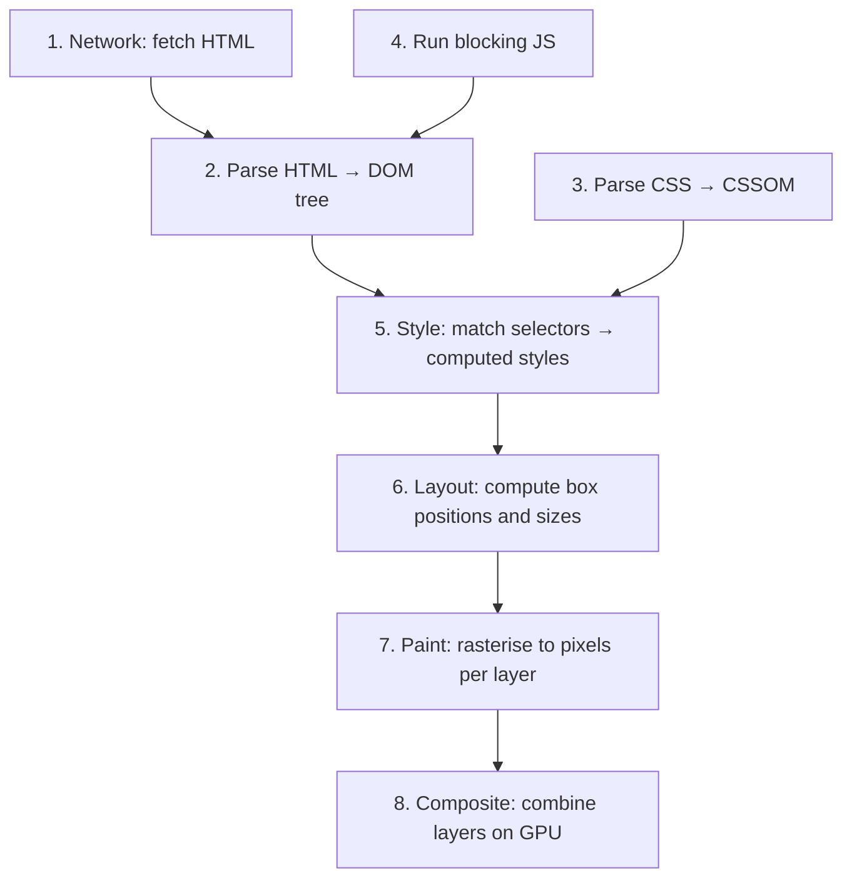
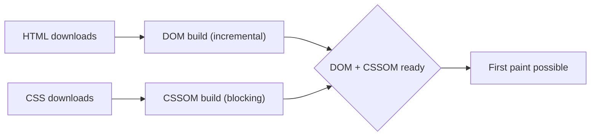
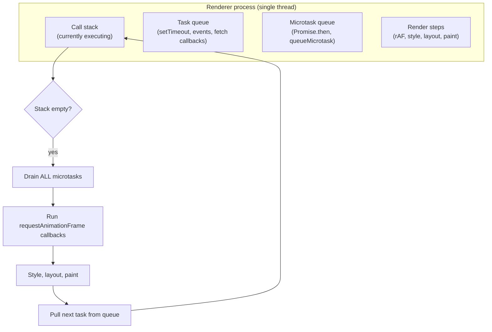
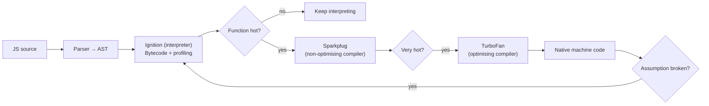
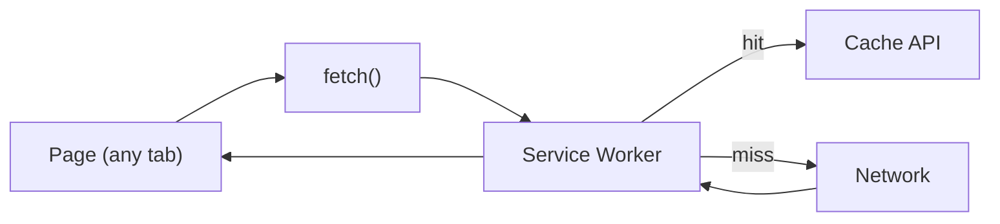

# Browser internals: rendering pipeline, event loop, V8, web APIs, paint and layout

The browser is a remarkably complex piece of software. Senior frontend interviews probe whether you understand **what happens between `<script>` and pixels on screen** — because every performance bug, layout shift, and unresponsive UI traces back to one of these stages.

## High-level architecture



Modern browsers (Chrome, Firefox, Safari) split work across multiple processes:

- **Browser process** — UI, network, navigation.
- **Renderer process** — one per tab; runs HTML parsing, CSS, JS, layout, paint.
- **GPU process** — final compositing, hardware acceleration.
- **Network process** — fetch, cache, cookies.
- **Utility processes** — sandboxed services (audio, video).

Sandboxing per tab means a crashed page doesn't kill the browser.

## The rendering pipeline

What happens when a page loads:



Each step has implications for performance:

| Step            | Cost trigger                                    |
| --------------- | ----------------------------------------------- |
| Parse HTML      | Blocking `<script>` pauses parsing              |
| Parse CSS       | Render-blocking; browser waits for CSSOM        |
| Style           | Big stylesheets, complex selectors              |
| Layout (reflow) | Width / height / position changes; expensive    |
| Paint           | Background-color, box-shadow, complex gradients |
| Composite       | Cheapest; GPU layers (opacity, transform)       |

**Performance rule**: animate `transform` and `opacity` (composite-only). Avoid animating `width`, `height`, `top`, `left` (forces layout + paint).

```css
/* BAD — triggers layout on every frame */
@keyframes slide {
  from {
    left: 0;
  }
  to {
    left: 100px;
  }
}

/* GOOD — composite only */
@keyframes slide {
  from {
    transform: translateX(0);
  }
  to {
    transform: translateX(100px);
  }
}
```

## Critical rendering path

To get pixels on screen, the browser needs **DOM + CSSOM**. Anything that delays either delays the first paint.



**CSS is render-blocking**. Browser will not paint until the CSSOM is built. Mitigations:

- **Inline critical CSS** for above-the-fold content; load the rest async.
- **`media` attribute**: `<link rel="stylesheet" href="print.css" media="print">` — only blocks for print.
- **Smaller stylesheets** — Tailwind's purge / CSS-in-JS extraction.

**JavaScript is parser-blocking by default**. A `<script>` mid-document pauses HTML parsing while it downloads and runs. Mitigations:

| Attribute       | Behaviour                                                      |
| --------------- | -------------------------------------------------------------- |
| (none)          | Block parsing, download + execute synchronously                |
| `async`         | Download in parallel; execute as soon as ready (any order)     |
| `defer`         | Download in parallel; execute after parsing, in document order |
| `type="module"` | Defer-by-default; treats file as ES module                     |

```html
<!-- Blocks parsing -->
<script src="a.js"></script>

<!-- Parses concurrently; runs whenever ready (order not guaranteed) -->
<script src="a.js" async></script>

<!-- Parses concurrently; runs after DOMContentLoaded, in order -->
<script src="a.js" defer></script>

<!-- Modern: ES modules; defer by default -->
<script type="module" src="app.js"></script>
```

For most app code, `defer` or `type="module"` is the right choice.

## The event loop

JavaScript is single-threaded. The event loop schedules work between the call stack and various queues.



The cycle:

1. Run a task to completion (call stack empties).
2. **Drain all microtasks** — Promises, queueMicrotask. New microtasks queued during draining run too.
3. If a frame is due (16.67ms for 60Hz), run requestAnimationFrame callbacks → style → layout → paint.
4. Pull next task from queue. Repeat.

**Microtask vs macrotask** matters for ordering:

```js
console.log('1')
setTimeout(() => console.log('2'), 0)
Promise.resolve().then(() => console.log('3'))
console.log('4')
// Output: 1, 4, 3, 2
```

Microtasks run **before** the next render. Macrotasks (setTimeout) run **after**. A long microtask chain can starve rendering — `Promise.then().then().then()` running synchronously blocks paint.

### Long tasks block UI

Any single task longer than ~50ms blocks user interaction. The Long Tasks API surfaces these.

```js
const observer = new PerformanceObserver((list) => {
  for (const entry of list.getEntries()) {
    if (entry.duration > 50) {
      console.warn('Long task:', entry.duration, 'ms')
    }
  }
})
observer.observe({ entryTypes: ['longtask'] })
```

Mitigations:

- Break work into chunks with `setTimeout(0)` or `requestIdleCallback`.
- Use Web Workers for CPU-heavy work (parsing, image processing, ML).
- `MessageChannel` for fast main↔worker communication.

## V8 — the JavaScript engine

Chrome and Node use V8 (Firefox uses SpiderMonkey, Safari uses JavaScriptCore). V8 doesn't interpret JS line-by-line in production — it compiles to optimised machine code.



Tiered compilation:

- **Ignition** — interprets bytecode while collecting type feedback.
- **Sparkplug** — fast non-optimising compiler for warm code.
- **TurboFan** — slow optimising compiler for hot code; produces aggressive machine code based on observed types.

**Deopt**: TurboFan assumes types stay consistent. If a function suddenly receives a different shape, V8 throws away the optimised code and goes back to Ignition. Common deopt causes:

```js
// BAD — different shapes hit the same function
function add(a, b) {
  return a + b
}
add(1, 2) // monomorphic (numbers)
add('1', '2') // becomes polymorphic
add({}, []) // becomes megamorphic — deopt likely

// BAD — adding properties after construction changes the shape
class User {
  constructor(id) {
    this.id = id
  }
}
const u = new User(1)
u.name = 'Alice' // shape change
```

The optimisation lessons:

- **Keep object shapes consistent**. Initialise all properties in the constructor.
- **Don't mix types** in hot functions.
- **Avoid `delete` on hot objects** — changes shape.
- **Don't `try/catch` in hot loops** in older V8 (improved in modern V8 but still costly).

## Garbage collection

V8 uses generational GC similar to JVM:

| Generation | Where                         | Collected by                        |
| ---------- | ----------------------------- | ----------------------------------- |
| Young      | Small region; new allocations | Scavenge — fast copying GC          |
| Old        | Long-lived objects            | Mark-compact, concurrent + parallel |

Short-lived objects die in the young gen cheaply. Survivors get promoted. Long pauses come from old-gen GC; modern V8 does most work concurrently.

GC implications:

- Allocating in hot loops creates pressure. Reuse objects when possible.
- Closures hold their entire captured scope alive.
- Memory leaks: detached DOM nodes still referenced from JS, event listeners not removed, growing caches.

## Storage APIs

| API                               | Capacity          | Lifetime                | Sync / async                     |
| --------------------------------- | ----------------- | ----------------------- | -------------------------------- |
| `localStorage`                    | ~5-10 MB          | Forever (until cleared) | Synchronous (blocks main thread) |
| `sessionStorage`                  | ~5-10 MB          | Tab close               | Synchronous                      |
| Cookies                           | ~4 KB each        | Set by server / JS      | Sent on every request            |
| IndexedDB                         | ~50 MB - 50% disk | Forever                 | Async, transactional             |
| Cache API                         | Per-origin        | Until purged            | Async, used with Service Workers |
| Origin Private File System (OPFS) | Large             | Persistent              | Async, file-like                 |

**Don't use `localStorage` for hot reads** — it's synchronous, blocks main thread. Use IndexedDB for anything beyond a few KB.

## Web Workers

Run JS on a separate thread. No DOM access; communicate via `postMessage`.

```js
// main.js
const worker = new Worker('/parser.js')
worker.postMessage({ data: hugeJson })
worker.onmessage = (e) => render(e.data)

// parser.js
self.onmessage = (e) => {
  const result = expensiveParse(e.data)
  self.postMessage(result)
}
```

Use for: JSON parsing of large payloads, image processing, encryption, ML inference, spreadsheet recalc. Anything that takes more than ~50ms of CPU.

**Comlink** is a lightweight library that makes worker communication feel like async function calls.

## Service Workers and PWA

A Service Worker is a script the browser keeps alive across page loads, intercepting network requests.



Use cases:

- **Offline support** — serve from cache when network fails.
- **Push notifications** — even when the page is closed.
- **Background sync** — defer write requests until online.
- **PWA install** — manifest + Service Worker → installable app.

## Web APIs worth knowing

| API                     | Use                                                    |
| ----------------------- | ------------------------------------------------------ |
| `IntersectionObserver`  | Lazy-load images, infinite scroll, viewport visibility |
| `MutationObserver`      | React to DOM changes                                   |
| `ResizeObserver`        | React to element size changes                          |
| `requestAnimationFrame` | Sync work to next paint                                |
| `requestIdleCallback`   | Run when browser is idle                               |
| `AbortController`       | Cancel fetch and other promises                        |
| `BroadcastChannel`      | Cross-tab messaging                                    |
| `WebSocket`             | Bidirectional persistent connection                    |
| `WebRTC`                | Peer-to-peer audio / video / data                      |
| `SharedArrayBuffer`     | Shared memory between workers (with COOP/COEP)         |
| `WebAssembly`           | Run compiled C/Rust/Go in the browser                  |

## Common pitfalls

- **Animating `width`/`height`/`top`/`left`**. Forces layout per frame. Use `transform` instead.
- **Synchronous `localStorage` reads in hot paths**. Blocks main thread.
- **Big libraries in initial bundle**. Use code splitting and dynamic imports.
- **`eval` and `new Function()`** in hot code. V8 cannot optimise.
- **Polyfills shipped to modern browsers**. Use `module`/`nomodule` pattern or differential serving.
- **Passive scroll handlers**. By default `scroll` and `wheel` are non-passive — block scrolling on slow handlers. Mark `{ passive: true }`.
- **Layout thrashing**: alternating reads (`offsetHeight`) and writes (`style.height`) in a loop forces multiple layout passes. Batch reads, then writes.
- **Huge DOM**: 5000+ nodes hurt every layout pass. Virtualise long lists.

## Interview answers

_Q: Walk me through what happens between typing a URL and pixels on screen._
A: DNS resolves; TCP + TLS handshake; HTTP request; HTML downloads. Browser parses HTML into DOM, CSS into CSSOM. JS runs and may modify both. Style computes; layout computes positions; paint rasterises to layers; GPU composites layers. First Contentful Paint is when content first appears.

_Q: Why is `transform: translate` faster than `top: 0px`?_
A: `top` triggers layout (reflow) — boxes move; layout for sibling and descendant boxes recomputes. `transform` is composite-only — the GPU shifts a pre-rendered layer. Layout is `O(N)` over the affected subtree; composite is essentially free at 60 FPS.

_Q: Difference between microtasks and macrotasks?_
A: Microtasks (Promise callbacks, queueMicrotask) drain entirely between every macrotask. Macrotasks (setTimeout, fetch callbacks) run one at a time, with rendering opportunities between. A long microtask chain blocks rendering; a long macrotask chain still allows rendering between tasks. Promise-heavy code can starve UI updates.

_Q: How does V8 optimise hot code?_
A: V8 starts in Ignition, the bytecode interpreter, while collecting type feedback. Hot functions get compiled by Sparkplug, then by TurboFan, the optimising compiler. TurboFan assumes types are consistent and emits specialised machine code. If assumptions break, V8 deopts back to Ignition. Keeping object shapes and types consistent in hot code preserves optimisation.

_Q: When would you reach for a Web Worker?_
A: When a task takes more than ~50ms of CPU and would block the UI. JSON parsing of huge payloads, image processing, ML inference, spreadsheet recalc. Use Comlink to wrap message-passing in a clean async API. Don't use workers for IO — use the main thread + async fetch.

_Q: How would you debug a janky page?_
A: Open Performance tab, record a typical interaction. Look for: long tasks (> 50ms), layout thrashing (multiple Layout entries close together), forced synchronous layout (yellow triangle on commit), big paint regions (Paint tab → highlight repaints). Then drill into specific functions in the Bottom-up view.

_Q: Why is JavaScript single-threaded but the browser appears responsive?_
A: JS runs on the main thread, but other browser work (network, parsing of resources, GPU compositing, IPC) runs in separate threads or processes. Web APIs return promises / events; the JS engine receives them via the event loop without doing the IO itself. Web Workers can run JS off-main-thread without DOM access. SharedArrayBuffer enables shared memory between workers.

_Q: How does the browser cache work?_
A: Multiple layers. HTTP cache: `Cache-Control` and `ETag` decide. Memory cache: very recent fetches. Disk cache: persistent. Service Worker cache: programmatic, used in PWAs. Push cache: HTTP/2 server push. Browsers prefer freshest valid response — `max-age` first; if expired, conditional request with `If-None-Match`.
