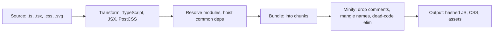
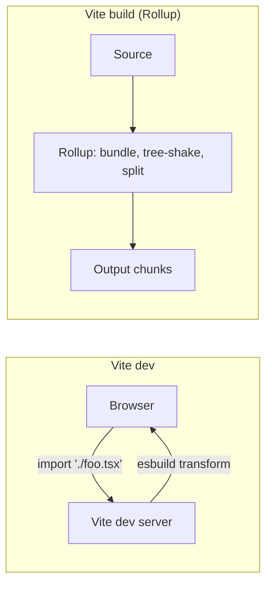

# Build tools: Vite, Webpack basics, ESLint, Prettier, Husky

Build tools turn your source code into runnable artifacts. They handle TypeScript compilation, JSX transformation, CSS processing, asset bundling, and code splitting. Senior interviews focus on **what each tool does**, **why dev experience matters**, and **how to choose** between options.

## The build pipeline



The two key tasks are **transformation** (one file in, one file out) and **bundling** (many files in, fewer files out). Modern tools usually do both, sometimes in different stages.

## Vite — the modern default

Vite uses **native ES modules** during dev and **Rollup** (or rolldown, soon) for production. Dev startup is near-instant because there is no bundling step — the browser fetches modules directly via `import` statements, and Vite transforms them on demand.



Why dev is fast:

- **No bundling step** in dev. Each module is requested by the browser as needed.
- **esbuild for transforms** — written in Go, ~100x faster than Babel.
- **HMR (Hot Module Replacement)** — when you save a file, only the changed module reloads. State preserved where possible.
- **Pre-bundled deps** — `node_modules` packages are pre-bundled once on first run with esbuild, then cached.

```js
// vite.config.ts
import { defineConfig } from 'vite'
import react from '@vitejs/plugin-react'

export default defineConfig({
  plugins: [react()],
  server: { port: 5173 },
  build: {
    rollupOptions: {
      output: {
        manualChunks: {
          react: ['react', 'react-dom'],
          ui: ['@radix-ui/react-dialog', '@radix-ui/react-tabs'],
        },
      },
    },
  },
})
```

For production, Vite produces hashed, minified, code-split bundles ready for static hosting on Vercel, Netlify, S3+CloudFront, etc.

## Webpack — the legacy default

Webpack builds a dependency graph from your entry, applies **loaders** (transform files) and **plugins** (modify the build), and outputs bundles. More configurable, more complex, slower.

```js
// webpack.config.js — much more verbose than Vite
module.exports = {
  entry: './src/index.tsx',
  module: {
    rules: [
      { test: /\.tsx?$/, use: 'ts-loader' },
      { test: /\.css$/, use: ['style-loader', 'css-loader'] },
      { test: /\.(png|jpg|svg)$/, type: 'asset/resource' },
    ],
  },
  resolve: { extensions: ['.tsx', '.ts', '.js'] },
  plugins: [new HtmlWebpackPlugin({ template: './index.html' })],
}
```

| Concern           | Vite                     | Webpack                      |
| ----------------- | ------------------------ | ---------------------------- |
| Dev startup       | Near-instant             | Often 10-30s on large apps   |
| HMR speed         | Fast, granular           | Slower, often whole-page     |
| Production output | Rollup, tree-shaken      | Webpack, tree-shaken         |
| Configuration     | Minimal defaults         | Many knobs, more boilerplate |
| Plugin ecosystem  | Smaller, growing fast    | Mature, vast                 |
| Best for          | New projects, SPAs, libs | Legacy projects, edge cases  |

For new projects, Vite is the default. Webpack remains for legacy apps and unusual configurations.

## ESLint — code quality and correctness

ESLint analyses your code and flags problems: unused variables, possible bugs, style violations, accessibility issues. With the right plugins, it catches real bugs.

```js
// eslint.config.js (flat config)
import js from '@eslint/js'
import tseslint from 'typescript-eslint'
import react from 'eslint-plugin-react'
import reactHooks from 'eslint-plugin-react-hooks'

export default tseslint.config(js.configs.recommended, ...tseslint.configs.recommended, {
  plugins: { react, 'react-hooks': reactHooks },
  rules: {
    'react-hooks/rules-of-hooks': 'error', // catches hook order bugs
    'react-hooks/exhaustive-deps': 'warn', // missing useEffect deps
    'no-floating-promises': 'error', // unhandled promises
  },
})
```

**Critical rules**:

- `react-hooks/rules-of-hooks` — enforces hook call order rules.
- `react-hooks/exhaustive-deps` — flags `useEffect` missing dependencies.
- `no-floating-promises` — promise without `await` or `.then`.
- `no-unused-vars` — dead code.
- `no-explicit-any` — discourage `any`.

Configure rules per project, but **never disable critical correctness rules globally**.

## Prettier — formatting consistency

Prettier formats code according to a small set of rules — line width, semicolons, quotes, trailing commas. **Eliminates style debates** in code review.

```json
// .prettierrc.json
{
  "semi": false,
  "singleQuote": true,
  "trailingComma": "es5",
  "printWidth": 100
}
```

Run `prettier --write .` once on your codebase, commit, and never argue about style again.

**Always pair with ESLint** — they handle different concerns. ESLint = correctness + bugs. Prettier = formatting. `eslint-config-prettier` disables formatting rules in ESLint so they don't fight.

## Husky + lint-staged — pre-commit hooks

Husky installs Git hooks. lint-staged runs commands only on files staged in the current commit.

```json
// package.json
{
  "scripts": {
    "prepare": "husky"
  },
  "lint-staged": {
    "*.{ts,tsx}": ["eslint --fix", "prettier --write"],
    "*.{js,jsx,css,md,json}": ["prettier --write"]
  }
}
```

```sh
# .husky/pre-commit
npx lint-staged
```

What this gives:

- Every commit auto-fixes formatting and lint issues.
- Bad code does not enter `main`.
- Reviewers focus on logic, not whitespace.

The trade-off: pre-commit can slow commits if rules are heavy. Keep checks fast (under 5 seconds for typical changes); leave heavy checks to CI.

## CI — the final gate

```yaml
# .github/workflows/ci.yml
name: CI
on: [pull_request]
jobs:
  check:
    runs-on: ubuntu-latest
    steps:
      - uses: actions/checkout@v4
      - uses: actions/setup-node@v4
        with:
          node-version: '22'
          cache: 'npm'
      - run: npm ci
      - run: npm run lint
      - run: npm run typecheck
      - run: npm run test
      - run: npm run build
```

**Layered checks**:

1. **Local pre-commit** — fast hygiene (formatting, lint).
2. **CI on every PR** — full lint, typecheck, tests, build.
3. **Bundle-size budget** — fail PRs that grow the bundle past a threshold.
4. **Visual regression** — Chromatic, Percy.
5. **E2E** — Playwright on main flows.

## Common mistakes

- **Disabling lint rules with `// eslint-disable-next-line` everywhere**. The rule was telling you something. Fix or escalate, do not silence.
- **No bundle size budget**. Bundles creep up over months. Add a CI check (`size-limit`, `bundlesize`) to fail PRs that bloat the bundle.
- **Skipping typecheck in dev**. Vite does not typecheck during dev (esbuild only transforms). Run `tsc --noEmit` in a watcher and in CI.
- **Husky hooks that take 30+ seconds**. Commits become painful, devs use `--no-verify`. Move slow checks to CI; keep pre-commit under 5s.
- **`prettier --check` instead of `--write`**. Prefer auto-format on save in editors and on commit. Make formatting invisible.
- **Using both `npm`, `yarn`, and `pnpm` across team members**. Lockfile chaos. Pin one in `package.json` engines and CI.

## Interview answers

_Q: Why is Vite dev so fast compared to Webpack?_
A: Vite skips bundling in dev. The browser asks for modules directly; Vite transforms them on demand using esbuild (Go, very fast). Webpack rebuilds a bundle on every change. For a large app, this is the difference between "instant feedback" and "wait 5 seconds per save."

_Q: When would you still pick Webpack over Vite?_
A: Legacy apps already on Webpack with custom loaders or plugins not yet ported to Vite. Module Federation (multi-app composition) — Webpack's plugin is more mature, though Vite is catching up. Edge cases like AMD modules or unusual bundle formats.

_Q: How does HMR work?_
A: When you save a file, the dev server detects the change and pushes a message to the browser via WebSocket. The browser's HMR runtime fetches the new module, swaps it in, and tells frameworks (React, Vue) to re-render. State is preserved where the framework supports it (React Fast Refresh). Without HMR, the page would reload and lose state.

_Q: Why ESLint and Prettier together?_
A: They handle different concerns. ESLint catches bugs and enforces patterns (no unused vars, missing deps, accessibility). Prettier formats — line breaks, quotes, indentation. Running both gives both correctness and consistency. `eslint-config-prettier` disables ESLint's formatting rules so they do not conflict.

_Q: Why do hashed filenames matter?_
A: Cache-busting. `app-a3f8.js` is immutable: if the content changes, the filename changes. The browser can cache it forever. Without hashed names, browsers either serve stale assets or refetch every time. CI builds also benefit — unchanged chunks have unchanged hashes and are not re-uploaded to the CDN.

_Q: How do you decide what to put in a vendor chunk?_
A: Stable, large dependencies that change rarely (React, big UI libraries). They get cached separately from app code, so updating your app does not invalidate the vendor cache. Watch out for over-splitting — too many small chunks add request overhead.

_Q: What is the trade-off of source maps in production?_
A: Pros: debuggable stack traces in error monitoring (Sentry et al.). Cons: anyone can read your source code if maps are public. Mitigation: upload source maps to your error monitoring service privately, do not serve them publicly. Or serve them only with a special header.
