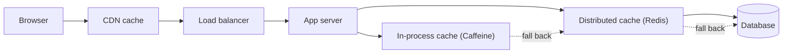
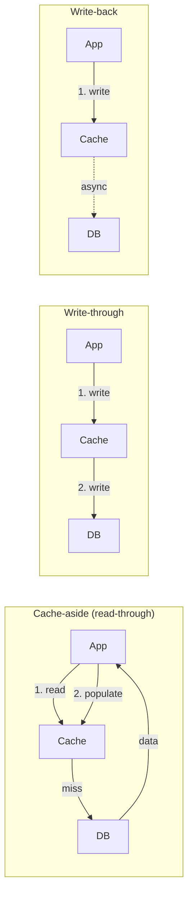
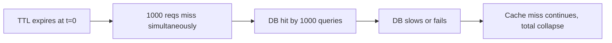

# Caching: Redis data types, invalidation strategies, LRU/LFU

Caches trade **freshness for speed**. Done right, they shave latency by orders of magnitude and protect databases from load spikes. Done wrong, they serve stale data, mask bugs, or collapse under load when keys expire all at once.

## Where caches sit in a system



| Layer                                | Latency  | Scope               | Best for                                |
| ------------------------------------ | -------- | ------------------- | --------------------------------------- |
| Browser                              | 0ms      | One user            | Fully personalised content              |
| CDN                                  | <50ms    | All users by region | Static assets, public API responses     |
| In-process (Caffeine, in-memory map) | µs       | One JVM             | Hot read-mostly data, micro-batch       |
| Distributed (Redis, Memcached)       | <1ms     | All app servers     | Shared session, query results, counters |
| Database                             | ms-100ms | Source of truth     | Authoritative reads                     |

The right answer is often **multiple layers** — local cache for the hot 10%, Redis for the warm 80%, DB for the cold 10%.

## Redis — the universal data structure server

Redis is single-threaded with sub-millisecond responses. Each command is atomic. Persistence is optional (RDB snapshots, AOF append-only file). Used as cache, message queue, leaderboard store, distributed lock, session store.

| Type        | Operations                   | Use                                   |
| ----------- | ---------------------------- | ------------------------------------- |
| String      | GET, SET, INCR, EXPIRE       | Counters, simple values, JSON blobs   |
| Hash        | HGET, HSET, HMGET            | Object-like fields                    |
| List        | LPUSH, RPOP, LRANGE, BLPOP   | Queues, recent activity feeds         |
| Set         | SADD, SISMEMBER, SDIFF       | Tags, dedup, membership               |
| Sorted set  | ZADD, ZRANGEBYSCORE, ZRANGE  | Leaderboards, time-ordered events     |
| Stream      | XADD, XREAD, consumer groups | Event log, pub/sub with replay        |
| Pub/Sub     | PUBLISH, SUBSCRIBE           | Fanout notifications, no replay       |
| HyperLogLog | PFADD, PFCOUNT               | Approximate cardinality (~0.8% err)   |
| Bitfield    | BITSET, BITCOUNT             | Per-user bitmaps (active days, flags) |
| Geo         | GEOADD, GEOSEARCH            | Location queries                      |

```redis
# Cache pattern: read-aside with TTL
GET user:42                        # try cache
SET user:42 "{json}" EX 300        # populate with 5min TTL on miss
INCR page:home:views               # atomic counter

# Distributed lock (with caveats — see Redlock)
SET lock:order-123 "owner-xyz" NX EX 10

# Leaderboard
ZADD leaderboard 100 "alice"
ZADD leaderboard 250 "bob"
ZRANGE leaderboard 0 9 WITHSCORES REV   # top 10
```

## Caching strategies



| Strategy      | Write path                            | Read path                              | Risk                             |
| ------------- | ------------------------------------- | -------------------------------------- | -------------------------------- |
| Cache-aside   | App writes DB, then invalidates cache | Read cache; on miss load DB + populate | Race between invalidate and load |
| Write-through | App writes cache + DB synchronously   | Read cache                             | Slower writes                    |
| Write-around  | App writes DB only                    | Read cache; on miss load + populate    | Stale until first read           |
| Write-back    | App writes cache; persist later       | Read cache                             | Data loss on crash               |
| Refresh-ahead | Refresh popular keys before TTL       | Read cache                             | Wasted refreshes                 |

**Cache-aside is the default**. Most issues come from incorrect invalidation, not the strategy itself.

## The two hard problems: invalidation and stampedes

> "There are only two hard things in computer science: cache invalidation and naming things." — Phil Karlton

### Invalidation patterns

- **TTL-only**: data is stale up to `TTL` seconds. Simplest. Works when stale is acceptable.
- **Explicit invalidation on write**: app deletes the key when DB changes. Race risk: read between delete and DB commit can repopulate stale value.
- **Versioned keys**: cache by `user:42:v17`. On write, increment version. Old keys age out via TTL.
- **Pub/sub broadcast**: writer publishes "user:42 changed"; subscribers invalidate their local caches.

### Cache stampede (thundering herd)

When a hot key expires, every concurrent request misses and hits the DB at once. The DB collapses; the cache stays empty; everything breaks.



**Mitigations**:

1. **Request coalescing / single-flight** — first request loads, others wait for the same promise.

```java
// Caffeine and Guava give this for free
LoadingCache<String, User> cache = Caffeine.newBuilder()
    .expireAfterWrite(Duration.ofMinutes(5))
    .build(key -> loadUserFromDb(key));    // multiple concurrent gets share one load
```

2. **Probabilistic early refresh (XFetch)** — refresh keys early with probability that grows as TTL approaches zero.

3. **Stale-while-revalidate** — serve stale value while one worker refreshes in background.

4. **TTL jitter** — randomize TTLs (e.g. `300 + random(0, 60)` seconds) so keys do not all expire together.

5. **Negative caching** — cache "not found" results with short TTL to absorb miss storms on missing data.

## Eviction policies

When cache memory is full, what gets evicted?

| Policy    | Behaviour                                    | Best for                        |
| --------- | -------------------------------------------- | ------------------------------- |
| LRU       | Drop least recently used                     | General hot-set tracking        |
| LFU       | Drop least frequently used                   | Stable access patterns          |
| TTL-based | Drop expired keys; combine with LRU/LFU      | Time-bounded data               |
| Random    | Drop random key                              | Cheap, surprisingly competitive |
| W-TinyLFU | LFU with admission filter (Caffeine default) | Best hit rate in practice       |

Redis exposes `maxmemory-policy`: `allkeys-lru`, `volatile-lru`, `allkeys-lfu`, `noeviction`, etc. **Default is `noeviction`** — Redis returns errors instead of evicting. Almost always wrong; set it explicitly.

## Hot key problem

A single very popular key (celebrity user, viral product) saturates one Redis shard. Mitigations:

- **Local in-process cache** in front of Redis for the hot key.
- **Replica reads** — read from any replica (eventual consistency).
- **Key fanout** — store the same value at `key:1`, `key:2`, ..., `key:N` and pick randomly. Increases write cost.
- **Different cache for hot keys** (in-memory L1, even on each app server).

## Distributed locks — Redlock and its caveats

Redis is often used for distributed locks: `SET lock:x "owner" NX EX 10`. The Redlock algorithm extends this across multiple Redis instances for higher safety.

**Important caveat**: Martin Kleppmann's analysis showed Redlock is not safe under clock drift, GC pauses, or network partitions. For correctness-critical locks (financial state, leadership election), use **Zookeeper** or **etcd**, both of which use consensus (Zab/Raft) and provide stronger guarantees. Redis locks are fine for performance optimization where occasional double-execution is acceptable.

## Common pitfalls

- **Caching mutable data without invalidation**. Stale forever.
- **TTLs too short** — cache barely helps.
- **TTLs too long** — staleness becomes a customer-visible bug.
- **No `maxmemory-policy`**. Redis defaults to `noeviction`; full memory means write errors.
- **Caching the unauthenticated query response** for an authenticated request. Privacy bug.
- **Using Redis for write-heavy workloads** without thinking about replica sync. Single-master limits write throughput.
- **Caching results of expensive computations without bounding cardinality**. The cache balloons. Limit keyspace.
- **Treating Redis as a database**. It is not durable by default. AOF + replication helps but does not match a real DB.

## Interview answers

_Q: Walk me through how cache-aside handles a read._
A: App asks the cache. Cache hit → return. Cache miss → app reads from DB, writes back to cache (with TTL), returns. Subsequent reads within TTL hit the cache.

_Q: How would you mitigate cache stampede?_
A: Stack defences. Single-flight at the app layer (Caffeine, Guava). TTL jitter to spread expirations. Probabilistic early refresh for hot keys. Stale-while-revalidate to serve stale values during refresh. Negative caching for misses to absorb storm on missing data.

_Q: When does write-through beat cache-aside?_
A: When you cannot tolerate the brief stale window of cache-aside (between DB commit and cache invalidation), or when you write rarely and read constantly. Write-through doubles the write latency but guarantees the cache is always at least as fresh as the DB.

_Q: How does Redis handle eviction?_
A: When memory hits `maxmemory`, Redis evicts according to `maxmemory-policy`. Default is `noeviction` (return errors). Common production: `allkeys-lru` or `allkeys-lfu`. Eviction is approximate — Redis samples a few keys and evicts the worst, not a true LRU walk.

_Q: How do you handle a "hot key" overwhelming one shard?_
A: Local in-process cache (Caffeine) on each app server in front of Redis. Replica reads if eventual consistency is acceptable. Key fanout — write to N replicas, read from random one. Or restructure: split the value into per-region keys if the hot key is global.

_Q: When would you use a sorted set vs a list in Redis?_
A: List is FIFO/LIFO with `O(1)` push/pop. Sorted set is ordered by a numeric score with `O(log n)` insert/range. Use sorted set for leaderboards, time-ordered events with arbitrary insertion, or "top N" queries. Use list for simple queues and recent-activity feeds where insertion order is fine.

_Q: How does Redis Cluster differ from a single Redis?_
A: Cluster shards keys across many Redis instances using hash slots (16384 slots, distributed across nodes). Each key hashes to a slot, the slot lives on one node. Multi-key operations work only on keys in the same slot (use hash tags to force colocation). Replication and failover are per-shard.
