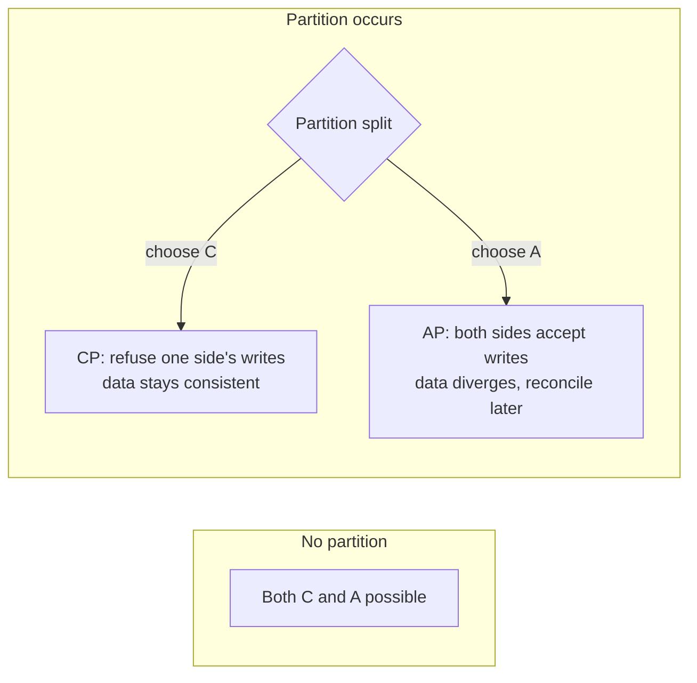
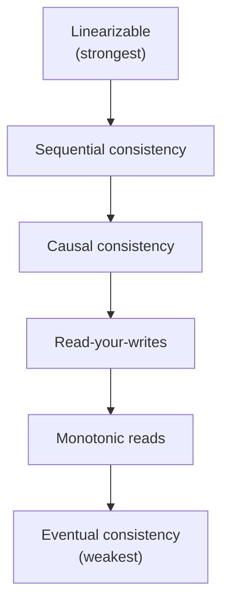
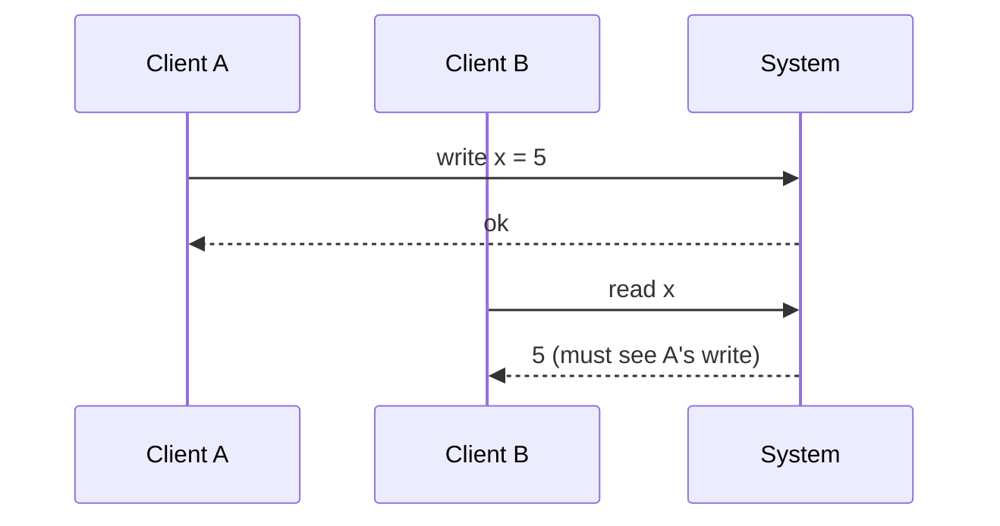
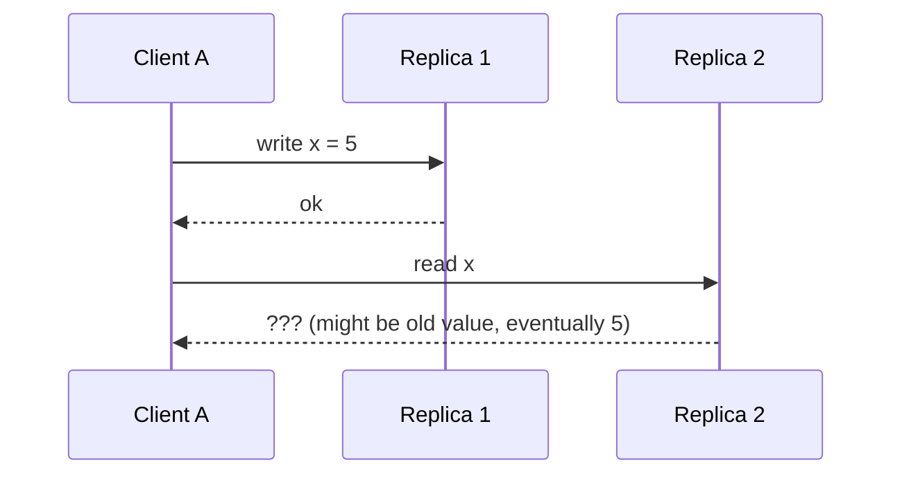

# CAP, PACELC, consistency models: linearizable, sequential, eventual

The moment you replicate data across machines, you face a hard physics fact: **the network can fail, machines can crash, and you cannot have everything**. Distributed systems theorems put numbers on the trade-offs. Senior interviews use this language to probe whether you can reason about partial failures.

## CAP — the famous theorem

In a distributed system, when a network partition (P) occurs, you can guarantee either:

- **Consistency (C)** — every read sees the latest write, OR
- **Availability (A)** — every request gets a response (possibly stale)

But not both at the same time.

**Key clarification**: CAP is not "pick 2 of 3." Partitions **will** happen. The real choice is **what to do when they do**: refuse to serve (CP) or serve possibly stale data (AP).

| Class | Examples                                                                     |
| ----- | ---------------------------------------------------------------------------- |
| CP    | Postgres with synchronous replicas, Zookeeper, etcd, HBase, MongoDB (strict) |
| AP    | Cassandra, DynamoDB, CouchDB, DNS, Riak                                      |

CP picks unavailable-but-correct: a partitioned replica refuses writes until the partition heals. AP picks available-but-eventually-correct: each side accepts writes; they reconcile on heal (last-write-wins, CRDTs, or app-level merge).

## PACELC — the more honest theorem

Daniel Abadi pointed out CAP misses the common case: **when there is no partition**, you still trade. PACELC says:

- **If Partition (P)**: Availability (A) or Consistency (C).
- **Else (E)**: Latency (L) or Consistency (C).

Synchronous replication ensures consistency at the cost of latency (writer waits for replicas to ack). Async replication is fast but readers can see stale data.

| System                      | PACELC class                                            |
| --------------------------- | ------------------------------------------------------- |
| DynamoDB (default)          | PA/EL — available under partition, low latency normally |
| Cassandra                   | PA/EL                                                   |
| BigTable / HBase            | PC/EC — consistent under partition, consistent normally |
| MongoDB                     | PA/EC (configurable per operation)                      |
| Postgres + sync replication | PC/EC                                                   |

## Consistency models — the spectrum

Consistency is not boolean. There is a hierarchy from "every reader sees the same global truth" to "everyone gets some answer eventually."

| Model                | Guarantee                                                                  | Cost                                 | Example                                           |
| -------------------- | -------------------------------------------------------------------------- | ------------------------------------ | ------------------------------------------------- |
| **Linearizable**     | All operations appear atomic and totally ordered consistent with real time | Highest latency, lowest availability | Single-leader DB with quorum reads, etcd, Spanner |
| **Sequential**       | Total order exists but may not match wall-clock                            | High                                 | Raft-based systems, ZooKeeper                     |
| **Causal**           | Causally related operations seen in order                                  | Medium                               | Collaboration tools, Cosmos DB session level      |
| **Read-your-writes** | A client always sees its own writes                                        | Low                                  | Session-stickied apps                             |
| **Monotonic reads**  | A client never sees older data than it has seen                            | Low                                  | Per-replica reads                                 |
| **Eventual**         | Replicas converge if writes stop                                           | Lowest                               | DNS, Cassandra default, Memcached                 |

### Linearizable — the strongest

A linearizable operation appears to take effect at some point between its invocation and its response, and all clients see the same order. There is **one true history**.

Cost: every read either goes to the leader, or quorum-confirms with replicas. Higher latency, lower throughput, requires a coordinator.

### Eventual — the weakest

Different replicas may return different values. If writes stop, replicas converge.

Cheap and available. Used everywhere staleness is OK: counters, feeds, search indexes, DNS.

### Read-your-writes — the practical compromise

A user expects to see their own changes immediately, even if other replicas lag. Implementations:

- Sticky session — read from the same replica that handled the write.
- Read from leader for a short window after a write.
- Versioned reads — client sends "I last wrote at version 10," replica refuses to serve until it has that version.

## Picking a consistency model in interviews

The exam-trick phrasing:

| Use case              | Pick                           | Why                                                |
| --------------------- | ------------------------------ | -------------------------------------------------- |
| Banking transfer      | Linearizable                   | Money cannot duplicate or vanish                   |
| Like counter          | Eventual                       | Off-by-one for a few seconds is fine               |
| Shopping cart         | Read-your-writes               | User must see their own additions                  |
| Inventory reservation | Linearizable (or careful saga) | Cannot oversell                                    |
| Social feed timeline  | Eventual + causal              | Order of related posts matters; absolute global no |
| Chat message ordering | Causal per conversation        | A's reply to B must appear after B's message       |
| Distributed lock      | Linearizable                   | Two holders is a correctness violation             |
| Search results        | Eventual                       | Index lag is acceptable                            |

## Common pitfalls

- **"We are CP" or "we are AP"** spoken absolutely. Real systems are configurable per operation. DynamoDB can be either. Cassandra's `QUORUM` reads + writes are linearizable; `ONE` is eventual.
- **Confusing transactions and consistency**. ACID is about transactions on a single node; CAP is about replicated state. A single Postgres without replicas has nothing to do with CAP.
- **Pretending exactly-once is real**. In a distributed system you have at-least-once with idempotency or at-most-once with possible loss. "Exactly-once" is a marketing term most of the time.
- **Ignoring clock skew**. Wall-clock-based ordering breaks under NTP drift. Use logical clocks (Lamport, vector) or hybrid logical clocks (Spanner-style TrueTime) for correct ordering.
- **Quorum without odd numbers**. With even-sized quorums you can split-brain. Always use odd numbers (3, 5, 7) for Raft / Paxos clusters.

## Interview answers

_Q: Walk me through what CAP actually means._
A: When a partition splits the system, replicas on both sides cannot communicate. You must choose: refuse some operations to keep state consistent (CP), or accept all operations and reconcile divergence later (AP). The choice is per operation, not per system — most modern databases let you pick.

_Q: Why is PACELC more useful than CAP?_
A: Partitions are rare. The everyday trade is between latency and consistency, even when the network is fine. PACELC names this: synchronous replication for consistency or asynchronous for latency. Most production performance tuning lives in this trade.

_Q: What is the difference between linearizable and sequential consistency?_
A: Both provide a total order across operations. Linearizable additionally requires that order to match real time — if A finishes before B starts, A is ordered before B. Sequential consistency only requires that some valid order exists; replicas can disagree on real-time placement as long as they agree on the order.

_Q: How would you implement read-your-writes consistency?_
A: After a write, route the user's reads to the leader (or to a replica known to have caught up). A common pattern: store the version of the last write in the user's session; on read, the system either reads from a replica with that version or waits for it to catch up. AWS Aurora and many cloud databases offer this as a built-in.

_Q: When is eventual consistency the right answer?_
A: When the cost of staleness is low and the cost of unavailability is high. Likes, view counts, shopping cart suggestions, social feeds, search indexes. The user does not notice a few seconds of staleness; they very much notice an outage.

_Q: How does Spanner achieve global linearizability with global writes?_
A: Atomic clocks and GPS receivers in every data center give Spanner a `TrueTime` API with bounded clock uncertainty (~7ms). Transactions wait out the uncertainty before committing, ensuring a consistent global order. This is unique infrastructure most cloud providers do not have.

_Q: What's the difference between strong consistency and ACID?_
A: ACID is a property of single-node transactions. Strong consistency (linearizable) is a property of distributed reads. A single-node Postgres database is ACID but irrelevant to CAP because there is nothing to replicate. A multi-region distributed system can be linearizable, eventual, or anywhere in between, independent of whether each shard runs ACID transactions internally.
