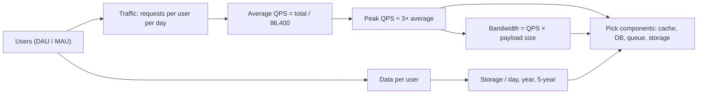

# Capacity estimation: back-of-envelope math, QPS, storage, bandwidth

System design interviews live or die on capacity estimation. Wrong by 10x and your architecture answers are wrong; right within 2x and the rest of the discussion has the right shape. The goal is not precision — it is **showing you pick components based on traffic, storage, and bandwidth, not because they are popular**.

## The estimation framework



Always start with: **users → activity → traffic → resources**. Resource numbers feed component decisions.

## Numbers worth memorising

| Quantity                             | Approx. value             |
| ------------------------------------ | ------------------------- |
| Seconds per day                      | 86,400 ≈ 10⁵              |
| Seconds per month                    | 2.6 × 10⁶                 |
| Seconds per year                     | 3.15 × 10⁷                |
| Single SQL row lookup (indexed)      | 5K-10K reads/sec/instance |
| Single hot Redis instance throughput | ~100K ops/s               |
| Same-region network RTT              | ~1 ms                     |
| Cross-region RTT                     | ~70-150 ms                |
| Sequential SSD read                  | ~100 MB/s                 |
| Sequential NVMe read                 | ~1 GB/s                   |
| Random SSD IOPS                      | ~10K IOPS                 |
| Memory access (RAM)                  | ~100 ns                   |
| L1 cache access                      | ~1 ns                     |
| Disk-to-disk network (1 Gbps)        | ~125 MB/s effective       |
| Disk-to-disk network (10 Gbps)       | ~1.25 GB/s effective      |

These are within 2x of reality on modern cloud hardware. Memorise the orders of magnitude; the exact number does not matter in interviews.

## Powers of 10 you should know cold

| Suffix       | Value      |
| ------------ | ---------- |
| K (thousand) | 10³        |
| M (million)  | 10⁶        |
| B (billion)  | 10⁹        |
| T (trillion) | 10¹²       |
| KB           | 10³ bytes  |
| MB           | 10⁶ bytes  |
| GB           | 10⁹ bytes  |
| TB           | 10¹² bytes |
| PB           | 10¹⁵ bytes |

(Strictly KB/KiB differ — 1000 vs 1024 — but for back-of-envelope, treat them as the same.)

## Pattern 1 — daily active users to QPS

```
DAU = 100M
Average requests per user per day = 50
Total daily requests = 100M × 50 = 5 × 10⁹

Average QPS = 5 × 10⁹ / 86,400
            ≈ 58,000 QPS
Peak QPS    ≈ 3 × average
            ≈ 174,000 QPS
```

The peak factor depends on the product:

- **Read-heavy global services**: ~2-3x average.
- **Time-zone bound** (US-only): ~5-10x because everyone uses it during waking hours.
- **Event-driven** (Black Friday, viral moments): 10-100x.

## Pattern 2 — storage growth

```
Active users = 100M
Records added per user per day = 5
Bytes per record = 1000

Daily new data = 100M × 5 × 1000 = 500 GB/day
Yearly        = 180 TB/year
5-year        = 900 TB

With 3x replication factor → 2.7 PB at 5 years
```

Always state: replication factor, retention period, indexing overhead (~30% on top of raw data).

## Pattern 3 — bandwidth

```
Peak QPS    = 174,000
Avg payload = 5 KB (request + response)

Peak bandwidth = 174,000 × 5 KB
              ≈ 870 MB/s
              ≈ 7 Gbps
```

For video, audio, or large blob services, bandwidth dominates. For typical CRUD APIs, bandwidth is rarely the bottleneck.

## Pattern 4 — read-vs-write ratio

```
Posts per user per day      = 0.1   (100M users × 0.1 = 10M new posts/day)
Reads per post per day      = 50    (avg user views many posts)

Total writes = 10M / day      ≈ 116 writes/sec average
Total reads  = 100M × 50      = 5B / day ≈ 58K reads/sec average
              with peak       ≈ 175K reads/sec
```

A 500:1 read:write ratio screams "read replicas + cache." A 1:1 ratio (e.g. inventory updates) screams "single source of truth, pessimistic locking, careful sharding."

## Pattern 5 — converting QPS to instances

```
Peak QPS              = 175K
Per-instance capacity = 5K req/s    (typical for a CRUD service in Java)

Instances needed     = 175K / 5K = 35
Add 30% headroom     ≈ 50 instances

For HA across 3 AZs  = 50 / 0.66 ≈ 75 instances total (so any AZ can be lost)
```

Always size for **failure scenarios**: capacity must hold even if one AZ or region is down.

## Worked example: Twitter-scale timeline

```
DAU                      = 200M
Tweets per user per day  = 0.5  (avg, not power users)
Reads per user per day   = 100  (timeline scrolling)

Tweets per day  = 100M
Reads per day   = 20B
Avg tweet size  = 500 bytes (text + metadata)

Write QPS  ≈ 100M / 86,400 ≈ 1,200 (peak ~3,600)
Read QPS   ≈ 20B / 86,400 ≈ 230,000 (peak ~700,000)

Daily storage   = 100M × 500 bytes = 50 GB/day
Yearly storage  = 18 TB/year
With 3x replication → 54 TB/year
```

This tells you immediately:

- Reads dominate by 200x → must cache aggressively, denormalise on write.
- Tweets are small → SQL or Cassandra works; not "video at scale" territory.
- 700K read QPS → cache + replicas, not direct DB hits.

## Common pitfalls

- **Skipping the assumption step**. State DAU, requests per user, peak factor explicitly. Otherwise the interviewer cannot follow.
- **Forgetting peak vs average**. Average QPS at 58K doesn't size your fleet — peak does.
- **Ignoring replication and retention**. 3x replication multiplies storage. 5-year retention vs 90 days is a 20x difference.
- **Conflating storage with index size**. SQL indexes typically add 30% on top of raw data. Memory caches need 2-5x the working set.
- **Estimating with too much precision**. "58,294 QPS" tells me nothing more than "60K QPS." Round aggressively; the interviewer cares about your reasoning.
- **Skipping bandwidth**. If you build a video service and forget bandwidth, your egress bill matches your AWS revenue.
- **Not validating against real systems**. Twitter does ~6K tweets/sec average peak. WhatsApp does ~100B messages/day. If your estimate gives "Twitter does 1M tweets/sec," recheck.

## Interview answers

_Q: How would you start a capacity estimation in an interview?_
A: State assumptions out loud — DAU, requests per user, peak factor, retention, replication. Compute average QPS, then peak. Compute storage for one day, one year, five years. Compute bandwidth. Round aggressively. Then connect each number to a component decision.

_Q: A service has 100K QPS at peak. How many instances do you need?_
A: Depends on per-instance capacity. A typical Java CRUD service handles ~5K QPS per instance comfortably. So 100K / 5K = 20 instances. Add 30% headroom for traffic spikes → 26. Multiply by 1.5 to handle the loss of one AZ in a 3-AZ deployment → ~40 instances.

_Q: How do you decide if you need a cache?_
A: Compare read QPS to what your DB can handle. If reads exceed ~10K QPS per DB instance and the data is read-mostly, you need a cache. Compute the working set size in memory — if it fits in RAM (Redis), great. If not, you need a tiered cache or a different access pattern.

_Q: How would you estimate storage growth for a chat app?_
A: Users × messages per day × avg message size. WhatsApp does ~100B messages per day at avg ~100 bytes → 10 TB/day. Apply replication (3x) → 30 TB/day. Multiply by retention. Decide hot vs cold tiering — recent messages in fast storage, old in cheap object storage.

_Q: A senior engineer claims their service needs 1000 servers. How would you sanity-check?_
A: Get the QPS and per-server capacity. 1000 servers at 5K QPS each = 5M QPS. Sanity check against the user base — does their DAU support 5M QPS? Most likely no; they are over-provisioned. Or per-server capacity is much lower than expected — investigate why (heavy work, blocking IO, GC pressure).

_Q: What's the difference between QPS and TPS?_
A: QPS is queries per second (read or write requests). TPS is transactions per second — usually means write transactions on a database. A service might do 100K QPS reads but only 1K TPS writes. The DB worries about TPS; the cache and load balancer worry about QPS.

_Q: How do you estimate latency budgets?_
A: Start with the user-facing target — say 200ms p99. Subtract: 50ms client-side render, 30ms TCP+TLS, 20ms regional network, leaves 100ms for the server. Server fans out to 5 services in series → 20ms each. If any one service exceeds 20ms p99, the overall budget breaks. Make latency budgets explicit per service.
