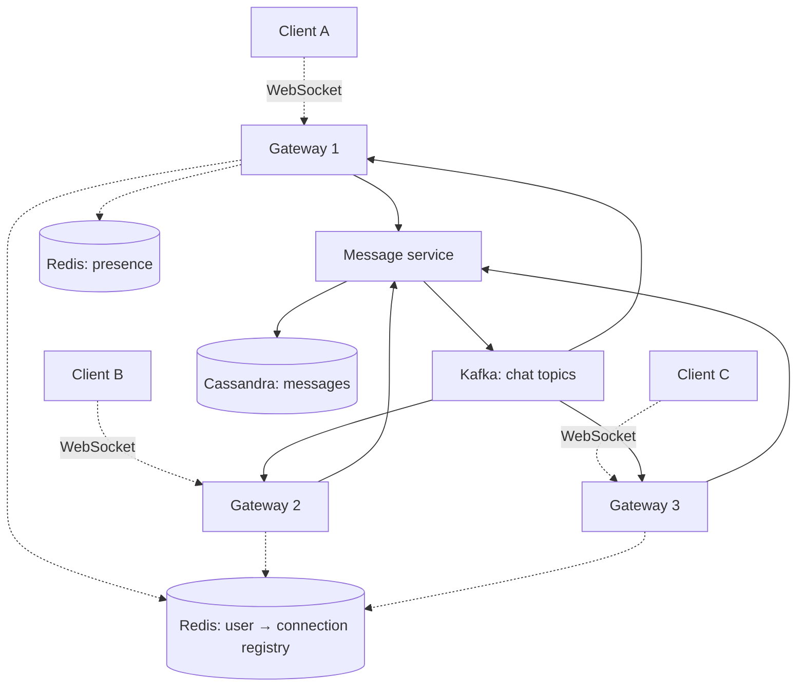
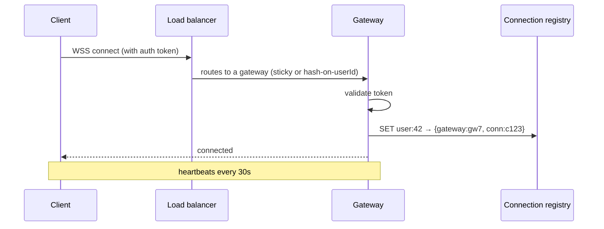
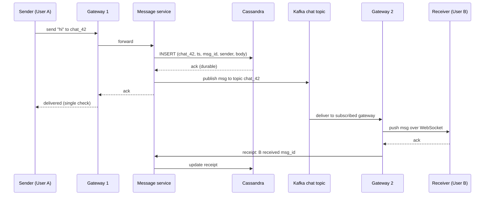
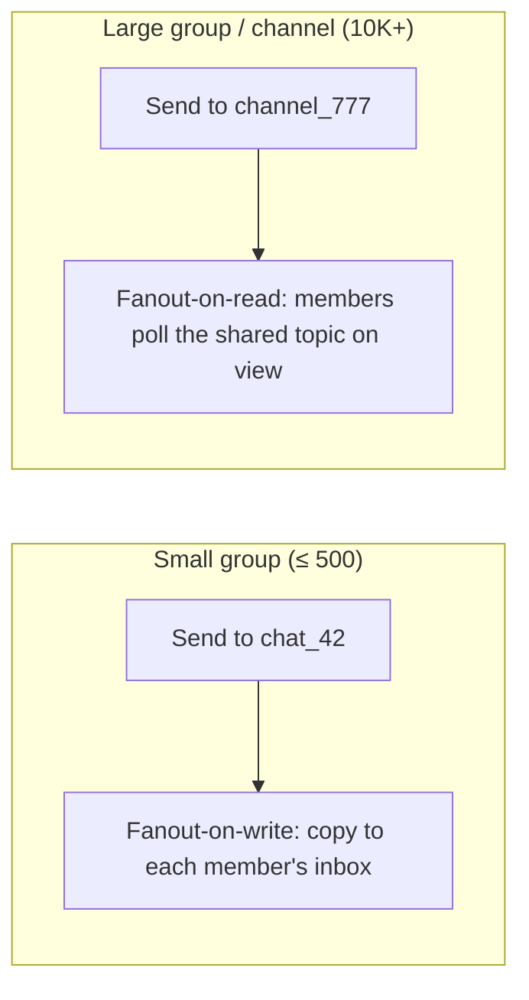

# Walkthrough: chat / messaging system (WhatsApp-lite)

A chat system is the canonical "real-time" system design problem. The interesting parts: persistent connections at scale, message ordering, offline delivery, group fanout, and presence.

## Step 1 — Clarify requirements

**Functional**:

- 1:1 chat between users.
- Group chat (small, large).
- Delivery receipts ("delivered" check mark).
- Read receipts ("read" check mark).
- Online / offline presence.
- Message history (read on demand).
- Optional: typing indicators, media (images, videos), end-to-end encryption.

**Non-functional**:

- Send-to-receive latency < 200ms.
- Messages ordered within a chat.
- Messages durable (not lost on crash).
- Delivery to offline users when they reconnect.

## Step 2 — Estimate

```
DAU                    = 50M
Messages per user/day  = 40
Total messages/day     = 2B

Avg send QPS  = 2B / 86,400 ≈ 23K
Peak send QPS = ~70K (3x)

Messages per chat = avg 100 (rough)
Avg message size  = 200 bytes
Daily storage     = 2B × 200 = 400 GB/day
Yearly            = 145 TB
With 3x replica   = 440 TB/year
```

50M concurrent connections at peak = 50M open sockets. Each WebSocket holds OS resources (file descriptors, memory). Sizing the connection layer is half the problem.

## Step 3 — Architecture



| Component                   | Responsibility                                              |
| --------------------------- | ----------------------------------------------------------- |
| Gateway nodes               | Hold persistent WebSockets; forward to message svc          |
| Connection registry (Redis) | Map `user_id → gateway_node, connection_id`                 |
| Message service             | Validates, persists, publishes to Kafka                     |
| Cassandra                   | Stores messages keyed by `(chat_id, ts, msg_id)`            |
| Kafka                       | Per-chat topic; gateways subscribe to deliver to live users |
| Presence (Redis)            | TTL-based online status                                     |
| Push gateway                | APNs / FCM for offline notifications                        |

## Step 4 — Connection layer

WebSockets give bidirectional persistent connections — necessary for low-latency push. Each gateway node holds many connections (10K-100K depending on box size).



**Sticky load balancing** (or consistent hash on user_id) ensures the same user always lands on the same gateway, avoiding stale registry entries.

**Heartbeats**: client sends ping every 30s; if gateway misses 3 in a row, mark connection dead and clean up registry.

## Step 5 — Sending a message



**Critical order**: persist first, then fan out. If the system crashes after persist but before fan-out, the recipient gets the message on next sync. If you fan out first and crash, the message is lost.

## Step 6 — Ordering

Message order matters per-chat, not globally. To preserve order:

- Use `chat_id` as the partition key in Kafka. All messages for one chat go to one partition; one partition is consumed in order.
- Use `chat_id` as the partition key in Cassandra. Rows in the partition are sorted by clustering column (`timestamp` or `msg_id`).
- Each message has a `msg_id` generated by Snowflake (monotonic per-shard 64-bit ID with embedded timestamp).

Cross-chat order is undefined and users do not care.

## Step 7 — Storage schema (Cassandra)

```cql
CREATE TABLE messages (
    chat_id     UUID,
    msg_id      BIGINT,           -- Snowflake-style; sortable
    sender_id   UUID,
    body        TEXT,
    created_at  TIMESTAMP,
    PRIMARY KEY ((chat_id), msg_id)
) WITH CLUSTERING ORDER BY (msg_id DESC);
```

Partition key = `chat_id` → all messages for one chat in one partition. Clustering key = `msg_id` desc → newest first, fast pagination.

For large chats, partition can grow huge. Partition by `(chat_id, year_month)` to bound partition size.

## Step 8 — Read receipts and presence

**Read receipts**:

```
chat_id, user_id, last_read_msg_id
```

Each user maintains their own "read up to" pointer per chat. Updates are very frequent (every chat scroll). Store in Redis for speed; snapshot to Cassandra periodically.

**Presence**:

```
SET presence:user:42 "online" EX 60
```

Each gateway updates the user's presence with TTL. If gateway crashes, presence expires — user shown offline within 60s. Subscribers pull or get notified.

## Step 9 — Offline delivery

Recipient is offline when message arrives. Two approaches:

| Strategy          | How                                                                           |
| ----------------- | ----------------------------------------------------------------------------- |
| Pull on reconnect | Client says "give me messages after msg_id X"; server queries Cassandra       |
| Push notification | OS-level (APNs / FCM) for "you have N new messages"; client pulls when opened |

The persistent message store is the source of truth. WebSocket delivery is a fast path; if missed, the message is still there to fetch.

## Step 10 — Group fanout



| Fanout          | When                    | Cost                                 |
| --------------- | ----------------------- | ------------------------------------ |
| On-write (push) | Small groups (≤ 500-1K) | Sender pays; receivers see instantly |
| On-read (pull)  | Large groups, channels  | Receivers pay on view                |
| Hybrid          | Mixed sizes             | Per-group threshold logic            |

Twitter's "celebrity problem" applies here — a celebrity with 10M followers cannot fanout-on-write because every tweet triggers 10M writes. Fanout-on-read for big audiences.

## Step 11 — End-to-end encryption (optional discussion)

If you do E2E (Signal Protocol):

- Server never sees plaintext. Stores encrypted blobs.
- Each chat has a session key managed via Double Ratchet protocol.
- Group chat has more complex key management (Sender Keys or MLS).
- Push notifications cannot include the message body — only "new message."

E2E rules out server-side search and many features; trade-off worth naming.

## Common pitfalls

- **No persistent connection registry**. Sender's gateway does not know which gateway holds the receiver. Either broadcast (wasteful) or maintain a registry (do this).
- **Synchronous fanout to all group members**. A 500-member group means 500 WebSocket pushes from one gateway. Use Kafka so each gateway pulls only its connected users.
- **Single hot partition for popular chats**. A celebrity Q&A with millions of viewers overloads one Kafka partition. Use multiple partitions for the hot chat and a coordinator to merge order.
- **Lost messages on gateway crash**. If the gateway crashes after acking the sender but before persisting, the message is gone. Always persist first.
- **Read receipts stored in main message table**. High-frequency updates on a hot row collapse the DB. Separate fast store (Redis) + periodic snapshot.

## Interview answers

_Q: Why use Kafka between the message service and the gateways?_
A: Decoupling. The message service does not know which gateway holds each receiver. Kafka gives a per-chat topic; each gateway subscribes to topics for its connected users and pushes to the WebSocket. Adds reliability — if a gateway dies, replacements pick up from the offset where the previous left off.

_Q: How do you guarantee message order within a chat?_
A: Single partition per chat in Kafka (`partition = hash(chat_id)`). Single consumer reads partition serially. Cassandra uses `chat_id` as partition key with `msg_id` as clustering column. Snowflake-style monotonic IDs ensure globally consistent order even if multiple workers ingest.

_Q: How do you handle the celebrity problem?_
A: Fanout-on-read for very large audiences. Each follower's client pulls from the celebrity's topic instead of receiving a personal copy. Cost shifts from sender (1 write × M followers) to receivers (each pulls on view). Threshold based on follower count: small accounts use fanout-on-write, large use fanout-on-read.

_Q: A user is offline for a week. How do they get all the messages?_
A: Messages are durable in Cassandra with `chat_id` partition. On reconnect, the client says "I last saw msg_id X for chat_42." Server queries Cassandra `WHERE chat_id = 42 AND msg_id > X` and streams down. Push notification (APNs/FCM) tells the OS-level client there are new messages so the app can connect.

_Q: How would you implement typing indicators?_
A: Pure ephemeral state. Sender publishes "user:42 typing in chat:7" to Redis pub/sub with 5s TTL. Subscribers (other chat members' gateways) receive and forward to clients. Never persisted. If lost, no harm.

_Q: How do you handle a user logging in on multiple devices?_
A: Connection registry maps `user_id → set of (gateway, connection_id)`. On send, fanout to all connections. On read receipt, clarify which device read — store device-aware receipt or use the most-recent-read across devices.

_Q: How would you scale presence to millions of online users?_
A: Redis `SET user:N "online" EX 60` per user. With 50M users at peak, ~50M keys at 100 bytes each = 5 GB Redis. Sharded Redis cluster handles it. Pub/sub for presence change notifications. Avoid querying presence on every message — cache locally or batch presence updates.

_Q: How does this differ from a notification system like an email service?_
A: Chat is real-time, bidirectional, ordered. Email is asynchronous, one-shot, no real-time delivery. Chat needs persistent connections, fanout topics, presence. Email needs SMTP, queueing, retry with backoff, DKIM. Different protocols, different SLAs.
