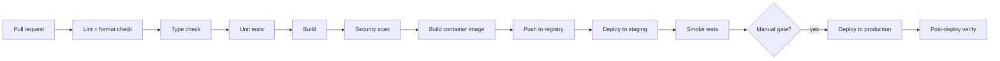
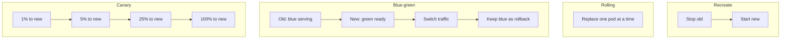
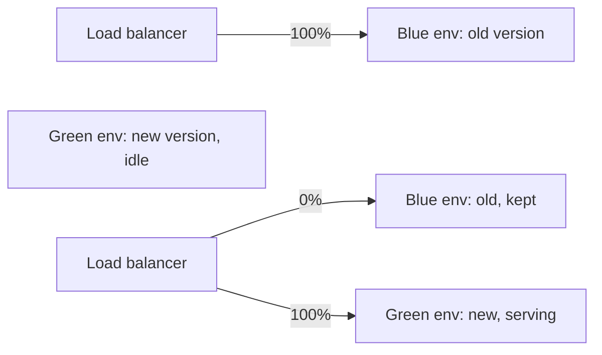
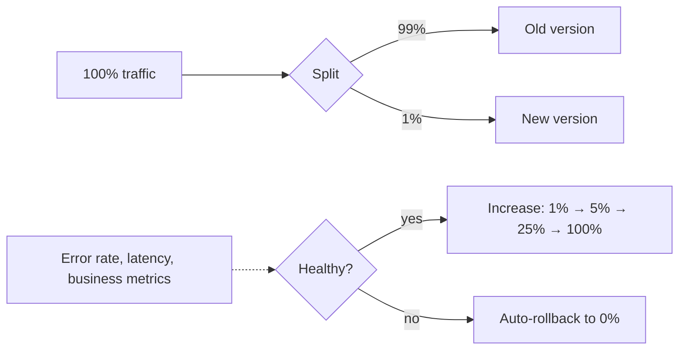
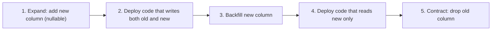

# CI/CD: pipeline stages, GitHub Actions, blue-green and canary deployments

CI/CD is the discipline of getting code from a developer's branch to production **safely and quickly**. CI catches bugs early; CD reduces the cost of each deploy so you can deploy often. "Deploy on Friday" stops being scary.

| Term | Meaning                                                       |
| ---- | ------------------------------------------------------------- |
| CI   | Continuous Integration — every change is automatically tested |
| CD   | Continuous Delivery — every passing change is deployable      |
| CD   | Continuous Deployment — every passing change is auto-deployed |

The first CD is what most teams do; the second is the more aggressive version (e.g. Etsy, Facebook deploy hundreds of times per day).

## A typical pipeline



| Stage              | Catches                                           |
| ------------------ | ------------------------------------------------- |
| Lint + format      | Style errors, dead code, simple bugs              |
| Type check         | Type mismatches before runtime                    |
| Unit tests         | Logic regressions                                 |
| Build              | Compile errors, missing imports                   |
| Security scan      | Known CVEs in deps and base images                |
| Build image        | Reproducible artifact tagged with commit SHA      |
| Deploy to staging  | Wiring + integration issues                       |
| Smoke / E2E tests  | User-visible regressions                          |
| Manual approval    | Human-in-the-loop for high-risk changes (or skip) |
| Production deploy  | Get the change to users                           |
| Post-deploy verify | Health checks, error rate, latency under SLO      |

Aim for **the whole pipeline to finish in 10-15 minutes** for a typical PR. Longer pipelines hurt iteration speed; engineers context-switch and stop reading PRs.

## GitHub Actions example

```yaml
# .github/workflows/ci.yml
name: CI
on:
  pull_request:
  push: { branches: [main] }

jobs:
  test:
    runs-on: ubuntu-latest
    steps:
      - uses: actions/checkout@v4
      - uses: actions/setup-node@v4
        with:
          node-version: '22'
          cache: 'npm'
      - run: npm ci
      - run: npm run lint
      - run: npm run typecheck
      - run: npm run test:unit -- --coverage
      - uses: codecov/codecov-action@v4

  build:
    needs: test
    runs-on: ubuntu-latest
    steps:
      - uses: actions/checkout@v4
      - uses: docker/setup-buildx-action@v3
      - uses: docker/login-action@v3
        with:
          registry: ghcr.io
          username: ${{ github.actor }}
          password: ${{ secrets.GITHUB_TOKEN }}
      - uses: docker/build-push-action@v5
        with:
          push: true
          tags: ghcr.io/myorg/app:${{ github.sha }}
          cache-from: type=gha
          cache-to: type=gha,mode=max

  deploy-staging:
    needs: build
    if: github.ref == 'refs/heads/main'
    runs-on: ubuntu-latest
    environment: staging
    steps:
      - uses: actions/checkout@v4
      - run: |
          kubectl set image deployment/app app=ghcr.io/myorg/app:${{ github.sha }}
          kubectl rollout status deployment/app
```

Key practices:

- **Cache dependencies** (`cache: 'npm'`) — saves 30-90 seconds per run.
- **Pin action versions** (`@v4`, not `@latest`) — reproducibility.
- **Tag images by commit SHA** — every deploy is traceable.
- **Use environments** with required reviewers for production.

## Deployment strategies



| Strategy   | Pros                                        | Cons                                             |
| ---------- | ------------------------------------------- | ------------------------------------------------ |
| Recreate   | Simple                                      | Downtime; clean state for stateful migrations    |
| Rolling    | Zero downtime; default in K8s               | Old + new running simultaneously (compatibility) |
| Blue-green | Instant rollback; clean cutover             | Double capacity during deploy                    |
| Canary     | Limited blast radius; data-driven decisions | Requires per-version metrics + auto-rollback     |
| Shadow     | No user impact; production realism          | Complex; only validates non-effects              |

### Rolling update (default)

K8s Deployment with `maxSurge: 1, maxUnavailable: 0`. New pods come up; old pods go down. Zero downtime. Old and new run simultaneously, so changes must be **backwards-compatible** (database migrations, API changes).

### Blue-green

Two complete environments. Cut traffic over via DNS, load balancer, or service mesh. Instant rollback by flipping back. Costs 2x infrastructure during deploy.



### Canary

Send a small percentage of traffic to the new version; watch metrics; gradually increase if healthy.



Canary requires:

- Per-version metrics (Prometheus labels by version).
- Automated rollback criteria (error rate > X, latency p99 > Y).
- Tooling (Argo Rollouts, Flagger, Spinnaker).

The trade-off: more setup, but the safest way to roll out big changes.

## Database migrations in CI/CD

The hardest part of CD. Schema changes must be **backwards-compatible during the rollout** — the old code is still running.

The expand-contract pattern:



Each step is independently deployable. Never combine "add column" and "use only new column" in one deploy — old running pods still expect old schema.

Tools: Flyway, Liquibase (Java); Alembic (Python); Knex / Prisma migrate (Node).

## Feature flags — decoupling deploy from release

Code can ship to production without being active for users. Toggle on per user, per percentage, per region.

```java
if (featureFlags.isEnabled("new-checkout-flow", userId)) {
    return newCheckout(user);
}
return oldCheckout(user);
```

Tools: LaunchDarkly, Split, Unleash, GrowthBook. Or DIY with a config service.

Benefits:

- Deploy at any time; release when ready.
- Kill switches for misbehaving features.
- A/B testing without separate deploys.
- Gradual rollouts to specific cohorts.

## Common pitfalls

- **Long pipelines**. 90-minute CI breaks iteration. Parallelise jobs, cache dependencies, run E2E only on main.
- **Flaky tests**. Retry-until-pass culture. Quarantine and fix the flake; never retry indefinitely.
- **Manual deploys for production**. Increases deploy cost, reduces frequency, hurts safety. Automate.
- **No automated rollback**. Canary fails → human paged → 30 min to revert. Should be 30 seconds, automated.
- **Database migrations + code changes in one deploy**. Old pods crash on new schema or vice versa. Always expand-contract.
- **Untracked deploys**. No record of what version is in production. Tag images by SHA; record deploys.
- **Secrets in CI logs**. Mask secrets; rotate any that leak.
- **Same pipeline for hotfix and feature**. Hotfix path should skip slow non-critical stages and deploy fast.

## Interview answers

_Q: How would you go from "deploy once a month" to "deploy daily"?_
A: Reduce deploy cost. Speed up the pipeline (cache, parallelise). Add automated rollback so failed deploys self-heal. Decouple deploy from release with feature flags so risky changes can ship dark. Make small PRs the norm — smaller change, smaller blast radius. Once each deploy is cheap and safe, frequency follows.

_Q: When would you choose blue-green over rolling deploy?_
A: When the new version is incompatible with running old pods (e.g. major data format change), when you need instant rollback (financial systems), or when the application is stateful in a way that mixed-version routing breaks. Cost: 2x capacity during deploy. Most stateless web apps just use rolling.

_Q: How does canary differ from blue-green?_
A: Blue-green flips 100% of traffic at once after staging the new version. Canary gradually shifts a percentage based on observed metrics. Canary is safer for risky changes but requires good observability and automated rollback. Blue-green is simpler but riskier (one bad deploy is a global problem until you flip back).

_Q: How do you handle a database schema change during continuous deployment?_
A: Expand-contract. Phase 1: add the new column nullable; deploy. Phase 2: write to both old and new; backfill; deploy. Phase 3: read from new only; deploy. Phase 4: drop old column. Each phase is independently safe — old code is always running until the next phase replaces it.

_Q: What would you put in a pre-merge CI vs post-merge CI?_
A: Pre-merge (PR builds): fast checks — lint, typecheck, unit tests, security scan. Goal: < 5 minutes. Post-merge (main builds): everything pre-merge + integration tests + container build + deploy to staging + smoke tests. Goal: < 15 minutes. Long heavy tests (full E2E, load tests) run nightly or pre-release, not per-PR.

_Q: How would you debug a deploy that succeeded technically but caused a regression?_
A: Roll back first; investigate after. Compare metrics before/after deploy: error rate, latency, business metrics. Check the diff for the deployed version. Look at canary observations if you ran one. Production traffic shadow into the previous version is a strong reproducer. Add a regression test once root-caused.

_Q: When would you use feature flags vs branching strategies?_
A: Feature flags for runtime toggle and gradual rollout. Branching for parallel work that doesn't overlap. Long-lived feature branches are an anti-pattern — they merge late, surface conflicts, and miss CI on main. Trunk-based development with feature flags is the modern norm at scale.
