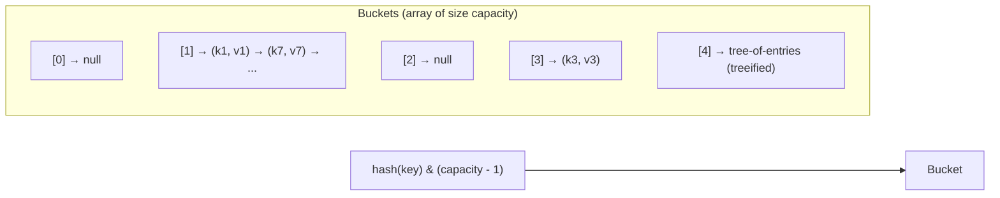
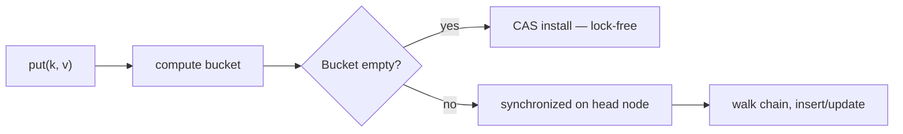

# Collections: HashMap internals, ConcurrentHashMap, CopyOnWriteArrayList, BlockingQueue

The Java collections framework is the most-used part of the JDK. Senior interviews focus on **how** the popular collections work, **when** to choose each one, and **what breaks** under concurrency.

## Choosing the right collection

| Need                            | Use                                         |
| ------------------------------- | ------------------------------------------- |
| Random-access list              | `ArrayList`                                 |
| FIFO queue, deque               | `ArrayDeque`                                |
| Sorted set / map                | `TreeSet` / `TreeMap` (red-black tree)      |
| Hash set / map                  | `HashSet` / `HashMap`                       |
| Insertion-ordered map iteration | `LinkedHashMap`                             |
| Concurrent hash map             | `ConcurrentHashMap`                         |
| Read-mostly listener list       | `CopyOnWriteArrayList`                      |
| Producer-consumer queue         | `LinkedBlockingQueue`, `ArrayBlockingQueue` |
| Priority-ordered queue          | `PriorityQueue`, `PriorityBlockingQueue`    |
| Sorted concurrent map           | `ConcurrentSkipListMap`                     |

## HashMap internals

Java's `HashMap` is a separate-chaining hash table.



**Key behaviours**:

- Capacity is always a **power of two**, so `hash & (capacity - 1)` replaces a modulo operation.
- The hash is `(h = key.hashCode()) ^ (h >>> 16)` — the high bits are mixed into the low bits to fight poor `hashCode` implementations.
- Collisions form a **singly linked list** in the bucket. Once a bucket has **8 entries** and capacity is **≥ 64**, the list converts to a **red-black tree** (`O(log n)` worst case instead of `O(n)`).
- **Resizing** doubles capacity at load factor 0.75. Each entry either stays in the same bucket index or moves to `oldIndex + oldCapacity` — determined by one extra bit of the hash.

**Not thread-safe.** Concurrent mutation can produce a corrupted bucket chain. Pre-Java 8, this could cause an infinite loop during resize. Modern JDKs do not loop, but the result is still a corrupt map.

```java
// Get is the inner loop of much production code
public V get(Object key) {
    int h = hash(key);
    int idx = h & (table.length - 1);
    for (Node<K,V> n = table[idx]; n != null; n = n.next) {
        if (n.hash == h && (n.key == key || (key != null && key.equals(n.key)))) {
            return n.value;
        }
    }
    return null;
}
```

The `n.key == key` reference check before `equals` is a fast path for interned strings and identity-equal keys.

**Equals/hashCode contract** — if you override `equals`, you **must** override `hashCode` consistently, or `HashMap` cannot find your keys after insert.

## ConcurrentHashMap

A drop-in replacement when multiple threads read and write. Reads are usually **lock-free**. Writes lock per-bucket.



**Key differences from `HashMap`**:

- **No null keys or values** — `null` would be ambiguous in concurrent reads (is it absent or present-with-null?).
- Resizing is **collaborative**: multiple writers help migrate entries to a new table.
- Bulk operations like `forEach`, `reduce`, `search` take a `parallelismThreshold` argument and use the `ForkJoinPool` when above the threshold.
- `compute`, `computeIfAbsent`, `merge` are atomic with respect to other puts on the same key.

```java
// Atomic counter increment, no lock
ConcurrentHashMap<String, Long> counts = new ConcurrentHashMap<>();
counts.merge("hits", 1L, Long::sum);
```

## CopyOnWriteArrayList

Every mutation copies the entire backing array. Reads are wait-free and lock-free.

```java
List<Listener> listeners = new CopyOnWriteArrayList<>();
listeners.add(listener);   // copies backing array of size N → new array of size N + 1
for (Listener l : listeners) l.fire(event);   // iteration is safe, no ConcurrentModificationException
```

**Use case**: listener registries, observer lists, where reads vastly outnumber writes and writes are rare. **Wrong for**: anything write-heavy. Adding 1000 entries one at a time copies the array 1000 times — `O(n²)` total.

## BlockingQueue — producer/consumer with back-pressure

```java
BlockingQueue<Task> queue = new ArrayBlockingQueue<>(1000);

// Producer
queue.put(task);                       // blocks if full — back-pressure
queue.offer(task, 100, MILLISECONDS);  // returns false if still full after timeout

// Consumer
Task t = queue.take();                 // blocks until non-empty
Task t = queue.poll(100, MILLISECONDS); // returns null on timeout
```

| Implementation          | Backing                 | Capacity             |
| ----------------------- | ----------------------- | -------------------- |
| `ArrayBlockingQueue`    | Array, single lock      | Bounded              |
| `LinkedBlockingQueue`   | Linked nodes, two locks | Bounded or unbounded |
| `SynchronousQueue`      | No capacity             | Hand-off only        |
| `PriorityBlockingQueue` | Heap                    | Unbounded            |
| `DelayQueue`            | Heap by expiration time | Unbounded            |

**Always pick a bounded queue in production.** Unbounded queues hide overload until you `OOM`. Bounded queues let producers either back-pressure (if `put`) or fail fast (if `offer`).

## TreeMap and ConcurrentSkipListMap

When you need **ordered iteration** or **range queries** (`headMap`, `tailMap`, `subMap`):

- `TreeMap` — red-black tree, `O(log n)`, single-threaded.
- `ConcurrentSkipListMap` — skip list, `O(log n)` expected, concurrent. Used in databases, schedulers, time-ordered queues.

```java
TreeMap<Long, Event> events = new TreeMap<>();
NavigableMap<Long, Event> recent = events.descendingMap();
NavigableMap<Long, Event> lastHour = events.tailMap(System.currentTimeMillis() - 3_600_000L);
```

## LinkedHashMap — insertion or access ordered

`LinkedHashMap` keeps entries in insertion order (or access order if `accessOrder = true`). The latter mode is the simplest LRU cache.

```java
class LRU<K, V> extends LinkedHashMap<K, V> {
    private final int capacity;
    LRU(int capacity) {
        super(16, 0.75f, true);    // accessOrder = true
        this.capacity = capacity;
    }
    protected boolean removeEldestEntry(Map.Entry<K, V> eldest) {
        return size() > capacity;
    }
}
```

Single-threaded only. For concurrent LRU, use Caffeine.

## Common pitfalls

- **Mutable keys in a `HashMap`**. Mutating an object after using it as a key changes its hash → the map cannot find it. Treat keys as effectively immutable.
- **Using `HashMap` from multiple threads**. Use `ConcurrentHashMap` or wrap with `Collections.synchronizedMap` (slower, single global lock).
- **`Iterator.remove()` on a `Collections.synchronizedMap(map)`**. Synchronisation does not extend to iteration; you need explicit `synchronized (map)` around the loop.
- **Boxing in hot loops**. `HashMap<Integer, Integer>` boxes both key and value on every operation. Use Eclipse Collections, fastutil, or `IntIntMap` libraries for hot paths.
- **`ArrayList.remove(int)` vs `remove(Object)`**. `list.remove(2)` removes index 2; `list.remove(Integer.valueOf(2))` removes the value 2. Bug magnet for `List<Integer>`.

## Interview answers

_Q: How does `HashMap` handle a poor `hashCode` that returns the same value for many keys?_
A: It still works correctly, but the bucket becomes a long chain — `O(n)` per lookup. Once the chain reaches 8 entries with capacity ≥ 64, Java 8+ converts it to a red-black tree, dropping worst-case to `O(log n)`. The original report from a Java 7 hash-collision DoS attack drove this change.

_Q: Why does `ConcurrentHashMap` disallow null values when `HashMap` allows them?_
A: With null allowed, `map.get(k) == null` is ambiguous: either the key is absent or present with null value. In concurrent code, the typical pattern `if (map.get(k) == null) map.put(k, compute())` becomes a race. Disallowing null forces the use of `containsKey` or `computeIfAbsent`.

_Q: When would you pick `ArrayList` over `LinkedList`?_
A: Almost always. `ArrayList` is contiguous memory, cache-friendly, and beats `LinkedList` for indexed access, iteration, and even most insertions in practice. `LinkedList` is only better when you have an `Iterator` already pointing at the position to insert/remove.

_Q: What is the difference between `synchronized Map` and `ConcurrentHashMap`?_
A: `Collections.synchronizedMap(map)` wraps every operation with a single global lock — high contention. `ConcurrentHashMap` locks per-bucket via CAS and per-head-node — concurrent reads scale, concurrent writes contend only on the same bucket. Use `ConcurrentHashMap` unless you specifically need the synchronisation point at the map level.

_Q: How does `HashMap` avoid memory waste at low load factors?_
A: It does not, by default. The load factor (0.75 by default) decides when to resize. The trade-off: lower load factor → fewer collisions but more wasted slots. Higher → more collisions. 0.75 is empirically a good balance.

_Q: When would you reach for `ConcurrentSkipListMap` over `TreeMap`?_
A: When you need an ordered map that supports concurrent reads and writes — schedulers, time-window aggregations, sorted job queues. Skip list operations scale with reader/writer threads where a synchronised `TreeMap` would serialise everything through one lock.

_Q: How would you implement a fixed-size LRU cache in 5 lines?_
A: Extend `LinkedHashMap` with `accessOrder = true` and override `removeEldestEntry` to return `size() > capacity`. The map auto-evicts on every `put` past capacity. Single-threaded only; reach for Caffeine for concurrent.
