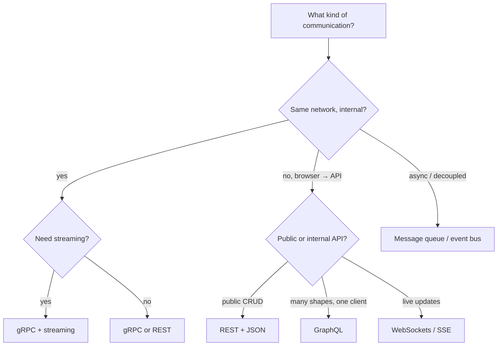
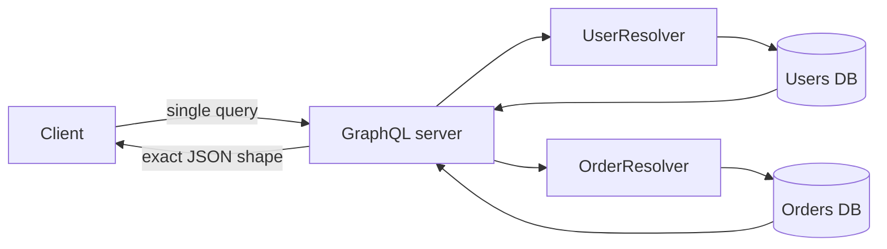
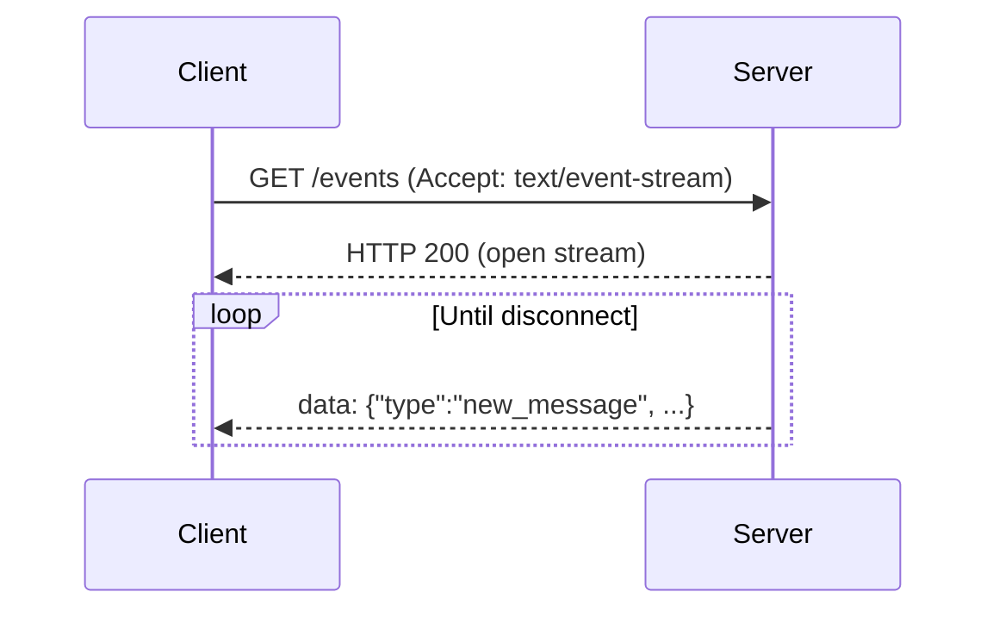
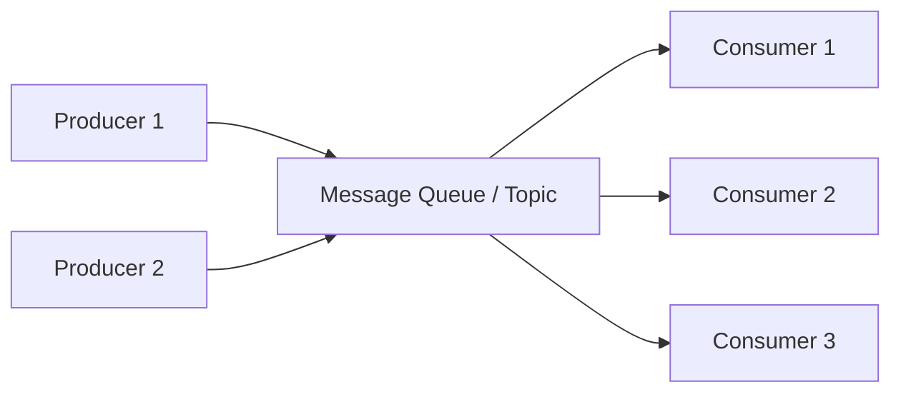
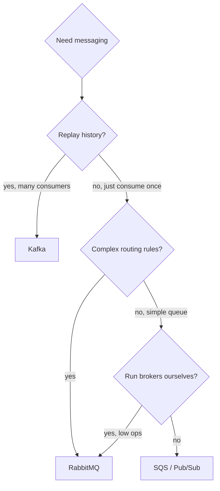

# Communication: REST vs GraphQL, gRPC, WebSockets, message queues

The protocols you choose for service-to-service and client-server communication shape your system's latency, observability, and team boundaries. Senior interviews probe whether you can pick the right tool for the access pattern.

## The decision space



| Pattern          | Best for                                               |
| ---------------- | ------------------------------------------------------ |
| REST             | Public APIs, CRUD, cacheable resources                 |
| GraphQL          | Multiple clients with different needs, single endpoint |
| gRPC             | Internal service-to-service, low latency, streaming    |
| WebSockets / SSE | Real-time push from server to client                   |
| Message queue    | Async processing, decoupled producers and consumers    |

## REST

REST is resource-oriented HTTP. Each resource has a URL; HTTP verbs (`GET`, `POST`, `PUT`, `DELETE`, `PATCH`) describe the action. Status codes communicate the outcome.

```
GET    /users/42           → 200 + user JSON
POST   /users              → 201 Location: /users/43
PUT    /users/42           → 204
DELETE /users/42           → 204
GET    /users/42/orders    → 200 + array of orders
```

| Strength                          | Weakness                                  |
| --------------------------------- | ----------------------------------------- |
| Caches with HTTP semantics        | Over- or under-fetching for complex pages |
| Browser tools (curl, fetch)       | Many endpoints for many use cases         |
| Universal tooling, easy debugging | Versioning ergonomics                     |
| Stateless, scales horizontally    | No streaming                              |

**Status code conventions** matter for observability:

- `2xx` — success.
- `3xx` — redirect.
- `4xx` — client error (do not retry).
- `5xx` — server error (retry with backoff).
- `429` — rate limited.

## GraphQL

GraphQL exposes one endpoint (`/graphql`). The client sends a **query** describing exactly the fields it wants; the server returns matching JSON.

```graphql
query {
  user(id: 42) {
    name
    email
    recentOrders(limit: 5) {
      id
      total
      items {
        name
        price
      }
    }
  }
}
```



| Strength                            | Weakness                               |
| ----------------------------------- | -------------------------------------- |
| Eliminates over- and under-fetching | No HTTP caching by default             |
| Single endpoint                     | Auth must be per-field, not per-route  |
| Strong schema and tooling           | Query cost can be unbounded (DoS risk) |
| Aggregates across services          | N+1 traps without DataLoader           |

**Risks**:

- **Cost analysis** must reject expensive queries. Limit query depth, count, or compute cost.
- **N+1**: a query with 100 users each fetching their orders becomes 1+100 DB queries unless you use **DataLoader** (Facebook's batching library).
- **Caching**: HTTP caches do not work; use Apollo Client cache, Relay store, or persisted-query mapping for CDN cacheability.

GraphQL works best when one team owns both client and server iterating together. For public APIs with thousands of consumers, REST is usually clearer.

## gRPC

gRPC is Google's RPC framework. Strongly typed contracts (Protocol Buffers), HTTP/2 transport, code generation in many languages.

```protobuf
syntax = "proto3";

service UserService {
  rpc GetUser (GetUserRequest) returns (User);
  rpc StreamUpdates (UserId) returns (stream UserUpdate);
  rpc UploadEvents (stream Event) returns (UploadResult);
  rpc Chat (stream ChatMessage) returns (stream ChatMessage);
}

message User {
  string id = 1;
  string name = 2;
  int32 age = 3;
}
```

| Strength                               | Weakness                                 |
| -------------------------------------- | ---------------------------------------- |
| Compact binary on the wire             | Browsers cannot speak it directly        |
| Strict types, code-gen                 | Harder to debug (binary)                 |
| Streaming (server, client, bidi)       | Tooling outside Go/Java/Python is weaker |
| Multiplexed over one HTTP/2 connection | Schema evolution requires care           |

**Streaming variants**:

- **Unary**: one request, one response.
- **Server streaming**: one request, server sends a stream of responses.
- **Client streaming**: client sends a stream, server returns one response.
- **Bidirectional**: full duplex stream of messages.

For internal service-to-service in big systems, gRPC is the standard. For browser clients, use **gRPC-Web** with an Envoy proxy that translates gRPC ↔ gRPC-Web.

## WebSockets and Server-Sent Events (SSE)

For server-to-client real-time push (chat presence, live dashboards, collaborative cursors):

| Feature         | WebSockets      | SSE                     |
| --------------- | --------------- | ----------------------- |
| Direction       | Bidirectional   | Server → client only    |
| Protocol        | Custom over TCP | HTTP, text/event-stream |
| Auto-reconnect  | Manual          | Built-in                |
| Browser support | Universal       | All except old IE       |
| Message types   | Text and binary | Text only               |
| Behind proxies  | May need config | Works as plain HTTP     |
| Complexity      | Higher          | Lower                   |

**SSE is underused** — for one-way server push, it is simpler than WebSockets and proxy-friendly.



WebSockets are operationally heavier — connection state lives somewhere, you need sticky session routing or a coordination layer (Redis pub/sub, Kafka), and reconnection logic on the client.

## Message queues — async decoupling

Queues let producers and consumers run at different speeds and survive each other's outages.



| Broker            | Strengths                                                 | Weaknesses                              |
| ----------------- | --------------------------------------------------------- | --------------------------------------- |
| **Kafka**         | Durable log, replay, high throughput, ordered partitions  | Heavy ops, no per-message ack           |
| **RabbitMQ**      | Routing patterns, per-message ack, easy fanout            | Throughput ceiling, less durable replay |
| **SQS** (AWS)     | Managed, simple, cheap                                    | No ordering except FIFO queues          |
| **Pub/Sub** (GCP) | Managed, global, push delivery                            | Eventual delivery, ordering needs keys  |
| **NATS**          | Very fast, cloud-native, lightweight                      | Less durable than Kafka                 |
| **Redis Streams** | If Redis is already in stack, decent for simple pipelines | Not as battle-tested as Kafka           |

### Kafka — distributed commit log

Kafka stores messages in **topics**, each split into **partitions** (the unit of parallelism). Each partition is an append-only log; consumers track their position with an **offset**.

- Order is guaranteed within a partition, not across partitions.
- Multiple consumer groups read independently — same data, different positions.
- Messages persist for hours, days, or forever — replay is a first-class feature.
- Producers pick partitions via key hashing or round robin.

Best for: event sourcing, change-data-capture, analytics pipelines, "many consumers replay history."

### RabbitMQ — flexible routing

Producers send to **exchanges**; exchanges route to **queues** based on bindings (direct, topic, fanout). Consumers pop from queues with per-message ack — if the consumer crashes, the message is redelivered.

Best for: classic work queues, task pipelines, fanout where each consumer needs every message, low to mid throughput with rich routing.

### When to pick which



## Delivery semantics — the hardest part of distributed messaging

| Guarantee     | Meaning                           | Cost                                               |
| ------------- | --------------------------------- | -------------------------------------------------- |
| At-most-once  | Message delivered 0 or 1 times    | Simplest; data loss possible                       |
| At-least-once | Message delivered 1 or more times | Default for most queues; need idempotent consumers |
| Exactly-once  | Message delivered exactly 1 time  | Hardest; usually means at-least-once + idempotency |

**Exactly-once is impossible** in the strictest sense across distributed systems. What people mean is "at-least-once with effective idempotency" — the consumer dedupes via a message id, so retries do not double-process.

**Always design consumers to be idempotent.** Network retries happen.

## Common pitfalls

- **Putting REST behind WebSockets just because real-time is cool**. WebSockets cost connection state and complexity. SSE or polling may be enough.
- **GraphQL without query cost limits**. One bad query can take down the server.
- **N+1 queries in GraphQL resolvers**. Use DataLoader.
- **Synchronous service-to-service for everything**. Tight coupling, cascading failures. Use queues for non-critical flows.
- **No retry policy or no circuit breaker**. One slow downstream cascades into upstream failure.
- **Idempotency keys missing on retries**. Two retries → two charges, two emails.
- **Ordering assumptions in Kafka across partitions**. Order holds only within a partition. Pick the partition key carefully.

## Interview answers

_Q: When would you pick GraphQL over REST?_
A: When multiple clients (web, mobile, partner) need different shapes of the same data and you want to iterate without versioning many endpoints. When a single screen aggregates from many sources and over-fetching matters. The cost: per-field auth, query cost analysis, no HTTP cache, more complex tooling.

_Q: Why is gRPC fast?_
A: Binary Protocol Buffers are smaller than JSON and parse without text scanning. HTTP/2 multiplexes many streams over one TCP connection — no per-call connection overhead. Code-gen produces optimized stubs. For internal service-to-service traffic, gRPC is typically 5-10x lower latency than REST + JSON.

_Q: When would you reach for Kafka over RabbitMQ?_
A: When you need durable replay (analytics, debugging, late-arriving consumers), high throughput per partition (~100K msg/s), or many independent consumer groups reading the same stream. RabbitMQ wins when routing flexibility matters more than throughput or replay.

_Q: What is the difference between at-least-once and exactly-once delivery?_
A: At-least-once means a message may be delivered multiple times during retries. Exactly-once requires idempotency at the consumer level — the same message processed twice produces the same end state. True exactly-once delivery does not exist in fully distributed systems; "Kafka exactly-once" works inside Kafka but breaks once side effects leave it.

_Q: When does WebSocket beat HTTP polling?_
A: When updates are frequent (multiple per second per user) and pushes outweigh requests. Polling at 1Hz × millions of users wastes massive bandwidth. WebSocket holds one connection per user with negligible overhead. The trade-off: connection state, sticky routing, complex reconnect logic.

_Q: How would you make a message queue consumer idempotent?_
A: Include a message id (provided by producer or computed from content). On consume, check if we have processed this id before — typically a Redis SET with TTL or a database table with unique constraint. If yes, drop. If no, process and record. Race conditions: do the dedupe check and the "record id" in the same atomic op (transaction or `SETNX`).

_Q: What is the trade-off of using SSE over WebSockets?_
A: SSE is one-way (server → client), text-only, and runs over plain HTTP — no proxy issues, automatic reconnect, simpler. WebSockets are bidirectional, support binary, but require connection management and more careful proxy/load-balancer setup. For server-push-only workloads (live notifications, dashboards), SSE is often the simpler win.
