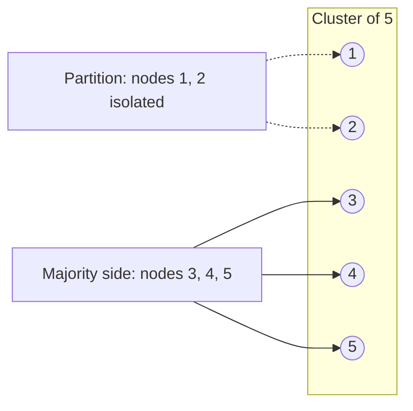
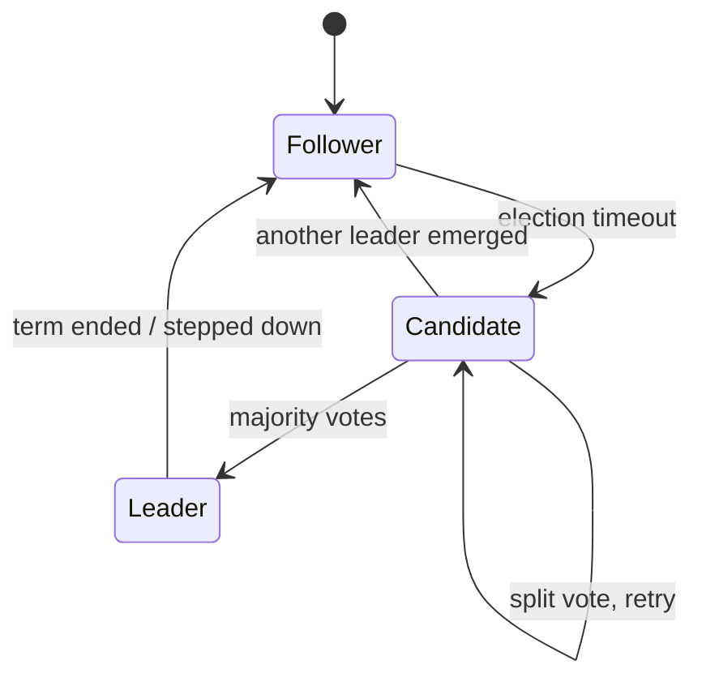
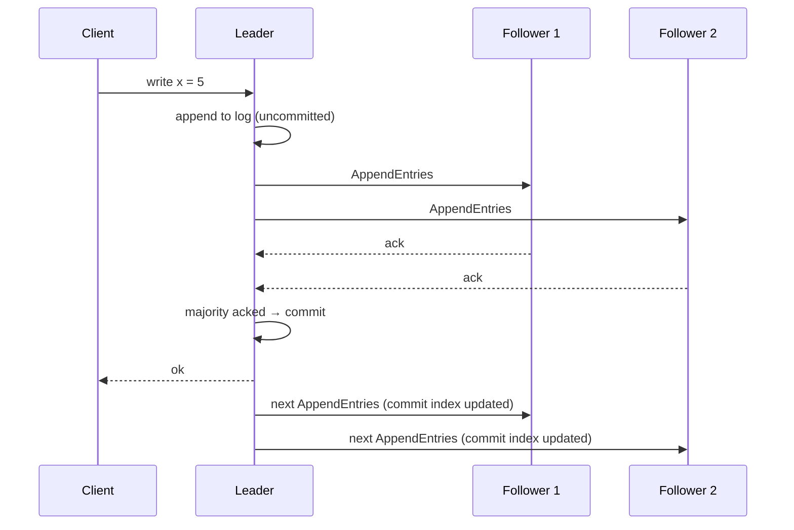
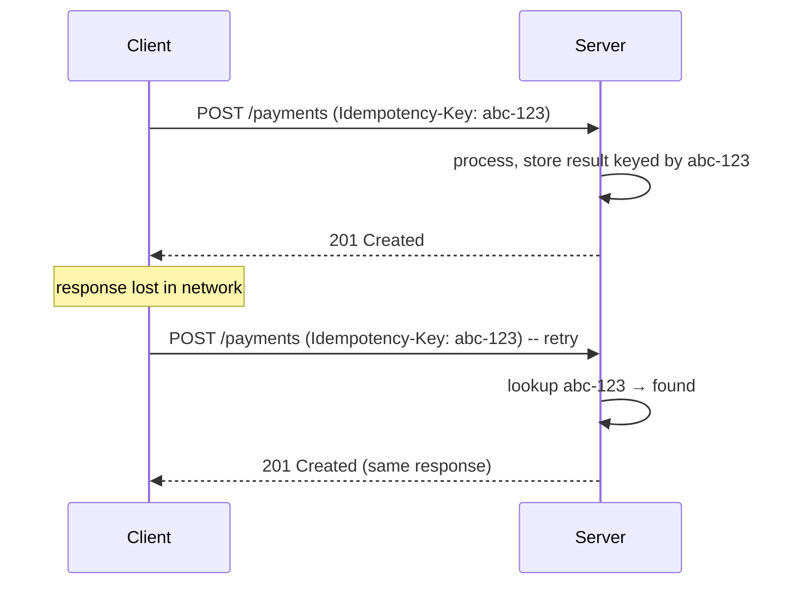

# Consensus, leader election, Raft / Paxos intuition, idempotency, exactly-once

Distributed systems must agree on shared state — who is the leader, what value is committed, what order events happened in. **Consensus algorithms** make this possible despite node failures, message loss, and partitions. Senior interviews probe whether you can reason about these guarantees and recognise when "exactly-once" is a marketing slogan.

## The consensus problem

Imagine N machines that need to agree on a value. Each can crash. Network messages can be delayed, dropped, or reordered. **Without consensus, the cluster cannot agree on anything**:

- Who is the primary database replica?
- What is the next sequence number?
- Did the previous commit succeed?
- When the leader changes, what was the last committed entry?

Consensus algorithms solve this with two key ideas: **majority quorum** and **monotonic terms**.

## Why majority quorum?



Quorum (majority) = ⌊N/2⌋ + 1.

| Cluster size | Quorum | Failures tolerated | Notes                                |
| ------------ | ------ | ------------------ | ------------------------------------ |
| 3            | 2      | 1                  | Standard small-cluster choice        |
| 5            | 3      | 2                  | Production sweet spot                |
| 7            | 4      | 3                  | When 3 failures must be tolerated    |
| 4            | 3      | 1                  | No better than 3-cluster, costs more |

Why majority? Two majorities of the same set must overlap by at least one node. So no two leaders can be elected without some node knowing both. **Even-sized clusters do not improve availability** — a 4-cluster needs 3 to make decisions, same as a 5-cluster, but tolerates only 1 failure (vs 5-cluster's 2).

## Raft — the friendly consensus algorithm

Raft was designed to be **understandable**. Most modern systems use Raft (etcd, Consul, CockroachDB, TiKV) over Paxos.



Each node is in one of three states:

- **Follower** — receives entries from leader, votes in elections.
- **Candidate** — campaigning to become leader.
- **Leader** — handles all client requests, replicates entries.

### Leader election

1. Followers expect a heartbeat from the leader at regular intervals.
2. If a follower goes too long without one, it becomes a candidate, **increments the term**, and requests votes from peers.
3. Each peer votes once per term, for the first valid candidate it sees.
4. A candidate with majority votes becomes leader for that term.

If two candidates split the vote, both fail. Each retries with a randomised timeout — eventually one candidate fires first and wins.

### Log replication



The leader writes to its own log, replicates to followers, waits for majority ack, then commits. Followers apply the entry once they learn it is committed.

**Term numbers** are the safety net. Every message carries a term. A node sees a higher term → steps down. This prevents stale leaders (an old leader that woke up after a partition) from corrupting the log.

## Paxos — the classic, harder one

Paxos predates Raft and is more general but harder to understand. Roles:

- **Proposer** — proposes values.
- **Acceptor** — votes on proposals.
- **Learner** — learns the chosen value.

Two phases per round:

1. **Prepare** — proposer sends a number to acceptors. Acceptors promise not to accept lower numbers.
2. **Accept** — proposer sends the value with that number. Majority ack → chosen.

Multi-Paxos optimises by electing a stable leader to skip phase 1 in steady state, which is essentially what Raft does explicitly.

For interviews, **mentioning Raft and outlining its three states + log replication is sufficient**. Going deeper into Paxos shows depth but is rarely asked.

## When you actually use consensus

You almost never implement Raft yourself. Use a service that exposes consensus:

| Service   | Purpose                                                     |
| --------- | ----------------------------------------------------------- |
| etcd      | Configuration store, service discovery (Kubernetes uses it) |
| Consul    | Service discovery, distributed locks, KV store              |
| ZooKeeper | Leader election, distributed locks (Kafka, HDFS use it)     |
| Spanner   | Globally consistent SQL (uses Paxos per shard)              |

For a "leader election" feature, do not write your own. Let etcd or ZooKeeper do it via lease/lock semantics.

## Idempotency — the practical safeguard

Networks lose messages. Clients retry. Consumers replay. **Without idempotency, retries cause double-billing, duplicate orders, repeated emails.**



Pattern:

```java
@PostMapping("/payments")
public ResponseEntity<Payment> charge(
        @RequestHeader("Idempotency-Key") String key,
        @RequestBody ChargeRequest request) {

    Optional<Payment> existing = repo.findByIdempotencyKey(key);
    if (existing.isPresent()) return ResponseEntity.ok(existing.get());

    Payment created = service.charge(key, request);
    return ResponseEntity.status(HttpStatus.CREATED).body(created);
}
```

The idempotency key lives in the database with a unique index. Concurrent requests with the same key race; the unique constraint resolves it; the loser reads the winner's result.

**Stripe's idempotency design**:

- Client supplies a UUID per request.
- Server stores `(idempotency_key, response)` for 24 hours.
- Same key within 24 hours → exact same response.
- Different request body with same key → error.

## "Exactly-once" — what it really means

**Wire-level exactly-once does not exist** in distributed systems. The network can always lose either the request, the response, or the ack. Once any of those is missing, the sender does not know what happened.

What systems actually offer is **effectively once** = at-least-once delivery + idempotent processing.

| Layer                    | What "exactly once" means there                                                 |
| ------------------------ | ------------------------------------------------------------------------------- |
| Kafka inside one cluster | Producer + consumer with transactional API achieves "exactly once within Kafka" |
| Kafka with side effects  | "Exactly once" claim breaks once you do anything outside Kafka                  |
| HTTP API                 | At-least-once + idempotency key                                                 |
| Database write           | Single-row UPSERT with unique constraint on key                                 |
| Distributed transaction  | Two-phase commit — slow, fragile, rarely used                                   |

The honest interview answer: "I'd design at-least-once delivery and make consumers idempotent."

## Common pitfalls

- **Even-sized consensus clusters**. 4 nodes is no better than 3. Always use 3, 5, or 7.
- **Cross-region single Raft cluster without thinking about latency**. Every commit waits for majority ack. Trans-Pacific latency is 100+ ms; that becomes your write latency.
- **Using a database as a consensus store**. The database itself relies on consensus internally; using it for distributed locks adds layers and inherits its limitations. Use etcd / ZooKeeper.
- **Implementing leader election by hand**. Subtle bugs — split-brain, stale leader, fencing tokens missing. Use a battle-tested library.
- **Treating Redis SETNX as "good enough" for distributed locks**. See Martin Kleppmann's analysis of Redlock. For correctness-critical locks, use ZooKeeper or etcd with **fencing tokens**.

## Interview answers

_Q: Walk me through Raft leader election._
A: Each node starts as follower with a random election timeout. If no heartbeat arrives in time, the follower becomes a candidate, increments its term, votes for itself, and asks peers for votes. Each peer votes once per term for the first valid candidate. A candidate with majority becomes leader. Term numbers prevent stale leaders from causing trouble.

_Q: Why is majority the magic number for consensus?_
A: Any two majorities of the same set must overlap by at least one node. So two leaders cannot be elected without some node knowing both — and that node will reject the older term. Without majority overlap, two sides of a partition could each elect their own leader and accept conflicting writes.

_Q: How does Raft handle a partition that splits the cluster 3-2?_
A: The 3-side has majority; it can elect a leader and continue. The 2-side cannot reach majority; if it had a leader before the split, that leader steps down or is stuck unable to commit. When the partition heals, the minority side syncs from the majority via standard log replication.

_Q: How do you make a payment endpoint idempotent?_
A: Require the client to supply an `Idempotency-Key` header (a UUID). On the server, store the key in the database with a unique constraint. Before processing, check if the key exists — if yes, return the cached response. If no, process the request, persist result + key, return. Concurrent retries with the same key race at the unique constraint; the loser reads the winner's response.

_Q: What is a fencing token and why does it matter for locks?_
A: A fencing token is a monotonically increasing number issued with each lock acquisition. The protected resource only accepts requests with a token greater than the last seen token. If an old lock holder wakes up after a long GC pause and tries to write, the resource rejects it because its token is outdated. Without fencing tokens, you can have two concurrent "lock holders" and corrupted state.

_Q: When is "exactly once" a valid claim?_
A: Inside a single, controlled boundary like Kafka's idempotent producer + transactional consumer reading from and writing to Kafka. Once side effects leave that boundary (DB write, HTTP call, email), exactly-once breaks because retries happen outside. The honest delivery model is at-least-once + idempotent processing.

_Q: Why does Spanner need atomic clocks?_
A: To bound clock uncertainty across data centers. Spanner uses TrueTime to assign global commit timestamps. Transactions wait out the uncertainty interval (~7ms) before committing, ensuring globally linearizable order. Without bounded uncertainty, you cannot cleanly order operations across regions.
