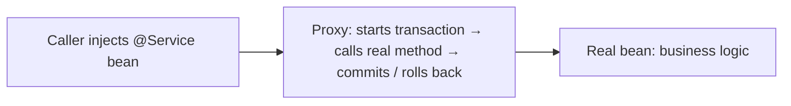

# Core Spring: DI, scopes, lifecycle, CGLIB vs JDK proxying

Spring is the dominant Java framework. The core abstraction is the **container** — a registry that creates objects (beans), wires their dependencies, applies cross-cutting concerns, and manages their lifecycle. Senior interviews test whether you understand what the container does for you and what to do when its magic surprises you.

## Dependency injection — the foundation

Dependency Injection (DI) means an object **declares** what it needs; the container **provides** it. The class does not call `new`, does not pull from a static factory, does not know how dependencies are constructed.

**Three injection styles**:

```java
// 1. Constructor injection — preferred
@Service
class OrderService {
    private final InventoryService inventory;
    private final PaymentGateway payments;

    public OrderService(InventoryService inventory, PaymentGateway payments) {
        this.inventory = inventory;
        this.payments = payments;
    }
}

// 2. Setter injection — for optional dependencies
@Component
class CacheService {
    private MetricsClient metrics;

    @Autowired(required = false)
    public void setMetrics(MetricsClient metrics) { this.metrics = metrics; }
}

// 3. Field injection — discouraged
@Service
class BadService {
    @Autowired private InventoryService inventory;   // hard to test, no immutability
}
```

**Always prefer constructor injection**:

- Dependencies are required and explicit at construction time.
- Fields can be `final`, so the object is immutable after construction.
- No reflection-based test setup needed — pass mocks directly.
- Circular dependencies fail loudly at startup instead of mysteriously at runtime.

## Bean scopes

| Scope         | Lifetime                                     | Use                               |
| ------------- | -------------------------------------------- | --------------------------------- |
| `singleton`   | One per container (default)                  | Stateless services, repositories  |
| `prototype`   | New instance on every injection or `getBean` | Stateful builders, mutable config |
| `request`     | One per HTTP request                         | Request-scoped state              |
| `session`     | One per HTTP session                         | User-scoped state                 |
| `application` | One per ServletContext                       | App-wide singletons               |
| `websocket`   | One per WebSocket session                    | WS-scoped state                   |

```java
@Component
@Scope("prototype")
class CommandBuilder { ... }
```

**Trap**: a singleton holding a reference to a prototype only gets one instance — the prototype is created once at injection time, not on each access. Use `Provider<CommandBuilder>` or method injection if you need a fresh prototype on every call.

## Bean lifecycle

```mermaid
flowchart LR
  Inst["Instantiate (constructor)"] --> Pop["Populate dependencies"]
  Pop --> Aware["Apply *Aware callbacks (BeanNameAware, ApplicationContextAware)"]
  Aware --> Pre["BeanPostProcessor.postProcessBeforeInitialization"]
  Pre --> Init["@PostConstruct / afterPropertiesSet / init-method"]
  Init --> Post["BeanPostProcessor.postProcessAfterInitialization (proxies wrap here)"]
  Post --> Ready["Bean ready for injection"]
  Ready --> Destroy["@PreDestroy / destroy-method on shutdown"]
```



Two lifecycle hooks worth knowing:

- `@PostConstruct` — called after dependencies are injected. Use for initialisation that needs the wired state.
- `@PreDestroy` — called on graceful shutdown. Use for releasing resources.

## How `@Configuration` and `@Bean` work

```java
@Configuration
class AppConfig {
    @Bean
    public DataSource dataSource() {
        return new HikariDataSource(...);
    }

    @Bean
    public OrderService orderService() {
        return new OrderService(dataSource(), ...);   // calls dataSource() — same instance returned
    }
}
```

The compiler-generated subclass of `AppConfig` (CGLIB-proxied) intercepts `dataSource()` and returns the cached singleton — even though it looks like a normal method call. Without that interception, you would get two separate `DataSource` instances.

## AOP and proxies — the source of "Why doesn't `@Transactional` work?" bugs

Spring applies cross-cutting concerns (transactions, security, caching, retries) using **proxies**. When you inject a bean annotated with `@Transactional`, Spring gives you a proxy that wraps the real bean.



Two proxy mechanisms:

- **JDK dynamic proxy** — uses `java.lang.reflect.Proxy`. Works only for **interfaces**. Default when the bean implements an interface.
- **CGLIB proxy** — generates a subclass of the bean class via bytecode. Works for plain classes. Spring uses this when no interface is implemented (or when `proxyTargetClass=true`).

| Aspect                   | JDK Proxy | CGLIB Proxy          |
| ------------------------ | --------- | -------------------- |
| Requires interface       | Yes       | No                   |
| Works on `final` classes | N/A       | No (cannot subclass) |
| Final methods proxied    | N/A       | No (cannot override) |
| Constructor called twice | No        | Yes (proxy + target) |
| Generation cost          | Cheap     | More expensive       |

### The self-invocation trap

```java
@Service
class OrderService {
    public void create(Order o) {
        // ...
        finalize(o);      // ← BUG: bypasses the proxy, no transaction starts
    }

    @Transactional
    public void finalize(Order o) { ... }
}
```

`this.finalize()` is a direct method call inside the same instance. The proxy is bypassed. `@Transactional` does nothing. **Same applies to `@Async`, `@Cacheable`, `@Retryable`, `@PreAuthorize`** — anything proxy-driven.

Fixes:

- Move the method to another bean.
- Inject `self` (the proxy) and call `self.finalize()`.
- Use AspectJ weaving instead of proxies (compile-time or load-time bytecode modification — annotations work everywhere).

## Spring Boot — opinionated startup

Spring Boot adds **auto-configuration**: based on what is on the classpath, the framework wires sensible defaults. Add `spring-boot-starter-data-jpa` and you get a `DataSource`, `EntityManagerFactory`, transaction manager, and Hibernate without writing a single bean definition.

Customisation paths:

- `application.yml` / `application.properties` for property-driven config.
- `@ConfigurationProperties` for type-safe binding to Java records.
- `@Conditional*` annotations to enable beans only when certain classes/properties are present.

## Common pitfalls

- **Field injection in production code**. Hard to test, prevents `final`, hides circular dependencies.
- **Singleton holding mutable state**. One instance, many threads. Either make state immutable, or use a concurrent collection, or change the scope.
- **Self-invocation bypasses proxies**. The whole class of "annotation does nothing" bugs traces back to this.
- **Injecting a `Logger` via `@Autowired`**. Use `LoggerFactory.getLogger(getClass())` directly — loggers are not Spring beans.
- **Mixing Lombok `@RequiredArgsConstructor` with `@Configuration`**. Confusing for new readers and surprises Spring's bean processing in some configurations.

## Interview answers

_Q: Why prefer constructor injection over field injection?_
A: Required dependencies are explicit and the bean cannot be constructed without them. Fields can be `final`, so the object is immutable after construction. Tests work without reflection — pass mocks directly to the constructor. Circular dependencies fail at startup instead of at runtime.

_Q: When would you use a prototype scope?_
A: For stateful objects you want fresh on each injection — command builders, reusable visitor walkers with per-walk state, transient form-binding objects. Singletons cannot hold per-call state safely; prototypes can.

_Q: Why does `@Transactional` sometimes silently do nothing?_
A: Self-invocation bypasses the proxy. `this.foo()` from inside the same class skips the proxy that adds transaction handling. The fix is to invoke through the proxy — split into a separate bean, inject `self`, or use AspectJ.

_Q: When does Spring use CGLIB instead of JDK dynamic proxies?_
A: When the bean class does not implement an interface, or when configured explicitly with `@EnableTransactionManagement(proxyTargetClass=true)`, or for `@Configuration` classes (always CGLIB — needed to intercept `@Bean` method calls).

_Q: How does Spring resolve circular dependencies between two singletons?_
A: With setter or field injection it can succeed via early reference exposure (the half-built bean is exposed during creation, populated later). With constructor injection, it fails at startup with a clear error. Constructor injection is preferred precisely because it surfaces the problem immediately.

_Q: What is the difference between `@Component`, `@Service`, `@Repository`, `@Controller`?_
A: All four are stereotype annotations marking classes for component scanning. `@Component` is generic. `@Service` documents a service-layer bean. `@Repository` adds exception translation (database errors → Spring's `DataAccessException`). `@Controller` marks a Spring MVC controller. Functionally similar; choose for documentation and convention.

_Q: How would you test a Spring service?_
A: For unit tests, instantiate the class directly with mocked dependencies — no Spring context needed because of constructor injection. For slice tests, use `@WebMvcTest`, `@DataJpaTest`, or `@JsonTest` to bring up only the slice you need. For full integration, `@SpringBootTest` boots the whole context.
