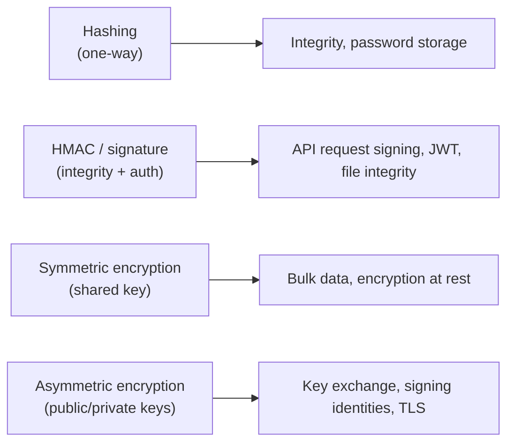
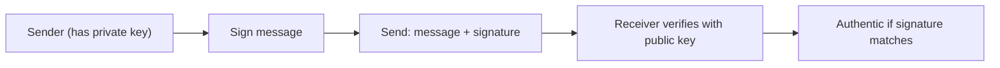
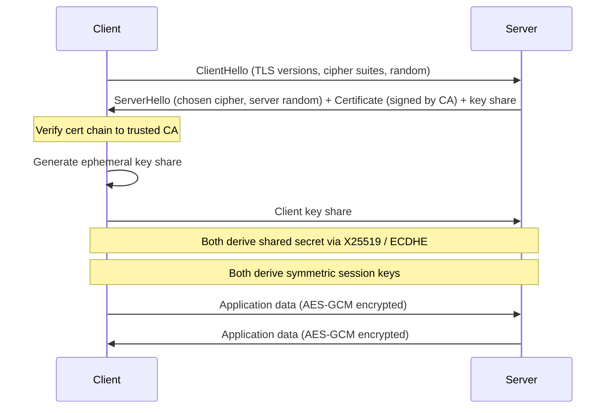
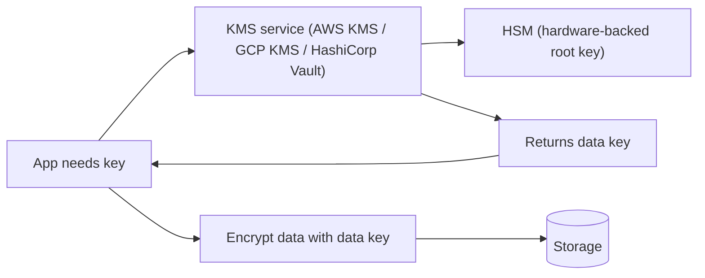

# Cryptography basics: hashing, signing, TLS handshake, symmetric vs asymmetric, encryption at rest

You don't write crypto algorithms — but you use them every day. **Senior engineers must understand which primitive solves which problem**, what guarantees it offers, and where teams typically misuse it. The two-line summary: _use the right primitive from a maintained library; never invent your own._

## The four primitives



| Primitive          | Provides                          | Reverses?              |
| ------------------ | --------------------------------- | ---------------------- |
| Hash               | Integrity, deduplication          | No (one-way)           |
| HMAC / sign        | Integrity + sender authentication | No                     |
| Symmetric encrypt  | Confidentiality                   | Yes (with key)         |
| Asymmetric encrypt | Confidentiality + identity        | Yes (with private key) |

## Hashing

A hash function maps any input to a fixed-size output. Same input → same hash. Different inputs → different hashes (collisions extremely rare for good hashes).

```
sha256("hello") = 2cf24dba5fb0a30e26e83b2ac5b9e29e1b161e5c1fa7425e73043362938b9824
sha256("hello!") = ce06092fb948d9ffac7d1a376e404b26b7575bcc11ee05a4615fef4fec3a308b
```

**Properties of good cryptographic hashes**:

- **Pre-image resistance** — given a hash, you cannot find an input that produces it.
- **Second pre-image resistance** — given an input, you cannot find a different input with the same hash.
- **Collision resistance** — you cannot find any two inputs with the same hash.

| Hash             | Status     | Use                                |
| ---------------- | ---------- | ---------------------------------- |
| MD5              | **Broken** | Never for security; checksums only |
| SHA-1            | **Broken** | Don't use for new work             |
| SHA-256, SHA-512 | Good       | General integrity, commit hashes   |
| SHA-3 / Keccak   | Good       | Alternative to SHA-2 family        |
| BLAKE3           | Good, fast | Modern alternative                 |

### Password hashing — special case

For password storage, **fast hashes are wrong**. SHA-256 of a password is almost as bad as plaintext — an attacker with the hash file can run millions of guesses per second.

Use **slow** hashes designed for passwords:

| Algorithm    | Year | Notes                                |
| ------------ | ---- | ------------------------------------ |
| bcrypt       | 1999 | Battle-tested; tunable cost factor   |
| scrypt       | 2009 | Memory-hard; harder for GPUs         |
| **argon2id** | 2015 | Modern winner; OWASP recommendation  |
| PBKDF2       | 2000 | NIST-approved; weaker than the above |

```java
// bcrypt — Java
String hash = BCrypt.hashpw(password, BCrypt.gensalt(12));    // cost 12 ≈ 250 ms
boolean ok = BCrypt.checkpw(password, hash);

// argon2id — modern preference
String hash = Argon2.hash(password, 3, 65536, 4);   // iterations, memory KB, parallelism
```

Salt is included automatically by these libraries — you don't manage it manually. Store the full output string (`$2b$12$...`); it contains algorithm, cost, salt, and hash.

## HMAC and digital signatures

A hash on its own does not prove the sender — anyone can compute one. **HMAC** binds a hash to a shared secret key.

```java
String message = "transfer amount=100";
String signature = HmacSha256(secretKey, message);
// Sender sends both. Receiver recomputes; if matches, message is authentic and untampered.
```

HMAC = **same secret key** on both sides. Used for: API request signing (AWS Signature V4), JWT (HS256), webhook verification.

**Digital signatures** use asymmetric crypto: signer holds a private key, anyone can verify with the public key.



Used for: TLS certificates, software updates, JWT (RS256, ES256), git commits (`-S`).

## Symmetric encryption

Same key encrypts and decrypts. Fast. Used for bulk data.

```
AES-256-GCM(plaintext, key) = ciphertext + nonce + auth_tag
```

| Algorithm         | Notes                                  |
| ----------------- | -------------------------------------- |
| AES-128-GCM       | Standard; fast on modern CPUs (AES-NI) |
| AES-256-GCM       | Stronger key; same speed               |
| ChaCha20-Poly1305 | Better on systems without AES-NI       |
| **DES, 3DES**     | **Broken / deprecated**                |

**Use authenticated modes** (GCM, ChaCha20-Poly1305). They detect tampering. Never use raw AES-CBC or AES-ECB; both have known attacks if not paired with a MAC.

```java
// Java — AES-GCM
SecretKey key = new SecretKeySpec(keyBytes, "AES");
byte[] nonce = randomBytes(12);
Cipher cipher = Cipher.getInstance("AES/GCM/NoPadding");
cipher.init(Cipher.ENCRYPT_MODE, key, new GCMParameterSpec(128, nonce));
byte[] ciphertext = cipher.doFinal(plaintext);
// Store: nonce + ciphertext (auth tag is appended by GCM)
```

## Asymmetric encryption

Two keys — **public** (shared) and **private** (kept secret). Encrypt with public, decrypt with private. Sign with private, verify with public.

| Algorithm | Use                                                    |
| --------- | ------------------------------------------------------ |
| RSA       | Older; key sizes 2048 / 3072 / 4096 bits               |
| ECDSA     | Elliptic curve signatures; smaller keys, same security |
| Ed25519   | Modern signature scheme; fast, small, secure defaults  |
| X25519    | Modern key exchange (replaces DH)                      |

Asymmetric is **slow** — you don't use it for bulk data. You use it to **exchange a symmetric key**, then use the symmetric key for the actual data. This is how TLS works.

## TLS handshake — putting it all together

TLS (Transport Layer Security) is what powers HTTPS. The handshake combines all four primitives.



What each primitive does:

- **Asymmetric** — server proves identity via certificate signed by a trusted CA.
- **Key exchange** (ECDHE / X25519) — client and server agree on a session secret without an eavesdropper learning it.
- **Symmetric** (AES-GCM) — actual data encrypted with the derived session key, fast.
- **Hash** (SHA-256) — used inside HMAC for record integrity.

**TLS 1.3** (current standard since 2018):

- Faster handshake (1 round trip vs 2 in TLS 1.2).
- Removes weak cipher suites (RC4, CBC modes).
- Forward secrecy mandatory — even if the server's private key leaks later, past sessions stay encrypted.

**Certificate trust** — the chain goes: leaf cert → intermediate cert → root CA. The root CA's public key is bundled with the OS / browser. Anyone in the chain that's compromised can issue rogue certificates, which is why **Certificate Transparency** logs exist.

## Encryption at rest

Data on disk encrypted with a key. Different layers:

| Layer                      | Example                                                      |
| -------------------------- | ------------------------------------------------------------ |
| Full-disk encryption       | LUKS, BitLocker, FileVault — protects against physical theft |
| Storage-service encryption | S3 SSE-S3 (default), EBS encrypted volumes                   |
| Database TDE               | Postgres pgcrypto, SQL Server TDE — protects DB files        |
| Application-level          | App encrypts before storing — most flexible                  |
| Field-level                | Encrypt only PII columns                                     |

**Key management** is harder than encryption. Where do keys live?



**Envelope encryption** is the standard pattern:

1. KMS holds a master key, never leaves the service.
2. App requests a data encryption key (DEK) for each operation.
3. KMS returns the DEK plaintext + DEK encrypted with master.
4. App uses plaintext DEK to encrypt data, stores encrypted DEK alongside.
5. To decrypt: send encrypted DEK to KMS, get plaintext DEK back, decrypt data.

This way, KMS only handles tiny key blobs; bulk encryption stays in the app for performance.

## Common mistakes

- **Hashing passwords with SHA-256**. Too fast. Use bcrypt / argon2id.
- **Using ECB mode** (`AES/ECB/PKCS5Padding`). Identical plaintext blocks become identical ciphertext blocks → reveals patterns. Use GCM.
- **Not authenticating ciphertext**. CBC alone lets attackers tamper. GCM is the modern default.
- **Reusing nonces with GCM**. Catastrophic — leaks the key. Generate a fresh random nonce per message.
- **Hardcoding keys in source code or config files**. Use a secret manager.
- **Custom crypto** — "I'll just XOR with a key, it's quick." No. Even pros get this wrong.
- **Trusting your own clock for cert validity** without checking CRL or OCSP. Revoked certs without revocation checks stay accepted.
- **No key rotation**. Keys should rotate periodically; old keys for old data, new keys for new data.

## Interview answers

_Q: Why is bcrypt better than SHA-256 for password storage?_
A: SHA-256 is fast — billions of guesses per second on a GPU. Bcrypt is intentionally slow (configurable cost) and includes a per-password salt. An attacker with the hash file can crack SHA-256 password files in hours; bcrypt at cost 12 takes years for the same dictionary attack.

_Q: How does TLS prevent man-in-the-middle attacks?_
A: The server presents a certificate signed by a trusted CA. The client verifies the chain — if the cert was issued for `example.com` and signed by a known CA, the client trusts it. An attacker who proxies the connection can't produce a valid cert for `example.com` without compromising a CA. Certificate Transparency logs detect rogue certs.

_Q: What is forward secrecy and why does it matter?_
A: Each TLS session uses an ephemeral key (ECDHE) that's discarded after the session. Even if an attacker records all encrypted traffic and later compromises the server's private key, they cannot decrypt past sessions. Without forward secrecy, one key breach decrypts years of recorded traffic. TLS 1.3 mandates forward secrecy.

_Q: Difference between hashing and encryption?_
A: Hashing is **one-way** — you cannot recover the input. Encryption is **reversible** with the right key. Hash for storing passwords or detecting tampering; encrypt when you need to recover the data later.

_Q: When would you use HMAC instead of a digital signature?_
A: When sender and receiver share a secret. HMAC is faster and the keys are simpler. Use signatures when many parties verify, but only one party signs — the public key can be shared widely without compromising the private key.

_Q: How does envelope encryption save cost in cloud KMS?_
A: KMS pricing is per-request. If you encrypt 1M files directly with KMS, that's 1M requests. With envelope encryption, KMS issues one data key per file (or per batch), and the app does the bulk encryption locally — KMS load drops by orders of magnitude. Also faster: KMS round-trips per byte are too expensive.

_Q: What's the difference between symmetric and asymmetric encryption, and when do you use each?_
A: Symmetric uses one shared key — fast, used for bulk data. Asymmetric uses a public/private key pair — slow, used for identity (signatures) and key exchange. Real systems combine: asymmetric establishes a shared symmetric key (via TLS handshake), then symmetric encrypts the data.

_Q: How do you store a JWT signing key safely?_
A: For HS256 (symmetric), store the secret in a KMS / vault, never in source or env. For RS256 / ES256 (asymmetric), store the private key in a vault; expose the public key via a JWKS endpoint that any verifier can fetch. Rotate keys periodically; support multiple keys (kid) so old tokens stay valid until expiry.
