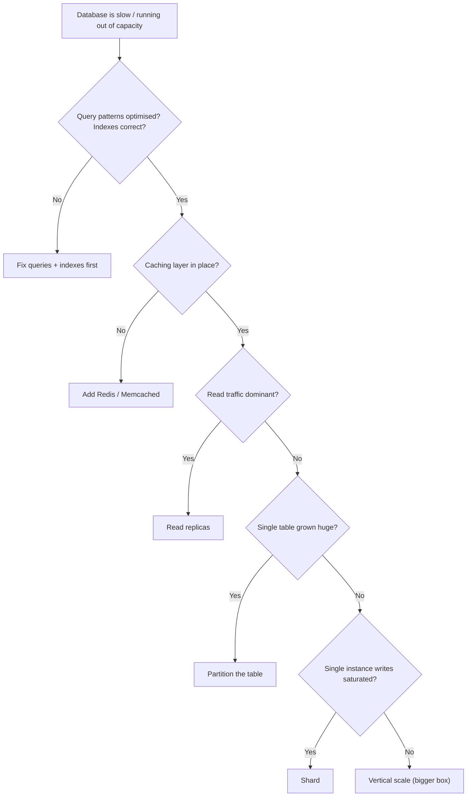
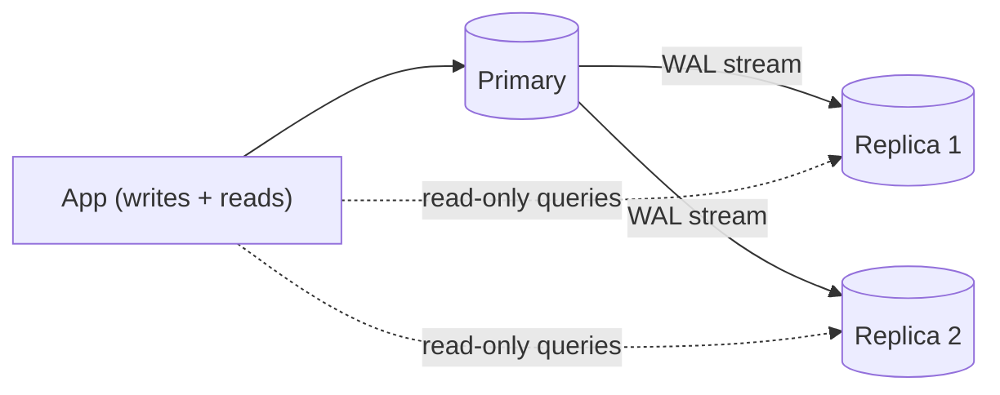
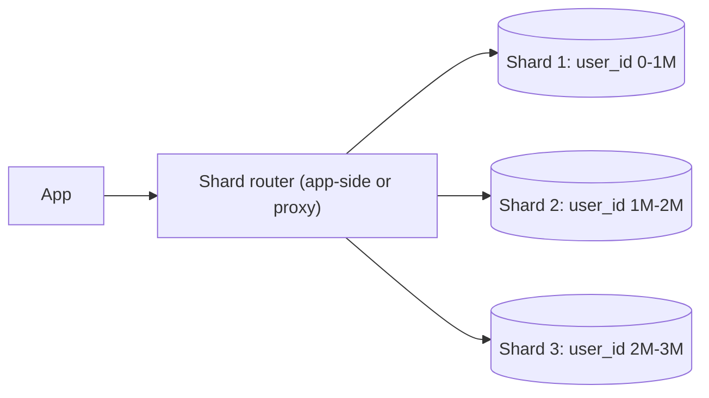

# Scaling: partitioning, sharding, replication patterns

A single Postgres or MySQL instance scales surprisingly far — millions of rows, tens of thousands of QPS — if you index well, write good queries, and use caching. Most "we need to scale the database" conversations should start with **what is actually slow and why**. Sharding is the option of last resort because it adds enormous operational complexity.



## Vertical scaling — start here

Modern cloud machines go up to 128 cores and 1+ TB of RAM. **Buying a bigger box** often beats sharding for years of growth. RDS, Aurora, and CloudSQL all offer this with minimal downtime via failover.

Cost: doubles roughly with each tier; eventually hits a ceiling.

## Read replicas — cheap read scaling

A primary handles writes; one or more replicas stream the WAL (write-ahead log) and serve reads.



Pros: cheap reads, failover candidates, can serve analytics queries without affecting OLTP.

Cons: **replication lag**. Replicas are eventually consistent. After a write, reading from a replica may return the old value for tens of milliseconds. Strategies:

- Read-your-writes: route reads from the same user to the primary for a short window after writes.
- Sticky session to primary for one user.
- Read from replica only when staleness is acceptable.

## Partitioning — split one table physically

Partitioning splits a logical table into multiple physical tables, all behind a single logical name. The database routes queries to the right partition based on a partition key.

| Strategy | Example use                                         |
| -------- | --------------------------------------------------- |
| Range    | `created_at` by month — time-series data            |
| List     | `country_code` IN ('US', 'CA', 'MX')                |
| Hash     | `user_id` hashed into N buckets — even distribution |

```sql
-- Postgres: range partition by month
CREATE TABLE orders (
    id BIGSERIAL,
    created_at TIMESTAMPTZ NOT NULL,
    ...
) PARTITION BY RANGE (created_at);

CREATE TABLE orders_2024_01 PARTITION OF orders
    FOR VALUES FROM ('2024-01-01') TO ('2024-02-01');
CREATE TABLE orders_2024_02 PARTITION OF orders
    FOR VALUES FROM ('2024-02-01') TO ('2024-03-01');
```

**Benefits**:

- Queries with the partition key in `WHERE` skip irrelevant partitions (`partition pruning`).
- Drop old data by dropping a partition — instant, no `DELETE` scan.
- Each partition gets its own indexes — smaller, faster, less write contention.

**Costs**:

- Queries that don't filter by the partition key can be slower (must scan all partitions).
- Schema changes affect every partition.
- Cross-partition `UNIQUE` constraints are tricky (must include partition key).

Partitioning works **inside one database instance**. It is the bridge between a single big table and full sharding.

## Sharding — split data across instances

Sharding splits data across multiple **database servers**. Each shard is independent — own CPU, RAM, disk, replication.



### Choosing a shard key

The shard key is the most important decision. Get it wrong, you live with the consequences for years.

| Strategy           | Example                 | Pros                          | Cons                                 |
| ------------------ | ----------------------- | ----------------------------- | ------------------------------------ |
| Range              | `id` 0-1M, 1M-2M        | Sequential range queries fast | Hot shards (all writes go to latest) |
| Hash               | `hash(user_id)`         | Even distribution             | Range queries hit every shard        |
| Geographic         | by region               | Low latency to users          | Skewed if regions differ in size     |
| Tenant-based       | by `tenant_id`          | Tenant isolation              | Big tenants overload one shard       |
| Consistent hashing | hash with virtual nodes | Resharding moves less data    | Complexity                           |

**Bad shard keys**:

- `created_at` — newest shard always hot.
- Low-cardinality fields (`gender`, `country` for global apps) — uneven distribution.
- Anything that breaks the most-common query (forces scatter-gather).

### What sharding makes hard

- **Cross-shard joins** — must scatter-gather across shards or denormalise data into each shard. Distributed transactions are slow and rare.
- **Foreign key integrity across shards** — not enforced by the database. App-level integrity checks.
- **Unique constraints** can only be enforced within a shard.
- **Resharding** when shard sizes diverge — complex data movement, often online for weeks.
- **ID generation** must be unique across shards (Snowflake, UUIDv7, range allocation per shard).

## Replication patterns

| Pattern          | Setup                                                                                               |
| ---------------- | --------------------------------------------------------------------------------------------------- |
| Primary-replica  | One writer, N read replicas                                                                         |
| Primary-primary  | Two writers, both replicate to each other; conflict resolution required                             |
| Synchronous      | Writer waits for replica ack — strong consistency, higher latency                                   |
| Asynchronous     | Writer commits immediately, replica catches up — lower latency, possible data loss on primary crash |
| Semi-synchronous | Writer waits for at least one replica ack — middle ground                                           |

Postgres supports streaming replication and logical replication. MySQL uses binlog-based replication. Both default to async; you opt into synchronous explicitly.

## NoSQL escape hatch

When relational scaling becomes painful and your data model fits, NoSQL can be the right answer:

| System              | Best for                                           |
| ------------------- | -------------------------------------------------- |
| DynamoDB            | Key-value with predictable single-key access       |
| Cassandra           | Time-series, write-heavy, multi-region             |
| MongoDB             | Document-oriented, flexible schema                 |
| Bigtable / HBase    | Massive analytical workloads                       |
| Cockroach / Spanner | SQL with horizontal scaling and global consistency |

Trade-off: most NoSQL gives up SQL's flexibility (joins, transactions, ad-hoc queries) for predictable horizontal scaling. Pick when your access patterns fit and your team can operate it.

## Common pitfalls

- **Sharding before optimising queries**. Most "we need to shard" cases are actually "we need an index."
- **Choosing a shard key for today's hottest query** without considering future analytics, joins, or new features.
- **Allowing scatter-gather queries on the hot path**. They scale `O(shards)` per query — eventually slower than a single big DB.
- **Treating replicas as instantly consistent**. Replication lag exists even on healthy systems. Engineer for it.
- **Failover without preparing for split-brain**. If both old primary and new primary accept writes momentarily, data diverges. Use a coordinator (Patroni, Orchestrator, MHA).
- **Ignoring backup recovery time**. A 10TB database backup takes hours to restore. Test recovery; do not just take backups.

## Interview answers

_Q: When would you reach for sharding?_
A: When write throughput exceeds what a single instance can handle, or when storage exceeds what a single instance can hold, and you have already optimised queries, added caching, and scaled vertically. Sharding adds operational complexity (resharding, ID generation, distributed reads, monitoring) that you should justify with hard numbers.

_Q: What is the difference between partitioning and sharding?_
A: Partitioning splits a table within one database instance — same server, same connection, queries automatically routed to partitions. Sharding splits across multiple instances — separate servers, app or proxy decides which shard to query. Partitioning is operationally simple; sharding is not.

_Q: How do you handle replication lag in a read-heavy app?_
A: For most reads, accept staleness — show eventually consistent data. For critical reads (just-after-write), route to primary or include a "freshness token" the replica must satisfy before serving. Cap-stale reads via monitoring; alert if a replica falls behind by more than X seconds.

_Q: What goes wrong if you choose `user_id` hash as a shard key but later need to ban a country?_
A: Users from that country are scattered across all shards. The "ban country" query becomes a scatter-gather across every shard. If the access pattern was predictable upfront, geographic sharding would have been better. Lesson: shard key reflects your dominant query.

_Q: When is read-replica sufficient and when do you need sharding?_
A: Replicas scale read traffic, not write throughput. If your bottleneck is writes (inserts, updates, deletes), replicas don't help — they get the same write load. If your bottleneck is reads, replicas are cheap and effective. Determine the bottleneck before choosing the tool.

_Q: How would you reshard from 4 shards to 8 with minimal downtime?_
A: With consistent hashing, only ~half of keys need to move. Process: (1) start dual-write to both old and new layouts; (2) backfill historical data in the background; (3) verify both layouts agree on a sample; (4) flip reads to new layout; (5) remove old. Complete reshard runs for weeks on big systems. Test rigorously.

_Q: What does CAP say about a sharded SQL database?_
A: When a network partition isolates a shard, the system must choose: refuse the request (CP — give up Availability) or serve potentially stale data (AP — give up Consistency). Most operational databases pick CP for the partitioned shard while staying available for queries on other shards. CockroachDB and Spanner achieve effective CP by relying on Paxos / Raft consensus per shard.
