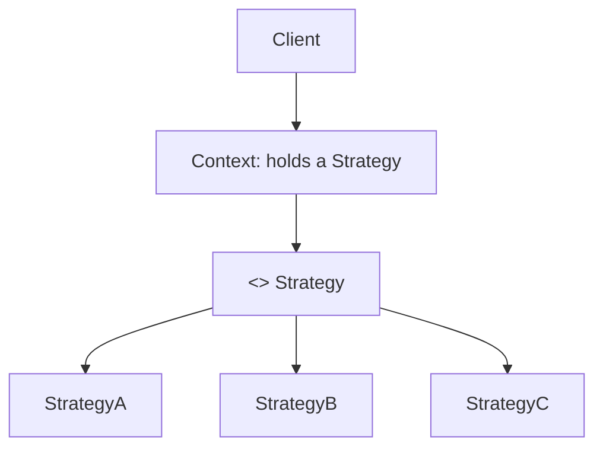
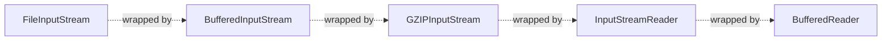
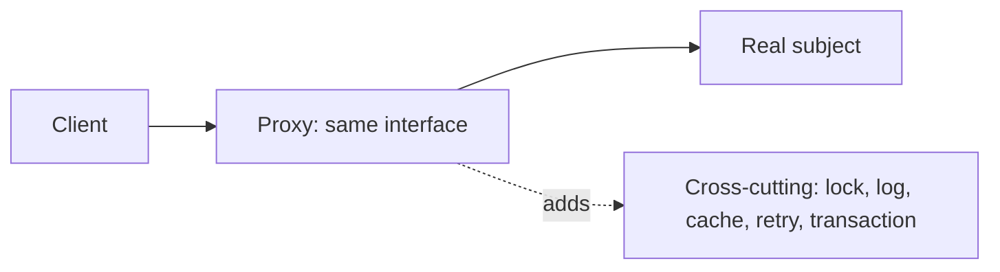

# Design patterns: singleton, factory, observer, strategy, decorator, adapter, facade, proxy

Design patterns are named, well-understood solutions to common design problems. They are **vocabulary** — when someone says "we should make this a strategy," everyone in the room knows the shape. The original Gang of Four book lists 23; in interviews, the eight below cover most cases.

Patterns are **not always the answer**. Modern languages and frameworks make many old patterns invisible (closures replace strategy in many cases; dependency injection containers replace factories). Use a pattern when it makes the design clearer, not for its own sake.

## The eight to know

| Pattern   | Category   | Solves                                      |
| --------- | ---------- | ------------------------------------------- |
| Singleton | Creational | One global instance                         |
| Factory   | Creational | Centralised object creation                 |
| Strategy  | Behavioral | Pick algorithm at runtime                   |
| Observer  | Behavioral | Decouple publishers from subscribers        |
| Decorator | Structural | Add behavior without subclassing            |
| Adapter   | Structural | Convert one interface into another          |
| Facade    | Structural | Simpler API over a complex subsystem        |
| Proxy     | Structural | Control access, lazy load, log, cache, etc. |

## Singleton

One instance, accessible globally.

```java
class ConnectionPool {
    private static final ConnectionPool INSTANCE = new ConnectionPool();
    private ConnectionPool() {}
    public static ConnectionPool getInstance() { return INSTANCE; }
}
```

**Why senior code rarely hand-rolls this**:

- Singletons are global mutable state. Hard to test, hard to reason about thread safety.
- Dependency injection containers (Spring, Guice, Dagger) provide singleton scope without the global. Inject the singleton; do not call `getInstance`.
- For Java, an `enum` with one value is the simplest thread-safe lazy singleton.

```java
public enum AppConfig {
    INSTANCE;
    public String get(String key) { ... }
}
```

In Spring, `@Component` is singleton-scoped by default. Use that.

## Factory

Centralises object creation when construction depends on configuration, runtime input, or polymorphism.

```java
interface PaymentGateway { Receipt charge(Money amount); }
class StripeGateway implements PaymentGateway { ... }
class PaypalGateway implements PaymentGateway { ... }

class PaymentGatewayFactory {
    public static PaymentGateway create(String provider) {
        return switch (provider) {
            case "stripe" -> new StripeGateway();
            case "paypal" -> new PaypalGateway();
            default -> throw new IllegalArgumentException(provider);
        };
    }
}
```

Variants:

- **Simple factory** (above) — one method picks based on input.
- **Factory method** — subclasses decide which class to instantiate.
- **Abstract factory** — creates families of related objects (UI for Mac vs Windows).

In Spring, `@Configuration` + `@Bean` methods are the modern factory.

## Strategy

Defines a family of algorithms; lets the client pick at runtime.



```java
interface ShippingCost {
    Money calculate(Order order);
}

class FlatRateShipping implements ShippingCost { ... }
class WeightBasedShipping implements ShippingCost { ... }
class FreeShipping implements ShippingCost { ... }

class CheckoutService {
    private final ShippingCost strategy;
    public CheckoutService(ShippingCost strategy) { this.strategy = strategy; }

    public Money checkout(Order order) {
        return order.subtotal().add(strategy.calculate(order));
    }
}
```

In modern Java, a strategy is often just a `Function<Order, Money>` — no interface needed. The pattern still has its place when the strategy carries multiple methods or its own state.

## Observer

Decouples a publisher from many subscribers. The publisher does not know who listens.

```java
interface OrderListener {
    void onOrderPlaced(Order order);
}

class OrderService {
    private final List<OrderListener> listeners = new CopyOnWriteArrayList<>();

    public void subscribe(OrderListener l) { listeners.add(l); }

    public void place(Order order) {
        // ... persist
        for (OrderListener l : listeners) l.onOrderPlaced(order);
    }
}
```

In larger systems, the in-process observer pattern evolves into **event-driven architecture** with a message broker (Kafka, RabbitMQ). Same idea, distributed.

**Trade-off**: easy to add new subscribers; harder to follow control flow during debugging.

## Decorator

Wraps behavior around an object without modifying it. The classic Java IO library is built on decorators.

```java
InputStream raw = new FileInputStream("data.gz");
InputStream buffered = new BufferedInputStream(raw);          // adds buffering
InputStream gunzipped = new GZIPInputStream(buffered);        // adds decompression
Reader reader = new InputStreamReader(gunzipped, UTF_8);      // adds char decoding
BufferedReader lines = new BufferedReader(reader);            // adds line reading
```

Each decorator implements the same interface (`InputStream`) and adds one capability. You compose them by chaining.



Compared to inheritance: decorators compose at runtime; inheritance fixes the chain at compile time.

## Adapter

Converts one interface into another. Used when integrating legacy or third-party code.

```java
// Existing interface our code uses
interface UserRepository {
    User findById(String id);
}

// Third-party legacy class with a different shape
class LegacyUserDao {
    public Map<String, Object> getUser(int userId) { ... }
}

// Adapter glues them together
class LegacyUserAdapter implements UserRepository {
    private final LegacyUserDao legacy;
    public LegacyUserAdapter(LegacyUserDao legacy) { this.legacy = legacy; }

    public User findById(String id) {
        Map<String, Object> raw = legacy.getUser(Integer.parseInt(id));
        return new User((String) raw.get("name"), (String) raw.get("email"));
    }
}
```

Adapter shields your code from the legacy shape. When the legacy is replaced, only the adapter changes.

## Facade

A simpler API over a complex subsystem. Hides internal complexity.

```java
class OrderFacade {
    private final InventoryService inventory;
    private final PaymentService payment;
    private final ShippingService shipping;
    private final NotificationService notification;

    public OrderResult placeOrder(Order order) {
        inventory.reserve(order);
        Receipt receipt = payment.charge(order);
        Tracking tracking = shipping.schedule(order);
        notification.confirm(order, receipt, tracking);
        return new OrderResult(receipt, tracking);
    }
}
```

Callers see one method. The facade orchestrates four services. Common in API gateways and aggregating endpoints.

## Proxy

A surrogate that controls access to another object. Used for lazy loading, logging, caching, access control, remote calls.



Java has built-in dynamic proxies (`java.lang.reflect.Proxy`); CGLIB generates subclass-based proxies. Spring's `@Transactional`, `@Async`, `@Cacheable` all work via proxies.

```java
// JDK dynamic proxy for caching
LoggingService real = new LoggingServiceImpl();
LoggingService cached = (LoggingService) Proxy.newProxyInstance(
    real.getClass().getClassLoader(),
    new Class<?>[] { LoggingService.class },
    (proxy, method, args) -> {
        String key = method.getName() + Arrays.toString(args);
        return cache.computeIfAbsent(key, k -> {
            try { return method.invoke(real, args); }
            catch (Exception e) { throw new RuntimeException(e); }
        });
    });
```

## When patterns become anti-patterns

- **Pattern-itis**: applying patterns for their own sake. Three classes for what would be a 10-line function is worse, not better.
- **Singleton overuse**: hidden global state, untestable, breaks parallelism.
- **Factory of factories of factories**: classic Java EE anti-pattern. Question whether each layer is earning its keep.
- **Observer chains** spanning many files: trace becomes impossible. Prefer explicit calls or a clearly-bounded event bus.

## Interview answers

_Q: When does the Strategy pattern beat a switch statement?_
A: When the variants are likely to grow, when each variant has its own state or dependencies, or when adding a variant should not require touching code in many places. For two trivial branches that will never grow, a switch is fine. For the third or fourth variant, refactor to strategy.

_Q: How does Spring's `@Transactional` use the proxy pattern?_
A: Spring wraps your bean in a proxy at startup. The proxy intercepts every method call, starts a transaction (if needed), invokes the real method, commits or rolls back, then returns. The proxy and your class share the same interface (or class via CGLIB), so callers cannot tell the difference.

_Q: Why prefer composition over inheritance for the decorator pattern?_
A: Inheritance fixes the wrapper chain at compile time. Composition lets you build different chains at runtime — `BufferedInputStream(GZIPInputStream(...))` vs `GZIPInputStream(BufferedInputStream(...))`. Inheritance also leaks parent details and makes single-axis extension hard if you need both buffering and gzipping.

_Q: When is the singleton pattern justified?_
A: For genuinely global resources where multiple instances are wrong (a logger, a metrics registry). Most production code uses DI containers that provide singleton scope without the global. Only roll your own singleton when DI is not available (libraries, simple scripts, native code).

_Q: How does the observer pattern relate to event-driven architecture?_
A: Observer is the in-process version of event-driven. Same idea — publishers do not know subscribers — but distributed across services. Kafka topics, RabbitMQ exchanges, AWS SNS topics are all "observer pattern at network scale." The trade-offs scale up: easier to extend, harder to trace causality, requires explicit ordering and delivery guarantees.

_Q: When would you use Adapter vs Facade?_
A: Adapter converts an existing interface to a different one your code expects — wraps one thing. Facade exposes a simpler interface over multiple things — orchestrates many. Both hide complexity but for different reasons.

_Q: How do you avoid the "AbstractFactoryProxyDecoratorBuilder" anti-pattern?_
A: Start simple. Use the simplest construct that solves today's problem. Add patterns when concrete duplication or coupling appears. Patterns earn their keep by reducing change cost — if the change cost is already low, the pattern is overhead.
