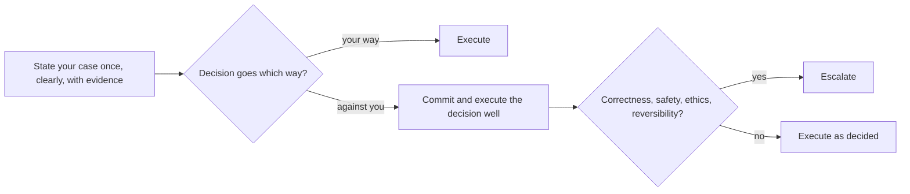
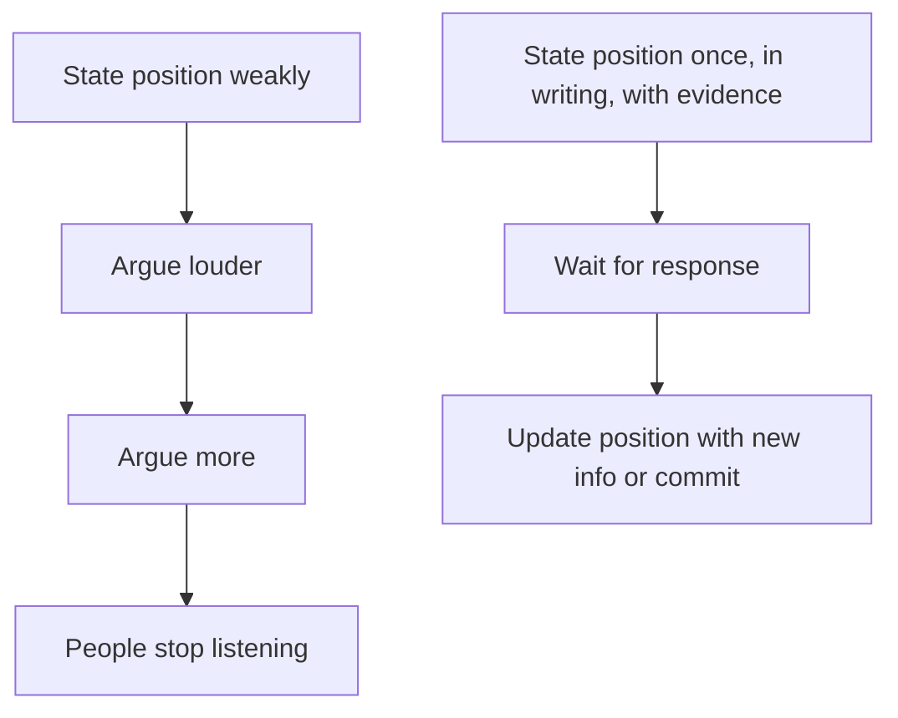
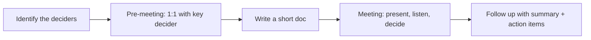

# Disagreement, tradeoffs, and influence without authority

Senior engineers spend a lot of their day **disagreeing well** — with peers about architecture, with managers about scope, with product about priorities. The skill is making your case without burning relationships, accepting decisions that go against you, and recognising the few cases where you must escalate.

## The disagree-and-commit framing

Amazon's leadership principle, but the idea is universal:



The discipline:

1. **State your case** clearly, in writing if it matters. Evidence over volume.
2. **Listen** to the counter-arguments. Steelman them.
3. **Concede** if convinced. Genuinely.
4. **If not convinced**: state your position one more time, then commit to whatever decision is made.
5. **Execute the decision well**, even if it's not yours.

The exception: **correctness, safety, ethics, or reversibility**. Those warrant escalation past the immediate decision-maker. "We're going to ship code that loses customer data" is not a disagree-and-commit situation.

## State your case once, well

The biggest disagreement mistake is **arguing the same point ten times**. State it well, then move on.



What "stating well" looks like:

```
Subject: Migration timeline — 4 weeks vs 2 weeks

I've been thinking about the proposed 2-week timeline for the auth migration.
Three concerns:

1. Database backfill alone takes ~10 days based on similar past migration (link to ticket).
2. We have no rollback plan; in 2 weeks we won't write one.
3. The team is on-call rotation that overlaps the proposed cutover.

Proposal: 4-week timeline that lets us write a rollback plan and avoid on-call overlap.

If we must do 2 weeks, I'd want to drop the schema change and ship the API changes first.

Happy to discuss; will go with whatever the team decides.
```

Specific. Evidence-backed. Offers an alternative. Signals commitment to the outcome regardless. This wins decisions; shouting in chat does not.

## Influencing peers

You usually have no formal authority over your peers. Influence comes from:

| Tactic                              | When                                                                            |
| ----------------------------------- | ------------------------------------------------------------------------------- |
| Lead with the problem, not solution | "I'm worried about X" invites collaboration; "we should do Y" invites debate    |
| Show your work in writing           | Short doc with three options and tradeoffs converts more decisions than threads |
| Concede small points                | Yields trust for the points that matter                                         |
| Build one ally before the meeting   | Walking into a 10-person meeting alone fails; with one supporter, it works      |
| Frame as a decision, not a debate   | "We need to pick. Here's the criteria. Which fits best?"                        |
| Make the cost of inaction visible   | "If we don't decide this week, we lose Q3"                                      |

**The "lead with the problem" trick is underrated**. "I'm worried our auth library is unmaintained" gets you allies; "let's switch to a different auth library" puts everyone on a side immediately.

## Tradeoff vocabulary

Senior engineers have language for the tradeoffs that come up daily. Practising the framing helps you sound senior in interviews.

| Pair                                | Senior framing                                                                                                            |
| ----------------------------------- | ------------------------------------------------------------------------------------------------------------------------- |
| Speed vs quality                    | "Lower-quality v1 ships in 2 weeks; higher-quality in 6. v1 buys us learning."                                            |
| Build vs buy                        | "Buying costs $X/month. Building takes Y engineers Z months and adds maintenance forever."                                |
| Generality vs simplicity            | "I'd add the abstraction the second time we need it, not the first."                                                      |
| Coupling vs autonomy                | "Microservices are autonomy at the cost of distributed-systems complexity."                                               |
| Consistency vs availability         | "Strong consistency requires synchronous writes — slower but never wrong."                                                |
| Cost vs latency                     | "Reducing p99 by 50ms costs us $X/month in extra cache. Worth it for checkout, not for analytics."                        |
| Now vs later                        | "We can fix this debt now in 2 weeks, or pay 1 day/quarter forever in slowdown."                                          |
| Centralise vs decentralise          | "Centralised reduces duplication but creates a coordination bottleneck."                                                  |
| Backwards-compatible vs clean break | "Clean break ships in a month; compatible takes a year. Cost of breaking 10 callers vs cost of carrying both for a year." |

## Influence patterns that work



- **Pre-meeting one-on-ones**. The big debate happens before the big meeting. By the time you're in the room, allies and objections are known.
- **Short docs** beat long arguments. 1-page doc + 3 options + tradeoffs. People read it; they don't read 50-message threads.
- **Show, don't tell**. A spike or prototype that proves an option works converts skeptics faster than rhetoric.
- **Pick your battles**. You have ~3-5 strong opinions per quarter. Spend them carefully.

## Receiving disagreement well

The other side: someone is pushing back on your design.

| Bad reaction                          | Good reaction                                      |
| ------------------------------------- | -------------------------------------------------- |
| Defensive — explain why they're wrong | Listen — what is their actual concern?             |
| Take it personally                    | Treat it as data about the design, not about you   |
| Argue every counter-point             | Concede small things; hold firm on the strong ones |
| Win the argument                      | Find the right answer; "winning" is not the goal   |

Senior engineers **invite disagreement**. "Tell me what's wrong with this." Bad designs get caught early; good designs get stronger.

## Escalating — when disagree-and-commit doesn't apply

Escalate when the decision involves:

- **Correctness**: shipping known-broken code.
- **Safety / privacy**: putting users at risk.
- **Ethics**: misleading users, breaking promises, dark patterns.
- **Reversibility**: a one-way door (deleting prod data, changing public API contracts).
- **Compliance**: GDPR, HIPAA, financial regulation.

Escalation playbook:

1. Re-state your case to the immediate decision-maker, in writing.
2. Make the risk explicit and concrete. Numbers and scenarios, not feelings.
3. If still unresolved, escalate one level up. Bring the writeup.
4. Be willing to be wrong. The escalation may reveal context you missed.

Escalation is rare and expensive — burns goodwill if overused. But for true safety / correctness issues, it's the right move.

## Common pitfalls

- **Disagreeing on everything**. You become "the engineer who pushes back". Pick battles.
- **Arguing the same point ten times**. Diminishing returns; people stop listening.
- **Disagreeing in chat instead of writing**. Verbal arguments evaporate; written cases persist.
- **Refusing to commit after a decision**. Slow-walking a decision you didn't like is corrosive. Either escalate or execute.
- **Frame as personal**. "You're wrong" doesn't land; "this approach has issue X" does.
- **No alternative offered**. "I disagree" without a counter-proposal is criticism, not engineering.
- **Escalating too often**. Save it for safety / correctness. Otherwise commit.

## Interview answers

_Q: Tell me about a time you disagreed with a teammate or manager._
A: [Use a STAR story.] Frame it as: I had a position with evidence, I expressed it once clearly, the decision went a certain way, and I committed to executing it well. Bonus: include what I learned about my position from the disagreement, even if I was mostly right.

_Q: How do you handle a teammate who keeps pushing for a different design?_
A: First, take their concern seriously. Steelman it. If they have a valid point, integrate it. If they don't, write up my position with options and tradeoffs and ask them to do the same. The decision becomes about evidence, not volume. If we still disagree, propose involving the team or tech lead. Disagree-and-commit applies.

_Q: When would you escalate a decision past your manager?_
A: When the decision involves correctness, safety, ethics, or compliance. "Manager said ship it without security review" → escalate. "Manager picked a different framework" → commit and move on.

_Q: How do you influence peers without formal authority?_
A: Write up the problem and options as a doc; share it before the meeting. Have one ally pre-aligned. Lead with "I'm worried about X" not "we should do Y" — invites collaboration over debate. Concede small points to hold firm on the big ones.

_Q: How do you receive disagreement on your own design?_
A: I invite it. Bad designs get caught early; good designs get stronger. I listen, restate the concern to confirm I heard it, and either integrate it or explain why not — usually with the underlying reasoning. I don't take it personally; the design and I are different things.

_Q: How do you decide which tradeoff to make?_
A: I name the tradeoff explicitly — "this is speed vs quality" or "consistency vs availability." Then I look at what the system optimises for: a payment service trades latency for correctness; an analytics dashboard trades correctness for latency. The right answer depends on the use case, not on which option is "better" in the abstract.

_Q: What's the hardest part of disagree-and-commit?_
A: The "commit" half. After arguing for the other approach, executing the decision well — without sandbagging or saying "I told you so" later — takes discipline. The team needs to trust that disagreement was sincere, and so was the commit.
