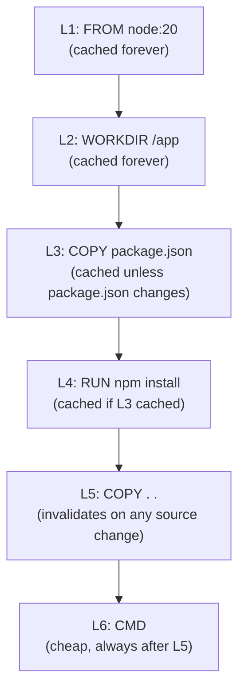

# Docker: Dockerfile, layers, multi-stage builds, networks, volumes

Docker packages an application with everything it needs to run — code, runtime, system libraries, config — into an **image**. The image runs the same way on a developer laptop, CI, staging, and production. "Works on my machine" stops being a debugging problem.

## What Docker actually is


Key concepts:

- **Image** — read-only template, built from a Dockerfile.
- **Container** — a running instance of an image. Many containers from one image.
- **Layer** — each Dockerfile instruction creates a layer. Layers are cached and shared between images.
- **Registry** — where images are stored and shared (Docker Hub, AWS ECR, GitHub Container Registry).

Containers are **not VMs**. They share the host kernel; only the userspace is isolated (via Linux namespaces and cgroups). Much lighter than VMs — start in seconds, run thousands per host.

## The Dockerfile

```dockerfile
FROM eclipse-temurin:21-jre-alpine
WORKDIR /app

COPY build/libs/app.jar app.jar
EXPOSE 8080

USER 1000:1000
ENTRYPOINT ["java", "-jar", "app.jar"]
```

Each instruction creates a layer. Layers are cached — if a layer's input does not change, the cached version is reused.

## Layer caching — order matters

```dockerfile
# BAD — every code change invalidates dependency cache
FROM node:20
WORKDIR /app
COPY . .                # all source copied first
RUN npm install         # cache invalidates whenever ANY file changes

# GOOD — dependencies cached separately
FROM node:20
WORKDIR /app
COPY package*.json ./   # only manifest first
RUN npm install         # cached unless package.json changes
COPY . .                # source last; npm install cache survives code changes
CMD ["node", "server.js"]
```

The principle: **put rarely-changing steps before frequently-changing steps**.



If you swap layers L3 and L5, every code change invalidates layer L4 — `npm install` runs every build. Builds slow from 10s to 2 minutes.

## Multi-stage builds — small final images

Build tools (Maven, npm, JDK) are huge. Don't ship them.

```dockerfile
# Stage 1: build — has Gradle and JDK
FROM eclipse-temurin:21-jdk-alpine AS build
WORKDIR /src
COPY build.gradle settings.gradle ./
COPY gradle ./gradle
COPY gradlew ./
RUN ./gradlew dependencies --no-daemon

COPY src ./src
RUN ./gradlew build --no-daemon

# Stage 2: runtime — only JRE + jar
FROM eclipse-temurin:21-jre-alpine
WORKDIR /app
COPY --from=build /src/build/libs/app.jar app.jar
EXPOSE 8080
USER 1000:1000
ENTRYPOINT ["java", "-jar", "app.jar"]
```

The final image contains only the JRE and the jar — typically 10x smaller than a build-tool image. Faster pulls, smaller attack surface, less storage.

| Image type                            | Approx. size       |
| ------------------------------------- | ------------------ |
| `openjdk:21`                          | ~430 MB (full JDK) |
| `eclipse-temurin:21-jre`              | ~190 MB            |
| `eclipse-temurin:21-jre-alpine`       | ~75 MB             |
| Distroless or scratch + static binary | ~15 MB             |

For Go services, `FROM scratch` and copying a static binary gives ~10 MB images.

## Networks

```bash
# Default bridge network — containers talk by IP
docker run -d --name redis redis:7
docker run -d --name app --link redis my-app

# Custom network — DNS-based discovery
docker network create my-net
docker run -d --name redis --network my-net redis:7
docker run -d --name app --network my-net my-app
# my-app can resolve "redis" via DNS within my-net
```

| Driver  | Use                                                   |
| ------- | ----------------------------------------------------- |
| bridge  | Default; containers on one host                       |
| host    | Container shares host network (no isolation, fast)    |
| overlay | Multi-host networking (Swarm, integrate with K8s CNI) |
| none    | No networking; isolated container                     |

In Kubernetes, networking is handled by the CNI (Calico, Cilium, Flannel). The Docker network model rarely matters in production — you do K8s.

## Volumes — persistent data

Container filesystems are ephemeral. Stop the container, the data is gone (unless saved elsewhere).

```bash
# Named volume — managed by Docker
docker run -d -v pgdata:/var/lib/postgresql/data postgres:16

# Bind mount — host directory
docker run -d -v /host/data:/var/lib/postgresql/data postgres:16

# tmpfs — RAM-only, ephemeral
docker run --tmpfs /tmp my-app
```

| Type         | Best for                                              |
| ------------ | ----------------------------------------------------- |
| Named volume | Production data; managed lifecycle                    |
| Bind mount   | Dev (live source mounting), simple host-managed paths |
| tmpfs        | Sensitive scratch data, fast I/O, ephemeral           |

In Kubernetes, the equivalent is **PersistentVolumeClaim** (PVC) backed by cloud disks (EBS, GCE PD, Azure Disk).

## Image security

- **Run as non-root**. Use `USER 1000:1000`. Containers running as root are a security risk if escaped.
- **Pin base image versions**. `FROM node:20.10.0-alpine` not `FROM node:latest`. Reproducible builds.
- **Scan images** with Trivy, Snyk, Grype, or registry-built-in scanners. Fix CVEs before deploy.
- **Drop capabilities**. `--cap-drop=ALL` removes Linux capabilities; add back only what is needed.
- **Read-only root filesystem**. `--read-only` prevents writes outside mounted volumes.
- **Don't bake secrets into images**. Use environment variables (with care) or secret stores. Layers are immutable; if a secret leaks into a layer, deleting it later doesn't actually remove it from the image.

## docker-compose — local multi-container

```yaml
# docker-compose.yml
version: '3.9'
services:
  app:
    build: .
    ports: ['8080:8080']
    depends_on: [db, redis]
    environment:
      DB_URL: jdbc:postgresql://db:5432/app
      REDIS_URL: redis://redis:6379

  db:
    image: postgres:16
    volumes: [pgdata:/var/lib/postgresql/data]
    environment:
      POSTGRES_PASSWORD: secret

  redis:
    image: redis:7

volumes:
  pgdata:
```

`docker-compose up` brings up the whole stack. Great for local dev, less common for production (Kubernetes won).

## Common pitfalls

- **`COPY . .` followed by `RUN npm install`**. Cache invalidated by every code change. Always copy package manifests first, install, then copy source.
- **Running as root**. Default `USER` is root. Add a non-root user explicitly.
- **Massive images with build tools in production**. Use multi-stage builds.
- **Storing secrets in environment variables visible via `docker inspect`**. Use Docker secrets or external secret managers.
- **Forgetting volumes for stateful services**. Container restart loses all data.
- **Pulling `latest` tag in production**. Pin a specific version. `latest` is whatever was pushed most recently — non-reproducible.
- **Logging to a file inside the container**. Logs disappear on restart. Log to stdout/stderr; the orchestrator forwards them.
- **Bloated `.dockerignore`**. Without it, `node_modules`, `.git`, build artifacts get copied into the build context, slowing builds. Add a proper `.dockerignore`.

## Interview answers

_Q: What is the difference between a container and a VM?_
A: A VM has its own kernel, full OS, virtual hardware — heavy, slow to start, lots of memory. A container shares the host kernel; only userspace is isolated via Linux namespaces and cgroups. Lighter, faster, lower overhead. Trade-off: containers must run on a compatible kernel; VMs can run any OS.

_Q: How does Docker layer caching work?_
A: Each Dockerfile instruction creates a layer keyed by its inputs (the instruction text + previous layer + COPY contents). On rebuild, Docker checks if a layer's inputs match; if yes, the cached layer is reused. Order instructions so frequently-changing ones come last.

_Q: Why use multi-stage builds?_
A: To keep the final image small. The build stage has compilers, package managers, build tools. The runtime stage only has the runtime and the artifact. The smaller image means faster pulls, less storage, smaller attack surface — all wins.

_Q: How would you debug a container that crashes immediately?_
A: `docker run` with `--rm -it --entrypoint sh image` to enter a shell instead of running the entrypoint. Inspect: is the binary present, are env vars correct, can it write to expected paths. Or `docker logs <container>` to see the crash output. Or override `ENTRYPOINT` in `docker run` for debugging.

_Q: How do containers persist data?_
A: Volumes. Named volumes managed by Docker, bind mounts to host directories, or tmpfs for ephemeral RAM. Without a volume, the container's filesystem is gone on stop. Stateful services (databases, queues) always need volumes.

_Q: How would you reduce a 1 GB image to 100 MB?_
A: Multi-stage build to drop build tools. Alpine base image instead of full Ubuntu. `--no-cache` on package installs to skip apt cache. `USER` non-root to avoid pulling extra root utilities. For static binaries, `FROM scratch` for minimum size.

_Q: How does Docker handle resource limits?_
A: `--cpus`, `--memory`, `--memory-swap` flags. Backed by Linux cgroups. Without limits, one runaway container can starve the host. In Kubernetes, this is `resources.requests` and `resources.limits` on the pod spec.
