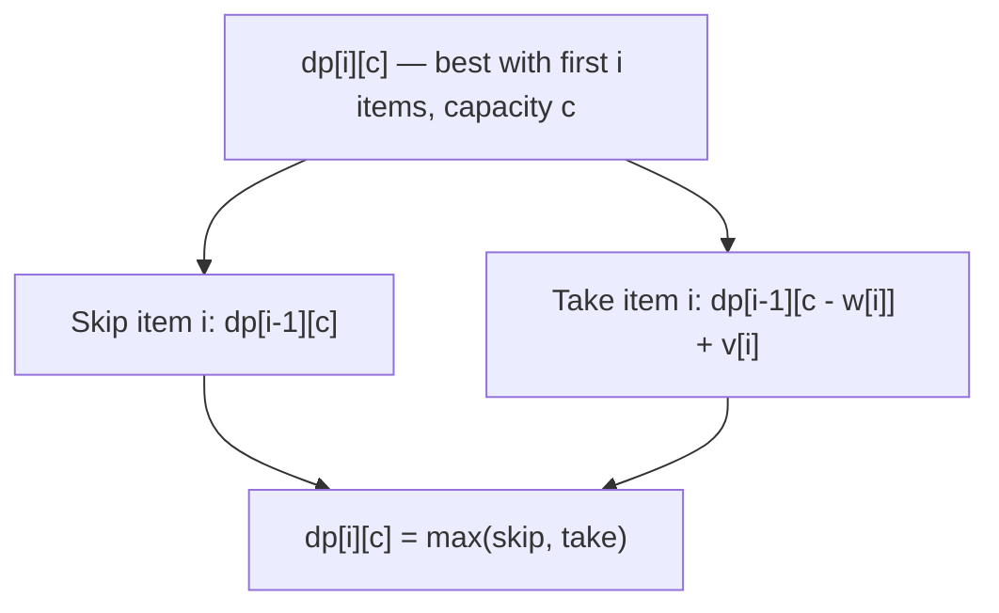

# Dynamic Programming: knapsack, LCS, LIS, edit distance, MCM

Dynamic programming (DP) is for problems where:

1. The answer can be built from answers to smaller versions of the same problem (**optimal substructure**).
2. The smaller problems repeat (**overlapping subproblems**), so caching avoids redundant work.

Recursion alone might be exponential. DP turns the same recursion into polynomial by remembering each subproblem's answer once.

## Two ways to express DP

| Approach               | Direction                  | Pros                                                          | Cons                               |
| ---------------------- | -------------------------- | ------------------------------------------------------------- | ---------------------------------- |
| Top-down (memoisation) | Recursive call + cache map | Closer to the recursive thinking; only computes needed states | Recursion depth, hash map overhead |
| Bottom-up (tabulation) | Iterative table fill       | No recursion, smaller constants, easier to space-optimise     | Need clear iteration order         |

For interviews, write whichever lets you explain the recurrence faster. Both are equally correct.

## How to attack a DP problem (in this order)

1. **Brute force** the problem recursively first. Get an exponential solution that works on small inputs.
2. **Identify state** — which arguments to the recursion uniquely identify a subproblem? The cache is keyed by that state.
3. **Verify overlapping subproblems** — does the same state appear down multiple branches? If yes, DP applies.
4. **Add memoisation** — wrap the recursion with a cache.
5. **Convert to bottom-up** if needed for performance or clarity. Iterate states in dependency order.
6. **Space-compress** if only a few previous rows are used.

## 0/1 Knapsack — the prototype DP problem

You have items with weights `w[]` and values `v[]`. The bag can hold weight `W`. Maximise the total value of items you carry; each item is taken **0 or 1 times**.

State: `dp[i][c]` = best value using the first `i` items with remaining capacity `c`.

Transition: at item `i` you either skip it (`dp[i - 1][c]`) or take it (`dp[i - 1][c - w[i]] + v[i]`). The answer is the max of those two.

```java
int knapsack(int W, int[] w, int[] v) {
    int n = w.length;
    int[][] dp = new int[n + 1][W + 1];
    for (int i = 1; i <= n; i++) {
        for (int c = 0; c <= W; c++) {
            dp[i][c] = dp[i - 1][c];
            if (c >= w[i - 1])
                dp[i][c] = Math.max(dp[i][c], dp[i - 1][c - w[i - 1]] + v[i - 1]);
        }
    }
    return dp[n][W];
}
```



**Space optimisation** — only the previous row matters, so the table compresses to `O(W)`. Iterate `c` **backward** so `dp[c - w]` still refers to row `i - 1`.

```java
int[] dp = new int[W + 1];
for (int i = 0; i < n; i++) {
    for (int c = W; c >= w[i]; c--) {
        dp[c] = Math.max(dp[c], dp[c - w[i]] + v[i]);
    }
}
```

## DP problem families

### Linear DP — answer depends on previous index

- **House robber**: `dp[i] = max(dp[i-1], dp[i-2] + nums[i])`. Cannot rob adjacent houses.
- **Climbing stairs**: `dp[i] = dp[i-1] + dp[i-2]`. Same Fibonacci skeleton.
- **Maximum subarray (Kadane)**: a degenerate DP with two variables, no table needed.

### 2D DP — paired strings, grids

- **Longest Common Subsequence**: characters match → diagonal + 1; mismatch → max of left or up.
- **Edit Distance**: insert, delete, or replace; min of three transitions.
- **Unique paths in a grid**: `dp[i][j] = dp[i-1][j] + dp[i][j-1]`.

```java
int lcs(String a, String b) {
    int n = a.length(), m = b.length();
    int[][] dp = new int[n + 1][m + 1];
    for (int i = 1; i <= n; i++) {
        for (int j = 1; j <= m; j++) {
            dp[i][j] = a.charAt(i - 1) == b.charAt(j - 1)
                ? dp[i - 1][j - 1] + 1
                : Math.max(dp[i - 1][j], dp[i][j - 1]);
        }
    }
    return dp[n][m];
}
```

```java
int editDistance(String a, String b) {
    int n = a.length(), m = b.length();
    int[][] dp = new int[n + 1][m + 1];
    for (int i = 0; i <= n; i++) dp[i][0] = i;
    for (int j = 0; j <= m; j++) dp[0][j] = j;
    for (int i = 1; i <= n; i++) {
        for (int j = 1; j <= m; j++) {
            if (a.charAt(i - 1) == b.charAt(j - 1)) dp[i][j] = dp[i - 1][j - 1];
            else dp[i][j] = 1 + Math.min(dp[i - 1][j - 1], Math.min(dp[i - 1][j], dp[i][j - 1]));
        }
    }
    return dp[n][m];
}
```

### Longest Increasing Subsequence (LIS)

`O(n²)` DP: `dp[i] = 1 + max(dp[j])` for `j < i, a[j] < a[i]`.

`O(n log n)` patience sort: maintain `tails[k]` = smallest tail of any increasing subsequence of length `k + 1`. Binary-search where each new value goes.

```java
int lengthOfLIS(int[] nums) {
    int[] tails = new int[nums.length];
    int len = 0;
    for (int x : nums) {
        int idx = Arrays.binarySearch(tails, 0, len, x);
        if (idx < 0) idx = -(idx + 1);
        tails[idx] = x;
        if (idx == len) len++;
    }
    return len;
}
```

The faster version is the canonical example of "DP plus binary search" — recognising that the inner `max` over `dp[j]` can itself be answered in `O(log n)` if we store `tails` cleverly.

### Interval DP — choices about ranges

- **Matrix Chain Multiplication**: `dp[i][j]` = min cost to multiply matrices `i..j`. Try every split point `k`. `O(n³)`.
- **Burst Balloons**: similar interval split.
- **Palindrome Partitioning II**: min cuts to partition a string into palindromes.

The recurrence has the shape `dp[i][j] = min over k of (dp[i][k] + dp[k+1][j] + cost(i, j, k))`.

### Bitmask DP — small subset state

When `n ≤ 20`, you can index states by a bitmask of which elements are included. Travelling Salesman is the classic: `dp[mask][i]` = min cost to visit the set `mask` ending at city `i`. Time `O(n² 2ⁿ)`, fast enough for `n = 18` or so.

### Tree DP

State per subtree. House robber on a tree: each node returns `(robThis, skipThis)`. Choose at the root.

## Complexity summary

| Problem            | Time         | Space (compressed) | Family                 |
| ------------------ | ------------ | ------------------ | ---------------------- |
| 0/1 Knapsack       | `O(n*W)`     | `O(W)`             | 2D                     |
| Unbounded Knapsack | `O(n*W)`     | `O(W)`             | 2D                     |
| LCS                | `O(n*m)`     | `O(min(n, m))`     | 2D string              |
| Edit Distance      | `O(n*m)`     | `O(min(n, m))`     | 2D string              |
| LIS                | `O(n log n)` | `O(n)`             | Linear + binary search |
| Matrix Chain       | `O(n³)`      | `O(n²)`            | Interval               |
| TSP (bitmask)      | `O(n² 2ⁿ)`   | `O(n 2ⁿ)`          | Bitmask                |

## How to recognise a DP problem

- **Maximum, minimum, or count** of something + a recursive structure.
- The brute-force recursion explores the same subproblem many times.
- Future decisions depend on a **small** piece of past state (string index, capacity, last position, current bitmask).
- "Either include or skip / pick or don't pick / split here or there" decisions appear in the recurrence.

If you cannot state the DP state in one English sentence, you do not have a DP solution yet. Keep restating until you can.

## Common mistakes

- **Wrong base case**. Most subtle bugs come from `dp[0][0]` or `dp[i][0]` initialisation. Walk through the smallest input by hand before coding.
- **Iteration order in space-compressed tables**. If `dp[c]` depends on `dp[c - w]` from the previous row, iterate backward. If it depends on the current row (unbounded knapsack), iterate forward.
- **Off-by-one between 1-indexed string positions and 0-indexed `charAt`**. Pick a convention and stay consistent.
- **Recursive memoisation hitting stack overflow** on deep recursions (`n = 10⁶`). Convert to bottom-up.
- **Hashing complex state slowly**. If your state is `(i, j, k, mask)`, prefer a multi-dimensional array over a `HashMap`. Hash overhead dominates on tight loops.

## Interview answers

_Q: How is DP different from divide-and-conquer like merge sort?_
A: Both split a problem into smaller pieces. Divide-and-conquer pieces are **disjoint** — merge sort's two halves never overlap. DP pieces **overlap** — Fibonacci's `fib(n - 2)` is computed many times across `fib(n - 1)` and direct calls. The cache is what makes DP polynomial.

_Q: Top-down or bottom-up for production code?_
A: Bottom-up almost always. No recursion depth, smaller constant factors, easier to space-compress. Top-down wins when only a small fraction of states are reachable — then the cache is sparse and the recursion only computes what is needed.

_Q: Walk me through the LCS recurrence on `"ABC"` and `"AC"`._
A: Build a 4×3 table indexed by prefix lengths. `dp[1][1] = 1` (matches A). `dp[1][2] = 1` (no extra). `dp[2][1] = 1`. `dp[2][2] = 1` (B ≠ C). `dp[3][1] = 1`. `dp[3][2] = 2` (matches C, take diagonal + 1). Answer: 2.

_Q: Why is iterating capacity backward critical in space-compressed knapsack?_
A: Forward iteration overwrites `dp[c - w]` with the current row's value before we use it. The transition wants the **previous row's** `dp[c - w]`. Going backward keeps the not-yet-touched cells in their previous-row state.

_Q: How do you reconstruct the actual solution, not just its cost?_
A: After filling the table, walk back from `dp[n][W]` and at each step ask "did I take this item or not?" by comparing `dp[i][c]` to `dp[i-1][c]`. If different, item `i` is in the bag. Same trick works for LCS, edit distance, etc.

_Q: When is greedy enough and DP overkill?_
A: When local optimum implies global optimum (the **exchange argument** holds). Activity selection is greedy. Coin change with arbitrary denominations is **not** greedy. Try both on a small adversarial input — if greedy fails on any case, DP is required.
