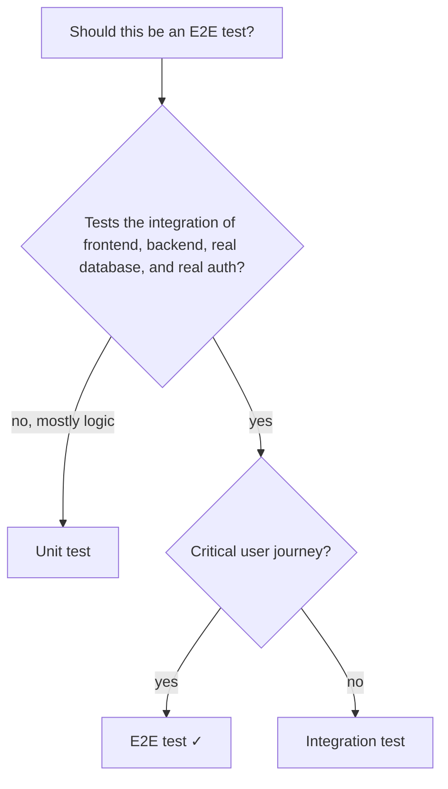
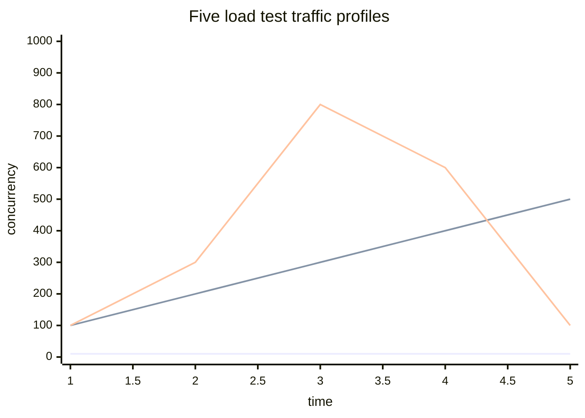
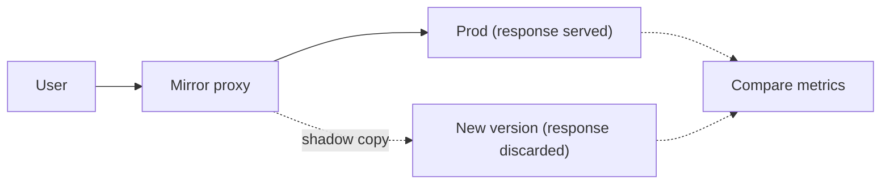

# E2E and load testing: Playwright, k6, JMeter, smoke vs soak vs stress

End-to-end (E2E) tests run the whole stack like a real user. Load tests run it under realistic (or unrealistic) traffic. Both catch bugs that unit and integration tests cannot — but both are slow, expensive, and fragile. The senior skill is keeping them **small, deterministic, and meaningful**.

## E2E testing — Playwright example

Playwright drives a real browser (Chromium, Firefox, WebKit) against your real app. It auto-waits for elements, retries on flake, traces failures with screenshots and video.

```ts
import { test, expect } from '@playwright/test'

test('user can mark a topic done', async ({ page }) => {
  await page.goto('/')
  await page.getByLabel('Display name').fill('Test User')
  await page.getByRole('button', { name: 'Get started' }).click()

  await page.getByRole('link', { name: /Arrays/i }).click()
  await page.getByRole('button', { name: 'Mark done' }).click()

  await expect(page.getByText('Done')).toBeVisible()
})
```

**Best practices**:

- Use **role-based locators** (`getByRole`, `getByLabel`, `getByText`) — they survive UI refactors and align with accessibility.
- Avoid CSS selectors and XPath; they break on every styling change.
- **Reset state** between tests (clear localStorage, drop the test database, recreate seed data).
- Run in **parallel by default**; isolate state per test.
- **Trace failures** (`trace: 'on-first-retry'`) so you have a video of what happened.

### How many E2E tests is enough?



Aim for **5 to 15 E2E tests per service**: login, signup, the 3-5 most critical flows, payment if applicable. Everything else is integration or unit.

## Load testing — k6

k6 is a modern load testing tool: tests are JavaScript, results are detailed, runs from a single binary. Replaces JMeter for most use cases.

```js
import http from 'k6/http'
import { check, sleep } from 'k6'

export const options = {
  stages: [
    { duration: '30s', target: 50 }, // ramp to 50 VUs
    { duration: '2m', target: 50 }, // hold steady
    { duration: '30s', target: 0 }, // ramp down
  ],
  thresholds: {
    http_req_duration: ['p(95)<500', 'p(99)<1500'], // latency SLOs
    http_req_failed: ['rate<0.01'], // error rate SLO
  },
}

export default function () {
  const res = http.get('https://api.example.com/orders', {
    headers: { Authorization: 'Bearer test-token' },
  })
  check(res, {
    'status 200': (r) => r.status === 200,
    'has body': (r) => r.body.length > 0,
  })
  sleep(1)
}
```

**VU** (virtual user) is k6's unit of concurrency. 50 VUs is roughly 50 simultaneous users hitting the endpoint.

## Five kinds of load test

| Type   | Purpose                        | Profile                | Duration      |
| ------ | ------------------------------ | ---------------------- | ------------- |
| Smoke  | Sanity check production path   | Tiny load, basic flows | 1-5 min       |
| Load   | Verify SLO at expected traffic | Normal peak traffic    | 10-30 min     |
| Stress | Find the breaking point        | Increase until failure | Until failure |
| Soak   | Catch leaks and degradation    | Steady load for hours  | 4-24 hours    |
| Spike  | Sudden surge then drop         | 0 → 10x → 0 quickly    | 5-15 min      |



### What each test answers

- **Smoke**: did the deployment work? Run before every prod release.
- **Load**: can the system meet SLOs at the traffic we expect? Run on staging weekly.
- **Stress**: what is our breaking point and how does it fail? Run quarterly.
- **Soak**: are there memory leaks, FD leaks, slow caches that build up? Run before major releases.
- **Spike**: how do we handle Black Friday or a viral moment? Run before predicted surges.

## Reading load test results

Mean is misleading. Look at percentiles:

```
http_req_duration:
  avg=120ms  min=50ms  med=110ms  p90=180ms  p95=250ms  p99=850ms  max=2500ms
```

- **p50 (median)**: typical user experience.
- **p95**: long-tail latency. SLOs usually live here.
- **p99**: tail latency. Your worst regular user.
- **max**: the single worst request — usually a fluke; do not chase it.

A 100ms median with a 2500ms max is normal. A p99 of 850ms when your SLO says < 500ms is a real problem affecting 1% of users.

## Production traffic shadow / dark launch

Before a risky change, send a copy of production traffic to a new version without exposing responses to users. Compare metrics. Catches problems load tests miss because **synthetic traffic is never quite real**.



Tools: Envoy mirror filter, Diffy, Mirage. Useful for migrations, library upgrades, and major refactors.

## Chaos testing

Inject failures intentionally — kill pods, partition networks, throttle disk — to verify your system handles them. Netflix's Chaos Monkey is the classic. Modern options: LitmusChaos (Kubernetes), Gremlin, ChaosMesh.

| Test              | Catches                                 |
| ----------------- | --------------------------------------- |
| Kill a pod        | Auto-restart, traffic rebalancing       |
| Network partition | Fail-over, replica sync                 |
| CPU saturation    | Hot-path fall-back, autoscaling         |
| Disk fill         | Disk-pressure handling, log rotation    |
| Slow downstream   | Timeout configuration, circuit breakers |
| Clock skew        | Distributed-lock correctness            |

Chaos tests are usually run in staging, then carefully in production with blast-radius limits.

## Common pitfalls

- **CI minutes treated as free**. A 90-minute test suite slows the team. Budget time by layer.
- **E2E flakiness from animations and timing**. Disable animations in tests, use auto-wait, never `sleep(1000)`.
- **Shared E2E state**. Two tests, both modifying user "alice", race. Use unique fixture data per test.
- **Load testing against an empty database**. The query plan changes with data volume. Seed realistic volumes.
- **Hitting cached endpoints**. CDN or app-level cache means k6 measures cache, not your service. Bust cache or test paths that bypass it.
- **Single-machine load tests**. One laptop cannot generate 10K req/s. Distribute via k6 cloud, JMeter slaves, or Locust workers.
- **Testing only the happy path under load**. Real traffic includes errors, retries, slow clients. Mix realistic distributions.
- **Mocking the system under test in E2E**. If the only "logic" left after mocking is the test setup, the test is theatre.

## Interview answers

_Q: What is the difference between load testing and stress testing?_
A: Load tests verify the system meets SLOs under expected traffic. Stress tests deliberately exceed expected traffic to find the breaking point and observe how the system fails — graceful degradation or cliff-edge collapse.

_Q: How do you decide what to E2E test versus integration test?_
A: E2E for journeys that span the frontend, backend, database, and auth — the cases where wiring is the risk. Integration for service-internal logic where the database and Spring context matter but the browser does not. Unit for pure logic. The pyramid stays bottom-heavy.

_Q: What does a healthy p99 latency look like?_
A: It depends on the SLO. For a public-facing API, p99 of 500ms is usually healthy. p99 of 5s with p50 of 200ms means the long tail is doing something different — GC pauses, cache misses, slow downstream calls. Track p99 separately from p50.

_Q: How would you load-test a service that depends on a third-party API?_
A: Either mock the third party (with realistic latency distribution) so you test only your service, or coordinate with the third party for a true integration load test. Hammering a real third party in a test is unprofessional and can get your account banned.

_Q: How do you keep E2E tests deterministic?_
A: Reset state between tests (clear DB, clear local storage, fresh user). Pin time and randomness if relevant. Disable animations. Use stable role-based locators. Run tests in parallel with isolated fixtures. Trace flakes when they occur and fix them — never retry-until-pass on CI.

_Q: When is chaos engineering worth doing?_
A: When you have services that must survive failures (multi-region, replicas, retries, circuit breakers) and the cost of an outage is high. Start in staging with single-failure injections, expand to game-days, eventually production with blast-radius controls. Do not run chaos tests if you cannot stop them quickly.

_Q: How does dark launch / shadow traffic differ from a canary?_
A: Canary deploys the new version to a small percentage of real users — they see real responses. Shadow sends a copy of traffic to the new version but discards its responses; users always see the old version. Shadow catches latency and error issues without exposing them; canary catches user-visible regressions but exposes them to a few users.
