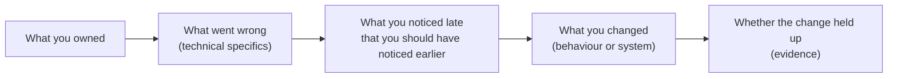
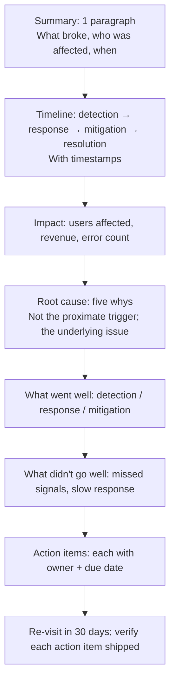

# Discussing failure and growth: post-mortems, blameless retrospectives

The "tell me about a failure" question is one of the most-asked behavioural questions at senior level. It is also one of the most-bungled. Senior engineers can talk about a failure **without sounding either defensive or self-flagellating**. The failure is the setup; the growth is the point.

## The arc of a good failure story



Five elements:

1. **What you owned**. Establish your responsibility. Not "the team" — you.
2. **What went wrong**. Specific technical details. Don't hide.
3. **What you noticed too late**. Self-awareness about the failure mode.
4. **What you changed**. Concrete change in your behaviour, or in the system, or in the process.
5. **Whether it held up**. Evidence the lesson stuck.

Element 5 is the most-skipped and most-important. A lesson without follow-up is just an apology.

## Example — weak vs strong

**Weak**:

> "We had a bug in production once. It was hard to debug. I learned to write better tests."

No specifics. No ownership. Generic lesson.

**Strong**:

> "I owned the recommendations service that powered our homepage feed. We rolled out a new ranking model behind a feature flag at 5%, but I'd configured the flag to **always** return the new ranker for one user cohort — power users — instead of a 5% sample. Power users saw worse recommendations for 6 hours before someone in customer support flagged it.
>
> What I should have caught: I tested the flag locally with one user ID and it worked. I didn't test what happened when the user cohort filter was active. The unit test didn't cover the cohort logic.
>
> What I changed: I added integration tests that exercise the cohort filtering with multiple cohorts. I also wrote a **rollout checklist** for our team — three items: 'verify rollout percentage is correct', 'verify no cohort is fully rolled', 'verify dashboard shows expected traffic split before declaring success'. The checklist is now in our deploy template.
>
> Six months later, a colleague used the checklist on a different rollout and caught a similar bug — wrong cohort filter — before it shipped to users."

The strong version:

- Specific technical detail (feature flag, cohort filter, 6 hours).
- Owns the specific mistake.
- Names what they should have noticed earlier.
- Concrete change with artefact (checklist).
- Evidence the lesson stuck (colleague caught a bug with the same checklist).

## Failures worth telling

Pick a failure of **judgement or process**, not core skill.

| Good failure type                             | Why it works                                   |
| --------------------------------------------- | ---------------------------------------------- |
| Underestimated complexity / timeline          | Common; lessons transfer; senior engineers nod |
| Shipped without enough monitoring             | Recoverable; lesson is reusable                |
| Picked the wrong abstraction                  | Easy to explain; common in real engineering    |
| Didn't communicate a risk early               | Cross-cutting lesson, not technical-only       |
| Trusted a system / library you shouldn't have | Maps to "always verify" lesson                 |
| Didn't push back when you should have         | Ownership lesson                               |
| Over-engineered something simple              | YAGNI lesson                                   |

| Bad failure type                  | Why to avoid                          |
| --------------------------------- | ------------------------------------- |
| "I deleted production data"       | Too far; raises hire-risk concerns    |
| "I worked too hard"               | Humble-brag; interviewers see through |
| "I'm a perfectionist"             | Same; not a real weakness             |
| "I struggled with [a core skill]" | Self-disqualifying                    |
| "Someone else's fault"            | Lacks ownership                       |

## Postmortem structure (the actual document)

Real production postmortems follow a similar arc; understanding them helps you tell better failure stories in interviews.



### Blameless framing

The cardinal rule: **focus on systems and processes, not individuals**.

| Blame framing                        | Blameless framing                                                                                               |
| ------------------------------------ | --------------------------------------------------------------------------------------------------------------- |
| "Alice deployed the bug"             | "Our deploy process didn't catch the regression because we don't run integration tests on every PR"             |
| "Bob ignored the alert"              | "The alert was tuned to fire too often; Bob saw 50 false positives that day. Our alerting fatigue caused this." |
| "Carol forgot to update the runbook" | "Runbook updates are not part of our deploy checklist; updates happen ad hoc"                                   |

Blameless is not "no one is responsible". Individuals still do work and have judgement. But the postmortem **diagnoses the system**, because that's what scales the lesson — fixing Alice's bug helps once; fixing the deploy process prevents the next one.

### Five whys

Drill from symptom to root cause:

```
Symptom: Production was down for 30 minutes.
Why? The new release crashed on startup.
Why? It tried to read an environment variable that didn't exist.
Why? The variable was added to staging but not to production.
Why? Our deploy automation doesn't compare env-var lists between environments.
Why? We've never had a divergence problem before.

Root cause: No diff or alert between staging and production env-var lists.
Action: Add a CI job that fails the build if staging and production env vars diverge.
```

Three whys is rarely deep enough. Five usually finds something systemic.

## Action items that actually ship

The most common postmortem failure: **the action items never ship**.

| Bad action item                | Good action item                                                             |
| ------------------------------ | ---------------------------------------------------------------------------- |
| "We should improve monitoring" | "Alice: add p99 latency alert tied to checkout SLO by Aug 15"                |
| "Better testing"               | "Bob: add integration test covering cohort filtering by Aug 8"               |
| "Document the runbook"         | "Carol: write runbook for X service by Aug 10; review with on-call rotation" |

Specific. Owned. Dated. Re-visit at 30-day mark to verify each shipped. The team that takes postmortems seriously is the team that doesn't repeat incidents.

## Talking about ongoing failures

What if the failure is recent and unresolved?

> "We're in the middle of fixing an incident now — a database failover took 15 minutes when it should have taken 60 seconds. We're still investigating the root cause; current hypothesis is that connection-pool draining was misconfigured. I'd be happy to share what we find when we ship the postmortem."

This is fine. Senior interviewers respect ongoing engineering work over polished hindsight. Don't fabricate a complete arc on a story that's still unfolding.

## Common pitfalls

- **Picking a non-failure as the failure**. "Once I worked too hard" — interviewers see through.
- **Blaming context or teammates**. Even if context was the cause, you must own your part.
- **Never circling back to growth**. The point of the story is the lesson, not the wound.
- **Lesson too generic**. "I learned to write better tests" applies to everyone always; it tells me nothing.
- **No follow-up evidence**. The lesson must have stuck. Show how.
- **Self-flagellating**. Calm and matter-of-fact beats remorseful. Failures happen; senior engineers process them and move on.
- **Over-rehearsed**. Failure stories are unique to you; they should sound personal. Memorising word-for-word kills the authenticity.

## Interview answers

_Q: Tell me about a project that failed._
A: [Use a 90-second STAR story with the five-element arc above.] Pick a real failure. Own your specific part. Describe what you'd do differently. Show evidence the lesson stuck.

_Q: What's your biggest weakness?_
A: A real one paired with how you compensate. "I tend to over-research before deciding. I now timebox investigations: 2 days max before writing up findings and committing to a direction. Catches the perfectionism without leaving me uninformed." The compensating mechanism is what differentiates this from a humble-brag.

_Q: How do you run a postmortem?_
A: Blameless framing — the system did X, not Alice did X. Timeline with timestamps. Five whys to root cause. Action items with owners and dates. Re-visit at 30 days to verify they shipped. The discipline is the follow-up; postmortems without follow-through are theatre.

_Q: When was the last time you made a wrong call?_
A: [Use a recent specific example.] Senior interviewers prefer recent over historical — shows you're still learning. Frame it: I had a position, I committed to it, the data later showed I was wrong, here's what I changed.

_Q: How do you handle being criticised for a failure?_
A: I want the criticism to be specific and accurate. I focus on the system and process, not on whether I personally did right or wrong. If the criticism reveals a real mistake on my part, I acknowledge it and outline what I'm changing. If it doesn't, I push back with the specifics.

_Q: How do you decide what to put in a postmortem action item?_
A: Specific, owned, dated. "Better monitoring" never ships. "Alice: add p99 alert by Aug 15" ships or doesn't, and we know which. I limit action items to the highest-leverage 3-5; long lists dilute focus.

_Q: How do you talk about failure without sounding bad?_
A: Calm, matter-of-fact, specific. Failures happen — the question is whether you process them and learn. The story is about the growth, not the wound. End on what changed and whether it held up. Senior interviewers want to see the system thinking, not the regret.
