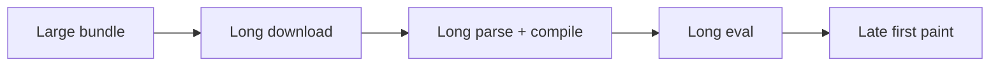
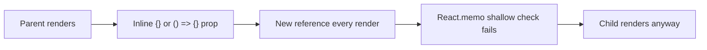
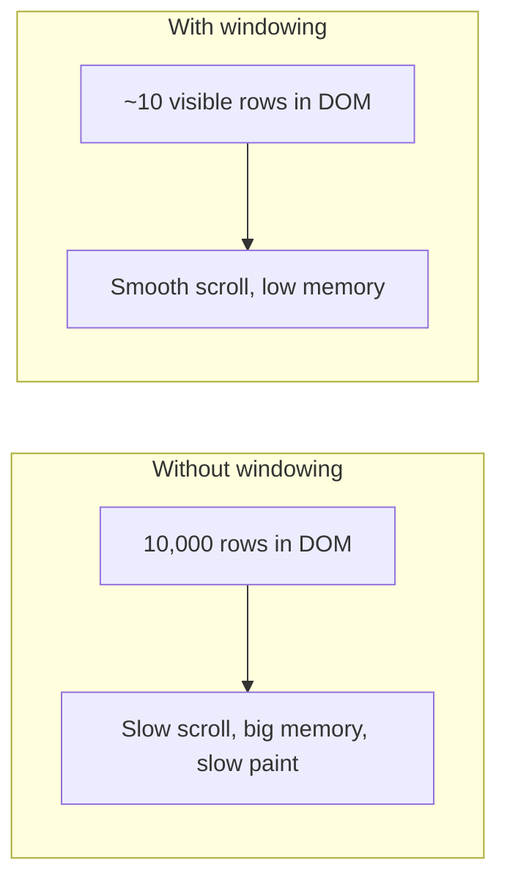

# Optimisation: memo, windowing, code splitting, image optimisation

Frontend performance is often the difference between "feels fast" and "feels broken." Senior interviews probe whether you understand **what's slow before you optimise**, the trade-offs of each technique, and how to measure improvement.

## Measure first, optimise second

**Always profile before adding abstractions.** The browser's Performance tab and React DevTools Profiler are free, immediate, and accurate.

| Tool                        | Tells you                                          |
| --------------------------- | -------------------------------------------------- |
| Chrome DevTools Performance | What the browser does each frame                   |
| React DevTools Profiler     | Which components rendered, why, and how long       |
| Lighthouse                  | First Contentful Paint, LCP, CLS, INP, bundle size |
| Web Vitals (real user)      | Field metrics from production users                |

Web Vitals to know:

- **LCP** (Largest Contentful Paint) — time until the biggest visible thing renders. Target < 2.5s.
- **INP** (Interaction to Next Paint) — time from user action to next visible response. Target < 200ms.
- **CLS** (Cumulative Layout Shift) — how much content jumps around. Target < 0.1.

## Bundle size — every kilobyte costs



Tactics to shrink the bundle:

### 1. Code splitting

Break the app into chunks that load on demand.

```jsx
import { lazy, Suspense } from 'react'

const Settings = lazy(() => import('./Settings'))

function App() {
  return (
    <Suspense fallback={<Spinner />}>
      <Routes>
        <Route path="/settings" element={<Settings />} />
      </Routes>
    </Suspense>
  )
}
```

Common split points:

- Per route — each page is its own chunk.
- Heavy modals — load when opened, not on initial page load.
- Admin features — most users never need them.
- Large libraries — Mermaid, Monaco, charting — lazy-load only on pages that need them.

### 2. Tree shaking

Modern bundlers (Vite, Webpack 5+, Rollup) drop exports that are not used. Helps only when libraries are written as ES modules with named exports.

```jsx
// Good — only imports what's used
import { format } from 'date-fns/format'

// Bad — pulls in entire library
import _ from 'lodash'
```

### 3. Replace heavy libraries

| Heavy              | Lighter alternative                    |
| ------------------ | -------------------------------------- |
| Moment.js (~70 KB) | date-fns / Day.js (~7 KB)              |
| Lodash (~70 KB)    | Native ES + small `lodash-es` imports  |
| Bootstrap CSS      | Tailwind (purges unused) / utility CSS |
| jQuery             | Native DOM APIs                        |
| Axios              | `fetch` + a thin wrapper               |

### 4. Dynamic imports

Heavy features behind a user action:

```jsx
async function exportPDF() {
  const { exportToPDF } = await import('./pdf-exporter')
  exportToPDF(currentDocument)
}
```

The PDF exporter (and its `pdfkit` dep) only ships to users who click the button.

## Render performance

The first question is "is the component actually slow, or is it rendering too often?" Use React Profiler to find out.

### React.memo — skip render when props unchanged

```jsx
const ExpensiveRow = memo(function ExpensiveRow({ item }: { item: Item }) {
  return <ComplexRendering item={item} />
})
```

`memo` shallow-compares props. If unchanged, skips render. **Useless when props change every render** — like inline objects or callbacks the parent recreates.

```jsx
// BAD — onClick is a new function every render of Parent
<MemoChild onClick={() => doThing()} />

// GOOD — useCallback keeps the function stable
const handleClick = useCallback(() => doThing(), [])
<MemoChild onClick={handleClick} />
```



### useMemo and useCallback

Cache values across renders. Useful when:

- The value is expensive to compute.
- The value is passed to a memoised child as a prop.
- The value is a dependency of `useEffect` and recreating it would re-run the effect.

Not useful for cheap computations. Adds memory and equality-check cost.

### Avoid unnecessary state

State that can be **derived** from other state should be derived, not stored.

```jsx
// BAD — derived state out of sync risk
const [items, setItems] = useState([])
const [count, setCount] = useState(0)

// GOOD — derive
const [items, setItems] = useState([])
const count = items.length
```

The first version doubles the chance of bugs because two state updates must stay in sync.

## Windowing — render only what's visible

Rendering 10,000 list items takes time even if each is cheap. **Virtualisation** (also called "windowing") renders only the items currently in the viewport.

```jsx
import { useVirtualizer } from '@tanstack/react-virtual'

function BigList({ items }) {
  const parentRef = useRef(null)
  const virtualizer = useVirtualizer({
    count: items.length,
    getScrollElement: () => parentRef.current,
    estimateSize: () => 48,
  })

  return (
    <div ref={parentRef} className="h-96 overflow-auto">
      <div style={{ height: virtualizer.getTotalSize() }} className="relative">
        {virtualizer.getVirtualItems().map((virtualRow) => (
          <div
            key={virtualRow.key}
            style={{
              position: 'absolute',
              top: 0,
              transform: `translateY(${virtualRow.start}px)`,
              height: virtualRow.size,
            }}
          >
            <Row item={items[virtualRow.index]} />
          </div>
        ))}
      </div>
    </div>
  )
}
```

Visible rows: ~10. DOM nodes: ~10. Scroll: smooth at 60fps even with 100K items.



Use windowing for: long product lists, infinite feeds, tables with thousands of rows, dropdowns with many options.

## Image optimisation

Images dominate page weight. The fixes are well-known:

| Technique          | What it does                                          |
| ------------------ | ----------------------------------------------------- |
| Correct dimensions | Don't load 4000×3000 to display 400×300               |
| Modern formats     | AVIF or WebP — 30-50% smaller than JPEG               |
| Responsive sources | `<picture>` or `srcset` to send right size per device |
| Lazy loading       | `loading="lazy"` defers off-screen images             |
| Width/height       | Reserves layout space, prevents CLS                   |
| Priority hints     | `fetchpriority="high"` for the LCP image              |

```html
<picture>
  <source type="image/avif" srcset="hero-400.avif 400w, hero-800.avif 800w" />
  <source type="image/webp" srcset="hero-400.webp 400w, hero-800.webp 800w" />
  
</picture>
```

Modern frameworks (Next.js `<Image>`, Vite + sharp pipelines) automate most of this.

## Network — make requests cheaper

- **HTTP/2 + HTTPS** — multiplexing, header compression, lower latency.
- **Gzip/Brotli compression** — text payloads shrink ~70%. Default in modern hosting.
- **CDN** — serve static assets from edge nodes. Sub-50ms anywhere.
- **Cache headers** — `Cache-Control: max-age=31536000, immutable` for hashed assets.
- **Preload critical resources** — `<link rel="preload" as="font">` for hero fonts.
- **Preconnect to third parties** — `<link rel="preconnect" href="https://api.example.com">`.

## Common mistakes

- **Optimising before measuring**. Most "slow" components turn out to render fine; the parent re-renders too often.
- **Wrapping every callback in `useCallback`**. Adds overhead, no win unless paired with a memoised child.
- **Memoizing values that are cheap**. Sum of a 100-element array? Just do it.
- **Forgetting bundle inspector tools**. `vite-bundle-visualizer` or `webpack-bundle-analyzer` show what's dragging down the bundle.
- **CSS-in-JS in hot paths**. Style libraries that compute styles on every render add measurable cost. Prefer atomic CSS or static-extracted CSS.
- **Animating layout-affecting properties**. `top`, `left`, `width`, `height` cause reflow. Animate `transform` and `opacity` instead.
- **Long synchronous tasks blocking the main thread**. `requestIdleCallback` or web workers for anything > 50ms.

## Interview answers

_Q: How would you find why a React app feels sluggish?_
A: Open React Profiler, record a typical interaction. Look for: (1) which components rendered and why ("hooks changed", "props changed"), (2) total render time, (3) commit timing. Then open Chrome Performance, record same interaction. Look for long tasks > 50ms blocking the main thread, layout thrashing, big garbage collections.

_Q: When does `React.memo` help and when doesn't it?_
A: It helps when the wrapped component is expensive to render and props rarely change. It does not help when props change every render — inline objects, inline callbacks, new arrays. The shallow comparison fails and the render happens anyway. Pair `memo` with `useCallback` and `useMemo` to stabilise references.

_Q: Why does windowing improve scroll performance?_
A: It keeps DOM size small. The browser's layout, paint, and event handling all cost more with more nodes. Windowing renders ~10 nodes instead of 10,000; total work per frame drops by orders of magnitude. The trade-off: jump-to-index requires knowing the scroll position math, and accessibility requires `aria-rowindex` to compensate for missing rows.

_Q: How would you reduce initial bundle size for a large app?_
A: Code split per route — `lazy()` + `Suspense`. Audit dependencies — replace heavy ones (Moment → date-fns, Lodash → native or scoped imports). Dynamic-import features behind a user action. Use a bundle visualizer to find unexpected weight. Set up budget alerts in CI.

_Q: What is the "waterfall" anti-pattern in data fetching?_
A: A child component fetches data based on something its parent already fetched. The child can't start its fetch until its parent finishes. Each level adds latency. Fix: lift the fetches up so they run in parallel, or use a query library's parallel `useQueries`, or use server components that do data fetching at the edge.

_Q: How do you avoid layout shift?_
A: Reserve space for known-size content. Set `width` and `height` on images. Use CSS `aspect-ratio` for responsive media. For ad slots, reserve placeholder dimensions. For fonts, use `font-display: optional` or preload + `font-display: swap` with similar metrics. Late-arriving content that pushes layout is the biggest CLS contributor.

_Q: When would you use a web worker for frontend work?_
A: When a task takes more than ~50ms of CPU and would otherwise block the main thread (parsing big JSON, compressing images, running ML models, complex spreadsheet recalc). Workers run on a separate thread; communicate via `postMessage`. Comlink wraps the message protocol in a clean async API.
