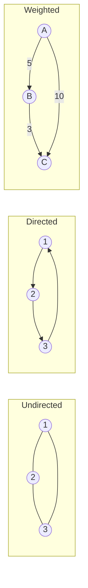

# Graphs: BFS, DFS, cycles, shortest paths, MST, topological sort

A graph is a set of nodes (vertices) connected by edges. Trees are a special case of graphs. Almost any system with relationships — friendships, dependencies, road networks, web pages, package versions — is a graph.

Before solving any graph problem, **clarify the four properties**: directed or undirected? Weighted or unweighted? Cycles allowed? Connected or disconnected?



## Representations

| Format           | Memory     | Edge lookup | Best for                               |
| ---------------- | ---------- | ----------- | -------------------------------------- |
| Adjacency list   | `O(V + E)` | `O(degree)` | Sparse graphs (most real ones)         |
| Adjacency matrix | `O(V²)`    | `O(1)`      | Dense graphs, frequent edge queries    |
| Edge list        | `O(E)`     | `O(E)`      | MST algorithms (Kruskal), input format |

```java
Map<Integer, List<int[]>> adj = new HashMap<>();  // node → [(neighbor, weight)]
```

## BFS — shortest path in unweighted graphs

BFS visits nodes in order of distance from the source. The queue holds the **frontier** — discovered but not yet expanded.

```java
int shortestPath(Map<Integer, List<Integer>> graph, int start, int target) {
    Set<Integer> visited = new HashSet<>();
    Deque<int[]> queue = new ArrayDeque<>();  // [node, distance]
    queue.offer(new int[] { start, 0 });
    visited.add(start);
    while (!queue.isEmpty()) {
        int[] curr = queue.poll();
        if (curr[0] == target) return curr[1];
        for (int next : graph.getOrDefault(curr[0], List.of())) {
            if (visited.add(next)) queue.offer(new int[] { next, curr[1] + 1 });
        }
    }
    return -1;
}
```

The crucial detail: **mark visited the moment you enqueue**, not when you dequeue. Otherwise the same node enters the queue many times.

## DFS — exhaustive search

DFS goes deep before going wide. Recursive form is shorter; iterative form avoids stack overflow on huge graphs.

```java
void dfs(int node, Map<Integer, List<Integer>> graph, Set<Integer> visited) {
    if (!visited.add(node)) return;
    process(node);
    for (int next : graph.getOrDefault(node, List.of())) {
        dfs(next, graph, visited);
    }
}
```

DFS counts connected components, finds bridges/articulation points, builds spanning trees, and powers backtracking searches.

## Cycle detection

**Undirected graph**: cycle exists if DFS finds a visited neighbor that is **not the parent** on the current path.

**Directed graph**: track three states — `WHITE` (unseen), `GRAY` (on current DFS path), `BLACK` (fully explored). A back edge to a `GRAY` node is a cycle.

```java
enum Color { WHITE, GRAY, BLACK }

boolean hasCycle(int node, Map<Integer, List<Integer>> graph, Color[] color) {
    color[node] = Color.GRAY;
    for (int next : graph.getOrDefault(node, List.of())) {
        if (color[next] == Color.GRAY) return true;          // back edge → cycle
        if (color[next] == Color.WHITE && hasCycle(next, graph, color)) return true;
    }
    color[node] = Color.BLACK;
    return false;
}
```

## Dijkstra — shortest path with non-negative weights

Use a min-priority-queue keyed by tentative distance. At each step, extract the closest unvisited node and relax its outgoing edges.

```java
int[] dijkstra(int n, List<int[]>[] graph, int start) {
    int[] dist = new int[n];
    Arrays.fill(dist, Integer.MAX_VALUE);
    dist[start] = 0;
    PriorityQueue<int[]> pq = new PriorityQueue<>((a, b) -> a[1] - b[1]);  // [node, dist]
    pq.offer(new int[] { start, 0 });
    while (!pq.isEmpty()) {
        int[] curr = pq.poll();
        int u = curr[0], d = curr[1];
        if (d > dist[u]) continue;  // stale entry — already relaxed via shorter path
        for (int[] edge : graph[u]) {
            int v = edge[0], w = edge[1];
            if (dist[u] + w < dist[v]) {
                dist[v] = dist[u] + w;
                pq.offer(new int[] { v, dist[v] });
            }
        }
    }
    return dist;
}
```

Time: `O((V + E) log V)`. Fails on negative edges — the `pq` can give a "wrong winner" if a longer path with negative weights would beat it later.

For **negative edges**, use Bellman-Ford (`O(V * E)`). Bellman-Ford also detects negative cycles: a `V`-th pass that still relaxes some edge means a negative cycle exists.

For **all-pairs shortest paths**, use Floyd-Warshall (`O(V³)`).

## Minimum Spanning Tree (MST)

A spanning tree connects all `V` vertices using `V - 1` edges. The **minimum** spanning tree minimises total edge weight. Two algorithms:

**Kruskal** — sort edges by weight, take each if it does not form a cycle (use union-find to check).

```java
int kruskal(int n, int[][] edges) {  // edges = [u, v, weight]
    Arrays.sort(edges, (a, b) -> a[2] - b[2]);
    int[] parent = new int[n];
    for (int i = 0; i < n; i++) parent[i] = i;
    int total = 0, count = 0;
    for (int[] e : edges) {
        int ru = find(parent, e[0]), rv = find(parent, e[1]);
        if (ru != rv) {
            parent[ru] = rv;
            total += e[2];
            if (++count == n - 1) break;
        }
    }
    return total;
}
```

**Prim** — grow from one vertex, always adding the cheapest edge that reaches a new vertex (priority queue).

| Choose  | When                                  |
| ------- | ------------------------------------- |
| Kruskal | Edge list given, sparse graph         |
| Prim    | Adjacency representation, dense graph |

## Topological sort — order a DAG

A topological sort orders nodes so every edge points from earlier to later. Only works on **directed acyclic graphs** (DAGs). Used for build dependencies, course prerequisites, package install order.

**Kahn's algorithm** (BFS-based, easy to explain):

```java
int[] topoSort(int n, List<List<Integer>> graph) {
    int[] indegree = new int[n];
    for (List<Integer> row : graph) for (int v : row) indegree[v]++;
    Deque<Integer> queue = new ArrayDeque<>();
    for (int i = 0; i < n; i++) if (indegree[i] == 0) queue.offer(i);
    int[] order = new int[n];
    int idx = 0;
    while (!queue.isEmpty()) {
        int u = queue.poll();
        order[idx++] = u;
        for (int v : graph.get(u)) {
            if (--indegree[v] == 0) queue.offer(v);
        }
    }
    if (idx != n) throw new IllegalStateException("Graph has a cycle");
    return order;
}
```

DFS-based variant: postorder traversal, then reverse the result.

## Common mistakes

- **Marking visited too late**. Marking on dequeue (instead of enqueue) duplicates queue entries and breaks BFS distance correctness.
- **Forgetting that Dijkstra fails on negative edges**. The first time a node is extracted, you assume its distance is final. With negative edges, a later path could beat it.
- **Treating undirected edges as one entry**. An undirected edge `(u, v)` must appear in both `adj[u]` and `adj[v]`. Forgetting this misses traversal paths.
- **Not checking for stale entries in Dijkstra's PQ**. A node may be enqueued multiple times with different distances. Skip processing when the popped distance is greater than the recorded best.
- **Running topological sort on a graph with cycles**. Kahn's gives a partial result (indegree never hits zero). Always check the final count equals `n`.

## Interview answers

_Q: BFS or DFS for finding shortest unweighted path?_
A: BFS. It explores in order of distance, so the first time you reach the target is along a shortest path. DFS could find a longer path first.

_Q: How does Dijkstra differ from BFS?_
A: BFS treats all edges as weight 1 and uses a FIFO queue. Dijkstra weights edges and uses a min-priority-queue ordered by tentative distance. BFS is `O(V + E)`; Dijkstra is `O((V + E) log V)`.

_Q: How would you detect whether a graph is bipartite?_
A: Two-color BFS or DFS. Color a node, then color its neighbors the opposite color. If a neighbor is already colored the same as the current node, the graph is not bipartite. `O(V + E)`.

_Q: Walk me through topological sort on a build graph where A depends on B and C, and B depends on C._
A: Edges B→A, C→A, C→B. Indegrees: A=2, B=1, C=0. Queue starts with C. Process C: A→1, B→0, queue=[B]. Process B: A→0, queue=[A]. Process A: queue empty. Order: C, B, A.

_Q: When would you pick MST over shortest paths?_
A: MST minimises total connectivity cost — wiring a network, building a road system. Shortest paths give the cheapest route between two specific nodes. MST contains the shortest path between two nodes only by accident; do not confuse them.

_Q: How do you find strongly connected components in a directed graph?_
A: Two passes. First DFS records postorder finish times. Second DFS on the **reverse graph** in decreasing-finish-time order; each tree of the second DFS is one SCC. This is Kosaraju's algorithm. Tarjan's algorithm achieves the same in one pass with a stack and lowlink values.
