# Greedy: interval scheduling, Huffman, Jump Game, when greedy is provably correct

A greedy algorithm makes the **locally best choice at each step**, never reconsidering. It is shorter and faster than DP, but only correct when local optima compose into a global optimum.

The hard skill is **proving** the greedy works. The famous tool is the **exchange argument**: assume an optimal solution differs from the greedy at the first decision; show you can swap in the greedy choice without making the solution worse. If that always works, the greedy is optimal.

If you cannot articulate the invariant being preserved, you do not have a greedy yet — fall back to DP.

## When greedy works

| Problem                 | Greedy choice                         | Why it works                              |
| ----------------------- | ------------------------------------- | ----------------------------------------- |
| Activity selection      | Pick earliest end time                | Earliest-ending leaves most room later    |
| Coin change (canonical) | Take largest coin ≤ remaining         | Canonical denominations like 1, 5, 10, 25 |
| Huffman coding          | Merge two least-frequent nodes        | Building bottom-up minimises path length  |
| Jump Game II            | Greedy farthest reachable             | Each "jump" extends to optimal frontier   |
| Fractional knapsack     | Sort by value/weight density          | Continuous space — splits are allowed     |
| Minimum spanning tree   | Add cheapest non-cycle edge (Kruskal) | Cut property of MST                       |

## Activity selection — pick by end time

Given activities with start and end times, schedule the maximum number of non-overlapping activities.

```mermaid
gantt
    title Activity selection — pick earliest-ending compatible
    dateFormat X
    axisFormat %s
    section Activities
    A1   :a1, 0, 4
    A2   :a2, 1, 3
    A3   :a3, 3, 5
    A4   :a4, 4, 6
    A5   :a5, 5, 8
```



Sort by end time: `[A2(1-3), A1(0-4), A3(3-5), A4(4-6), A5(5-8)]`. Take A2 (ends 3). A1 conflicts. A3 fits (starts 3 ≥ 3 — depends on inclusive/exclusive). A4 conflicts. A5 fits. Final: A2, A3, A5.

```java
int maxActivities(int[][] intervals) {
    Arrays.sort(intervals, (a, b) -> a[1] - b[1]);
    int count = 0, lastEnd = Integer.MIN_VALUE;
    for (int[] in : intervals) {
        if (in[0] >= lastEnd) {
            count++;
            lastEnd = in[1];
        }
    }
    return count;
}
```

## Jump Game II

Given an array where `nums[i]` is the max jump length from index `i`, find the minimum jumps to reach the end.

The greedy: track `farthest` reachable so far, plus `currentEnd` (the limit of the current jump). When `i` reaches `currentEnd`, you must take a jump; the next jump extends to `farthest`.

```java
int jump(int[] nums) {
    int jumps = 0, currentEnd = 0, farthest = 0;
    for (int i = 0; i < nums.length - 1; i++) {
        farthest = Math.max(farthest, i + nums[i]);
        if (i == currentEnd) {
            jumps++;
            currentEnd = farthest;
        }
    }
    return jumps;
}
```

## Huffman coding — build the min-heap of frequencies

Symbols with frequencies. Build a prefix code where frequent symbols get short codes.

```java
class Node implements Comparable<Node> {
    int freq;
    Node left, right;
    public int compareTo(Node other) { return Integer.compare(this.freq, other.freq); }
}

Node huffman(Map<Character, Integer> freq) {
    PriorityQueue<Node> pq = new PriorityQueue<>();
    for (var e : freq.entrySet()) {
        Node n = new Node();
        n.freq = e.getValue();
        pq.offer(n);
    }
    while (pq.size() > 1) {
        Node a = pq.poll(), b = pq.poll();
        Node merged = new Node();
        merged.freq = a.freq + b.freq;
        merged.left = a;
        merged.right = b;
        pq.offer(merged);
    }
    return pq.poll();   // root of the Huffman tree
}
```

The optimality proof uses the **sibling lemma**: in some optimal tree, the two least-frequent symbols are siblings at maximum depth. Greedy merges them first, which is always safe.

## Gas station circuit

You have `gas[i]` and `cost[i]` arrays around a circle. Find a start index from which you can complete the loop, or `-1`.

The trick: if `sum(gas) < sum(cost)`, it is impossible. Otherwise, there is a unique starting point — the index right after where the running deficit hits its minimum.

```java
int canCompleteCircuit(int[] gas, int[] cost) {
    int total = 0, tank = 0, start = 0;
    for (int i = 0; i < gas.length; i++) {
        total += gas[i] - cost[i];
        tank += gas[i] - cost[i];
        if (tank < 0) {
            start = i + 1;
            tank = 0;
        }
    }
    return total >= 0 ? start : -1;
}
```

## When greedy fails

- **0/1 knapsack**: sort by value/weight ratio? Try `[(weight=10, value=10), (weight=20, value=15), (weight=30, value=22)]` with capacity 50. Greedy takes the first (ratio 1.0), then the second (ratio 0.75) → total 25. Optimal: items 2 and 3 → total 37. **DP needed.**
- **Coin change with arbitrary denominations**: coins `{1, 3, 4}`, target 6. Greedy: 4 + 1 + 1 = 3 coins. Optimal: 3 + 3 = 2 coins. DP needed.
- **Travelling salesman**: nearest-neighbor greedy is `O(2 log n)`-approx in the worst case. Far from optimal.

The lesson: do not trust greedy by default. Run it against an adversarial small input first.

## Common mistakes

- **Choosing the wrong sort key**. Sort-by-start vs sort-by-end gives very different results in activity selection. Sort by **what the proof needs**, not by what feels natural.
- **Skipping the proof**. "I'll just take the largest" sometimes works and sometimes silently fails. The exchange argument is the safety check.
- **Reaching for greedy when DP is required**. If small adversarial inputs break the greedy, the algorithm is wrong. DP costs more time but is correct.
- **Using greedy for shortest path on graphs with negative edges**. Dijkstra is greedy and breaks. Bellman-Ford is the DP fallback.

## Interview answers

_Q: How do you decide between greedy and DP?_
A: Try greedy first if a natural local choice exists. Then probe: can I prove the exchange argument? Can I find an adversarial input where greedy fails? If proof is clean, greedy. If failure exists, DP.

_Q: Why does activity selection sort by end time, not by start time or duration?_
A: Earliest-ending leaves the most remaining time for future activities. Sort by start time and you might pick a long activity that blocks several short ones. Sort by duration and you can still block compatible alternatives. End time is the only key with a clean exchange argument.

_Q: Where does greedy show up in real systems, not just interviews?_
A: Job schedulers (shortest-job-first), TCP congestion control (slow-start is greedy), packet routing (Dijkstra in OSPF), compression (Huffman in DEFLATE), branch prediction heuristics in CPUs, page replacement (LRU is greedy on recency), distributed systems leader election (lowest-id heuristic).

_Q: Walk me through "minimum number of arrows to burst balloons."_
A: Sort balloons by their right edge. Take the first one's right edge as the arrow position. Skip every balloon that contains that arrow. When you find one that does not, fire a new arrow at its right edge. Count the arrows. Greedy works because the rightmost arrow from the leftmost balloon also pops as many overlapping balloons as possible.

_Q: How is Huffman optimal?_
A: It is optimal for prefix codes given symbol frequencies. The proof rests on two lemmas: (1) in some optimal tree, the two least-frequent symbols are siblings at the deepest level; (2) merging them produces a smaller equivalent problem whose optimal tree extends to an optimal full tree. Greedy merges them first, so by induction the algorithm is optimal.

_Q: What is the difference between a greedy algorithm and a heuristic?_
A: A greedy algorithm has a proof of optimality (or near-optimality with a known approximation ratio). A heuristic has no proof — it works well in practice but you cannot guarantee anything. "Nearest neighbor for TSP" is a heuristic; "Kruskal's MST" is a greedy with a proof.
