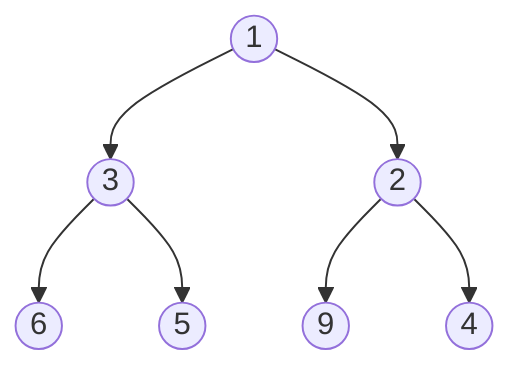
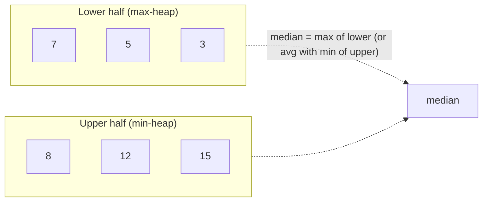

# Heaps: binary heap, heapify, heap sort, median in a stream

A heap is a complete binary tree with a simple ordering rule: **every parent compares correctly to its children**. In a min-heap, every parent is smaller than its children. In a max-heap, every parent is larger. There is no rule between siblings.

The smallest (or largest) element is always at the root, so `peek` is `O(1)`. Insert and remove are `O(log n)`.



A min-heap. The smallest value, `1`, sits at the root. The heap is **complete** — every level full except possibly the last, which fills left-to-right.

## Stored as an array, not as nodes

Because the tree is complete, you can store it in a plain array. For a node at index `i`:

| Relation    | Index         |
| ----------- | ------------- |
| Parent      | `(i - 1) / 2` |
| Left child  | `2 * i + 1`   |
| Right child | `2 * i + 2`   |

```
index : 0 1 2 3 4 5 6
value : 1 3 2 6 5 9 4
```

This array layout is the reason heaps are so fast: no pointer chasing, perfect cache behavior.

## Operations

```java
class MinHeap {
    private final int[] heap;
    private int size = 0;
    public MinHeap(int capacity) { heap = new int[capacity]; }

    public void push(int val) {
        heap[size++] = val;
        siftUp(size - 1);
    }

    public int pop() {
        int top = heap[0];
        heap[0] = heap[--size];
        siftDown(0);
        return top;
    }

    private void siftUp(int i) {
        while (i > 0) {
            int parent = (i - 1) / 2;
            if (heap[parent] <= heap[i]) break;
            swap(i, parent);
            i = parent;
        }
    }

    private void siftDown(int i) {
        while (true) {
            int left = 2 * i + 1, right = 2 * i + 2, smallest = i;
            if (left < size && heap[left] < heap[smallest]) smallest = left;
            if (right < size && heap[right] < heap[smallest]) smallest = right;
            if (smallest == i) break;
            swap(i, smallest);
            i = smallest;
        }
    }

    private void swap(int a, int b) { int t = heap[a]; heap[a] = heap[b]; heap[b] = t; }
}
```

`siftUp` after push: walk up swapping with the parent if order is wrong. `siftDown` after pop: walk down swapping with the smaller child if order is wrong. Both visit at most one node per level, so they are `O(log n)`.

## Heapify — build a heap from an array in `O(n)`

Pushing `n` elements one at a time costs `O(n log n)`. A smarter approach: copy the array, then sift down from the **last non-leaf node** backwards.

```java
void heapify(int[] arr) {
    for (int i = arr.length / 2 - 1; i >= 0; i--) {
        siftDown(arr, i, arr.length);
    }
}
```

Why is this `O(n)` and not `O(n log n)`? Most nodes are near the bottom and have very short sift paths. The math: `sum from h=0 to log n of (n / 2^(h+1)) * h` converges to `O(n)`. This is the difference between **building** a heap and **inserting** elements one by one.

## Heap sort

```java
void heapSort(int[] arr) {
    heapify(arr);  // O(n) — now max-heap
    for (int end = arr.length - 1; end > 0; end--) {
        swap(arr, 0, end);            // root (max) goes to the end
        siftDown(arr, 0, end);        // restore heap on shortened range
    }
}
```

`O(n log n)` time, `O(1)` extra space, in-place. **Not stable** (equal keys can swap order). Real-world sorts like Tim Sort outperform it on partially sorted data, but heap sort wins as a worst-case-guaranteed `O(n log n)` baseline.

## Median in a stream — two-heap pattern

Numbers arrive one at a time. Report the running median in `O(log n)` per insert and `O(1)` per query.

The trick: split numbers into two heaps.



```java
class MedianFinder {
    private final PriorityQueue<Integer> lower = new PriorityQueue<>(Comparator.reverseOrder());
    private final PriorityQueue<Integer> upper = new PriorityQueue<>();

    public void addNum(int num) {
        if (lower.isEmpty() || num <= lower.peek()) lower.offer(num);
        else upper.offer(num);
        // Rebalance: lower may exceed upper by at most 1
        if (lower.size() > upper.size() + 1) upper.offer(lower.poll());
        else if (upper.size() > lower.size()) lower.offer(upper.poll());
    }

    public double findMedian() {
        if (lower.size() > upper.size()) return lower.peek();
        return (lower.peek() + upper.peek()) / 2.0;
    }
}
```

The invariant: `lower` always has the smaller half, `upper` the larger half, and their sizes differ by at most one. The median is either the root of the larger heap or the average of both roots.

## Other heap-flavored problems

- **Top-k frequent elements**: bucket by frequency, then a min-heap of size `k`.
- **Merge k sorted lists**: a min-heap of `(value, listIndex)` pairs.
- **Schedule tasks with cooldown**: a max-heap by remaining count plus a queue of cooling tasks.
- **Sliding window median**: two heaps with lazy deletion (mark elements outside the window, drop when they bubble to the top).

## Common mistakes

- **Forgetting that Java's `PriorityQueue` is a min-heap by default**. Pass `Comparator.reverseOrder()` for a max-heap.
- **Mutating an object already inside the heap**. Heap order silently breaks. Remove and re-insert instead, or use lazy deletion.
- **Confusing "find kth" with "find top k"**. Sometimes the answer is one element, sometimes the set of `k`. Both use a heap of size `k`, but the return shape differs.
- **Using `O(n log n)` "build by repeated insert" when `O(n) heapify` exists**. Tiny in interviews; matters at scale.

## Interview answers

_Q: Why is `heapify` `O(n)` rather than `O(n log n)`?_
A: Sift-down work depends on a node's depth. Half the nodes are leaves (zero work), a quarter are one level up (constant work), and so on. The sum forms a geometric series that converges to `O(n)`, even though the worst case for one node is `O(log n)`.

_Q: How do you build a max-heap of `(value, index)` pairs in Java?_
A: `new PriorityQueue<int[]>((a, b) -> b[0] - a[0])`. Beware of integer overflow on subtraction for large values — use `Integer.compare(b[0], a[0])` instead.

_Q: When would you choose a heap over a balanced BST?_
A: When you only need extreme element access (min or max) plus insert. A heap gives `O(1)` peek and `O(log n)` insert/extract, with much better cache behavior than a tree. A BST adds `O(log n)` arbitrary search, ordered iteration, and predecessor/successor — capabilities a heap does not have.

_Q: Walk me through median in a stream after inserting 1, 2, 3, 4._
A: Insert 1: `lower=[1]`, `upper=[]`, median=1. Insert 2: 2>1 → `upper=[2]`, balance check passes, median=`(1+2)/2 = 1.5`. Insert 3: 3>1 → `upper=[2,3]`, upper exceeds lower → move 2 to lower, `lower=[2,1]`, `upper=[3]`, median=2. Insert 4: 4>2 → `upper=[3,4]`, balance fine, median=`(2+3)/2 = 2.5`.

_Q: How does Dijkstra's algorithm handle a `decrease-key` operation when the standard library's heap does not?_
A: Two options. (1) Lazy deletion — push the new shorter distance, ignore stale entries when they pop. Simpler but uses more memory. (2) Indexed priority queue — a heap that exposes a position map so you can decrease a key in `O(log n)`. Standard libraries rarely give you this; you implement it or pull a library.
