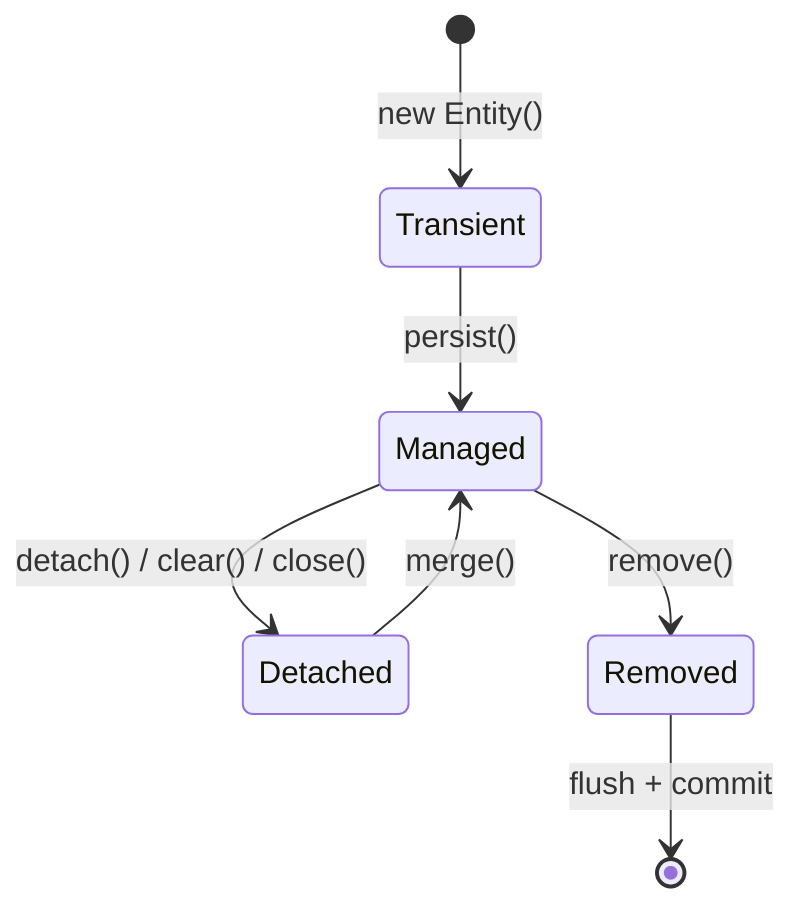
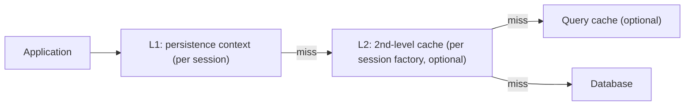

# Data & Transactions: JPA, JPQL, isolation, propagation, N+1 problem

JPA (Jakarta Persistence API) maps Java objects to relational tables. **Hibernate** is the most-used implementation. The framework promises that you write Java and it generates SQL — but the abstraction leaks, and senior engineers spend a lot of time **looking at the actual SQL** to debug performance.

## Entity lifecycle states



| State     | Meaning                                               |
| --------- | ----------------------------------------------------- |
| Transient | New object, not yet known to the persistence context  |
| Managed   | In persistence context; changes are auto-flushed      |
| Detached  | Was managed; persistence context is closed or cleared |
| Removed   | Marked for deletion on next flush                     |

The persistence context (the `EntityManager`) is essentially a write-behind cache + dirty-checking engine. Mutate a managed entity → on commit (or flush), Hibernate compares to the loaded snapshot and issues `UPDATE` for changed columns only.

## JPQL vs native SQL

```java
// JPQL — queries entities, not tables
List<Order> recent = em.createQuery(
    "SELECT o FROM Order o WHERE o.status = :status", Order.class)
    .setParameter("status", OrderStatus.NEW)
    .getResultList();

// Native SQL — queries tables, raw SQL
List<Object[]> stats = em.createNativeQuery(
    "SELECT date_trunc('day', created_at), COUNT(*) " +
    "FROM orders GROUP BY 1")
    .getResultList();
```

| Choice                 | When                                                |
| ---------------------- | --------------------------------------------------- |
| JPQL                   | Domain-level queries, portable across DBs           |
| Criteria API           | Dynamic queries built at runtime (search filters)   |
| Native SQL             | Database-specific features (window functions, CTEs) |
| `@Query` (Spring Data) | Declarative repository methods                      |

## Fetching strategies — the N+1 problem

This is the single most important JPA concept to master.

```java
@Entity
class Order {
    @Id Long id;
    @ManyToOne(fetch = FetchType.LAZY)
    Customer customer;
    @OneToMany(mappedBy = "order", fetch = FetchType.LAZY)
    List<LineItem> items;
}

// Naive controller code
List<Order> orders = orderRepo.findAll();         // 1 query
for (Order o : orders) {
    log.info("{} {}", o.getCustomer().getName(),  // N queries (one per order)
                       o.getItems().size());      // N more queries
}
```

For 100 orders, that is **1 + 100 + 100 = 201 queries**. The classic N+1 disaster — pages that load in milliseconds against test data and time out in production.

**Fixes**:

```java
// 1. Fetch join — single query
@Query("SELECT o FROM Order o JOIN FETCH o.customer WHERE o.id IN :ids")
List<Order> findWithCustomer(@Param("ids") List<Long> ids);

// 2. Entity graph — declarative
@EntityGraph(attributePaths = {"customer", "items"})
@Query("SELECT o FROM Order o WHERE o.status = :status")
List<Order> findActive(@Param("status") OrderStatus status);

// 3. @BatchSize on the association — automatic IN-clause batching
@OneToMany(mappedBy = "order")
@BatchSize(size = 50)
List<LineItem> items;

// 4. Project to a DTO — bypass entity graph entirely
record OrderSummary(Long id, String customerName, int itemCount) {}

@Query("""
    SELECT new com.example.OrderSummary(o.id, o.customer.name, SIZE(o.items))
    FROM Order o WHERE o.status = :status
""")
List<OrderSummary> summary(@Param("status") OrderStatus status);
```

**Always log the actual SQL** during development. Hibernate's `show-sql=true` plus `format-sql=true` plus `use-sql-comments=true` reveals what is actually being executed.

## Transactions

A transaction is a unit of work that either fully succeeds or fully fails. JPA + Spring make it almost invisible — but knowing the dials matters.

### Isolation levels

| Level            | Prevents             | Allows                         |
| ---------------- | -------------------- | ------------------------------ |
| READ UNCOMMITTED | (nothing)            | Dirty reads                    |
| READ COMMITTED   | Dirty reads          | Non-repeatable reads, phantoms |
| REPEATABLE READ  | Non-repeatable reads | Phantom reads                  |
| SERIALIZABLE     | All anomalies        | Lowest concurrency             |

- **Dirty read**: read uncommitted data that another transaction may roll back.
- **Non-repeatable read**: read same row twice, get different values (another tx committed an update in between).
- **Phantom read**: same range query returns different row sets (another tx inserted matching rows).

PostgreSQL defaults to READ COMMITTED. MySQL InnoDB defaults to REPEATABLE READ.

### Propagation behavior

What happens when a `@Transactional` method calls another `@Transactional` method?

| Propagation          | Behaviour                                            |
| -------------------- | ---------------------------------------------------- |
| `REQUIRED` (default) | Join existing transaction or create one              |
| `REQUIRES_NEW`       | Suspend current transaction, start a fresh one       |
| `SUPPORTS`           | Use existing transaction if present, otherwise none  |
| `NOT_SUPPORTED`      | Suspend current transaction, run without one         |
| `MANDATORY`          | Must be in an existing transaction or throw          |
| `NEVER`              | Must not be in a transaction or throw                |
| `NESTED`             | Save-point inside existing transaction (not all DBs) |

```java
@Transactional
public void placeOrder(Order o) {
    inventory.reserve(o);
    try {
        audit.log(o);                 // call into another bean
    } catch (Exception ignored) { }
    payment.charge(o);
}

// In AuditService — runs in its own tx so failures here don't roll back the order
@Transactional(propagation = REQUIRES_NEW)
public void log(Order o) { ... }
```

### Rollback rules

By default, Spring rolls back on **unchecked** exceptions (`RuntimeException`, `Error`) and **commits** on checked exceptions. Customise:

```java
@Transactional(rollbackFor = IOException.class)
public void process() throws IOException { ... }
```

## Caching layers

Hibernate has three levels of caching:



- **L1 (persistence context)** — automatic, per-session, dedupes by primary key within one transaction.
- **L2 (second-level cache)** — shared across sessions, opt-in per entity. Good for read-mostly reference data. Stale on writes from outside JPA — clear or evict.
- **Query cache** — caches result sets of named queries. Tricky to invalidate; use with caution.

For non-trivial read-mostly data, an external cache (Redis, Caffeine + cache-aside pattern) is usually clearer than the L2 cache.

## Common pitfalls

- **N+1 queries**. The most common JPA bug. Always profile generated SQL during development.
- **`OneToMany` with `EAGER` fetch**. Loads the whole collection on every entity load — explosion in joins. Default to `LAZY` and use fetch joins on demand.
- **Modifying a detached entity**. Changes are not auto-persisted. `merge` returns a managed copy; the original detached entity stays detached.
- **`@Transactional` on a `private` method**. Spring's proxy cannot intercept private calls. The transaction silently does nothing.
- **Self-invocation of `@Transactional`**. Calling `this.foo()` bypasses the proxy. See Core Spring topic.
- **Putting business logic in equals/hashCode**. Hibernate calls `equals` and `hashCode` heavily during cascades; make them based on a stable business key, not on the database id (which is null for transient entities).
- **`save()` on every change in a loop**. Hibernate batches automatically when configured. Use `saveAll` or set `hibernate.jdbc.batch_size` and flush periodically.

## Interview answers

_Q: How would you debug a slow endpoint that hits a JPA repository?_
A: Enable SQL logging first. Look for: (1) N+1 — many similar `SELECT` for child entities; (2) `SELECT *` when you only need a few columns — switch to a DTO projection; (3) missing index — `EXPLAIN ANALYZE` against the database; (4) huge fetched result sets — paginate with `Pageable`. Optimise where the SQL is slow, not where the Java is slow.

_Q: When does `@Transactional` not actually start a transaction?_
A: When the method is private, when called via self-invocation (bypassing the proxy), when `propagation = NEVER` and there is no current transaction, or when the bean is not a Spring-managed component. In all these cases the annotation is silently ignored.

_Q: What is optimistic locking and when do you use it?_
A: Add a `@Version` field to the entity. On update, Hibernate adds `WHERE version = :oldVersion` and increments `version`. If the row was modified by another transaction in the meantime, the update affects 0 rows and Hibernate throws `OptimisticLockException`. Use it for any concurrent edit scenario where blocking pessimistic locks would harm throughput.

_Q: When would you pick pessimistic locking over optimistic?_
A: When conflicts are frequent (many concurrent writers on the same row) and retry cost is high. Pessimistic locking (`SELECT ... FOR UPDATE`) prevents the conflict at the cost of blocking. Use sparingly — easy to deadlock.

_Q: How does the persistence context know an entity changed?_
A: When an entity is loaded, Hibernate stores a snapshot of its state. On flush (commit, query that needs current state, or explicit), it compares the snapshot to the live entity field by field. Changed fields are sent in an `UPDATE`. This is **dirty checking** and is why entities should not be modified without intent.

_Q: Why is `OpenSessionInView` controversial?_
A: It keeps the persistence context open through the controller and view rendering, so lazy loads work. The cost: hidden N+1 queries fire while rendering, and the database connection is held longer than needed. Production systems disable it and force fetch decisions in the service layer.

_Q: How does `JOIN FETCH` differ from a regular `JOIN` in JPQL?_
A: A regular JPQL `JOIN` is for filtering — the joined entities are not initialised, so accessing them later still triggers lazy loads. `JOIN FETCH` initialises the association in the same query, populating the field. Without `FETCH`, you do not solve N+1.
