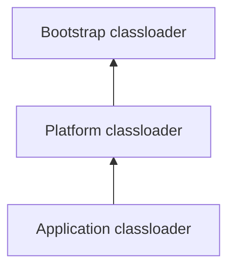
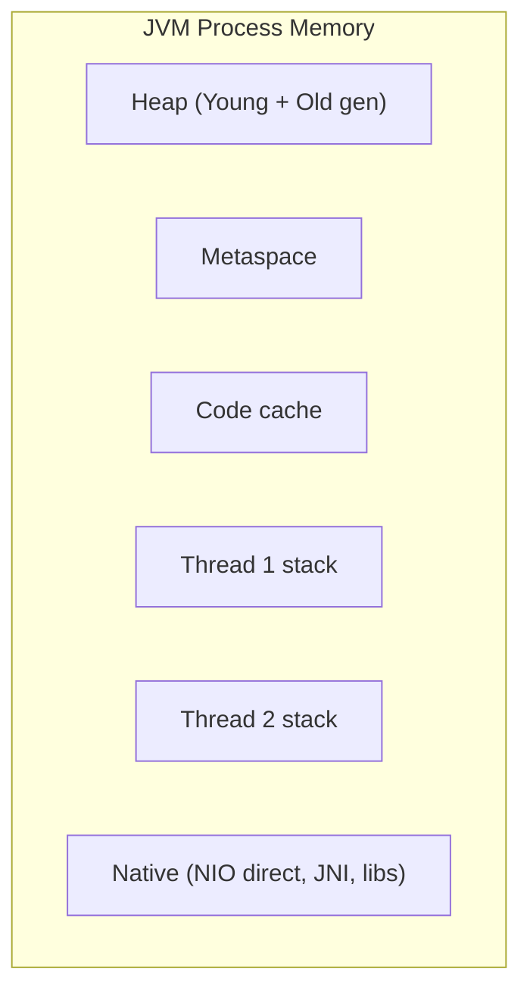
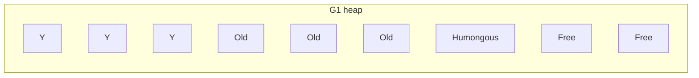

# JVM: class loaders, memory, JIT, GC algorithms

The JVM is what runs your Java code. Senior interviews test how it works under the hood — not the syntax of `for` loops, but **what happens when memory is tight, when classes load, when the JIT kicks in, when GC pauses your service**. Knowing these answers is what separates "Java developer" from "Java engineer who can debug production."

## How the JVM runs your code

The JVM starts as an interpreter. Methods get **profiled** as they run. Hot methods (called many times or with hot loops) are compiled to native code by the JIT and replace the interpreted version. This is why a Java service often gets faster after warm-up.

## Class loaders

A class loader finds bytecode for a class name and turns it into a runtime `Class` object.

| Loader      | Loads                                 |
| ----------- | ------------------------------------- |
| Bootstrap   | `java.*` core classes (no parent)     |
| Platform    | `javax.*`, JDK extensions             |
| Application | Your app's classpath                  |
| Custom      | Your own (frameworks, plugin systems) |

Class loaders use **delegation**: ask the parent first, only load yourself if the parent cannot find the class. This prevents two different `String` classes existing at once.

**Custom class loaders** power hot reload (Spring DevTools), plugin systems (OSGi, IntelliJ plugins), and isolation (Tomcat gives each web app its own classloader so two apps' versions of a library do not collide).

## Memory areas

Every running JVM has these regions. Knowing them tells you which kind of `OutOfMemoryError` you are looking at.

| Area               | Holds                           | Lifetime            | OOM looks like              |
| ------------------ | ------------------------------- | ------------------- | --------------------------- |
| Stack (per thread) | Method frames, locals, refs     | Lives with the call | `StackOverflowError`        |
| Heap               | All objects                     | GC-managed          | `OOM: Java heap space`      |
| Metaspace          | Class metadata, method bytecode | Until class unload  | `OOM: Metaspace`            |
| Code cache         | JIT-compiled native code        | JIT-managed         | "code cache full" warning   |
| Native memory      | Direct buffers, JNI allocations | Manual / GC-tracked | `OOM: Direct buffer memory` |

**Metaspace OOM** almost always means a **classloader leak** — frameworks like Hibernate proxies or hot-redeploy in app servers create new classes that never unload because something still holds a reference.

**Heap OOM** is usually a memory leak (unbounded cache, listener registry, `ThreadLocal` not cleared) or under-sizing.

## Garbage collection

GC is the JVM's automatic memory manager. The fundamental trade-off: **throughput vs latency**. Spend more CPU on GC bookkeeping for shorter pauses, or fewer pauses for higher throughput.

| Collector        | Goal                    | When to choose                    | Pause times     |
| ---------------- | ----------------------- | --------------------------------- | --------------- |
| Serial           | Simple, single-threaded | Tiny services, embedded           | Long            |
| Parallel         | Throughput              | Batch jobs, no latency SLO        | Long            |
| G1 (default)     | Predictable pauses      | Most modern services              | ~50-200ms       |
| ZGC / Shenandoah | Sub-millisecond pauses  | Latency-sensitive APIs, big heaps | <10ms           |
| Epsilon          | Do nothing              | Benchmarks, very short jobs       | None (then OOM) |

### How G1 works (the modern default)

The heap is divided into many small **regions** (typically ~2 MB each). Each region is "young", "old", or "humongous." G1 collects the regions with the most garbage first — hence the name "Garbage First."

**Generational hypothesis**: most objects die young. G1 (and most collectors) keep new objects in the young generation, collect it frequently with cheap copying GC, and promote survivors to the old generation. Old generation is collected less often but with more work.

**Tuning intuition**:

- Long G1 pauses → increase heap or reduce live set; check humongous allocations (>50% of region size).
- Frequent young-gen GC → enlarge young gen.
- High allocation rate → look for short-lived garbage in hot loops.
- Always enable GC logging first: `-Xlog:gc*:file=gc.log`. Never change collectors without baseline numbers.

### ZGC and Shenandoah

Both are concurrent collectors that do almost all GC work **while the application runs**. Pauses are typically <10ms regardless of heap size — ZGC handles 16 TB heaps with millisecond pauses. The trade-off: more CPU overhead and slightly worse throughput than G1.

Use them when **tail latency** matters: real-time bidding, trading systems, low-latency APIs. Default to G1 otherwise.

## JIT compilation

The JVM identifies hot methods using invocation and back-edge counters. Once a threshold is crossed, the method is compiled.

**Tiered compilation**:

- **Tier 1-3 (C1)** — quick compilation, less optimisation. Used early.
- **Tier 4 (C2)** — slow compilation, maximum optimisation. Used for very hot code.

C2 does aggressive optimisations:

- **Inlining** — paste the called method's body into the caller, eliminating call overhead.
- **Escape analysis** — if an object never leaves a method, allocate it on the stack or scalarise it (replace with primitive locals). No GC pressure.
- **Loop unrolling and vectorisation** — turn a loop into SIMD instructions where the CPU supports them.
- **Branch prediction hints** — based on profiled execution.

**Why your benchmark numbers lie**: the first iteration runs interpreted, the next iterations run C1, then C2 takes over. Always **warm up** before measuring.

## The Java Memory Model (JMM)

The JMM defines what a thread is allowed to see when other threads write. Without it, the compiler and CPU could reorder writes in surprising ways.

Key happens-before relations:

- Each statement happens-before the next in program order.
- Unlock happens-before the next lock on the same monitor.
- `volatile` write happens-before every subsequent `volatile` read of the same variable.
- Thread start happens-before any action in the started thread.
- Final field writes in a constructor happen-before any read of that final reference.

Without happens-before, **a write in one thread is not guaranteed to be visible to another thread**. This is why naked shared mutable state breaks under concurrency.

## Common mistakes

- **Adding more heap when GC is the bottleneck**. Bigger heap means longer GC pauses. The fix is reducing allocation rate or live set.
- **Tuning GC without GC logs**. You are guessing. Always profile first.
- **Confusing `Metaspace` OOM with heap OOM**. Different fix. Metaspace usually means classloader leak.
- **Pinning classes via `ThreadLocal`** in a servlet container. Web app gets undeployed but threads in the pool still hold references → classloader leak → metaspace fills up.
- **Using `System.gc()` in production**. Forces a full GC. Almost always wrong. Trust the GC unless profiling proves otherwise.

## Interview answers

_Q: What happens between `javac` finishing and your method actually running native code?_
A: `javac` produces bytecode. The class loader finds it, verifies it, and turns it into a `Class`. The interpreter runs it while profiling. Once the method is hot, C1 compiles it to fast native code, then C2 may recompile with deeper optimisations. Subsequent calls jump to native code directly.

_Q: How does generational GC make collection cheap?_
A: Most objects die young. The young generation is small and copying-collected: live objects are copied to a new region, garbage is left behind, the whole region is reused. Cost is proportional to live data, not total data. Old generation is collected less frequently with a more expensive algorithm.

_Q: Why does the same Java service get faster after running for a few minutes?_
A: JIT warm-up. Methods start interpreted; once they cross profiling thresholds they are compiled (C1, then C2). Cold calls cost ~10-100x more than fully optimised calls. JVM warm-up is why HFT firms and FAAS platforms either pre-warm or use AOT compilation.

_Q: When would you choose ZGC over G1?_
A: When pause time SLO is below ~50ms or heap is > 32 GB. ZGC pauses stay sub-10ms regardless of heap size. The trade-off is throughput — typically 10-15% lower than G1. For batch jobs, G1 wins on raw throughput.

_Q: How would you debug a `Metaspace` OOM?_
A: Run with `-Xlog:class+load=info -Xlog:class+unload=info`. Look for classes loaded but never unloaded. Common causes: hot-redeploy without classloader cleanup, dynamic proxies (Hibernate, Spring), JSP recompilation. Heap dump and look for many `Class` objects with the same name from different classloaders.

_Q: What does `escape analysis` do for performance?_
A: It detects that an object never escapes a method (no field assignment, no return, no thread visibility). The JVM then allocates it on the stack (no heap pressure) or scalarises it into local CPU registers. This is why short-lived wrapper objects in hot code can be effectively free.

_Q: How does the Java memory model differ from sequential consistency?_
A: Sequential consistency would guarantee that all threads see operations in the same global order. The JMM weakens this to allow CPU and compiler reorderings. It defines **happens-before** as the safety net: synchronising via `volatile`, locks, or `final` provides ordering guarantees; without them, no ordering between threads is guaranteed.
