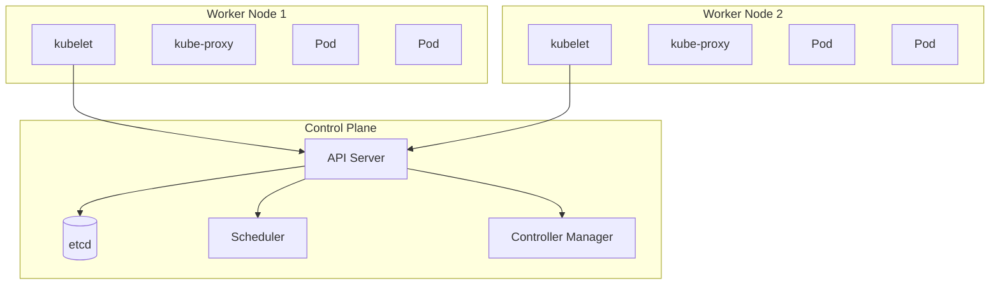
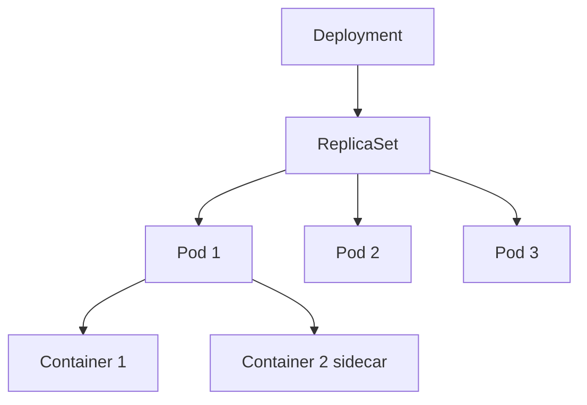
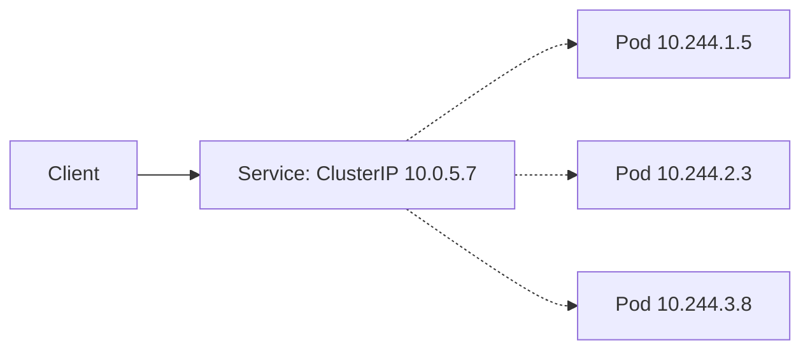

# Kubernetes: pods, ReplicaSets, deployments, services, ConfigMaps, ingress

Kubernetes (K8s) is a container orchestrator. You give it a desired state — "I want 5 replicas of this service" — and it makes the cluster match. Senior interviews probe whether you understand the building blocks and the operational realities (rolling updates, networking, persistent storage, autoscaling).

## High-level architecture



Control plane:

- **API Server** — the single front door; all reads and writes go here.
- **etcd** — distributed key-value store; cluster state.
- **Scheduler** — places pods on nodes based on resource requests, affinities, taints.
- **Controller Manager** — runs reconciliation loops (Deployment, ReplicaSet, Node, etc.).

Worker nodes:

- **kubelet** — agent that talks to API Server, runs pods locally.
- **kube-proxy** — handles service-level networking (iptables / IPVS).
- **CNI** — actual pod networking (Calico, Cilium, Flannel).

## The object model



| Resource                  | Purpose                                                                                      |
| ------------------------- | -------------------------------------------------------------------------------------------- |
| **Pod**                   | Smallest deployable unit; one or more tightly coupled containers sharing network and volumes |
| **ReplicaSet**            | Maintains N copies of a pod; replaces failed ones                                            |
| **Deployment**            | Manages ReplicaSets for rolling updates and rollbacks                                        |
| **StatefulSet**           | Like Deployment but with stable IDs and persistent storage                                   |
| **DaemonSet**             | One pod per node (logging agent, node exporter)                                              |
| **Job / CronJob**         | Run-to-completion or scheduled tasks                                                         |
| **Service**               | Stable network endpoint for a set of pods                                                    |
| **Ingress**               | HTTP routing into the cluster                                                                |
| **ConfigMap**             | Non-secret config                                                                            |
| **Secret**                | Sensitive config                                                                             |
| **PersistentVolumeClaim** | Storage request; bound to a PV                                                               |

## Pod — the unit of scheduling

```yaml
apiVersion: v1
kind: Pod
metadata:
  name: app
spec:
  containers:
    - name: app
      image: my-app:1.2.3
      ports: [{ containerPort: 8080 }]
      resources:
        requests: { cpu: '200m', memory: '256Mi' }
        limits: { cpu: '1', memory: '512Mi' }
      readinessProbe:
        httpGet: { path: /ready, port: 8080 }
        periodSeconds: 5
      livenessProbe:
        httpGet: { path: /health, port: 8080 }
        periodSeconds: 30
```

Pods rarely deployed directly — use a Deployment. A pod failure is just gone; the Deployment creates a replacement.

**Resource requests vs limits**:

- **Requests** — what the scheduler reserves. Used to place pods on nodes.
- **Limits** — hard ceiling. CPU above limit is throttled; memory above limit kills the pod (OOMKilled).

**Probes**:

- **Readiness** — is this pod ready to serve? Failing pulls it out of service rotation.
- **Liveness** — is this pod alive? Failing restarts the pod.
- **Startup** — long-startup app. Disables liveness until the app is up.

## Deployment — the everyday workload

```yaml
apiVersion: apps/v1
kind: Deployment
metadata:
  name: app
spec:
  replicas: 3
  strategy:
    type: RollingUpdate
    rollingUpdate:
      maxSurge: 1 # at most 1 extra pod during rollout
      maxUnavailable: 0 # never let count drop below replicas
  selector:
    matchLabels: { app: my-app }
  template:
    metadata:
      labels: { app: my-app }
    spec:
      containers: [...]
```

**Rolling update**: bring up new pods, kill old ones gradually. Zero downtime if `maxUnavailable=0`.

**Rollback**: `kubectl rollout undo deployment/app` reverts to the previous ReplicaSet.

## Service — stable networking

Pod IPs change every restart. Services give a stable virtual IP that routes to current pods.

```yaml
apiVersion: v1
kind: Service
metadata:
  name: app
spec:
  selector: { app: my-app } # picks pods with this label
  ports:
    - port: 80
      targetPort: 8080
  type: ClusterIP
```

| Type                         | Visibility                                         |
| ---------------------------- | -------------------------------------------------- |
| ClusterIP (default)          | Cluster-internal only                              |
| NodePort                     | Exposed on every node at a fixed port              |
| LoadBalancer                 | Cloud LB provisioned (AWS ELB, GCP LB)             |
| ExternalName                 | DNS alias to external host                         |
| Headless (`clusterIP: None`) | DNS returns pod IPs directly; for stateful clients |



kube-proxy programs iptables (or IPVS) on each node to load-balance traffic to ready pods. Round-robin by default.

## Ingress — HTTP routing

A Service exposes a port; an Ingress routes by hostname and path.

```yaml
apiVersion: networking.k8s.io/v1
kind: Ingress
metadata:
  name: app
  annotations:
    cert-manager.io/cluster-issuer: letsencrypt
spec:
  tls:
    - hosts: [api.example.com]
      secretName: api-tls
  rules:
    - host: api.example.com
      http:
        paths:
          - path: /
            pathType: Prefix
            backend:
              service: { name: app, port: { number: 80 } }
```

Ingress requires an Ingress Controller (Nginx, Traefik, AWS ALB Controller). Without one, the Ingress resource does nothing.

## ConfigMap and Secret

```yaml
apiVersion: v1
kind: ConfigMap
metadata: { name: app-config }
data:
  LOG_LEVEL: 'info'
  FEATURE_X: 'true'

---
apiVersion: v1
kind: Secret
metadata: { name: app-secrets }
type: Opaque
stringData:
  DB_PASSWORD: 'supersecret'
```

Mount into the pod as env vars or files:

```yaml
spec:
  containers:
    - name: app
      envFrom:
        - configMapRef: { name: app-config }
        - secretRef: { name: app-secrets }
```

**Secrets in K8s are base64-encoded, not encrypted by default.** For real secret management, integrate Vault, AWS Secrets Manager, or use Sealed Secrets / SOPS for git-stored secrets.

## Persistent storage

```yaml
apiVersion: v1
kind: PersistentVolumeClaim
metadata: { name: pgdata }
spec:
  accessModes: [ReadWriteOnce]
  resources: { requests: { storage: 50Gi } }
  storageClassName: fast-ssd
```

The **StorageClass** maps to a cloud disk type (gp3 on AWS, pd-ssd on GCP). The PVC binds to a PV provisioned dynamically by the storage class.

For stateful workloads (databases, message brokers), use **StatefulSet** + PVC. Each pod gets a stable name (`db-0`, `db-1`) and its own PVC that survives pod restarts.

## Autoscaling

```yaml
apiVersion: autoscaling/v2
kind: HorizontalPodAutoscaler
metadata: { name: app-hpa }
spec:
  scaleTargetRef:
    apiVersion: apps/v1
    kind: Deployment
    name: app
  minReplicas: 3
  maxReplicas: 30
  metrics:
    - type: Resource
      resource:
        name: cpu
        target: { type: Utilization, averageUtilization: 70 }
```

HPA scales pods up when CPU > 70% averaged across pods. Pair with **Cluster Autoscaler** (or Karpenter) which adds/removes nodes when pods cannot be scheduled.

For custom metrics (request rate, queue depth), use Prometheus Adapter or KEDA.

## Common pitfalls

- **No resource requests** — scheduler does not know how to place pods; node gets overcommitted.
- **No liveness or readiness probes** — service routes to pods that aren't ready, and dead pods aren't restarted.
- **Same probe for liveness and readiness** — readiness should be cheap and frequent; liveness should be more lenient (restarts are expensive).
- **`replicas: 1`** — single pod = downtime on restart. Always 2+.
- **Storing secrets in ConfigMaps** — they're not encrypted; use Secrets (and integrate a real secret manager).
- **Ignoring Pod Disruption Budgets (PDB)** — node maintenance can drain too many pods at once.
- **Hardcoding cluster-internal hostnames** — use Services + DNS (`app.namespace.svc.cluster.local`).
- **Latest tag on production images** — non-reproducible. Pin to a specific tag or digest.
- **Bare pods in production** — they don't restart on failure. Use Deployments / StatefulSets.

## Interview answers

_Q: How does a Deployment differ from a ReplicaSet?_
A: Deployment is the user-facing object; it manages a series of ReplicaSets. When you change the pod template, Deployment creates a new ReplicaSet, scales it up while scaling the old one down — that's the rolling update. ReplicaSet alone doesn't know about updates; it only maintains pod count.

_Q: What happens when a pod is killed?_
A: Depends on its owner. Bare pod: gone. Deployment-owned pod: ReplicaSet creates a replacement, scheduler places it on a node, kubelet pulls the image and starts the container. A few seconds for healthy systems. Service routes traffic only when the new pod's readiness probe passes.

_Q: How would you do a zero-downtime deployment?_
A: Default Deployment rolling update with `maxSurge: 1, maxUnavailable: 0`. New pods come up first; old ones go down only when new are ready. Set proper readiness probes so traffic doesn't route to half-started pods. PreStop hook on old pods to drain connections gracefully.

_Q: How would you handle a stateful service like Postgres?_
A: StatefulSet + PVC. Each replica gets a stable hostname (`pg-0`, `pg-1`). Use a Headless Service so DNS returns individual pod IPs. Run a database operator (Crunchy, Zalando) for failover, backups, and primary election. Manual primary-replica setup is painful; operators automate it.

_Q: When should you not use Kubernetes?_
A: When the team is small and the operational overhead exceeds the benefit. K8s adds complexity — you need to operate the cluster, understand networking, manage RBAC, set up monitoring, handle upgrades. For a small app, ECS, Cloud Run, or simple VMs are often easier. K8s shines at organizational scale.

_Q: How does service discovery work in Kubernetes?_
A: DNS. Every Service gets `<svc>.<namespace>.svc.cluster.local`. Pods can resolve and call each other by name. kube-proxy handles the actual load-balancing via iptables/IPVS. For service mesh (Istio, Linkerd), an Envoy sidecar intercepts and adds traffic shaping, mTLS, retries.

_Q: What is the difference between requests and limits?_
A: Requests is what the scheduler reserves on the node — it's the floor. Limits is the maximum the container can use — exceeding CPU is throttled, exceeding memory is OOMKilled. If you set limits but not requests, the request defaults to the limit. Always set both based on observed usage with headroom.
