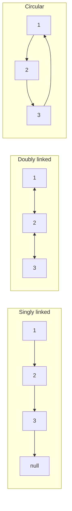
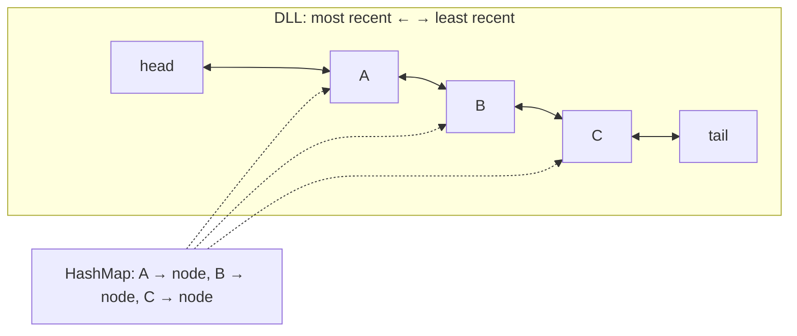

# Linked Lists: singly, doubly, circular, Floyd cycle, LRU cache

A linked list stores elements in nodes connected by pointers. Unlike an array, the elements are **not contiguous in memory** — each node could live anywhere on the heap. The trade-off is that you cannot jump to index `k` in `O(1)`, but you can insert and delete in the middle without shifting anything.

## Variants

| Type     | Each node has              | Best for                                |
| -------- | -------------------------- | --------------------------------------- |
| Singly   | `value`, `next`            | Stacks, simple traversal, lowest memory |
| Doubly   | `value`, `next`, `prev`    | LRU cache, undo stacks, deque           |
| Circular | Last node's `next` → first | Round-robin, ring buffers, Josephus     |



## Core operations

```java
class Node {
    int val;
    Node next;
    Node(int val) { this.val = val; }
}

// Insert at head — O(1)
Node insertHead(Node head, int val) {
    Node node = new Node(val);
    node.next = head;
    return node;
}

// Reverse — O(n), in place, no extra memory
Node reverse(Node head) {
    Node prev = null, curr = head;
    while (curr != null) {
        Node next = curr.next;  // save next BEFORE rewriting curr.next
        curr.next = prev;
        prev = curr;
        curr = next;
    }
    return prev;  // new head
}
```

The reverse loop is the canonical "linked list muscle memory." Master those four lines and most list problems become combinations of them.

## Floyd's cycle detection — tortoise and hare

The problem: a list might have a cycle (some node's `next` loops back to an earlier node). Detect it without using a `Set`.

Two pointers. The slow one moves one step, the fast one moves two. If a cycle exists, they will meet inside it. If no cycle, the fast one falls off the end.

```java
boolean hasCycle(Node head) {
    Node slow = head, fast = head;
    while (fast != null && fast.next != null) {
        slow = slow.next;
        fast = fast.next.next;
        if (slow == fast) return true;
    }
    return false;
}
```

**Why it works**: inside the cycle, the fast pointer gains one step on the slow pointer per iteration. Eventually the gap closes, regardless of the cycle length.

To find the cycle's **start node** after detection: reset one pointer to head, advance both one step at a time. The meeting point is the start of the cycle.

## LRU cache — the canonical doubly-linked-list problem

Build a cache with `O(1)` `get` and `put`, evicting the **least recently used** item when full.

The data structure: a `HashMap<key, Node>` plus a doubly linked list. The map gives `O(1)` lookup. The list maintains usage order — most recent at the head, least recent at the tail.



```java
class LRUCache {
    static class Node {
        int key, val;
        Node prev, next;
    }
    private final int capacity;
    private final Map<Integer, Node> map = new HashMap<>();
    private final Node head = new Node(), tail = new Node();

    LRUCache(int capacity) {
        this.capacity = capacity;
        head.next = tail;
        tail.prev = head;
    }

    public int get(int key) {
        Node node = map.get(key);
        if (node == null) return -1;
        moveToHead(node);
        return node.val;
    }

    public void put(int key, int val) {
        Node node = map.get(key);
        if (node != null) {
            node.val = val;
            moveToHead(node);
            return;
        }
        if (map.size() == capacity) {
            Node lru = tail.prev;
            remove(lru);
            map.remove(lru.key);
        }
        Node fresh = new Node();
        fresh.key = key;
        fresh.val = val;
        map.put(key, fresh);
        addToHead(fresh);
    }

    private void addToHead(Node node) {
        node.prev = head;
        node.next = head.next;
        head.next.prev = node;
        head.next = node;
    }

    private void remove(Node node) {
        node.prev.next = node.next;
        node.next.prev = node.prev;
    }

    private void moveToHead(Node node) {
        remove(node);
        addToHead(node);
    }
}
```

The dummy `head` and `tail` sentinels remove all the null-checks. Real-world caches like Caffeine, Guava, and Linux page cache all use a similar idea (often with frequency tracking on top — TinyLFU, ARC).

## When to use linked lists in real code

Honestly: rarely. Modern arrays are cache-friendly and `ArrayList`/`Vec` beats `LinkedList`/`std::list` for almost every real workload. Reach for linked lists when:

- You need stable references that survive mutation (Linux kernel uses intrusive lists for this).
- You implement a queue with frequent enqueue/dequeue and want guaranteed `O(1)` per operation.
- You build an LRU/LFU cache where order matters.
- The list is a building block of a more complex structure (skip list, B-tree internal node).

## Common mistakes

- **Losing the head pointer when reversing**. Always save `next` before rewriting `curr.next`.
- **Off-by-one in the fast pointer's null check**. `fast.next != null` is required before dereferencing `fast.next.next`. Drop one and you crash on even-length lists.
- **Not handling deletion of the head node**. A dummy/sentinel node before `head` removes the special case entirely.
- **Memory leaks** in C/C++ when you remove a node without freeing it. Java's GC saves you here, but `LinkedList<Node>` still consumes more memory per element than an `ArrayList` (object header + two pointers per node).

## Interview answers

_Q: Why is reversing a linked list so common in interviews?_
A: It tests pointer manipulation and your ability to track three references (`prev`, `curr`, `next`) without losing the list. It also extends to "reverse in groups of k", "reverse between positions m and n", "palindrome check via half-reverse" — a whole family of problems.

_Q: How does Floyd's algorithm find the start of a cycle, not just detect one?_
A: After slow and fast meet, the distance from head to cycle-start equals the distance from the meeting point to cycle-start (when both move forward in the cycle). Reset slow to head, advance both one step at a time, and they meet at the cycle's start. Provable with a small algebra exercise on the relative speeds.

_Q: When is a doubly linked list not worth the extra memory?_
A: Read-mostly workloads, or when you only ever traverse forward. Each node carries an extra pointer (8 bytes on a 64-bit machine), so a million-node list pays an extra 8 MB. Use a singly linked list and a tail pointer if the only "back" operation you need is `addFirst`.

_Q: Why does an LRU cache pair a hash map with a linked list?_
A: The hash map gives `O(1)` lookup by key. The doubly linked list gives `O(1)` order-update — move the touched node to head, evict from tail. Either alone fails: a hash map alone has no order; a linked list alone has `O(n)` lookup.

_Q: How would you make the LRU cache thread-safe?_
A: Wrap `get`/`put` in a single mutex, or — for higher throughput — partition the cache into stripes by hash and lock per stripe (`ConcurrentHashMap`-style). Caffeine uses a more sophisticated approach with a write buffer and read buffers per CPU, applying changes asynchronously.
