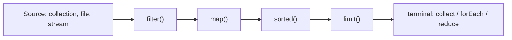

# Modern Java: lambdas, streams, Optional, records, sealed classes, pattern matching

Java has evolved fast since version 8. Modern Java code reads more like Kotlin or Scala — concise, functional, with strong types preventing whole categories of bugs. Senior interviews expect fluency with these features and **judgement** about when to use them.

## Lambdas and method references

A lambda is a short anonymous function. Method references are even shorter: a pointer to an existing method.

```java
Comparator<String> byLength = (a, b) -> a.length() - b.length();
Comparator<String> byLengthRef = Comparator.comparingInt(String::length);

Runnable greet = () -> System.out.println("hi");
Function<Integer, Integer> doubler = n -> n * 2;
BiFunction<Integer, Integer, Integer> add = Integer::sum;
```

Functional interfaces (`Function`, `Predicate`, `Consumer`, `Supplier`, etc.) live in `java.util.function`. The compiler matches the lambda shape to the interface.

## Streams

Streams turn collection processing into a pipeline of transformations. They compose, are easy to read once you know the operations, and parallelise via `parallelStream()`.

```java
Map<Department, List<Employee>> byDept = employees.stream()
    .filter(e -> e.salary() > 50_000)
    .collect(groupingBy(Employee::department));

double avgTenure = employees.stream()
    .collect(averagingDouble(Employee::tenureYears));

List<String> names = employees.stream()
    .sorted(comparingInt(Employee::salary).reversed())
    .limit(10)
    .map(Employee::name)
    .toList();
```



**Two kinds of operations**:

- **Intermediate** (`filter`, `map`, `sorted`, `flatMap`, `peek`) — lazy, return a stream, do nothing until terminated.
- **Terminal** (`collect`, `forEach`, `reduce`, `count`, `findFirst`) — trigger execution. The stream is single-use after.

**Tradeoffs**:

- Streams are great for clear pipelines and aggregations.
- For simple iteration, an enhanced `for` loop is often more readable and easier to debug.
- `parallelStream()` only helps if the workload is CPU-bound and big. For small collections or IO-bound work, parallel streams add overhead.

## Optional

`Optional<T>` represents a value that may or may not be present. It forces the caller to acknowledge absence.

```java
Optional<Order> order = repo.findById(id);
String message = order
    .filter(Order::isActive)
    .map(this::toMessage)
    .orElse("not found");

// Throwing on absence
Order found = repo.findById(id)
    .orElseThrow(() -> new NotFoundException(id));
```

**Where to use `Optional`**:

- ✅ Return types of methods that may not produce a value.
- ❌ Field types — adds boxing overhead and an extra layer of indirection.
- ❌ Method parameters — use overloads or default values instead.
- ❌ Inside collections — `Optional<T>` in a `List` is double indirection. Use `null` filtered out or a sentinel.

## Records — concise immutable data

`record` is a compact way to declare a class whose state is fully described by its fields. The compiler generates the constructor, `equals`, `hashCode`, `toString`, and accessors.

```java
record Order(String id, BigDecimal total, Instant createdAt) {}

// Use
Order o = new Order("abc", new BigDecimal("9.99"), Instant.now());
o.id();        // accessor (no get prefix)
o.equals(other);
o.toString();  // Order[id=abc, total=9.99, createdAt=...]
```

Compact constructor for validation:

```java
record Email(String address) {
    public Email {
        if (!address.contains("@")) throw new IllegalArgumentException();
    }
}
```

Records are **shallowly immutable** — fields are `final`. Mutable fields like `List` are still mutable inside; copy in the compact constructor if you need deep immutability.

## Sealed classes — closed type hierarchies

A sealed type can only be extended by a fixed list of permitted subtypes. The compiler **knows** all the variants and can enforce exhaustiveness.

```java
sealed interface Result<T> permits Ok, Err {}
record Ok<T>(T value) implements Result<T> {}
record Err<T>(String message) implements Result<T> {}
```

Combined with switch pattern matching, this gives you compile-time exhaustiveness — like `enum` for arbitrary types.

## Pattern matching

The `switch` expression handles types and structures, not just primitives.

```java
String describe(Result<Integer> r) {
    return switch (r) {
        case Ok<Integer>(Integer value) -> "ok: " + value;
        case Err<Integer>(String message) -> "err: " + message;
    };
}
```

Without sealed types, you would need a `default` branch. With them, the compiler proves exhaustiveness — if you add a third variant later, this switch fails to compile until you handle it.

Pattern matching also unwraps record components directly into local variables:

```java
double area(Shape s) {
    return switch (s) {
        case Circle(double r)        -> Math.PI * r * r;
        case Rectangle(double w, double h) -> w * h;
        case Triangle(double b, double h)  -> 0.5 * b * h;
    };
}
```

## Text blocks

Multiline strings without escaping every quote.

```java
String json = """
    {
      "id": "abc",
      "total": 9.99
    }
    """;
```

Indentation is normalised based on the closing `"""` position.

## Switch expressions (vs old switch statements)

```java
// Old — fall-through, statement-only
String result;
switch (day) {
    case MON:
    case TUE: result = "early"; break;
    case WED: result = "mid"; break;
    default:  result = "other";
}

// Modern — expression, no fall-through, exhaustive
String result = switch (day) {
    case MON, TUE -> "early";
    case WED      -> "mid";
    default       -> "other";
};
```

The arrow form (`->`) is exhaustive (won't compile if a case is missing on enums or sealed types) and prevents fall-through bugs.

## var — local type inference

```java
var users = repo.findAll();             // List<User>, inferred
var batches = users.stream()
    .collect(groupingBy(User::tier));   // Map<Tier, List<User>>, inferred
```

Use `var` when the type is obvious from the right-hand side. Don't use it where it makes the type unclear (e.g. `var x = compute();` where `compute()` returns `Object`).

## Functional interfaces

| Interface             | Shape          | Use                      |
| --------------------- | -------------- | ------------------------ |
| `Function<T, R>`      | `T -> R`       | Transform a value        |
| `Predicate<T>`        | `T -> boolean` | Filter, conditionals     |
| `Consumer<T>`         | `T -> void`    | Side effects (forEach)   |
| `Supplier<T>`         | `() -> T`      | Lazy creation            |
| `BiFunction<T, U, R>` | `(T, U) -> R`  | Two-arg transform        |
| `UnaryOperator<T>`    | `T -> T`       | Transform same type      |
| `BinaryOperator<T>`   | `(T, T) -> T`  | Combine two of same type |

## Common pitfalls

- **Streams as a hammer**. A `for` loop is often clearer and easier to debug. Don't replace simple iteration with `.forEach()`.
- **Side effects inside `map` or `filter`**. The pipeline is lazy; effects may run zero or many times depending on intermediate operations.
- **Calling `Optional.get()` without `isPresent` check**. Re-creates the same NPE you tried to avoid.
- **Mutable fields in a record**. Records guarantee field finality, not deep immutability. A `record User(String id, List<String> roles)` still has a mutable list.
- **`Optional` in field or parameter types**. Use `@Nullable` and standard `null` instead. `Optional` is for return values.
- **Auto-boxing in stream pipelines**. `IntStream`, `LongStream`, `DoubleStream` avoid boxing; `Stream<Integer>` does not.

## Interview answers

_Q: When does `parallelStream()` help vs hurt?_
A: Helps when the workload is CPU-bound, the data set is large (10K+ elements), and operations are stateless and don't share data. Hurts when the operations are short, the stream is small, the work is IO-bound, or you have a small thread pool already running other work — parallel streams use the common `ForkJoinPool` and can starve other parallel work.

_Q: Why are records immutable by default?_
A: They model **value types**. Identity does not matter; only the values. Mutability would break `equals`, `hashCode`, and the value-type model. Java's immutability is shallow — a record can hold a mutable collection — but the field references themselves are final.

_Q: What is the difference between `==` and `equals` for records?_
A: `==` is reference equality. `equals` for records is auto-generated to compare each component. Two records with the same values return true from `equals` but false from `==` unless they are the same instance.

_Q: How do sealed classes interact with pattern matching?_
A: The compiler knows the closed list of permitted subtypes. A `switch` expression that handles all of them is exhaustive — no `default` needed. Add a new permitted subtype later and every switch breaks at compile time, which is exactly the safety you want.

_Q: When would you pick a record over a regular class?_
A: When the class is a transparent carrier of immutable data — DTOs, parameter bundles, intermediate results in pipelines. If you need mutable state, inheritance from a non-Object class, or hidden internals, use a regular class.

_Q: Why is `Optional` not `Serializable`?_
A: It was designed as a return-type wrapper, not a field type. Making it `Serializable` would encourage misuse. If you really need to send "absent or value" over the wire, encode it explicitly in your DTO or use a nullable field.

_Q: What does `Stream.flatMap` do?_
A: It maps each element to a stream, then flattens those streams into one. Use it when each element produces zero, one, or many results. Example: `users.stream().flatMap(u -> u.permissions().stream())` gives you a single stream of all permissions across all users.
