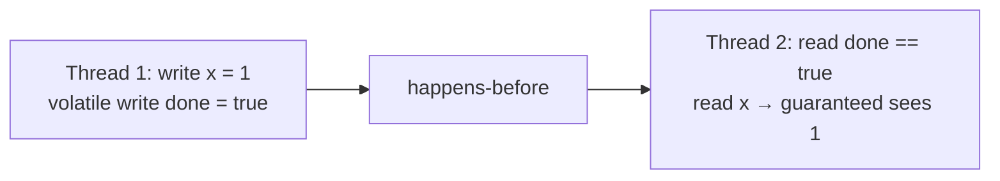
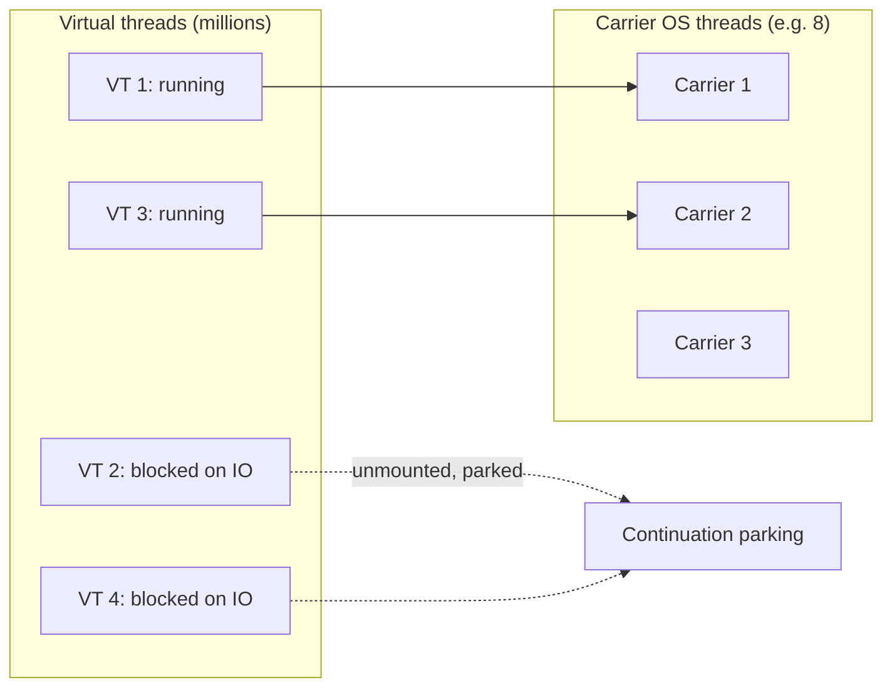

# Multithreading: JMM, locks, synchronizers, ThreadLocal, ForkJoinPool, virtual threads

Multithreading is where most production bugs hide. They show up as race conditions, missed updates, deadlocks, or "it worked on my machine and breaks once a week in prod." Senior interviews probe whether you know **why** the bugs happen and **what guarantees** the JDK gives you to prevent them.

## The Java Memory Model — the foundation

Without synchronisation, **a write in one thread is not guaranteed to be visible to another**. The CPU and JIT can reorder writes, cache values in registers, and skip memory barriers. The JMM tells you which guarantees you do get.

The key concept is **happens-before**. If action A happens-before action B, then B sees everything A wrote.



Happens-before is established by:

- Program order within a single thread.
- Unlock → next lock on the same monitor.
- `volatile` write → every later `volatile` read of the same variable.
- Thread `start()` → any action in the started thread.
- Final field write in constructor → read of that final reference.

Anything outside happens-before is a race condition. The compiler and CPU are free to do whatever is fastest.

## Visibility and atomicity tools

| Tool                 | Provides                                          | Does not provide                              |
| -------------------- | ------------------------------------------------- | --------------------------------------------- |
| `volatile`           | Visibility, ordering of single read/write         | Atomicity of compound ops (`x++`)             |
| `synchronized`       | Mutual exclusion + visibility                     | Try-lock, fairness, multiple conditions       |
| `ReentrantLock`      | Above + try-lock, interruptible, fair, conditions | Auto-release on exception (use `try/finally`) |
| `AtomicInteger` etc. | Atomic CAS without locks                          | Composite invariants across multiple atomics  |
| `LongAdder`          | High-throughput counter (striped)                 | Exact reads under contention                  |

**`volatile` is not a lock.** `count++` on a volatile is still a race. The increment is read-modify-write. Use `AtomicInteger.incrementAndGet()` or a synchronised block.

## Compare-and-swap (CAS) — the lock-free building block

Modern hardware exposes a CPU instruction that atomically reads a memory location, compares it to an expected value, and writes a new value only if the comparison succeeded. This is `CAS`. Java exposes it via `Atomic*` classes and `VarHandle`.

```java
AtomicInteger counter = new AtomicInteger();

// Increment without a lock — retries on contention
counter.incrementAndGet();

// Manual CAS loop
int current;
int updated;
do {
    current = counter.get();
    updated = current + 1;
} while (!counter.compareAndSet(current, updated));
```

CAS underlies `ConcurrentHashMap`, `AtomicReference`, `Lock-Free` queues, and pretty much everything in `java.util.concurrent`.

## Double-checked locking — the canonical broken-then-fixed example

```java
class Singleton {
    private static volatile Singleton instance;        // volatile is required

    public static Singleton get() {
        Singleton local = instance;
        if (local == null) {
            synchronized (Singleton.class) {
                local = instance;
                if (local == null) {
                    local = new Singleton();
                    instance = local;
                }
            }
        }
        return local;
    }
}
```

Without `volatile`, another thread can observe a partially constructed object. Why: the JIT can reorder `instance = new Singleton()` so the reference is published **before** the constructor finishes. Reader sees a non-null reference and dereferences uninitialised fields.

`volatile` adds memory barriers that prevent that reorder. Modern Java prefers a holder class (initialise on demand via the class loader) over double-checked locking — the JVM guarantees class init is thread-safe and lazy.

## Synchronisers

```java
CountDownLatch start = new CountDownLatch(1);
CountDownLatch done  = new CountDownLatch(workers);

for (int i = 0; i < workers; i++) {
    new Thread(() -> {
        try { start.await(); } catch (InterruptedException e) { Thread.currentThread().interrupt(); return; }
        // do work
        done.countDown();
    }).start();
}
start.countDown();   // release all workers at once
done.await();        // wait for all to finish
```

| Synchronizer     | Purpose                                                    |
| ---------------- | ---------------------------------------------------------- |
| `Semaphore`      | Limit concurrent access to a resource (connection pool)    |
| `CountDownLatch` | Wait for N events, single-use                              |
| `CyclicBarrier`  | Repeating rendezvous of N threads                          |
| `Phaser`         | CyclicBarrier + parties can register/deregister at runtime |
| `Exchanger`      | Two threads swap data at a sync point                      |

## Thread pools

Never `new Thread()` in production. Use a pool.

```java
ExecutorService pool = Executors.newFixedThreadPool(8);
Future<Result> future = pool.submit(() -> compute(input));
Result r = future.get(5, TimeUnit.SECONDS);   // blocking with timeout
```

| Factory                                   | Underlying                                                       |
| ----------------------------------------- | ---------------------------------------------------------------- |
| `newFixedThreadPool(n)`                   | Bounded pool, unbounded queue (DANGER: OOM)                      |
| `newCachedThreadPool()`                   | Unbounded pool of short-lived threads (DANGER: too many threads) |
| `newSingleThreadExecutor()`               | One thread, FIFO queue                                           |
| `newScheduledThreadPool(n)`               | Time-based scheduling                                            |
| `newVirtualThreadPerTaskExecutor()` (21+) | Virtual thread per task                                          |
| `new ThreadPoolExecutor(...)` (manual)    | Pick your own bounds, queue, rejection policy                    |

**Production rule**: build your own with `ThreadPoolExecutor` so you can choose a **bounded queue** and a sensible **rejection policy**. Default factory methods quietly hide unbounded queues that turn `OOM` into a mystery.

## ThreadLocal — per-thread state

```java
private static final ThreadLocal<SimpleDateFormat> FORMATTER =
    ThreadLocal.withInitial(() -> new SimpleDateFormat("yyyy-MM-dd"));

String today() { return FORMATTER.get().format(new Date()); }
```

Each thread sees its own copy. Common uses: thread-unsafe formatters, request context (user id, trace id), database transactions.

**Trap**: in a thread pool, a `ThreadLocal` set during one request survives into the next request unless you call `remove()` in a `finally`. This causes hard-to-debug correctness bugs and metaspace classloader leaks in containers.

## ForkJoinPool — work stealing for parallel computation

```java
class SumTask extends RecursiveTask<Long> {
    int[] arr; int lo, hi;
    SumTask(int[] arr, int lo, int hi) { this.arr = arr; this.lo = lo; this.hi = hi; }
    protected Long compute() {
        if (hi - lo < 1000) {
            long sum = 0;
            for (int i = lo; i < hi; i++) sum += arr[i];
            return sum;
        }
        int mid = (lo + hi) / 2;
        SumTask left = new SumTask(arr, lo, mid);
        left.fork();
        long right = new SumTask(arr, mid, hi).compute();
        return left.join() + right;
    }
}

long total = ForkJoinPool.commonPool().invoke(new SumTask(arr, 0, arr.length));
```

ForkJoinPool keeps **one deque per worker thread**. Idle threads steal from the back of others' deques. This minimises contention and is the engine behind `parallelStream()`, `CompletableFuture.supplyAsync()` (default), and recursive divide-and-conquer.

## Virtual threads (JDK 21+)

Virtual threads are lightweight threads scheduled by the JVM, not the OS. Millions can exist at once. On a blocking call (network IO, `Thread.sleep`, `synchronized` since JDK 24), the virtual thread **unmounts** from its carrier OS thread, freeing it for other work.

```java
try (var executor = Executors.newVirtualThreadPerTaskExecutor()) {
    var futures = orders.stream()
        .map(o -> executor.submit(() -> processOrder(o)))
        .toList();
    for (var f : futures) f.get();
}
```



**Use virtual threads for blocking IO at high concurrency** — REST handlers calling databases and external APIs, message consumers, web crawlers.

**Do not use virtual threads for CPU-bound work** — they do not magically add cores. Keep CPU-bound work on a fixed-size platform-thread pool sized to `Runtime.getRuntime().availableProcessors()`.

## Concurrent collections

| Collection              | Notes                                                                  |
| ----------------------- | ---------------------------------------------------------------------- |
| `ConcurrentHashMap`     | Per-bucket locking via CAS + synchronized; reads usually lock-free     |
| `CopyOnWriteArrayList`  | Reads lock-free; every write copies the whole array (read-mostly only) |
| `ConcurrentLinkedQueue` | Lock-free unbounded queue                                              |
| `LinkedBlockingQueue`   | Bounded blocking FIFO; back-pressure for producer/consumer             |
| `ArrayBlockingQueue`    | Bounded blocking FIFO with array backing                               |
| `SynchronousQueue`      | No capacity — handoff between exactly one producer and one consumer    |
| `ConcurrentSkipListMap` | Sorted, lock-free, scalable alternative to `TreeMap`                   |

## Common pitfalls

- **`synchronized` self-invocation works** (locks are reentrant), **but `@Transactional` does not** because Spring's proxy is bypassed when calling another method on the same instance.
- **`ThreadLocal` in pooled threads leaks** unless you call `remove()` in `finally`.
- **Holding a lock while calling user code** (callbacks, listeners) invites deadlocks. Release before calling out.
- **Catching `InterruptedException` and ignoring it**. At minimum, restore the flag with `Thread.currentThread().interrupt()` so callers can see the interruption.
- **Using `Thread.stop()`**. Deprecated since forever. The thread can be killed mid-update of shared state, leaving objects in inconsistent states.
- **Synchronising on a `String` literal or boxed `Integer`**. The JVM may share these with code you do not control. Use a private `Object` field as the monitor.

## Interview answers

_Q: What is the difference between concurrency and parallelism?_
A: Concurrency is structuring code so multiple tasks make progress, possibly interleaved on one CPU. Parallelism is executing tasks simultaneously on multiple cores. Concurrency is about correctness under interleaving; parallelism is about throughput. You can have concurrent code that runs on one core (no parallelism) or parallel code that has no concurrency (independent batches).

_Q: When would you reach for `synchronized` over `ReentrantLock`?_
A: For simple, short critical sections. `synchronized` is shorter, cannot leak, and the JIT optimises it well. Use `ReentrantLock` when you need try-lock with timeout, interruptible acquisition, fairness, or multiple `Condition` instances.

_Q: How does `ConcurrentHashMap` allow concurrent reads and writes?_
A: It splits writes per-bucket. An empty bucket gets a CAS install. A non-empty bucket is locked at the head node — only one writer per chain. Reads are usually lock-free, walking the chain via volatile reads. Resizes are collaborative: multiple writers help migrate entries to a new table.

_Q: Why is `CopyOnWriteArrayList` only good for read-mostly workloads?_
A: Every write copies the entire backing array. For a 1000-element list with frequent writes you allocate 1000 entries per write and do a 1000-element copy. Excellent for listener lists where reads dominate; terrible for active queues.

_Q: What is the actor model alternative to shared-state concurrency?_
A: Each actor is a sequential agent that processes one message at a time from its mailbox. Actors do not share memory; they communicate by sending messages. No locks needed because no shared state. Akka and Erlang are the canonical implementations. Trade-off: state lives across messages, and ordering between actors needs design.

_Q: How do you size a thread pool for an HTTP service?_
A: For mostly-blocking workloads (waiting on DB, external APIs): `threads = cores * (1 + waitTime / cpuTime)`. A 4-core service with 95% wait time → ~80 threads. Or just use virtual threads. For CPU-bound: `threads = cores`. Always bound the queue and pick a sensible rejection policy.

_Q: What is the ABA problem in CAS?_
A: A thread reads value A, prepares to swap to C. Another thread changes A → B → A. The first thread's CAS succeeds because the value is "still A," but the underlying state changed. Java's `AtomicStampedReference` adds a version counter to avoid this. Most code does not encounter ABA, but lock-free queues and stacks need to handle it explicitly.

_Q: How would you safely shut down a thread pool?_
A: Call `shutdown()` to stop accepting new tasks. Then `awaitTermination(timeout)`. If it times out, call `shutdownNow()` which interrupts running tasks and returns the queued ones. Tasks that swallow `InterruptedException` will not stop — make sure your code propagates it.
