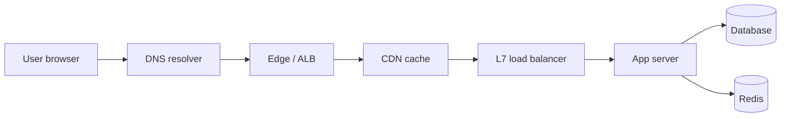
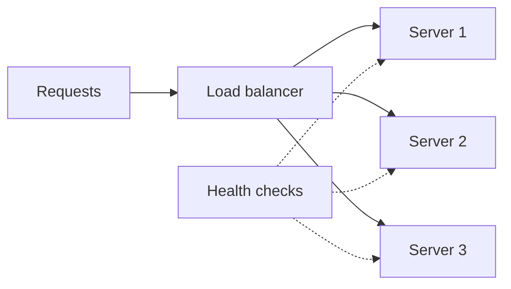
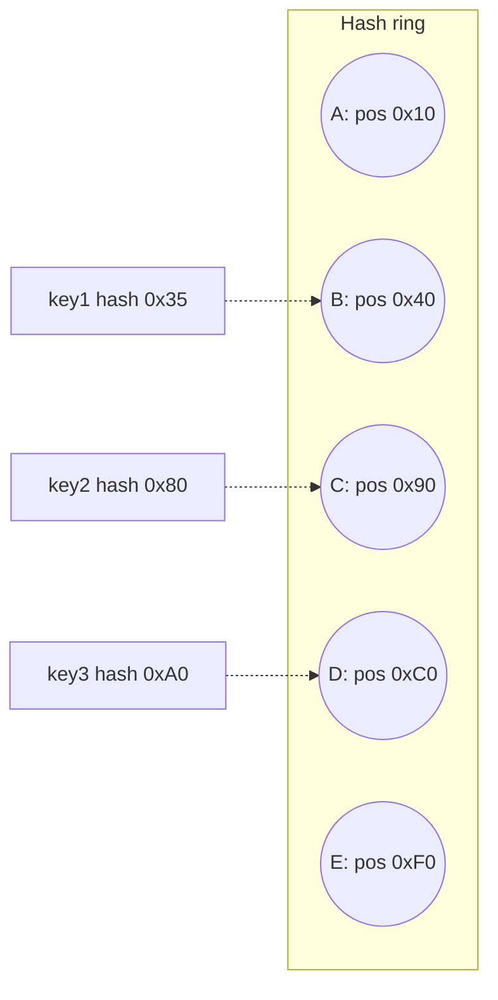

# Networking: DNS, load balancers, round robin, consistent hashing, Nginx

System design questions test whether you can decompose a product, reason about traffic, and pick infrastructure for the requirement rather than the buzzword. The components below are the vocabulary; the walk-throughs (module 4.4) put them together.

## How a request reaches your server



Every box can be a topic on its own. The senior skill is knowing what each one buys you and what it costs.

## DNS — name to IP

DNS maps `api.example.com` to one or more IP addresses. Records propagate through caches at the OS, ISP, and recursive resolver levels.

| Record | Purpose                                    |
| ------ | ------------------------------------------ |
| A      | IPv4 address                               |
| AAAA   | IPv6 address                               |
| CNAME  | Alias to another name                      |
| MX     | Mail server                                |
| TXT    | Free-form (SPF, DKIM, domain verification) |
| SRV    | Service location (port + host)             |

**TTL** controls how long resolvers cache. Low TTL means quick failover but more lookups; high TTL means efficient but slow to fail over.

**Critical insight**: DNS changes are **not instant**. Old IPs may be cached for hours regardless of your TTL — some resolvers ignore short TTLs. **Never plan failover via DNS surgery during an outage**. Use:

- **Anycast IPs** with health checks (one IP, many edges; routing picks the healthiest).
- **Multi-A records** with the load balancer doing health-based filtering.
- **GSLB** (global server load balancing) — DNS plus health checks plus geo-routing.

## Load balancers

A load balancer distributes incoming traffic across multiple servers.



### Layer 4 vs Layer 7

| Concern            | L4 (TCP/UDP)                        | L7 (HTTP, gRPC)                      |
| ------------------ | ----------------------------------- | ------------------------------------ |
| Sees               | TCP connection, source/dest IP+port | HTTP method, host, path, headers     |
| Can route by URL?  | No                                  | Yes                                  |
| Can terminate TLS? | No (or pass-through)                | Yes                                  |
| Can do retries?    | No                                  | Yes (idempotent only)                |
| Overhead           | Lower                               | Higher (parses HTTP)                 |
| Typical use        | Generic TCP traffic                 | Web apps, APIs, microservice routing |

### Distribution strategies

| Strategy             | Behaviour                                | When to use                                  |
| -------------------- | ---------------------------------------- | -------------------------------------------- |
| Round robin          | Even rotation                            | Stateless, equal-capacity backends           |
| Least connections    | Pick the least busy                      | Long-lived connections, varying request cost |
| Weighted             | Capacity-aware (e.g. 2:1 large vs small) | Mixed instance types                         |
| Hash on key          | Same key → same backend                  | Sticky sessions, cache locality, sharding    |
| Power of two choices | Pick the better of two random backends   | Best-of-both balance + scalability           |

## Consistent hashing — the canonical "why" question

The naive "hash mod N" approach (assign key to `hash(key) % N` servers) breaks badly when N changes. Add one server to a 10-server fleet and ~90% of cache keys move. Cache miss storm, latency spike, possible cascade.

**Consistent hashing** lays nodes and keys on a **ring** of hash positions. Each node owns the arc of keys from itself counter-clockwise to the previous node. Adding or removing a node moves only the keys in the affected arc — roughly `1/N` of total keys.



If C disappears, only keys in arc `(B, C]` move — to D. Other keys are untouched.

```java
class ConsistentHashRing<T> {
    private final NavigableMap<Long, T> ring = new TreeMap<>();
    private final int virtualNodes;

    public ConsistentHashRing(int virtualNodes) { this.virtualNodes = virtualNodes; }

    public void addNode(T node) {
        for (int i = 0; i < virtualNodes; i++) {
            long hash = hash(node.toString() + "#" + i);
            ring.put(hash, node);
        }
    }

    public T getNode(String key) {
        if (ring.isEmpty()) return null;
        long hash = hash(key);
        Map.Entry<Long, T> entry = ring.ceilingEntry(hash);
        return entry != null ? entry.getValue() : ring.firstEntry().getValue();
    }
}
```

**Virtual nodes**: each physical node maps to many ring positions. Smooths the load distribution — without virtual nodes, a 5-server fleet gets very uneven shares because random ring positions are uneven.

Used in: Memcached / Cassandra / DynamoDB partitioning, Akamai, distributed caches.

## CDN — caching at the edge

A Content Delivery Network caches static assets at hundreds of edge locations near users. The first hit fetches from origin; subsequent hits within TTL serve from edge.

| Concern              | CDN value                          |
| -------------------- | ---------------------------------- |
| Static asset latency | Sub-50ms anywhere                  |
| Bandwidth cost       | Origin sees a fraction of traffic  |
| Origin protection    | DDoS absorbed at edge              |
| TLS termination      | At the edge, lower latency         |
| Cache invalidation   | Hard — TTL-based or explicit purge |

Cache headers control behavior:

- `Cache-Control: public, max-age=31536000, immutable` — for hashed asset filenames.
- `Cache-Control: private, no-store` — for personalized content.
- `s-maxage` — overrides max-age at shared caches (CDNs) only.
- `Vary: Accept-Encoding` — tells the cache which request headers create distinct cached versions.

## Reverse proxy — Nginx, HAProxy, Envoy

A reverse proxy sits in front of your servers, accepting client connections and forwarding to backends. Adds capabilities the app should not implement:

- TLS termination
- Compression
- Rate limiting
- Request/response header rewriting
- Static file serving
- Layer 7 routing
- Connection pooling to backends
- Caching

```nginx
upstream api {
    server backend-1.internal:8080 weight=2;
    server backend-2.internal:8080;
    server backend-3.internal:8080 backup;
}

server {
    listen 443 ssl http2;
    server_name api.example.com;

    location / {
        proxy_pass http://api;
        proxy_set_header X-Forwarded-For $remote_addr;
        proxy_read_timeout 30s;
    }

    location /static/ {
        root /var/www;
        expires 1y;
    }
}
```

**Envoy** is the modern equivalent — sidecar proxy that powers service meshes (Istio, Linkerd).

## TCP, HTTP, and HTTP/2/3

The web rides on TCP. Connection setup costs a round trip. TLS adds another. **Latency, not bandwidth, is the bottleneck** for most modern apps.

| Protocol | Key feature                                                                 |
| -------- | --------------------------------------------------------------------------- |
| HTTP/1.1 | Single request per connection at a time, keep-alive                         |
| HTTP/2   | Multiplexing many requests over one TCP connection                          |
| HTTP/3   | Built on QUIC over UDP — survives network changes, no head-of-line blocking |

**Head-of-line blocking** in HTTP/1.1 means one slow response blocks all subsequent ones on the same connection. HTTP/2 fixes this for the application layer; HTTP/3 fixes it at the transport layer too.

## Common pitfalls

- **Failover via DNS during an outage**. Caches are unreliable. Use anycast or LB-level health checks.
- **Sticky sessions everywhere**. Couples user to backend; one backend goes down, those users break. Prefer stateless with shared session storage.
- **Hash mod N for cache keys**. Adding a node invalidates almost everything. Use consistent hashing.
- **TLS termination only at the edge with mTLS missing inside**. Inter-service traffic in clear text on a "trusted" network. Defense in depth — terminate at edge, re-encrypt to backend or use a service mesh.
- **Single point of failure in the load balancer**. The LB itself needs redundancy — anycast IPs, multiple LB instances, health checks.
- **Nginx as a "do everything" component**. Fine for some traffic, but specialised tools (Envoy for mesh, Cloudflare for CDN/WAF) do specific jobs better.

## Interview answers

_Q: How does a load balancer choose where to send a request?_
A: It picks an algorithm — round robin, least connections, weighted, consistent hash. Layer 4 chooses based on TCP info; Layer 7 can choose based on the URL or headers. Backend health checks remove unhealthy servers from rotation.

_Q: Why is consistent hashing better than `hash mod N` for distributed caches?_
A: With `hash mod N`, changing N invalidates almost every key — they all map to a different server. With consistent hashing, only ~`1/N` of keys move when a node is added or removed. Cache miss storms drop dramatically. Virtual nodes additionally smooth uneven load.

_Q: When would you choose Layer 4 over Layer 7 load balancing?_
A: For non-HTTP TCP traffic (databases, message brokers, raw TCP services). Layer 4 has lower overhead and is protocol-agnostic, but cannot route by URL or terminate TLS. For HTTP, Layer 7 is almost always the right choice.

_Q: How does TLS termination at the edge work?_
A: The edge load balancer holds the certificate and decrypts incoming HTTPS. To the backend it forwards either plain HTTP (inside a trusted network) or new HTTPS (re-encrypted). This centralises certificate management and offloads CPU work from app servers.

_Q: What happens if the only DNS resolver path goes down?_
A: Users cannot resolve your domain. Mitigations: use multiple DNS providers (AWS Route 53 + Cloudflare or similar), enable DNSSEC, lower TTL only for parts that actually need it (do not lower TTL globally — every lookup costs), and design the app to retry on resolution failures.

_Q: How does anycast IP failover differ from DNS failover?_
A: Anycast assigns the same IP to multiple edge locations. BGP routing sends each user to the nearest healthy one. When an edge goes down, the routing protocol re-converges in seconds. DNS failover requires resolvers to expire cached entries, which can take hours. Anycast is the standard for global services.

_Q: Why use HTTP/2 over HTTP/1.1?_
A: Multiplexing — many parallel requests on one connection without head-of-line blocking. Header compression (HPACK) reduces overhead on small requests. Server push (rarely used). HTTP/2 needs TLS in practice. For mobile or poor networks, HTTP/3 (QUIC) is even better — survives network changes without reconnecting.
