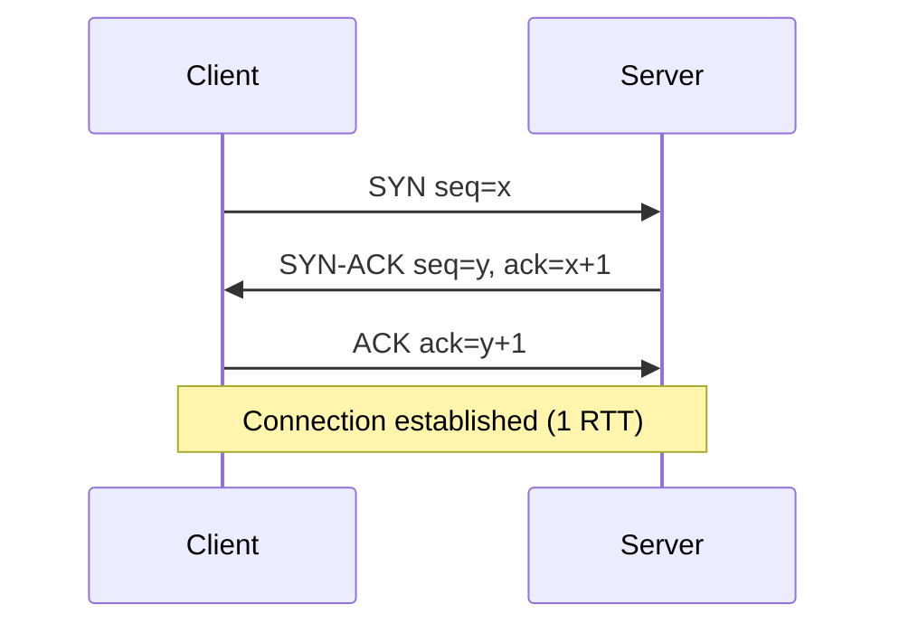
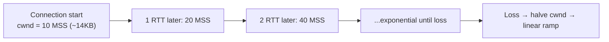
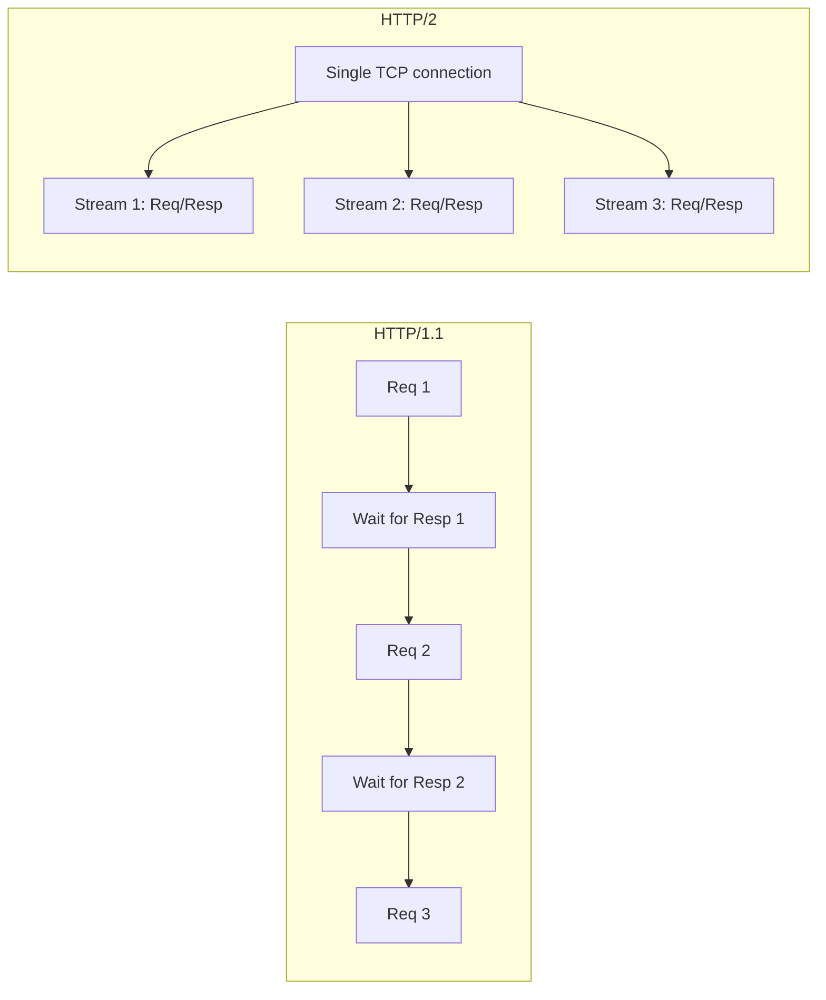
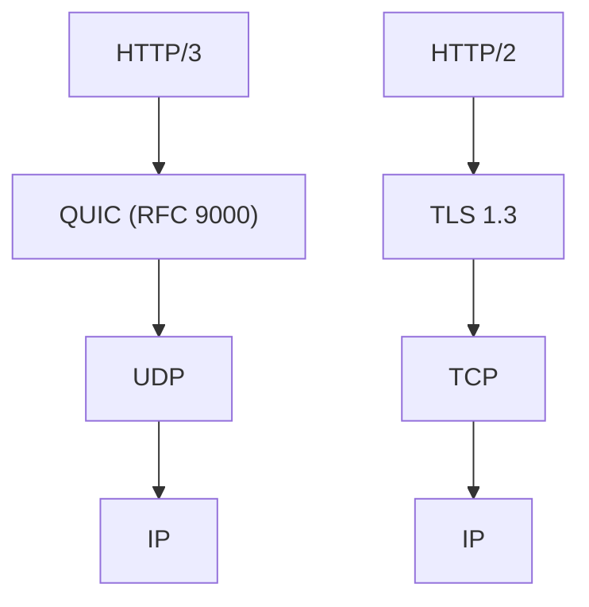
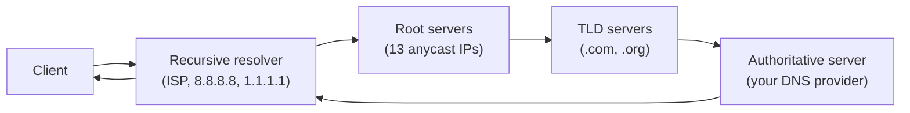
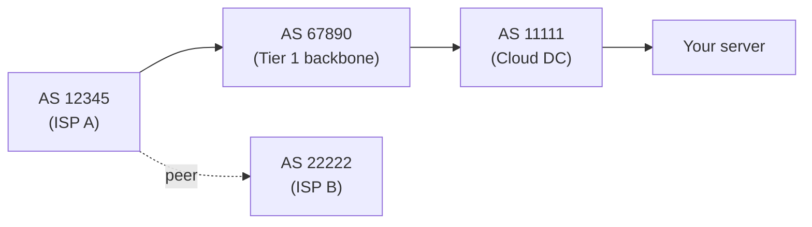
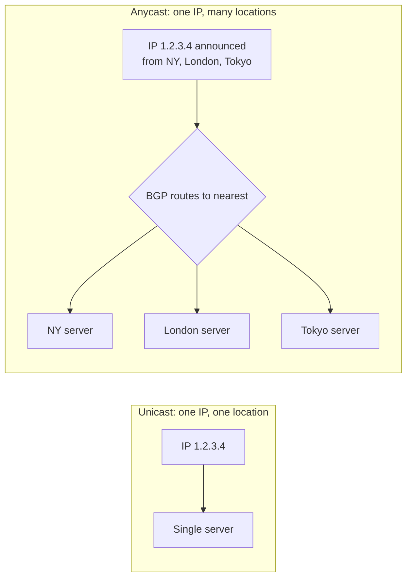

# Networking deep dive: TLS handshake, HTTP/3 + QUIC, TCP slow-start, BGP routing

The basic networking topic covers the components — load balancers, DNS, consistent hashing. This deep-dive goes into **how the protocols beneath them actually work**. Senior interviews increasingly ask about TLS internals, HTTP/3 motivations, why a connection feels slow on cold start, and how routing makes the internet work at all.

## TCP refresher and slow-start

TCP gives reliable, in-order, congestion-controlled byte streams. Two key behaviours every senior engineer should know:

### Three-way handshake



One round trip before any data flows. **Latency, not bandwidth, is the bottleneck** for short HTTP exchanges. From a US client to an Indian server (~250ms RTT), TCP setup alone takes 250ms before the first byte of HTTP request leaves.

### Slow-start and congestion control

TCP starts each connection conservatively, doubling the send rate per RTT until packet loss occurs. Then it backs off and ramps up more carefully (congestion avoidance).



For a high-bandwidth, high-latency link (e.g. 1 Gbps trans-Pacific, 150ms RTT), reaching full bandwidth from cold takes **many** RTTs. A short HTTP request finishes long before TCP reaches full speed.

**Implications for performance**:

- Reusing connections is huge (HTTP keep-alive, HTTP/2 multiplexing, connection pools).
- HTTP/3 over QUIC moves congestion control to userspace and enables better cold-start (see below).
- Modern Linux kernels use BBR congestion control instead of CUBIC for better throughput on lossy / high-RTT links.

### TCP head-of-line blocking

If packet 5 is lost, packets 6, 7, 8 cannot be delivered to the application until packet 5 is retransmitted. Packets sit in the kernel buffer waiting. Multiplexing many streams over one TCP connection (HTTP/2) means one stalled stream stalls all of them. **HTTP/3 fixes this.**

## TLS handshake — the slow path

TLS adds another 1-2 RTTs on top of TCP. Pre-TLS 1.3, full handshake was 2 RTTs.

```mermaid
sequenceDiagram
    participant Client
    participant Server
    Note over Client,Server: TCP handshake already done (1 RTT)
    Client->>Server: ClientHello (TLS 1.3 supported, cipher suites, key share, random)
    Server->>Client: ServerHello (chosen cipher, server random) + Certificate (signed by CA) + key share + Finished
    Note over Client: Verify cert chain; derive session keys
    Client->>Server: Finished (verifies handshake) + early app data (encrypted)
    Note over Client,Server: 1 RTT for TLS 1.3, ready for app data
```

TLS 1.3 (current standard since 2018) reduces this to **1 RTT for the full handshake**. Combined with TCP, that's 2 RTTs from cold connection to first encrypted byte.

### What the handshake achieves

- **Server identity** — server presents a certificate signed by a CA the client trusts.
- **Key exchange** — client and server agree on a session secret without an eavesdropper learning it (ECDHE / X25519).
- **Cipher negotiation** — pick a cipher suite both sides support.
- **Forward secrecy** — ephemeral keys mean compromise of long-term keys does not decrypt past sessions. **Mandatory in TLS 1.3.**

### 0-RTT resumption

TLS 1.3 supports **0-RTT** (early data): client sends app data with the first message, using a key from a prior session. Saves a round trip on resumption.

**Trade-off**: 0-RTT data is replayable. If an attacker captures the encrypted early data, they can replay it. Servers must mark idempotent operations only as 0-RTT-safe.

### Cipher suites

A cipher suite specifies: key exchange + signature + bulk cipher + hash. TLS 1.3 simplifies — only AEAD ciphers allowed (AES-GCM, ChaCha20-Poly1305).

| Cipher suite                            | TLS version        |
| --------------------------------------- | ------------------ |
| `TLS_AES_128_GCM_SHA256`                | 1.3                |
| `TLS_AES_256_GCM_SHA384`                | 1.3                |
| `TLS_CHACHA20_POLY1305_SHA256`          | 1.3                |
| `TLS_ECDHE_RSA_WITH_AES_256_GCM_SHA384` | 1.2 (still common) |
| Anything with `RC4`, `MD5`, `CBC`       | **Avoid**          |

### Certificate transparency

Every TLS certificate is logged to public **CT logs** (Certificate Transparency). Browsers refuse certs not in CT. This is how rogue CA-issued certs get caught — anyone monitors the logs and detects suspicious issuance.

## HTTP/2 — multiplexing over one TCP

HTTP/1.1 forced one request at a time per connection (or pipelining, which broke). HTTP/2 multiplexes many concurrent streams over one TCP connection.



| Feature                | HTTP/1.1         | HTTP/2                          |
| ---------------------- | ---------------- | ------------------------------- |
| Streams per connection | 1 (head-of-line) | Many (multiplexed)              |
| Header compression     | None             | HPACK (huge win for small reqs) |
| Server push            | No               | Yes (deprecated in browsers)    |
| Binary or text         | Text             | Binary frames                   |
| TLS required           | No               | Effectively yes (browsers)      |

**HTTP/2's flaw**: streams multiplexed over one TCP connection still suffer TCP head-of-line blocking. One lost packet stalls all streams.

## HTTP/3 — QUIC over UDP

HTTP/3 abandons TCP. Built on **QUIC**, which runs over UDP and reimplements reliability and congestion control in userspace.



### Why move off TCP?

1. **TCP is implemented in the kernel** — slow to evolve. New congestion control or recovery features need kernel updates everywhere.
2. **TCP head-of-line blocking** affects multiplexed protocols.
3. **TCP + TLS handshake** takes 2-3 RTTs combined.
4. **Connection migration** — TCP is bound to source IP+port. Mobile network → WiFi handoff drops the connection.

### What QUIC fixes

| Pain                 | TCP+TLS                         | QUIC                             |
| -------------------- | ------------------------------- | -------------------------------- |
| Connection setup     | 1 RTT TCP + 1 RTT TLS = 2 RTT   | 1 RTT (or 0 RTT on resume)       |
| Stream multiplexing  | One stream stalls all (TCP HOL) | Streams independent (no HOL)     |
| Connection migration | Fixed to IP+port                | Connection ID survives IP change |
| Encryption           | Optional (TLS adds it)          | Mandatory                        |
| Userspace evolution  | Kernel updates needed           | App-level updates only           |

### When HTTP/3 helps

- **Mobile users** with intermittent connections (network handoff).
- **Lossy networks** (mobile, satellite, congested WiFi).
- **High-latency cold starts** — 0-RTT resume.

Major sites (Google, Cloudflare, Facebook) serve via HTTP/3 by default. Server-to-server traffic still mostly HTTP/2 — within a data centre, TCP is fine.

## DNS deep dive

Already covered in `topic_networking`. Worth knowing more:

### Resolver hierarchy



Caching at every layer keeps lookups fast. TTL controls cache duration.

### DNSSEC

Cryptographically signs DNS responses. Prevents cache poisoning attacks. Adoption is patchy; `1.1.1.1` and `8.8.8.8` validate.

### DNS over HTTPS (DoH) / DNS over TLS (DoT)

Encrypts DNS queries. Prevents ISP from seeing what domains you query. Browsers (Firefox, Chrome) use DoH by default in many regions.

## BGP — how the internet routes

The Border Gateway Protocol decides how packets traverse autonomous systems (ASes) — large networks like ISPs, cloud providers, big companies.



Each AS announces what IP prefixes it owns and what routes it can reach. Routers pick the shortest-AS-path route by default.

### BGP weaknesses

- **No authentication by default** — any AS can announce any prefix. Misconfigurations and attacks ("BGP hijacks") have routed Google, AWS, Cloudflare traffic through random networks. **RPKI** (Resource Public Key Infrastructure) signs prefix announcements but adoption is incomplete.
- **Slow convergence** — a route change can take minutes to propagate globally.
- **Withdrawal anomalies** — when a route disappears, packets either drop or take a longer path.

For application engineers: BGP failures are rare but spectacular. Mitigation is anycast (announce the same prefix from multiple sites) — Cloudflare and similar CDNs do this.

## Anycast vs unicast



Anycast gives:

- **Low latency** — user reaches the nearest edge.
- **DDoS absorption** — traffic spreads across all sites.
- **Failover** — if one site goes down, BGP routes to the next.

DNS root servers, public DNS resolvers (`1.1.1.1`, `8.8.8.8`), CDNs all use anycast.

## Connection pooling and keep-alive

Reusing a connection avoids re-running TCP + TLS handshakes.

| Setting                 | Effect                                              |
| ----------------------- | --------------------------------------------------- |
| HTTP/1.1 keep-alive     | Default; reuse connection for sequential requests   |
| HTTP/1.1 pipelining     | Avoid; broken in practice                           |
| Connection pool size    | Match expected concurrency × downstream latency     |
| Connection idle timeout | Match server's; clients evict before server does    |
| Maximum lifetime        | Cap at hours; prevents long-lived stale connections |

In Java, `HttpClient` (JDK 11+) handles this with built-in pooling. Don't use `HttpURLConnection` for production; it's primitive.

```java
HttpClient client = HttpClient.newBuilder()
    .version(HttpClient.Version.HTTP_2)
    .connectTimeout(Duration.ofSeconds(5))
    .build();
```

## Common pitfalls

- **Treating HTTPS as "free"**. TLS handshake adds an RTT. Reuse connections.
- **Default connection pool sizes**. Small pool starves under load. Tune for expected concurrency.
- **Ignoring keep-alive**. Each request opens a new connection → cold-start penalty per request.
- **Trusting DNS for failover**. Caches are unreliable. Use anycast or LB-level health checks.
- **Disabling cipher suite negotiation**. Pinning a single cipher breaks fall-back when servers change.
- **Mixing HTTP/1.1 and HTTP/2 paths in load balancers**. ALB → backend talks HTTP/1 even though client is HTTP/2; benefits halved.
- **No TLS to backend**. "Internal network is trusted" until the network has a breach. Defence in depth — terminate TLS at edge, re-establish to backend or use service mesh mTLS.

## Interview answers

_Q: Why is the first request to a server slower than subsequent ones?_
A: Cold start incurs DNS lookup, TCP handshake (1 RTT), TLS handshake (1 RTT for TLS 1.3). Plus TCP slow-start: bandwidth ramps up exponentially per RTT until reaching capacity. Subsequent requests on the warmed-up connection skip handshakes and run at full bandwidth.

_Q: How does HTTP/3 help on mobile networks?_
A: QUIC's connection migration uses connection IDs, not IP+port. WiFi-to-cellular handoff doesn't drop the session — same connection ID, new IP. Plus QUIC eliminates TCP head-of-line blocking; one lost packet doesn't stall all streams. Both matter on lossy mobile links.

_Q: What's TLS 0-RTT and what's the catch?_
A: On reconnection, the client sends app data with the first message using a key from a prior session — saves an RTT. The catch: 0-RTT data is replayable. An attacker who captures the encrypted early data can replay it. Servers must mark only idempotent operations as 0-RTT-safe (typically `GET` with no side effects).

_Q: How does TCP slow-start affect a "fast" network?_
A: A 1 Gbps link with 150ms RTT has ~18 MB in flight at full speed. Slow-start doubles the congestion window per RTT, so reaching full bandwidth takes ~10 RTTs (~1.5 seconds). For a 1 MB transfer, the entire transfer happens in slow-start. Workarounds: connection reuse, BBR congestion control, large initial congestion windows on Linux.

_Q: Why does anycast improve latency and DDoS resilience?_
A: Anycast announces the same IP from many locations. BGP routes the user to the nearest one — lower latency. A DDoS attacker hits all anycast sites; load distributes across the global footprint instead of overwhelming one. CDNs and DNS resolvers depend on anycast.

_Q: What is BGP hijacking?_
A: One AS announces an IP prefix it doesn't own; routers globally accept the announcement. Traffic intended for the real owner reroutes to the hijacker. Famous incidents: Pakistan blackholing YouTube globally (2008), MyEtherWallet redirected via Amazon's Route 53 (2018). RPKI mitigates by cryptographically signing announcements; adoption is incomplete.

_Q: What's the difference between HTTP/2 server push and resource hints?_
A: Server push: server unilaterally sends a resource the client hasn't asked for, reasoning it'll be needed. Largely deprecated — caches and prefetch turned out better. Resource hints: client-side `<link rel="preload">`, `<link rel="dns-prefetch">`, `<link rel="preconnect">` tell the browser to start fetching speculatively. Universally supported.

_Q: How would you decide between HTTP/2 and HTTP/3 for a backend service?_
A: Internal data centre traffic: HTTP/2 over TCP is fine. Network is reliable; TCP works. Public-facing edge for mobile / global users: HTTP/3 over QUIC reduces handshake cost and survives network handoff. Most CDN providers (Cloudflare, Fastly) negotiate automatically based on what the client supports.
