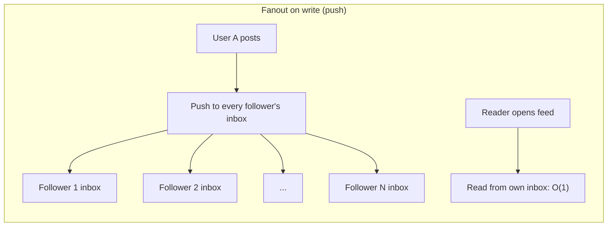
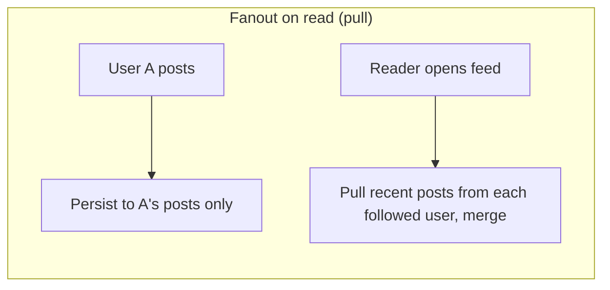
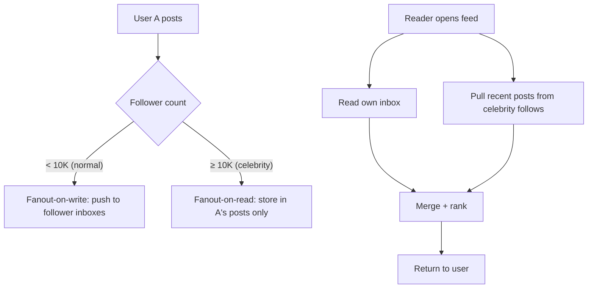
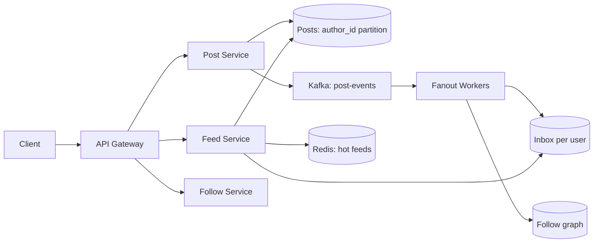

# Walkthrough: social news feed (fan-out on read vs write)

The news feed is the canonical "scale to celebrity users" problem. The core trade-off — fanout on write vs fanout on read — is the textbook answer for any system with imbalanced producer/consumer ratios.

## Step 1 — Clarify requirements

**Functional**:

- Post text or media.
- Follow / unfollow other users.
- Open feed → see chronologically (or ranked) ordered posts from followed users.
- Like, comment.

**Non-functional**:

- Feed open < 300ms p95.
- 50M DAU.
- Follower distribution skewed: 99% have < 1K followers, 1% are "celebrities" with millions.
- Posts are durable.

## Step 2 — Estimate

```
DAU                  = 50M
Posts/user/day       = 0.5 (avg)
Total posts/day      = 25M ≈ 290 posts/sec, peak ~900

Feed opens per user  = 5/day
Total feed reads     = 250M/day ≈ 3K/sec, peak ~9K

Avg posts in a feed  = 50
Storage per post     = 1 KB
```

The interesting numbers: 290 writes/sec is small; the explosion happens in fanout if push-based.

## Step 3 — Two fanout strategies





| Strategy        | When user posts                           | When user opens feed                             |
| --------------- | ----------------------------------------- | ------------------------------------------------ |
| Fanout on write | Push to every follower's inbox (N writes) | Read from own inbox (O(1))                       |
| Fanout on read  | Persist to author's posts only            | Pull recent posts from each followed user, merge |

| Strategy        | Strength                       | Weakness                                         |
| --------------- | ------------------------------ | ------------------------------------------------ |
| Fanout on write | Reads are cheap (single inbox) | Celebrity posts cause millions of writes         |
| Fanout on read  | Writes are cheap (one row)     | Reads are expensive — query and merge per follow |

## Step 4 — The celebrity problem

A user with 10M followers posts once. Fanout-on-write triggers 10M inbox writes. If they post 10 times a day, that's 100M writes from one account.

```
Celebrity posts/day        = 10
Followers                  = 10M
Daily writes per celebrity = 100M
Across 100 celebrities     = 10B writes/day → 116K writes/sec just for fanout
```

Pure fanout-on-write breaks. Pure fanout-on-read is also bad — every feed open queries 10K accounts, merges them, ranks. 50M opens × 10K queries = 500B queries/day.

## Step 5 — Hybrid (industry standard)



The split:

- For **normal users**, fanout-on-write at post time.
- For **celebrities** (above some threshold like 10K followers), fanout-on-read.
- At feed open: read own inbox (precomputed) + pull from celebrity follows + merge + rank.

This bounds both write load (no celebrity blasts) and read load (most posts are pre-arranged in inbox).

## Step 6 — Architecture



| Component         | Notes                                                         |
| ----------------- | ------------------------------------------------------------- |
| Post service      | Validate, persist, emit event                                 |
| Posts table       | Cassandra; partitioned by `author_id`, sorted by time         |
| Follow graph      | Sharded MySQL or graph DB; `(follower, followee)`             |
| Kafka post events | Decouples post from fanout; replayable                        |
| Fanout workers    | Read post events, look up author's followers, write to inbox  |
| Inbox table       | Per-user, cassandra; partitioned by `user_id`, sorted by time |
| Feed service      | Reads inbox, pulls celebrity posts, merges, ranks             |
| Redis             | Caches hot feeds (active users)                               |

## Step 7 — Storage schema

```cql
-- Posts (by author)
CREATE TABLE posts (
    author_id   UUID,
    post_id     BIGINT,
    body        TEXT,
    created_at  TIMESTAMP,
    PRIMARY KEY ((author_id), post_id)
) WITH CLUSTERING ORDER BY (post_id DESC);

-- Inbox (per follower)
CREATE TABLE inbox (
    user_id     UUID,
    post_id     BIGINT,
    author_id   UUID,
    created_at  TIMESTAMP,
    PRIMARY KEY ((user_id), post_id)
) WITH CLUSTERING ORDER BY (post_id DESC);
```

Inbox stores `post_id` references, not full post bodies. Bodies are in `posts`. This keeps inbox writes small (~24 bytes) and lets you update a post without touching every follower's inbox.

For long-tail inactive users, compute inbox lazily — only run fanout for users active in the last N days. Inactives compute their feed on demand.

## Step 8 — Ranking

Chronological is the simplest. Ranked feeds (Facebook, Twitter algorithmic) require a separate ranking model: features (recency, author affinity, engagement signals) → score → re-order.

For interview, mention you would:

- Pull a candidate set (last few hundred posts from inbox + celebrity follows).
- Score each candidate via a model (recency + engagement features).
- Sort by score, return top N.

The ranking model is its own system (feature store, ML inference service). For a senior interview, naming the components is enough.

## Step 9 — Caching

Hot path: open feed → lookup last-N posts. Cache the top 50-100 posts per active user in Redis with TTL.

```
Active users (last 24h): ~30M
Avg cache size per user:  50 posts × 24 bytes = 1.2 KB
Total cache size:         30M × 1.2 KB ≈ 36 GB
```

A 50 GB Redis cluster handles it comfortably.

Cache invalidation: when fanout writes a new post to a user's inbox, also publish to Redis pub/sub to invalidate that user's cached feed. Or use cache TTL of 1-5 minutes and accept some staleness.

## Step 10 — Edge cases

- **Posting to a private account**: filter at fanout; only fanout to approved followers.
- **Block list**: filter at read time; if blocked author appears in the inbox, drop.
- **Edited or deleted posts**: post bodies live in `posts` table. Fetching by post_id always shows current state (or null if deleted).
- **New follow relationship**: do not retroactively backfill the follower's inbox; just affect future posts. Acceptable.
- **Massive backfill on follow celebrity**: do not write 10K celebrity posts to the new follower's inbox; pull on demand.

## Common pitfalls

- **Fanout-on-write for everyone, including celebrities**. Breaks at celebrity scale. Always hybrid.
- **Storing full post bodies in inbox**. Massive duplication and updates of edited posts cascade to millions of rows.
- **Missing the inbox-cache invalidation**. New posts arrive but cached feed is stale for minutes.
- **Synchronous fanout on the post hot path**. Post should return as fast as possible; Kafka decouples.
- **No cap on inbox size**. Inboxes grow unbounded. Cap at last N posts (TTL or scheduled cleanup).
- **Rebuilding inboxes on every code deploy**. Inbox is the long-term derived store; changes to fanout logic should not invalidate it. Backfill carefully.

## Interview answers

_Q: When does fanout-on-write break?_
A: When a single post must be replicated to millions of inboxes — the celebrity problem. 10M followers × 10 posts/day = 100M writes/day from one account. Replication amplification is a write hot spot. Switch to fanout-on-read for high-follower accounts.

_Q: Walk me through what happens when I open my feed in a hybrid system._
A: Feed service reads my inbox (the precomputed feed of normal-user posts). In parallel, queries celebrity authors I follow for their recent posts (fanout-on-read for them). Merges both streams, ranks (chronologically or by ML score), returns top N. Cached in Redis for the session.

_Q: How would you handle a new follow relationship?_
A: Do not backfill the follower's inbox with 10 K of historical posts — too expensive and most are stale. New follow affects future posts only. If the user wants to see historical posts from this new follow, they navigate to the profile.

_Q: How do you scale the fanout workers?_
A: Kafka topic partitioned by `author_id`. Workers consume in parallel, fanout independently. For celebrity posts, queue to a separate "slow" topic so they do not block normal traffic. Track lag — if fanout falls behind, scale workers; if a worker dies, Kafka rebalances partitions.

_Q: What's the storage cost of inboxes?_
A: Per inbox: ~50 recent posts × 24 bytes = 1.2 KB. 50M users → 60 GB. Plus replication. Manageable. The cost grows linearly with active users; bound it by capping inbox size.

_Q: How does Twitter's "Tweet Timeline Service" handle this?_
A: Hybrid — Tweet ID fanout to follower inboxes for normal users; pull from author cache for celebrities. Personalized ranking on top. Inboxes stored in a service called Manhattan (their NoSQL). Redis for hot caches. Feed open is a parallel fan-in: own inbox + ranked celebrity pulls + ad slot insertion + ranking model.

_Q: How would you implement "show new posts" badge without serving them?_
A: Cheap counter per user. When fanout writes to inbox, increment "unread count" in Redis. Feed open zeroes it. Badge is a single Redis read on every page load — sub-millisecond.
