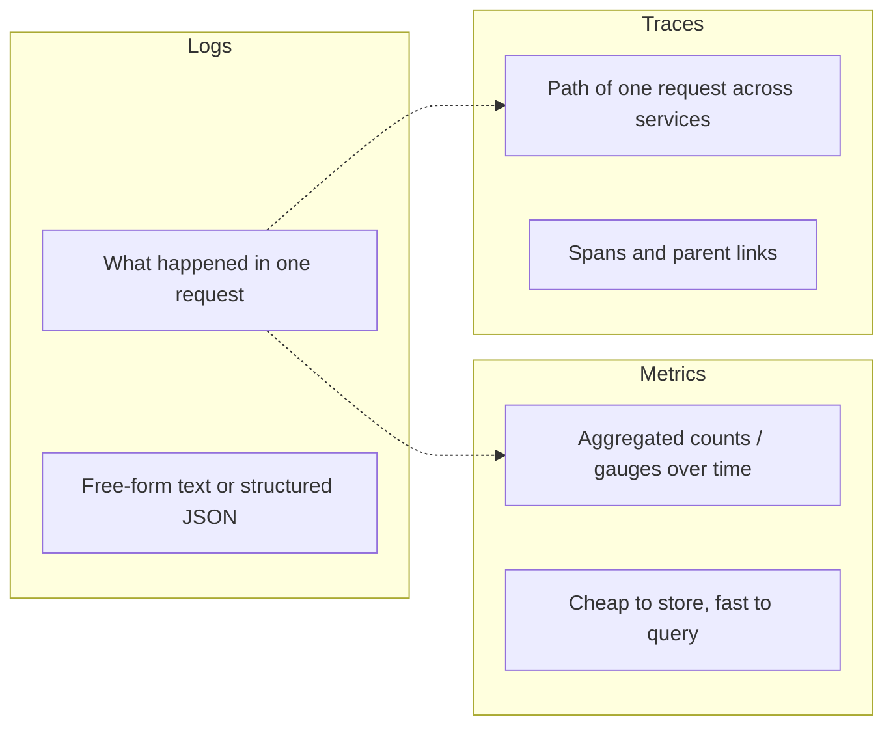
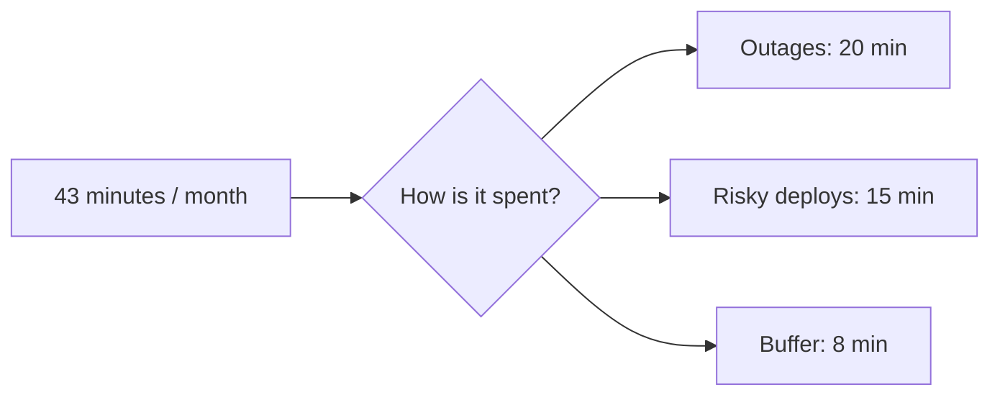

# Observability: logs, metrics, traces, RED + USE methods, SLI/SLO/SLA

Observability is the ability to understand a system's internal state from its outputs. The classic shorthand is **the three pillars**: logs, metrics, traces. Senior interviews probe whether you know what each is for, how they relate, and how to design SLOs that actually drive engineering decisions.

## The three pillars



| Pillar  | Tells you                              | Best for                            | Volume             |
| ------- | -------------------------------------- | ----------------------------------- | ------------------ |
| Logs    | What happened in this specific request | Post-mortem debugging, audit trail  | High (per request) |
| Metrics | Aggregated counts and gauges over time | Dashboards, alerts, SLOs            | Low (sampled)      |
| Traces  | Path a request took across services    | Latency hot spots, fan-out problems | Sampled            |

Modern stacks unify these via **OpenTelemetry** — one SDK emits all three with consistent IDs (trace_id, span_id) so you can pivot between them.

## Logs

Logs answer "what happened in this request?" Modern systems use **structured logging** — every log entry is JSON with consistent fields.

```json
{
  "timestamp": "2024-03-15T14:23:45.123Z",
  "level": "ERROR",
  "service": "order-service",
  "trace_id": "abc-123",
  "span_id": "def-456",
  "user_id": "u-42",
  "message": "Payment authorization failed",
  "error": "card_declined",
  "card_last4": "4242"
}
```

Tooling: ELK (Elasticsearch + Logstash + Kibana), Loki + Grafana, Datadog, Splunk, CloudWatch.

**Log levels** — pick the right level so noise does not bury signal:

- `ERROR` — something failed that needs attention.
- `WARN` — something worth noting; not necessarily an action item.
- `INFO` — normal high-level events (request started, request finished).
- `DEBUG` — detailed flow, off in production unless investigating.
- `TRACE` — extreme detail, almost never on in prod.

**Sampling**: logging every successful request floods storage. Sample success at 1% or skip it entirely; log every error and warning. Pair with metrics for trends.

## Metrics

Metrics are aggregated numerical values over time. Cheap to store (time-series database compresses well), fast to query, ideal for dashboards and alerts.

| Type      | Behavior                   | Example                             |
| --------- | -------------------------- | ----------------------------------- |
| Counter   | Monotonically increases    | `http_requests_total{status="2xx"}` |
| Gauge     | Goes up and down           | `memory_usage_bytes`                |
| Histogram | Buckets of observed values | Request duration distribution       |
| Summary   | Pre-computed percentiles   | `request_duration_p99`              |

```promql
# Prometheus query examples
# Request rate per second over last 5 min
rate(http_requests_total[5m])

# Error rate
sum(rate(http_requests_total{status=~"5.."}[5m]))
  / sum(rate(http_requests_total[5m]))

# p99 latency over last 5 min, per endpoint
histogram_quantile(0.99,
  sum by (le, route) (rate(http_request_duration_seconds_bucket[5m])))
```

### Cardinality explosion — the metrics killer

Adding `user_id` as a label seems useful but creates one time series per user. With 10M users, your Prometheus runs out of memory. **Keep label cardinality low** — use logs or traces for high-cardinality values.

| OK in metric labels      | NOT OK              |
| ------------------------ | ------------------- |
| HTTP method, status code | user id             |
| Service, region          | request id          |
| Endpoint route pattern   | full URL with query |
| Customer tier (free/pro) | email address       |

## Traces — distributed call paths

A trace shows a single request's journey across services. Each unit of work is a **span**; spans link to their parent and child spans.

```mermaid
gantt
    title Trace: GET /checkout
    dateFormat X
    axisFormat %s
    section Gateway
    request received   :0, 600
    section Auth
    verify token       :10, 30
    section Order
    fetch cart         :40, 60
    fetch user         :40, 50
    section Inventory
    reserve items      :110, 80
    section Payment
    charge             :200, 250
    section Shipping
    schedule           :460, 80
    section Notify
    send email         :550, 40
```



Each row is a span. The slowest part jumps out — payment took 250ms here. Without tracing you'd see "checkout took 600ms" and have to guess.

Tools: Jaeger, Zipkin, AWS X-Ray, Datadog APM, Honeycomb. OpenTelemetry is the vendor-neutral standard for collection.

**Trace propagation**: when service A calls service B via HTTP, A includes a `traceparent` header. B continues the trace with its own spans linked to A's. Critical for async boundaries — message queues, callback handlers, scheduled jobs — where naive instrumentation drops the link.

## RED and USE — what to monitor

Two methodologies that cover most monitoring needs.

### RED (request-driven services)

For HTTP, gRPC, or any request-handling service:

| Letter | Metric                 | Alert threshold example                       |
| ------ | ---------------------- | --------------------------------------------- |
| R      | **Rate** (req/s)       | Sudden drop below baseline → outage indicator |
| E      | **Errors** (%)         | > 1% of requests are 5xx                      |
| D      | **Duration** (latency) | p99 > 500ms                                   |

### USE (resources)

For CPUs, disks, queues, connection pools:

| Letter | Metric              | Example                           |
| ------ | ------------------- | --------------------------------- |
| U      | **Utilisation** (%) | CPU 85% used                      |
| S      | **Saturation**      | Run queue depth, queue length     |
| E      | **Errors**          | Disk read errors, dropped packets |

Combine: a service may have low CPU utilisation but a saturated thread pool — RED catches the symptom (slow requests), USE finds the cause (queued threads).

## SLI, SLO, SLA — making reliability measurable

| Term | Meaning                                                  | Example                                    |
| ---- | -------------------------------------------------------- | ------------------------------------------ |
| SLI  | **Indicator**: measured signal                           | Proportion of HTTP requests under 300ms    |
| SLO  | **Objective**: target for the SLI                        | 99.9% of requests under 300ms over 30 days |
| SLA  | **Agreement**: contract with users + financial penalties | "If less than 99.5%, 10% credit"           |

The SLO is internal; the SLA is external. SLA is usually weaker than SLO so engineering has buffer.

### Error budget — the team management tool

`Error budget = 1 - SLO`. With a 99.9% SLO over 30 days, you have 43 minutes of unavailability before tripping.



The trick: the error budget is **not** "we should never use it." If you do not use the budget, you are over-investing in reliability and under-investing in features. If you blow the budget, **slow down feature work and fix reliability**. This makes reliability a measurable trade-off, not a vague feeling.

## Alerting — keep humans sleeping

| Bad alert                     | Good alert                                          |
| ----------------------------- | --------------------------------------------------- |
| "CPU > 80%"                   | "p99 latency > 500ms for 5 consecutive minutes"     |
| "Memory growing"              | "Error rate > 1% for 5 minutes"                     |
| "Disk full"                   | "Service health check failing on majority of nodes" |
| Single metric threshold       | Multi-window rate (avoid one-spike false alarms)    |
| Symptom of underlying problem | The user-visible problem itself                     |

**Alert on symptoms users feel**, not internal causes. CPU at 80% is fine if requests still meet SLO. p99 latency above SLO matters because users feel it.

## Common pitfalls

- **Logging everything** — floods storage, makes search slow, costs money. Sample success, log all errors.
- **Cardinality explosion** in metric labels — Prometheus runs out of memory.
- **No structured logging** — grep-the-logs becomes the only debugging tool.
- **No trace propagation across async boundaries** — distributed traces stop at the queue.
- **Alerting on causes, not symptoms** — pages on every CPU spike, not on real user-facing problems.
- **No error budget tracking** — reliability becomes a vibes-based discussion.
- **Dashboards no one looks at** — useful only when accessed during incidents. Trim them ruthlessly.

## Interview answers

_Q: Walk me through how you would diagnose a slow API endpoint._
A: Open the trace for a slow request and look for the slowest span. If it is a downstream call, drill into that service's trace. If it is local, look at metrics for that service — DB query duration, GC pauses, thread pool saturation. Logs are last — used to confirm a hypothesis or capture parameters. Metrics + traces find the where; logs explain the why.

_Q: Why are RED and USE complementary?_
A: RED is for request-handling services — what users feel. USE is for resources — what is going wrong inside. A service can have terrible RED (slow, errors) without obvious USE problems if the bottleneck is downstream. Or great RED but quietly saturating a thread pool that will fail under more load. Both views catch what the other misses.

_Q: What is an error budget and why does it matter?_
A: It is `1 - SLO`. With a 99.9% SLO, you have 43 minutes of "down time" allowed per month. The team manages this budget like any other — if you spend it all early, you stop shipping risky features and invest in reliability. If you never use it, you are over-engineering and starving feature work. It turns reliability into a measurable trade.

_Q: Why is high cardinality a problem for Prometheus?_
A: Each unique label combination is its own time series, stored independently. Adding `user_id` with 10M users → 10M time series. Memory and storage explode; query performance dies. Move high-cardinality data to logs or traces; keep metrics labels low-cardinality (method, status, route, region).

_Q: How would you know your alerts are good?_
A: They are infrequent, actionable, and user-visible. If an alert fires and the on-call engineer cannot do anything, it is noise. If users do not feel the underlying problem, it should be a warning, not a page. Track alert fatigue: ratio of pages to genuine incidents. Aim for 1:1 — every page is a real problem.

_Q: How does OpenTelemetry change observability?_
A: One vendor-neutral SDK that emits logs, metrics, traces with consistent context. You instrument once; switch backends without re-instrumenting. Auto-instrumentation libraries cover popular frameworks (Spring, gRPC, HTTP clients) so you get traces with minimal code. Standard since 2021; replacing OpenTracing and OpenCensus.

_Q: When is sampling traces acceptable?_
A: Almost always for production at scale. 100% trace volume is too expensive. Common patterns: head-based sampling (decide at request entry, e.g. 1% random) keeps costs predictable. Tail-based sampling (decide after seeing the trace, e.g. always keep errors and slow requests) catches the interesting traces but needs a buffer. Both are better than 100%.
