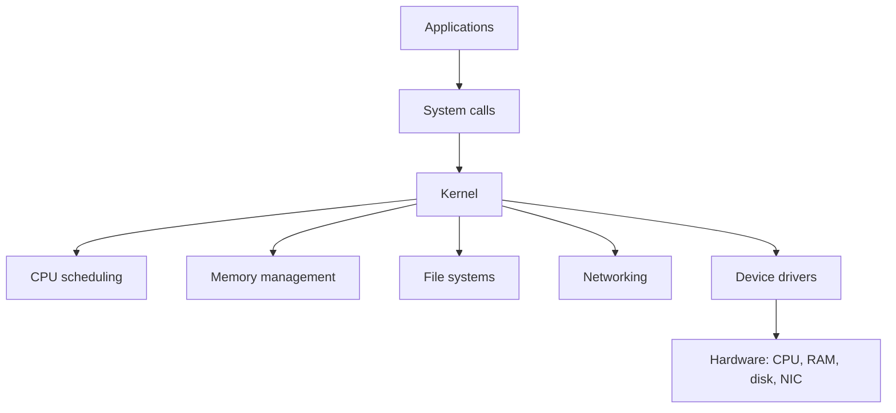
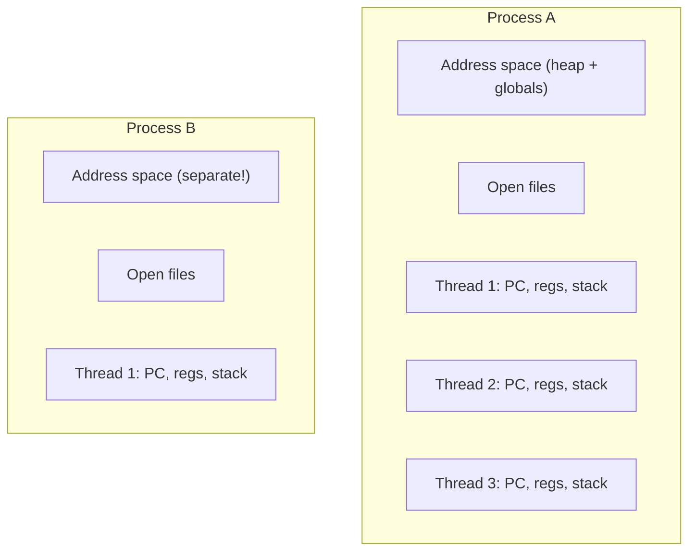
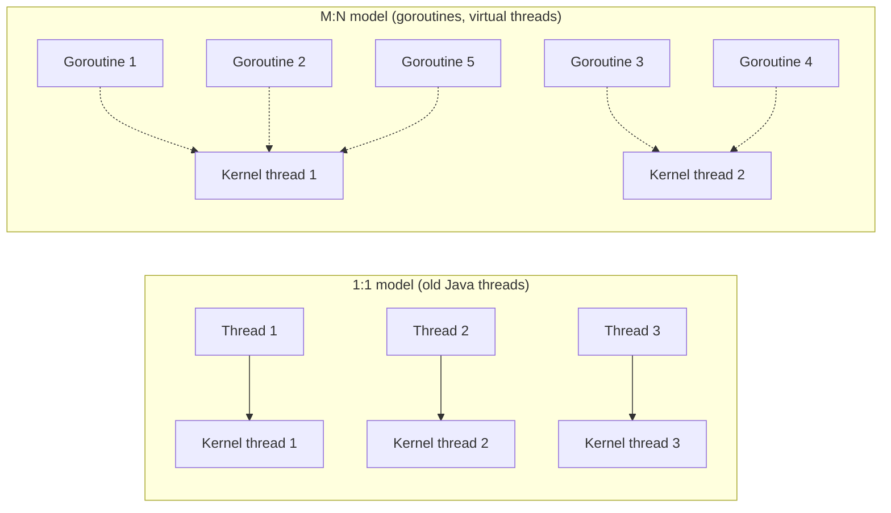
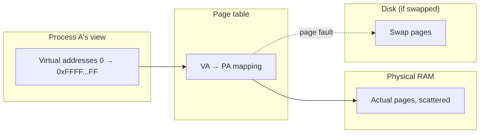
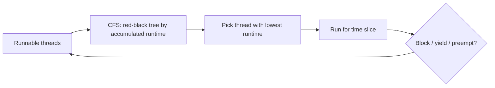
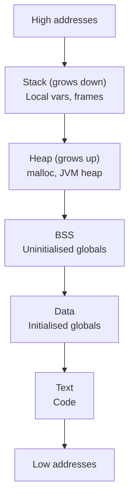
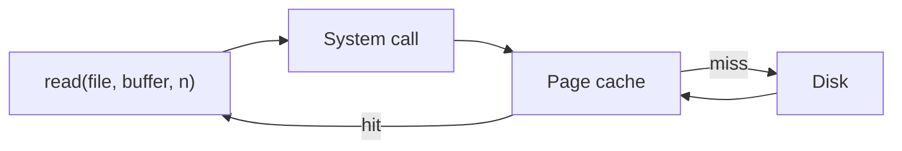

# OS fundamentals: processes vs threads, virtual memory, paging, scheduling, context switches, IPC

Operating systems are the foundation everything else runs on. **Most senior engineers will be asked at least one OS question** at FAANG-tier interviews — process vs thread, memory layout, scheduling, what a context switch costs. The answers help you reason about JVM internals, container resource limits, garbage collectors, networking — basically every performance question.

## What an OS does



The kernel manages shared hardware so applications don't conflict. Privileged operations (memory mapping, process creation, IO) go through **system calls** — the boundary between user space and kernel space.

## Processes vs threads

A **process** is a unit of resource ownership: address space, open files, environment. A **thread** is a unit of execution: a program counter, registers, stack.



| Concern             | Process                        | Thread                               |
| ------------------- | ------------------------------ | ------------------------------------ |
| Address space       | Own (isolated)                 | Shared with other threads in process |
| Creation cost       | High (fork ~1ms, exec more)    | Low (~10-100µs)                      |
| Context switch cost | High (TLB flush)               | Lower (same address space)           |
| Communication       | IPC: pipes, sockets, shm       | Shared memory directly               |
| Crash isolation     | One crash doesn't kill another | One thread crash often kills process |
| Default protection  | Strong (kernel-enforced)       | None (developers must synchronise)   |

**Multi-process** for safety and isolation (Chrome's per-tab process model, Postgres per-connection process). **Multi-threaded** for performance and shared state (web servers, JVM apps).

### How processes are created

On Unix: `fork()` creates a copy of the calling process; `exec()` replaces the program. On Windows: `CreateProcess()` does both in one call.

```c
pid_t pid = fork();
if (pid == 0) {
    // Child process
    execvp("/bin/ls", args);
} else {
    // Parent process
    waitpid(pid, &status, 0);
}
```

Modern systems use **copy-on-write**: child shares parent's pages until either modifies them, then a new page is allocated. Makes fork cheap on Linux.

## Threads in the OS vs the language

**Kernel threads (1:1 model)** — every thread has a kernel thread underneath. Linux NPTL, Windows threads. JVM's old `Thread` class. Heavy: 1MB stack each, kernel-scheduled.

**Green threads / user-space threads (M:N model)** — many lightweight threads multiplexed onto few kernel threads. Go goroutines, Erlang processes, JVM virtual threads (Project Loom). Cheap: KB-sized, language-runtime-scheduled.



For high-concurrency IO-bound work, M:N wins. The runtime parks blocked goroutines and reuses kernel threads.

## Virtual memory

Each process sees a contiguous "address space" from 0 to the maximum (e.g. 256TB on x86-64). The OS maps virtual addresses to physical memory in pages (typically 4 KB).



**Why virtual memory?**

- Each process is isolated — can't read or write another's memory.
- Programs don't need to fit in physical RAM — pages can be swapped to disk.
- Memory can be over-committed — pages allocated lazily on first access.
- Shared libraries map once into many processes.

### Page tables and TLB

For every memory access, the CPU must translate virtual → physical. Doing this through page tables every time would be devastating. The **Translation Lookaside Buffer (TLB)** caches recent translations in hardware.

```
Virtual address (48-bit)
  → Page table walk (3-4 levels on x86-64)
  → Physical address (or page fault if not present)

TLB hit: 1 cycle
TLB miss + page table walk: ~100 cycles
```

When a process is context-switched, the TLB is flushed (or partially preserved with PCID). This is one reason context switches are expensive.

### Page faults

Three kinds:

- **Minor**: page is in RAM but not in this process's page table. Fast — kernel updates the table.
- **Major**: page must be loaded from disk. Slow — milliseconds.
- **Invalid**: program accessed memory it shouldn't. SIGSEGV; process crashes.

`top` and `htop` show major fault rates. Sustained majfaults indicate memory pressure → swap → terrible latency.

### mmap

`mmap()` maps a file (or anonymous memory) into the address space. The kernel handles loading pages on demand. Used for:

- **Memory-mapped IO** — read large files without explicit reads.
- **Shared memory between processes**.
- **Allocators** that mmap large regions and sub-allocate.
- **Databases** — Postgres uses mmap for shared buffers; LMDB is built around mmap.

## CPU scheduling

The OS decides which thread runs on which CPU at which time. Modern Linux uses **CFS** (Completely Fair Scheduler), which gives each runnable thread a proportional share of CPU time.



| Concept            | Meaning                                                   |
| ------------------ | --------------------------------------------------------- |
| Time slice         | How long a thread runs before potentially being preempted |
| Niceness           | Priority hint (-20 to 19); CFS uses it to weight runtime  |
| Real-time priority | `SCHED_FIFO`, `SCHED_RR` — preempt CFS threads            |
| `taskset`          | Pin a thread to specific CPUs (CPU affinity)              |
| `cgroup`           | Container CPU limits — Kubernetes uses this               |

**For app developers**:

- The scheduler is fair across processes; one runaway service can't fully starve others (unless real-time priority).
- Latency-sensitive code: prefer `SCHED_FIFO` or fewer threads on isolated CPUs (SCHED_OTHER's preemption adds jitter).
- Container CPU limits use **cgroups CPU shares** (proportional) and **CPU quotas** (hard cap). A quota that's too tight throttles even when CPU is otherwise idle.

## Context switching

When the OS switches the CPU from thread A to thread B, it must:


Cost:

- **Direct cost**: saving and restoring CPU state. ~1 µs on modern x86.
- **Indirect cost**: cache misses (instruction cache, data cache, TLB) until B's working set warms up. Often dominates the direct cost.

For a process switch (different address space), TLB flush adds significant cost. For a thread switch within the same process, only registers + scheduler state.

**Implication for performance**:

- Excessive thread count → excessive context switching → CPU spent on bookkeeping, not work.
- "Optimal thread count" depends on workload: CPU-bound → roughly = cores. IO-bound → many more (until context switching dominates).
- Tools: `vmstat`, `pidstat -w` show context switch rates. Above ~100K voluntary CS/sec is high.

## IPC — Inter-Process Communication

Processes don't share memory by default; they need explicit channels.

| Mechanism                              | Use                                              |
| -------------------------------------- | ------------------------------------------------ |
| **Pipes** (anonymous)                  | Parent-child streaming (shell pipelines)         |
| **Named pipes (FIFO)**                 | Filesystem-named; unrelated processes            |
| **Sockets** (Unix domain)              | Bidirectional, byte streams, files-as-paths      |
| **Sockets** (TCP/UDP)                  | Network — even on same host                      |
| **Shared memory** (`shm_open`, `mmap`) | Fast; multiple processes map same physical pages |
| **Semaphores / mutexes** (POSIX, SysV) | Synchronisation primitives                       |
| **Signals**                            | Async notifications: SIGTERM, SIGINT, SIGUSR1    |
| **Message queues** (mq\_\*)            | Kernel-buffered messages                         |

Modern systems mostly use **sockets** (Unix domain for local, TCP for cross-host) or **shared memory** for high-throughput cases (databases, GPU drivers, video codecs).

## Memory layout of a process



Each thread has its own stack; the heap is shared. Linker maps shared libraries somewhere in the middle.

For a JVM: the JVM's own heap is one big chunk allocated from the process heap; objects live there. Native memory (direct buffers, JNI) is separate. Native stacks vary per thread (1MB default for JVM).

## File descriptors

Every open file, socket, or pipe is a file descriptor — a small integer indexing into a per-process table.

```bash
$ ls -la /proc/$$/fd
0 → /dev/pts/0       # stdin
1 → /dev/pts/0       # stdout
2 → /dev/pts/0       # stderr
3 → /tmp/file.txt    # opened file
4 → socket:[12345]   # open TCP socket
```

**FD limits** (`ulimit -n`) are per-process; default 1024 on many systems. Hit the limit and you get `Too many open files`. For high-concurrency servers (web servers, databases): bump to 65535 or higher.

## Disk IO

Reads and writes go through the page cache by default — recently-read pages stay in RAM. Subsequent reads are RAM-fast.



Tunables:

- **`O_DIRECT`** — bypass page cache. Used by databases that manage their own buffer pool.
- **`fsync()`** — flush page cache to disk. Required after writing to ensure durability before declaring success.
- **`fdatasync()`** — flush data only, not metadata. Faster.

For a senior engineer:

- Logs: write asynchronously to page cache; OS flushes periodically. Loss of recent logs on crash is acceptable for most apps.
- Database WAL: must `fsync` after every commit for durability.
- For performance-sensitive IO: `mmap` + manual page management, or `io_uring` (modern Linux).

## Common pitfalls

- **Confusing process and thread costs**. Threads are 100x cheaper to create than processes; use threads for parallelism, processes for isolation.
- **Spawning too many threads**. Above ~10K threads on standard Linux, context switching dominates. Use a thread pool or virtual threads.
- **Ignoring container limits**. Setting `Xmx` to host RAM size in a container with cgroup limits → OOMKilled. Use `-XX:+UseContainerSupport` (default in modern JVM) and proper limits.
- **Treating mmap as free**. Touching pages costs major faults until they're warm.
- **Sync IO in hot loops**. `read()` in a tight loop = system call overhead per read. Buffer reads.
- **Not handling `SIGPIPE`**. Writing to a closed pipe terminates by default. Servers should ignore and check write return values.
- **Assuming `fsync` is fast**. It's milliseconds, not microseconds. Batch writes when durability allows.

## Interview answers

_Q: Process vs thread — what's the difference and when do you use which?_
A: A process owns resources (address space, files); a thread is a unit of execution within a process. Threads share memory, processes don't. Threads are cheaper to create (microseconds vs milliseconds) and switch between. Use threads when shared state is needed; use processes for isolation (Chrome tabs, Postgres connections) where one crash shouldn't kill others.

_Q: What is virtual memory and why does it exist?_
A: Each process sees its own contiguous address space, mapped to physical RAM via page tables. It provides isolation (one process can't access another's memory), allows over-commit (allocate more virtual than physical RAM), and enables swapping pages to disk. Without it, every program would have to manage memory directly and conflict with others.

_Q: What is a context switch and why does it cost?_
A: When the CPU switches from one thread to another, the kernel saves the current thread's registers and PC, then restores the target's. Direct cost is ~1µs. Indirect cost is bigger: caches and TLB warm up for the new thread; the previous one's working set may be evicted. Process switches add TLB flush. Heavy context switching means the CPU spends time on bookkeeping, not work.

_Q: How does the OS schedule threads on a CPU?_
A: Linux uses CFS — Completely Fair Scheduler — which gives each runnable thread a proportional share of CPU time based on its niceness / weight. Threads run in time slices; preempted when the slice expires or a higher-priority thread becomes runnable. Real-time threads (`SCHED_FIFO`, `SCHED_RR`) preempt CFS threads. Container CPU limits work via cgroups.

_Q: What happens on a page fault?_
A: The CPU tried to access a virtual page that isn't currently mapped. Three cases. Minor fault: page is in RAM but not in this process's table; kernel updates and resumes — fast. Major fault: page must come from disk; kernel reads it, updates the table, resumes — milliseconds. Invalid: address isn't valid; kernel sends SIGSEGV; process crashes.

_Q: Why do JVM virtual threads matter?_
A: They give you cheap M:N concurrency. Old Java threads are 1:1 with kernel threads — 1MB stack, kernel-scheduled. A few thousand max. Virtual threads (Project Loom, JDK 21+) are KB-sized, scheduled by the JVM. Millions can exist. For blocking IO at high concurrency, this is transformative — your REST handler can call DB and external APIs without thread-per-request scaling pain.

_Q: How does `fork()` work and why is it cheap?_
A: `fork()` creates a copy of the calling process. Naively this would copy gigabytes of memory. Linux uses copy-on-write: the child initially shares the parent's pages, marked read-only. When either tries to write, a new physical page is allocated. So `fork` is fast (microseconds), and `exec` (which replaces the child's image) usually follows immediately.

_Q: What does `fsync` do and why care?_
A: `fsync(fd)` forces the kernel to flush the page cache for that file descriptor to disk. Without it, your `write()` returns immediately but the data is only in RAM; a power loss loses the last seconds of writes. Databases call `fsync` on every commit for durability. It's slow (milliseconds), so batching commits or using SSD with capacitor-backed cache helps.

_Q: How do you find what's blocking a slow process?_
A: `top` for CPU, `htop` for nicer view, `ps -eL` for threads. `iostat` for disk. `iotop` for per-process disk IO. `strace -p PID` to see syscalls. `perf top` or `perf record -p PID` for CPU profiling. `pidstat -w 1 -p PID` for context switch rate. For Java: jstack, jcmd for thread dumps, async-profiler for flame graphs.
