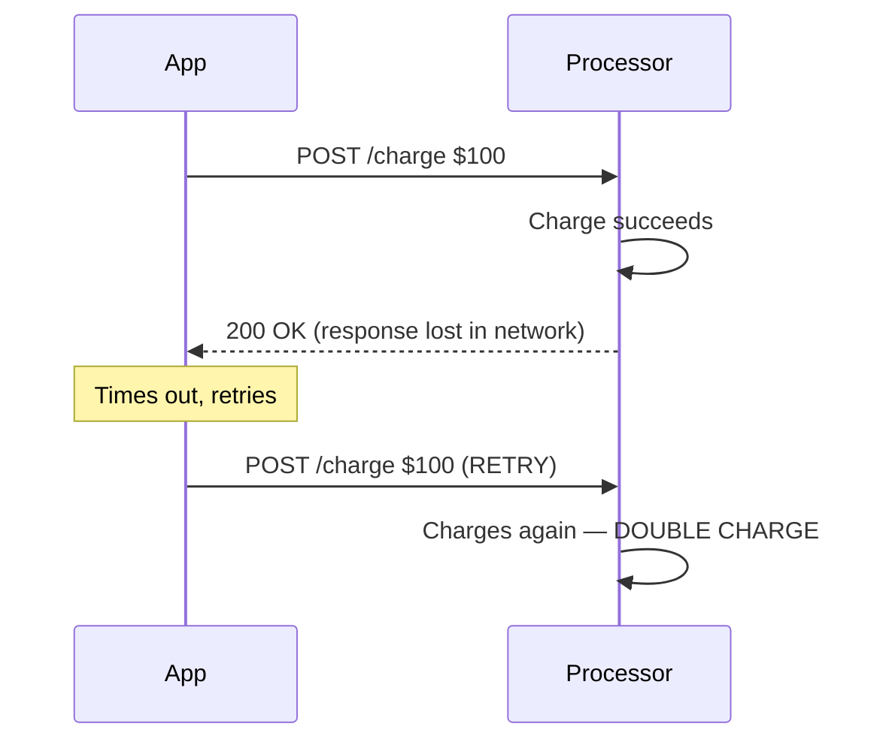
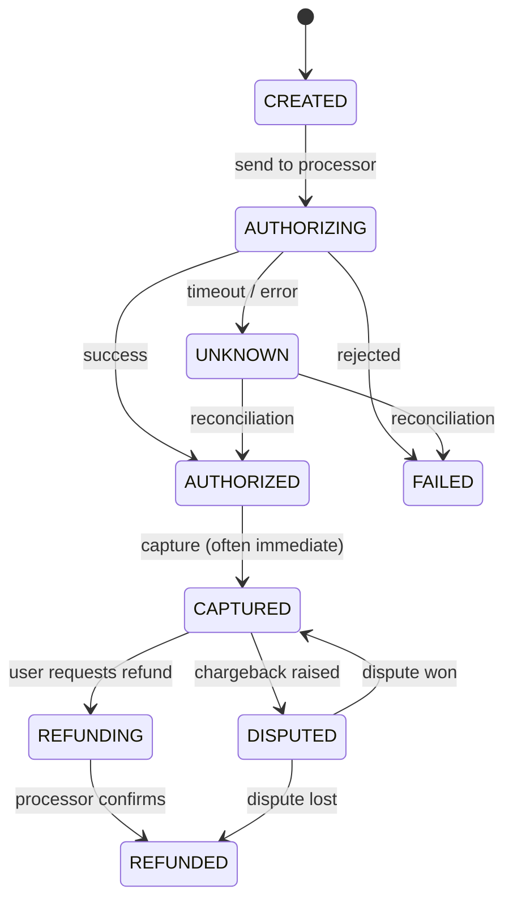
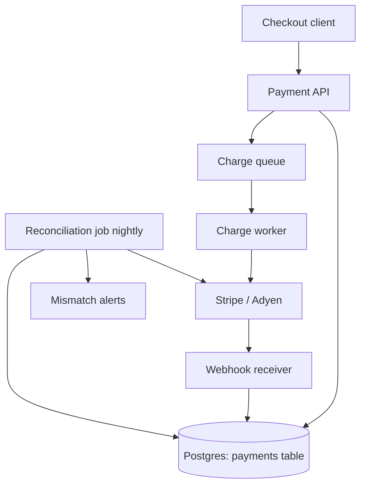
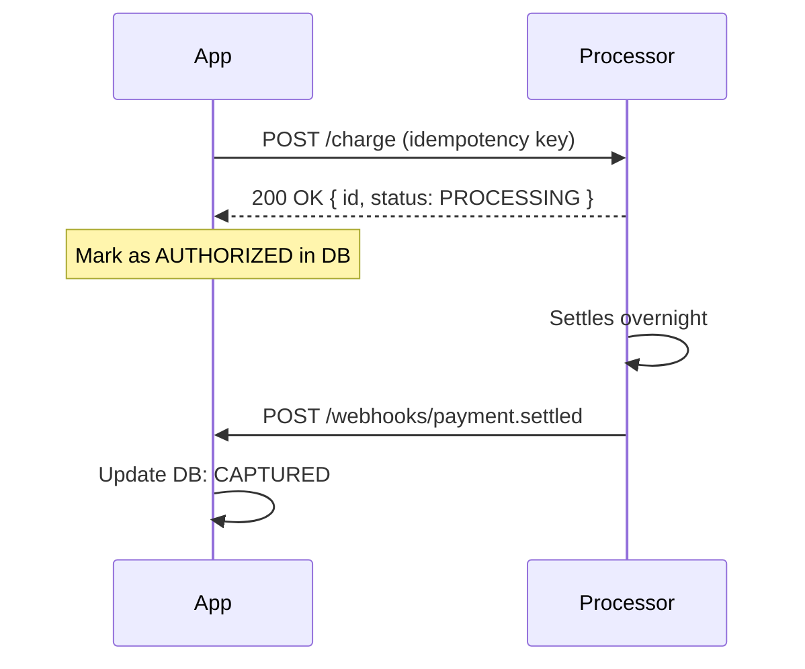
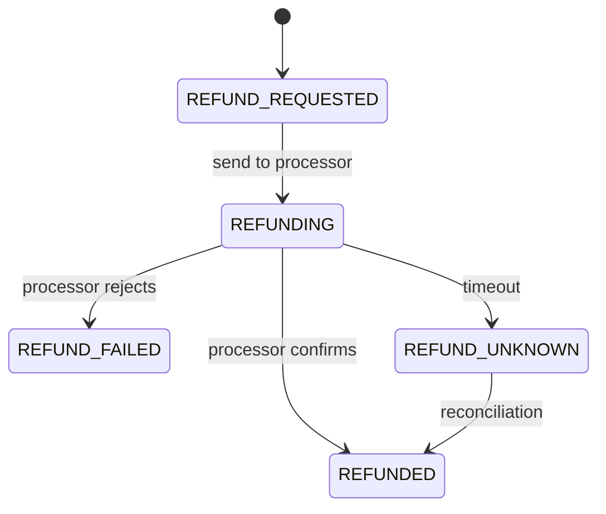
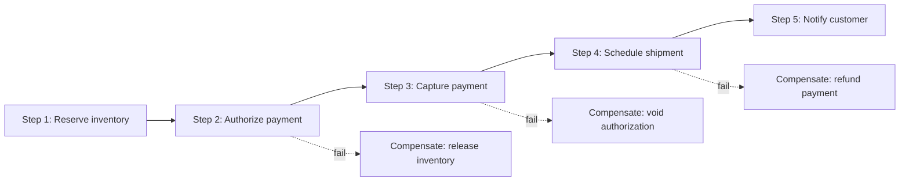
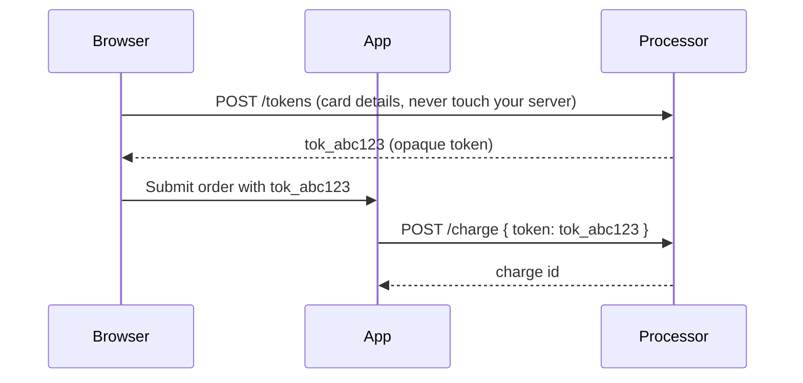

# Walkthrough: payments system (idempotency, double-charge, saga, refund, reconciliation)

A payments system is the canonical "correctness over latency" design problem. **Money cannot duplicate or vanish.** Every senior engineer working in fintech, e-commerce, or SaaS will be asked to design something like this — payment authorization, subscription billing, marketplace payouts, refunds, dispute handling.

The hard parts are **idempotency, double-charge prevention, distributed transactions, refunds, and reconciliation with external systems**. Latency targets are loose (a few seconds is fine); correctness targets are absolute.

## Step 1 — Clarify requirements

**Functional**:

- Customer initiates payment for an order.
- App charges via a payment processor (Stripe, Adyen, Braintree, Razorpay).
- Handle success, failure, retries.
- Refunds (full and partial).
- Webhooks from processor (async events: settled, disputed, refunded).
- Reconciliation: app's view = processor's view.

**Non-functional**:

- **No double-charges, ever.**
- **No silent payment loss** — if the user's card was charged, the app must know.
- Latency: a few seconds at checkout is fine.
- Throughput: depends on business; design for 100-1000 TPS for a typical SaaS.
- Auditability: every state change logged; immutable audit trail.

## Step 2 — The fundamental problem: networks lose messages

A naive payment flow:



The user is charged $200. Customer support is upset. This is not a hypothetical — it happens daily without idempotency.

## Step 3 — Idempotency keys

Every payment request carries a **unique key** the client generates. The processor stores `(idempotency_key, response)` for at least 24 hours. Same key within window → same response, no second charge.

```mermaid
sequenceDiagram
    participant App
    participant Processor
    App->>Processor: POST /charge $100 (Idempotency-Key: ord-1234)
    Processor->>Processor: Charge $100; store (ord-1234, response)
    Processor-->>App: 200 OK (response lost)
    App->>Processor: POST /charge $100 (Idempotency-Key: ord-1234) RETRY
    Processor->>Processor: Lookup ord-1234, found, return cached response
    Processor-->>App: 200 OK (same response)
    Note over App,Processor: No double-charge; one charge total
```

```java
@PostMapping("/payments")
public Payment charge(
        @RequestHeader("Idempotency-Key") String key,
        @RequestBody ChargeRequest req) {

    // Check if we've already processed this key
    Optional<Payment> existing = repo.findByIdempotencyKey(key);
    if (existing.isPresent()) return existing.get();

    // First time — process and store with the key
    Payment payment = processor.charge(req);
    payment.setIdempotencyKey(key);
    return repo.save(payment);   // Unique constraint on idempotency_key
}
```

**The key derivation**: where does the key come from? Stripe / Adyen require client-supplied UUIDs. Internally, derive from a stable order field — `idempotency_key = "order-${orderId}-charge-${attemptNum}"`. Same order, same retry → same key.

**Storage**:

- Database table with `UNIQUE INDEX (idempotency_key)`.
- Concurrent retries race at the unique constraint; loser reads winner's response.
- TTL: keep at least 24 hours; processor's window is the constraint.

## Step 4 — The state machine

A payment is a state machine. Every transition is a write to the database **before** any external call.



The crucial state is **UNKNOWN** — we don't know whether the charge succeeded. **You can never "just retry" from UNKNOWN** because you might double-charge. You must reconcile (query the processor) before retrying.

Two-phase pattern in code:

```java
@Transactional
public Payment initiateCharge(Order order) {
    // Persist intent BEFORE making the external call
    Payment p = new Payment();
    p.setOrderId(order.getId());
    p.setAmount(order.getTotal());
    p.setIdempotencyKey("order-" + order.getId());
    p.setStatus(PaymentStatus.AUTHORIZING);
    repo.save(p);
    return p;
}

public Payment processCharge(String paymentId) {
    Payment p = repo.findById(paymentId).orElseThrow();

    if (p.getStatus() != PaymentStatus.AUTHORIZING) {
        return p;  // Already done
    }

    try {
        ProcessorResponse resp = processor.charge(p.getIdempotencyKey(), p.getAmount());
        p.setStatus(PaymentStatus.AUTHORIZED);
        p.setProcessorRef(resp.getId());
    } catch (ProcessorException e) {
        // Network timeout, error — DON'T mark FAILED. Mark UNKNOWN, queue reconciliation.
        p.setStatus(PaymentStatus.UNKNOWN);
        reconcileQueue.send(p.getId());
    }
    return repo.save(p);
}
```

## Step 5 — Architecture



| Component        | Responsibility                                                      |
| ---------------- | ------------------------------------------------------------------- |
| Payment API      | Validates request, creates payment intent, returns immediately      |
| Postgres         | Source of truth. Every state change is a row update.                |
| Charge worker    | Picks up AUTHORIZING payments, calls processor with idempotency key |
| Processor        | External (Stripe / Adyen). Handles card networks, fraud check.      |
| Webhook receiver | Async events from processor (settled, refunded, disputed)           |
| Reconciliation   | Nightly job; compare app's view to processor's; flag mismatches     |
| Audit log        | Append-only; every state change recorded                            |

The **API returns fast** — payments table updated, queue sent, response back. Worker processes in background. Frontend polls for status or receives via WebSocket.

## Step 6 — Webhooks and async settlement

Many processors don't synchronously confirm. They return "accepted, will settle later." Settlement comes via a webhook hours or days later.



Webhook handler must be:

- **Idempotent** — processor retries webhooks; same event_id seen multiple times → process once.
- **Verified** — signature check (HMAC) so attackers can't fake events.
- **Fast** — 200 OK in under 5 seconds; do real work async.

```java
@PostMapping("/webhooks/payment")
public ResponseEntity<Void> handle(
        @RequestHeader("Stripe-Signature") String sig,
        @RequestBody String body) {

    // Verify signature
    if (!stripeClient.verifyWebhook(body, sig)) {
        return ResponseEntity.status(400).build();
    }

    StripeEvent event = parse(body);

    // Idempotent dedup on event ID
    if (processedEventRepo.existsByEventId(event.id())) {
        return ResponseEntity.ok().build();   // Already processed
    }

    // Persist + queue async work
    processedEventRepo.save(new ProcessedEvent(event.id()));
    eventQueue.send(event);
    return ResponseEntity.ok().build();
}
```

## Step 7 — Refunds

A refund is itself a payment-like state machine.



**Idempotency on refunds too**:

```
refund_idempotency_key = "payment-" + paymentId + "-refund-" + refundAttemptNum
```

**Edge cases**:

- Partial refund: tracking remaining refundable amount.
- Refund older than processor's window (180 days for many): different API path.
- Currency: refund must match original currency.

## Step 8 — Reconciliation

Nightly job: for every payment in the last N days, ask the processor "what is the status?" Compare to our DB. Flag mismatches.

```python
def reconcile():
    payments = db.query("SELECT * FROM payments WHERE updated_at > NOW() - INTERVAL '7 days'")
    for p in payments:
        processor_view = processor.fetch(p.processor_ref)
        if p.status != map_processor_status(processor_view.status):
            alert(f"Mismatch: payment {p.id} app={p.status} processor={processor_view.status}")
            # Don't auto-fix; escalate to human review
```

Why nightly?

- Catches UNKNOWN states that didn't get reconciled in real time.
- Catches webhook drops.
- Catches data corruption / bugs that miscount.

Big payment companies (Stripe, Adyen, banks) have dedicated reconciliation teams. Mismatches turn into customer support tickets if not detected.

## Step 9 — Distributed transactions: ordering vs payment

The classic problem: place an order, charge payment, reserve inventory, schedule shipment. Each is a separate service. They can't share a database transaction.

**Saga pattern** with compensations:



Compensations are **best-effort** — refund the payment, release the inventory. They are NOT byte-for-byte rollbacks; the world has moved on. Compensations are themselves idempotent (and have idempotency keys).

**Authorize then capture** is a payment-specific tool:

- **Authorize**: card network reserves the funds; not yet charged.
- **Capture**: actual transfer.
- If something fails between authorize and capture, **void** the authorization (no money moves).

This pattern lets you authorize early (before shipping), capture only when shipped. Reduces refund volume.

## Step 10 — Audit and immutability

Every state change is a row in an append-only audit table:

```sql
CREATE TABLE payment_audit (
    id BIGSERIAL PRIMARY KEY,
    payment_id UUID NOT NULL,
    from_status VARCHAR(20),
    to_status VARCHAR(20),
    actor VARCHAR(64),       -- service / user
    reason TEXT,
    occurred_at TIMESTAMPTZ NOT NULL,
    metadata JSONB
);
```

Never delete or update audit rows. Compliance (PCI-DSS, SOX) often requires 7 years retention.

## Step 11 — PCI-DSS

If you store card numbers, you're in PCI scope — heavy compliance burden. **The right answer is don't store cards yourself.** Use processor-issued tokens.



Card details go directly from browser to processor (Stripe Elements, Adyen Drop-in). Your server only sees the token. Drops you to **PCI-DSS SAQ A** scope — minimal compliance.

## Step 12 — Fraud and 3D Secure

Card networks require **Strong Customer Authentication (SCA)** in many regions. 3D Secure 2 is the protocol — bank challenges the customer on high-risk transactions.

Flow: charge → processor returns `requires_action` → frontend redirects to bank's challenge page → user authenticates → frontend confirms with processor. Add another state: `REQUIRES_ACTION`.

Fraud detection:

- Velocity checks: many cards from same IP, many cards on same email.
- Geolocation mismatch (card country ≠ IP country).
- Stolen-card lists from processor.
- Machine learning fraud scores (most processors offer this).
- 3DS for high-risk transactions.

## Common pitfalls

- **No idempotency keys** — double charges on retry.
- **Marking UNKNOWN as FAILED then retrying** — double charges.
- **Storing card numbers** — drops you into PCI-DSS Level 1 scope. Don't.
- **Synchronous webhooks doing real work** — slow webhook processing → processor times out → retries → duplicate processing without dedup.
- **Webhooks not signature-verified** — attacker fakes `payment.succeeded`.
- **Reconciliation only when something looks wrong**. Run nightly always; small mismatches accumulate.
- **Not handling currency** — multi-currency requires tracking presented vs settled currency, FX rates.
- **Retries without exponential backoff** — hammering the processor when it's already struggling.
- **Mixing presentation amounts with charge amounts** — display the amount the customer sees; charge in minor units (cents) to avoid floats.
- **Float arithmetic for money** — use `BigDecimal` (Java) or integer minor units. Never `double`.

## Interview answers

_Q: How do you prevent double-charges in payments?_
A: Three lines of defence: (1) idempotency keys per request — same key returns same response, no second charge; (2) state machine that distinguishes AUTHORIZING / AUTHORIZED / UNKNOWN, never auto-retrying from UNKNOWN; (3) reconciliation job that compares app's view to processor's view nightly, catching anything missed in real time.

_Q: Why is idempotency hard in payments?_
A: The network can lose either the request, the response, or the ack. The client can't know what state the processor is in. Without an idempotency key, every retry potentially re-runs the operation. With a key, the processor recognises the retry and returns the original response. Both client and server must implement it for safety.

_Q: How do you handle a payment that's stuck in UNKNOWN status?_
A: Never auto-retry from UNKNOWN. Reconcile by querying the processor for the original idempotency key — they have it. Their answer (succeeded / failed / never seen) updates our state. If they say succeeded, we move to AUTHORIZED. If never seen, we can retry safely. Reconciliation is a separate process from the user-facing flow.

_Q: How does the saga pattern apply to e-commerce checkout?_
A: Each step (inventory reserve, payment authorize, payment capture, shipping schedule) is a local transaction. Failure at step N triggers compensations for steps 1..N-1 in reverse — release inventory, void authorization. Compensations are idempotent and best-effort. The orchestrator (or event chain) tracks where in the saga the workflow is.

_Q: How do you scope PCI-DSS for a payments integration?_
A: Use processor-issued tokens. Card details go from browser → processor without touching your server (Stripe Elements, Adyen Drop-in). Server only stores opaque tokens. This drops you to SAQ A — minimal compliance. Storing real card numbers triggers Level 1, with quarterly audits and severe restrictions.

_Q: How would you handle a webhook that you receive twice?_
A: Dedup on the processor's event ID. Store every received event ID in a database with a unique constraint. Before processing, check existence. The webhook handler returns 200 immediately on duplicate. Processing itself is idempotent for safety (e.g. setting status to CAPTURED twice is a no-op).

_Q: How would you reconcile across services in a payment lifecycle?_
A: Nightly job pulls all payments updated in the last N days. For each, query the processor by idempotency key or processor reference. Compare statuses. Mismatches go to a queue for human review or automated correction (depending on policy). Track mismatch rate as a quality metric — should be near zero.

_Q: Why do you authorize before capturing?_
A: Authorization reserves the funds without charging. Capture moves the money. Between them, you can void the authorization with no money movement. Useful for: physical shipping (capture only when shipped), deferred charges, fraud review windows, multi-step workflows. Reduces refund volume because you can void instead of refund.
