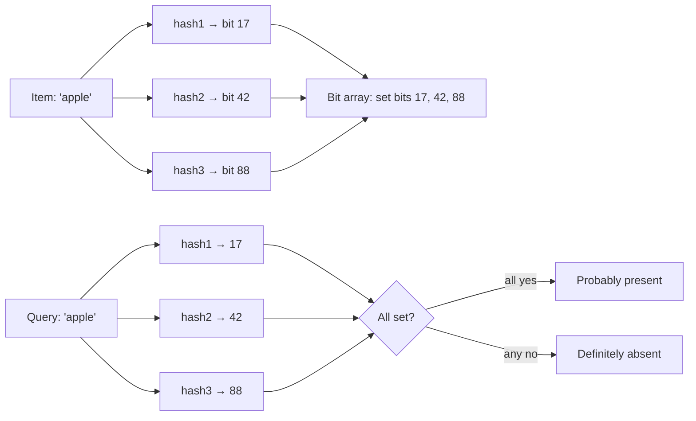
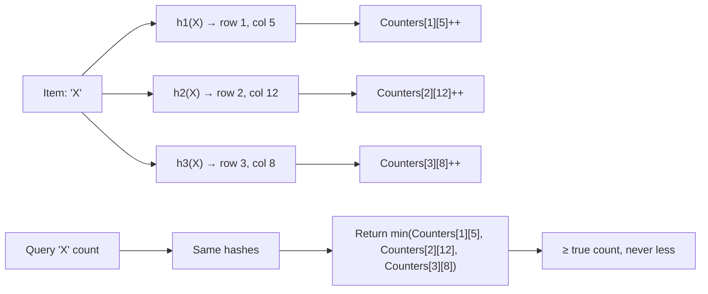
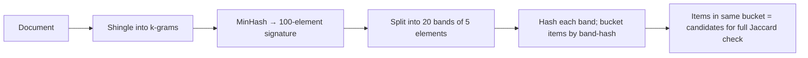

# Probabilistic data structures: Bloom filter, Count-Min sketch, HyperLogLog, MinHash, LSH

Probabilistic data structures trade exactness for **massive savings in space and time**. They give answers like "definitely not" or "approximately 1.2 billion unique users." For huge data, this is often all you need — and a deterministic answer would cost gigabytes.

Senior interviews touch these when you talk about caches, deduplication, analytics, search, recommendation, or anything that says "at scale." Knowing **the right one for the right problem** is a strong signal.

## When probabilistic beats exact

| Need                                     | Exact cost                  | Probabilistic alternative                                   |
| ---------------------------------------- | --------------------------- | ----------------------------------------------------------- |
| "Is this item in the set?"               | Hash set: O(N) memory       | **Bloom filter**: ~10 bits per item, 1% false positive rate |
| "How many unique users today?"           | HashSet of all users: GB    | **HyperLogLog**: 12 KB, ~2% error                           |
| "Top-K most frequent items in a stream?" | Hash + heap: O(N) memory    | **Count-Min sketch + heap**: KB, slight overcount           |
| "Is this document similar to that one?"  | All-pairs comparison: O(N²) | **MinHash + LSH**: O(N) for 'find similar'                  |

## Bloom filter

Probabilistic membership test. Tells you "definitely not in set" or "probably in set." **No false negatives**; configurable false positive rate.



Insert: hash item with `k` hash functions; set `k` bits in a bit array of size `m`.

Query: hash same way; check those `k` bits. All set → probably present. Any unset → definitely absent.

```java
class BloomFilter {
    private final BitSet bits;
    private final int size;
    private final int hashCount;

    public BloomFilter(int expectedItems, double fpRate) {
        this.size = (int) (-expectedItems * Math.log(fpRate) / Math.pow(Math.log(2), 2));
        this.hashCount = Math.max(1, (int) (size * Math.log(2) / expectedItems));
        this.bits = new BitSet(size);
    }

    public void add(String item) {
        for (int i = 0; i < hashCount; i++) {
            bits.set(hash(item, i));
        }
    }

    public boolean mightContain(String item) {
        for (int i = 0; i < hashCount; i++) {
            if (!bits.get(hash(item, i))) return false;
        }
        return true;   // probably; not certainly
    }

    private int hash(String item, int seed) {
        return Math.abs((item.hashCode() ^ seed) % size);
    }
}
```

**Sizing**: for 1M items at 1% false-positive rate → ~10 MB bit array, 7 hash functions. **For comparison**, a `HashSet<String>` of 1M URLs (avg 50 bytes) needs ~80 MB plus collection overhead.

**Real-world uses**:

- **Cassandra and HBase** — every SSTable has a Bloom filter; "is this key here?" without disk read.
- **Web crawlers** — "have I crawled this URL?" across billions.
- **Caches** — "is it worth checking the cache?" — avoid Redis hop on definite miss.
- **CDN routing** — "does this origin have this asset?"
- **Spell checkers** — quick word-exists check.

**Limitations**:

- Cannot delete (clearing bits would create false negatives). Use **Counting Bloom Filter** (each cell is a small counter) if delete is needed.
- Performance degrades as it fills. Resize / replace periodically.

## Count-Min sketch

Approximate frequency counter for streams. "How many times have I seen `userId=42`?" with sub-linear memory.

Two-dimensional array of counters; multiple hash functions. Increment all the cells the item maps to. Query: minimum across the cells (taking the min reduces overcount from collisions).



**Always overcounts; never undercounts** (because of hash collisions piling other items into the same cell; the min reduces the overcount).

**Use cases**:

- **Top-K** in a stream — combine with a min-heap of K candidates; CMS gives the count, heap maintains the top.
- **Heavy hitters** — find items above threshold.
- **DDoS detection** — flag IPs sending more than N req/sec.
- **Real-time analytics** — page-view counts per URL across a firehose.

Memory: typically a few KB to MB, regardless of stream size. Twitter, Heavy Hitters apps, Cloudflare DDoS detection use variants.

## HyperLogLog (HLL)

Approximate **cardinality** — "how many unique items have I seen?" with constant memory.

The intuition: hash each item to a uniformly random bit string. Track the **maximum number of leading zeros** seen in any hash. If you ever saw a hash starting with 10 zeros, you've probably seen ~2¹⁰ = 1024 unique items (because P(10 zeros) = 1/1024).

To reduce variance, use many "buckets" and average. HLL uses 2¹⁴ = 16,384 buckets in 12 KB and gives ~0.8% error for any cardinality from 0 to billions.

```java
// Conceptual
class HLL {
    private final byte[] buckets;
    private final int p;             // # bits for bucket index

    public HLL(int p) {
        this.p = p;
        this.buckets = new byte[1 << p];
    }

    public void add(String item) {
        long hash = hash64(item);
        int bucket = (int) (hash >>> (64 - p));         // top p bits → bucket
        long remaining = hash << p;                      // bottom 64-p bits
        int leadingZeros = Long.numberOfLeadingZeros(remaining) + 1;
        buckets[bucket] = (byte) Math.max(buckets[bucket], leadingZeros);
    }

    public long estimate() {
        // Harmonic mean of 2^bucket[i], with bias correction. Real impl is complex.
        ...
    }
}
```

**Real-world**:

- **Redis** has built-in HLL: `PFADD`, `PFCOUNT`, `PFMERGE`. 12 KB per HLL.
- **Postgres** has `hll` extension.
- **BigQuery and Druid** use HLL for approximate distinct counts.
- **Reddit, GitHub, Stripe** track unique visitors with HLL.

**Limitations**:

- Cannot enumerate the elements — only count them.
- Cannot remove an element. Merge two HLLs by max per bucket; intersection is harder.

## MinHash

Approximate **Jaccard similarity** between sets — "how similar are these two sets?" Useful for documents, user behaviour, recommendations.

Jaccard: `|A ∩ B| / |A ∪ B|`. Computing exactly requires both full sets.

MinHash trick: for `k` independent hash functions, each set's "signature" is the minimum hash value across all elements. Probability that two sets share a min-hash equals their Jaccard similarity. Use `k = 100` hash functions; estimated similarity = fraction matching.

```
set_A = {"cat", "dog", "fish"}
hash1(A) = min(hash1("cat"), hash1("dog"), hash1("fish")) = 12
hash2(A) = min(hash2(...)) = 47
... 100 hashes total

Compare to set_B's 100-hash signature: count matches / 100 = estimated Jaccard.
```

**Used in**:

- **Plagiarism detection** — convert document to set of shingles (n-grams), compute MinHash, compare.
- **Near-duplicate detection** — Google, search engines find duplicate web pages.
- **Recommendation systems** — find users with similar interaction sets.

## Locality-Sensitive Hashing (LSH)

MinHash gives pairwise similarity. But comparing all pairs is `O(N²)` — too slow for millions of documents.

LSH groups items into **buckets** so similar items are likely to share a bucket. Look up similar items in `O(1)` per query. Build by hashing the MinHash signature into bands; items sharing any band → candidate similar pair.



LSH reduces "find similar docs" from `O(N²)` to roughly `O(N)` for the index plus `O(1)` for queries. Adopted by recommendation systems, image similarity, deduplication pipelines.

## Skip lists (honourable mention)

Probabilistic alternative to balanced trees. Each node has multiple "express lanes" with random heights. Expected `O(log n)` operations.

Used in: Redis sorted sets, LevelDB / RocksDB write-ahead structure, in-memory databases. Often simpler to implement and concurrency-friendly compared to red-black trees.

## When NOT to use probabilistic

- **You need certainty**. Banking, ID lookups, anywhere a false positive is catastrophic. Bloom says "maybe present" — confirm with the source of truth.
- **Small data**. A `HashSet` is simpler. Probabilistic wins at scale.
- **Need to enumerate elements**. None of these support full iteration.
- **Cardinality is small** (under 10K). Exact set is fine.

## Common pitfalls

- **Treating Bloom positives as truth**. Always verify with the source — Bloom only tells you the source might have it.
- **Sizing Bloom filter wrong**. Too small → high false-positive rate. Too large → wasted memory. Calculate from expected items + target rate.
- **Concatenating two HLLs by adding counts**. Wrong. Use `PFMERGE` (max per bucket).
- **Using one hash function for Bloom**. Need `k` independent hashes. In practice: hash once with two distinct seeds, combine: `h1 + i * h2`.
- **Counting unique with HashSet at scale**. 100M unique strings × 50 bytes = 5 GB. HLL: 12 KB.
- **Underestimating Count-Min overcount**. Errors accumulate in proportion to total stream weight. Tune width and depth.

## Interview answers

_Q: When would you use a Bloom filter?_
A: When you need fast "is this in the set?" lookup at huge scale and can tolerate a small false-positive rate. Cassandra uses one per SSTable to avoid disk reads on cache miss. Web crawlers use one to avoid re-fetching billions of URLs. Always pair with a source-of-truth check after a positive — Bloom only says "maybe."

_Q: How does HyperLogLog estimate cardinality?_
A: Hash each element to a uniformly random bit string. Track the maximum number of leading zeros across all hashes — if you've seen 10 leading zeros, you've probably seen ~2^10 unique items. Use many buckets and harmonic-mean their estimates to reduce variance. Constant memory regardless of cardinality; ~0.8% error in 12 KB.

_Q: How does Count-Min sketch differ from a Bloom filter?_
A: Bloom filter says "in / not in." Count-Min sketch counts frequency. Both use multiple hash functions and tolerate collisions, but with different guarantees. Bloom: no false negatives, possible false positives on membership. CMS: never undercounts, may overcount because of collisions piling up.

_Q: How would you find the top 10 most-active IPs in a high-volume stream?_
A: Count-Min sketch + min-heap of size 10. Each IP increments its CMS counters. Get its current count from CMS. If count exceeds heap minimum, push into heap. Memory bounded by CMS dimensions × bits per counter, plus 10-element heap. Used in DDoS detection and real-time analytics.

_Q: Why is MinHash useful for finding similar documents?_
A: It estimates Jaccard similarity in `O(k)` per pair, where `k` is the signature size (e.g. 100). Combined with LSH for indexing, you avoid `O(N²)` all-pairs comparison and find near-duplicates in roughly linear time. Powers search-engine deduplication, plagiarism detection, recommendation similarity.

_Q: How do you delete an element from a Bloom filter?_
A: You can't, in a standard Bloom filter — clearing bits would create false negatives. Use a **Counting Bloom Filter** where each cell is a small counter (e.g. 4 bits). Increment on add, decrement on delete. Trades 4x more memory for delete support.

_Q: What's the trade-off of probabilistic data structures?_
A: Memory and speed for accuracy. They give you bounded error rates (you choose) for orders-of-magnitude less memory and faster queries. The right call when error tolerance is acceptable — analytics, caching, similarity search. The wrong call when correctness is required — banking, identity, anywhere a wrong answer harms users.

_Q: How does Redis use HLL in production?_
A: `PFADD key item` adds an item; `PFCOUNT key` returns approximate cardinality. `PFMERGE dest src1 src2` combines HLLs (max-per-bucket). Used for distinct-visitor counts, unique-event tracking, daily / weekly / monthly active users. Each HLL is 12 KB regardless of how many items it has counted.
