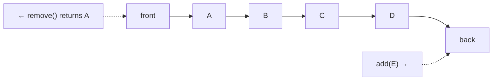
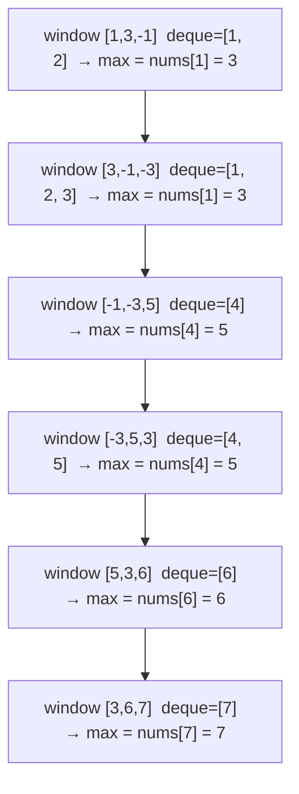

# Queues: priority queues, deques, sliding window maximum

A queue is "first in, first out." Add at the back, remove from the front. The mental model is a checkout line. Queues come up everywhere: BFS, task scheduling, message buses, throttling, event loops.



In Java, prefer `Deque<Integer> queue = new ArrayDeque<>()`. Operations:

| Operation | `Queue` API | `Deque` (front) | `Deque` (back) |
| --------- | ----------- | --------------- | -------------- |
| Add       | `offer`     | `offerFirst`    | `offerLast`    |
| Remove    | `poll`      | `pollFirst`     | `pollLast`     |
| Peek      | `peek`      | `peekFirst`     | `peekLast`     |

## 1. Queue powers BFS

Breadth-first search visits nodes by distance from the start. The queue holds the **frontier** — nodes seen but not yet expanded.

```java
List<Integer> bfs(Map<Integer, List<Integer>> graph, int start) {
    Set<Integer> visited = new HashSet<>();
    Deque<Integer> queue = new ArrayDeque<>();
    List<Integer> order = new ArrayList<>();
    queue.offer(start);
    visited.add(start);
    while (!queue.isEmpty()) {
        int node = queue.poll();
        order.add(node);
        for (int next : graph.getOrDefault(node, List.of())) {
            if (visited.add(next)) queue.offer(next);
        }
    }
    return order;
}
```

If you replace the queue with a stack you get DFS. The data structure decides the traversal order.

## 2. Priority queue — heap-backed

A priority queue serves elements by priority, not by insertion order. Java's `PriorityQueue` is a min-heap by default. `O(log n)` insert and remove, `O(1)` peek.

```java
PriorityQueue<Integer> minHeap = new PriorityQueue<>();
minHeap.offer(5); minHeap.offer(1); minHeap.offer(3);
minHeap.poll();  // 1
minHeap.poll();  // 3
minHeap.poll();  // 5

// Max-heap: reverse the comparator
PriorityQueue<Integer> maxHeap = new PriorityQueue<>(Comparator.reverseOrder());
```

**Top-k pattern** — keep a min-heap of size `k`, push every element, pop when size exceeds `k`. The `k` largest elements remain.

```java
int[] topK(int[] nums, int k) {
    PriorityQueue<Integer> heap = new PriorityQueue<>();  // min-heap
    for (int n : nums) {
        heap.offer(n);
        if (heap.size() > k) heap.poll();
    }
    int[] result = new int[k];
    for (int i = 0; i < k; i++) result[i] = heap.poll();
    return result;
}
```

Time: `O(n log k)`. Space: `O(k)`. Beats sorting (`O(n log n)`) when `k << n`.

**Other priority-queue uses**: Dijkstra's shortest path (frontier ordered by distance), event-driven simulation, merge-k-sorted-lists, scheduling.

## 3. Deque — push/pop on both ends

A deque (double-ended queue) lets you add and remove at both ends in `O(1)`. It is the go-to data structure for the **monotonic deque** pattern.

## 4. Sliding window maximum — the canonical deque problem

Given an array and a window size `k`, return the maximum value inside each sliding window.

Naive: `O(n * k)`. Sort each window: still `O(n * k log k)`.

The deque trick gets it to `O(n)`. Maintain a **monotonic decreasing deque of indices**. The invariant: the front always holds the index of the current window's maximum.

```java
int[] maxSlidingWindow(int[] nums, int k) {
    int n = nums.length;
    int[] result = new int[n - k + 1];
    Deque<Integer> dq = new ArrayDeque<>();  // indices, values decreasing front→back
    for (int i = 0; i < n; i++) {
        // 1. Drop indices that fall out of the window from the front
        while (!dq.isEmpty() && dq.peekFirst() <= i - k) dq.pollFirst();
        // 2. Drop smaller values from the back — they cannot be future maxima
        while (!dq.isEmpty() && nums[dq.peekLast()] < nums[i]) dq.pollLast();
        dq.offerLast(i);
        // 3. Window is full → record answer
        if (i >= k - 1) result[i - k + 1] = nums[dq.peekFirst()];
    }
    return result;
}
```

Walk through `nums = [1, 3, -1, -3, 5, 3, 6, 7]`, `k = 3`:



Each index is added once and removed at most once, so total work is `O(n)`.

## 5. Other queue patterns

- **BFS layered** — instead of recording one node per dequeue, dequeue an entire layer (`size = queue.size()`) per iteration. Useful for "level order traversal" or "shortest path in unweighted graph."
- **Multi-source BFS** — initial frontier has multiple starting nodes (e.g. "rotting oranges": all rotten cells start in the queue together).
- **0-1 BFS** — when edges have weight 0 or 1, use a deque. Push 0-edges to the front, 1-edges to the back. Beats Dijkstra for binary-weight graphs.

## Common mistakes

- **Using `LinkedList` as a queue**. Works but slower than `ArrayDeque`. Allocates a node per offer.
- **Passing the wrong comparator to `PriorityQueue`**. Default is min-heap. For max-heap or custom order, pass a `Comparator`. Easy to forget and silently get wrong order.
- **Forgetting `offer` vs `add`**. `add` throws on capacity overflow; `offer` returns `false`. For `ArrayDeque` they behave the same (no capacity), but `offer` reads more naturally.
- **Mutating elements already inside a `PriorityQueue`**. The heap order silently breaks. To "decrease key," remove and re-insert, or use a separate "lazy deletion" pattern.

## Interview answers

_Q: Why does Dijkstra's algorithm use a priority queue?_
A: At every step we want to expand the closest unvisited node. A priority queue gives that in `O(log n)` per extract. With `m` edges and `n` nodes, total time is `O((n + m) log n)`. A plain queue would force `O(n)` linear scans for the minimum.

_Q: Walk me through sliding window maximum on `[4, 2, 1, 3]` with `k = 2`._
A: i=0, val=4, deque=[0], not yet at window. i=1, val=2, 2<4 keep deque, deque=[0,1], window=[4,2], max=4. i=2, val=1, drop index 0 (i-k=0, peekFirst=0 → pop), deque=[1], 1<2 keep, deque=[1,2], window=[2,1], max=2. i=3, val=3, drop index 1, deque=[2], 1<3 pop, deque=[3], window=[1,3], max=3. Result: [4, 2, 3].

_Q: When would you build your own queue from two stacks?_
A: Almost never in production (use the standard library). In interviews it tests amortized analysis: each element moves between the two stacks at most once. In a system like a service worker pool you might have a similar structure where a "scheduled" pool feeds an "active" pool, and the move from one to the other is rare.

_Q: How does a circular buffer relate to a queue?_
A: A circular buffer is a queue implemented on a fixed-size array with two pointers (head, tail) that wrap around. `O(1)` for both operations, no allocations after construction, used heavily in audio/video buffers, kernel I/O queues, and Disruptor-style high-performance message passing.

_Q: How would you handle a queue that needs both priority and FIFO order for ties?_
A: Two options. (1) Use a `PriorityQueue` whose comparator falls back to insertion order — track a sequence number alongside each element and break ties with it. (2) Use multiple FIFO queues, one per priority bucket; serve from highest priority that has work. The bucket approach scales worse on priorities but keeps each queue cheap.
