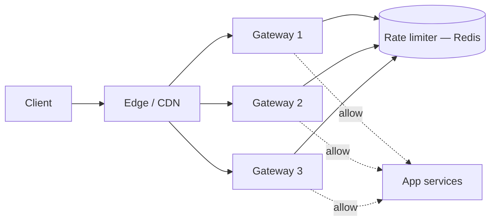
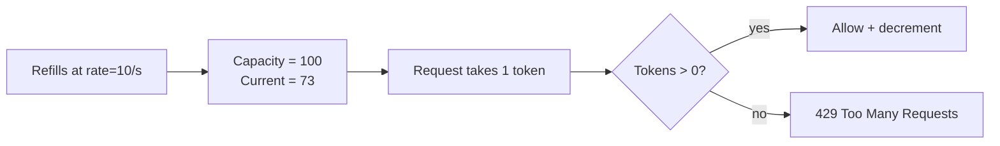
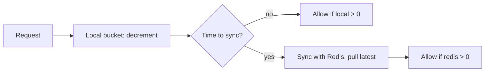

# Walkthrough: distributed rate limiter (token bucket)

A rate limiter prevents abuse, controls costs, and protects downstream services. Senior interviews use it to test whether you can design something **distributed, low-latency, and atomic** — three constraints that pull in different directions.

## Step 1 — Clarify requirements

**Functional**:

- Limit per-user (or per-API-key, per-IP, per-endpoint) request rate.
- Return HTTP `429 Too Many Requests` when exceeded.
- Include `Retry-After` and `X-RateLimit-*` headers.
- Different limits per tier (free: 100/min, paid: 10K/min).

**Non-functional**:

- Decision latency < 1ms (added to every request).
- Fair across many gateway nodes.
- Survive Redis hiccups gracefully.
- Atomic (no race that allows over-limit traffic).

## Step 2 — Where does it live?



Rate limiting at the **gateway** (or an Envoy/Nginx filter) is standard. Each gateway calls the shared rate-limit store. Some implementations push it into the app for per-route logic; gateway is preferred for protection.

## Step 3 — Algorithms

### Token bucket (most common)

Each key has a bucket with `capacity` tokens that refills at `rate` tokens/sec. Each request takes 1 token; empty bucket → reject.



Allows **bursts up to capacity** (a user idle for 10s gets 100 tokens). Smooths long-term to `rate`.

### Leaky bucket

Same shape but serves at constant rate; excess queues (or drops). Smooths traffic but does not allow bursts.

### Fixed window

Count requests in 1-minute buckets. Simple; suffers from "double rate at boundary" — a user can fire 2× the limit if they hit the end of one window and start of the next.

### Sliding window log

Store every request timestamp; count those within the last minute. Precise but `O(N)` storage per user.

### Sliding window counter

Approximate by weighting two adjacent fixed windows by their elapsed fraction. Cheap and accurate enough for most cases.

```
At time t inside the current window:
  count = current_window_count
        + (1 - elapsed_fraction) × previous_window_count
```

| Algorithm              | Allows bursts     | Storage      | Precision     |
| ---------------------- | ----------------- | ------------ | ------------- |
| Token bucket           | Yes               | O(1)         | High          |
| Leaky bucket           | No                | O(1) + queue | High          |
| Fixed window           | Burst at boundary | O(1)         | Low           |
| Sliding window log     | No                | O(N)         | Highest       |
| Sliding window counter | Yes               | O(1)         | High (approx) |

**Token bucket and sliding window counter are the typical production choices.**

## Step 4 — Atomicity is the hard part

Two gateway nodes both check the bucket simultaneously, both see "tokens > 0", both decrement. Now bucket is over-spent. Race condition.

**Solution: Lua script in Redis** — single atomic operation.

```lua
-- KEYS[1] = bucket key, ARGV = { capacity, rate, now, requested }
local capacity = tonumber(ARGV[1])
local rate     = tonumber(ARGV[2])
local now      = tonumber(ARGV[3])
local requested = tonumber(ARGV[4])

local data = redis.call('HMGET', KEYS[1], 'tokens', 'ts')
local tokens = tonumber(data[1]) or capacity
local ts     = tonumber(data[2]) or now

-- Refill since last update
local delta = math.max(0, now - ts) * rate / 1000
tokens = math.min(capacity, tokens + delta)

if tokens >= requested then
    tokens = tokens - requested
    redis.call('HMSET', KEYS[1], 'tokens', tokens, 'ts', now)
    redis.call('PEXPIRE', KEYS[1], math.ceil(capacity * 1000 / rate))
    return 1
else
    redis.call('HMSET', KEYS[1], 'tokens', tokens, 'ts', now)
    return 0
end
```

The script runs server-side in Redis; Redis is single-threaded so it executes atomically. Returns `1` (allowed) or `0` (rejected).

**Use server-side time** (`redis.call('TIME')`) instead of trusting client clocks — clock skew between gateway nodes can corrupt the bucket.

## Step 5 — Java gateway side

```java
@Component
class RateLimiter {
    private final RedisTemplate<String, String> redis;
    private final RedisScript<Long> script;   // pre-loaded SHA via EVALSHA

    public boolean allow(String userId, int capacity, double ratePerSec) {
        long now = System.currentTimeMillis();
        Long allowed = redis.execute(script,
            List.of("ratelimit:" + userId),
            String.valueOf(capacity),
            String.valueOf(ratePerSec),
            String.valueOf(now),
            "1");
        return allowed != null && allowed == 1;
    }
}

// In a filter
@Component
class RateLimitFilter extends OncePerRequestFilter {
    private final RateLimiter limiter;

    protected void doFilterInternal(HttpServletRequest req, HttpServletResponse res, FilterChain chain)
        throws ServletException, IOException {
        String userId = extractUserId(req);
        if (!limiter.allow(userId, 100, 10.0)) {
            res.setStatus(429);
            res.setHeader("Retry-After", "60");
            res.setHeader("X-RateLimit-Limit", "100");
            res.setHeader("X-RateLimit-Reset", "60");
            return;
        }
        chain.doFilter(req, res);
    }
}
```

## Step 6 — Multiple buckets per request

Real systems have layered limits:

- Global limit per IP (DDoS protection).
- Per-user limit.
- Per-endpoint limit (login is more sensitive than feed).
- Per-tier limit (free vs paid).

Apply all relevant buckets; reject if any one fails. Order them cheap-to-expensive — IP check first; user-specific check second.

## Step 7 — Failure modes

### Redis unavailable

| Strategy       | Behavior                                 | Risk                          |
| -------------- | ---------------------------------------- | ----------------------------- |
| Fail open      | Allow all traffic when Redis down        | Abuse during outage           |
| Fail closed    | Reject all traffic when Redis down       | Whole API offline             |
| Local fallback | Each gateway uses local in-memory bucket | Per-gateway limits, less fair |

**Common production choice**: local in-memory fallback during Redis outage with per-gateway limits (lower than the global to be safe). Document the behavior.

### Local cache + Redis (two-tier)

Each gateway maintains an in-process cache. Decrements locally, sync with Redis periodically (every 100ms or every N requests). Reduces Redis QPS by ~10x but allows brief over-limit windows. Trade precision for cost.



Used by Stripe, Cloudflare. Acceptable when slight over-limit is OK.

## Step 8 — Headers

Always tell the client what is happening:

```http
HTTP/1.1 429 Too Many Requests
Retry-After: 30
X-RateLimit-Limit: 100
X-RateLimit-Remaining: 0
X-RateLimit-Reset: 1742398260
```

`Retry-After` is the seconds until reset (or a fixed delay). Well-behaved clients use it for backoff.

## Step 9 — Estimate the rate-limiter itself

```
Peak request QPS              = 100K
Decisions/req                 = 3 (IP + user + endpoint)
Total Redis ops/sec           = 300K
One Redis instance            = ~100K ops/sec
Redis cluster                 = 3-5 instances (sharded by key)
```

Each gateway round-trip to Redis is ~0.5ms in same-region. Adds < 1ms to request latency.

## Common pitfalls

- **Trusting client-supplied timestamps**. Clients can lie. Use server-side time.
- **Race conditions from multi-step Redis calls**. Always use a Lua script (atomic) or `WATCH/MULTI/EXEC` with retry loop.
- **No per-user keying** — applying a global limit. One abusive user blocks everyone.
- **Rate limiting after authentication**. An unauth flood still hits your servers. Apply IP-based limits before auth.
- **No fallback for Redis outage**. API goes down with Redis. Either local in-memory fallback or fail-open with logging.
- **Counting failed requests**. A user who hammers a wrong-password endpoint should be limited; do count those.
- **Missing headers**. Clients cannot back off if you do not tell them when to retry.

## Interview answers

_Q: Walk me through token bucket._
A: Each key has a bucket with `capacity` tokens, refilling at `rate` tokens per second. On request, refill the bucket based on elapsed time (capped at capacity), then decrement by 1. If tokens ≥ 1, allow; else reject. State stored in Redis as `tokens, ts` — a Lua script handles refill + decrement atomically.

_Q: Why does the fixed-window algorithm allow boundary bursts?_
A: A user can send `limit` requests at second 59 of one window and another `limit` at second 0 of the next. Effective rate is `2 × limit / 1 second`. Sliding-window counter fixes this by weighting the previous window's count by the fraction of the current minute that has not elapsed.

_Q: How do you guarantee atomicity when many gateways check the same bucket?_
A: Lua script in Redis. Redis is single-threaded; the script runs to completion before any other command. Multi-step operations would be racy because two gateways could both see "tokens=1" before either decrements. The script reads, computes, writes in one indivisible operation.

_Q: What happens if Redis goes down?_
A: Two main strategies. Fail open — allow all traffic with logging — risks abuse during outage. Fail closed — reject all — kills the API. Most production systems use a local in-memory fallback with conservative per-gateway limits. The conservative limit ensures the global system does not exceed total expected limit even without coordination.

_Q: How would you design layered rate limits?_
A: Apply multiple buckets in order from cheap to expensive: IP first (cheap, broad protection), then user-specific (sensitive), then per-endpoint (auth-required, strict). Reject as soon as any one fails. The order matters for cost — do not query a user-bucket if the IP is already over limit.

_Q: How do you rate-limit by IP when behind a load balancer?_
A: The load balancer forwards client IP via `X-Forwarded-For` header. Trust only the right IP from a trusted LB; otherwise an attacker spoofs the header. Take the leftmost IP (closest to client) and rate-limit on that. For Cloudflare, use `CF-Connecting-IP` instead, which is set by Cloudflare and unforgeable.

_Q: When would you use leaky bucket over token bucket?_
A: When you must smooth traffic to a constant rate (e.g. SMS sends to a provider that throttles strictly). Leaky bucket queues excess at the limiter; token bucket drops or rejects. Token bucket is better for "burst is OK, long-term avg matters"; leaky bucket is better for "smooth output regardless of input."
