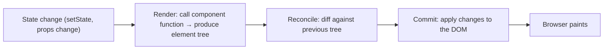
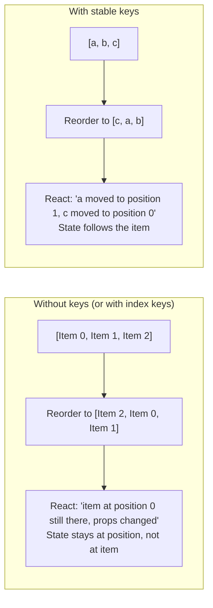
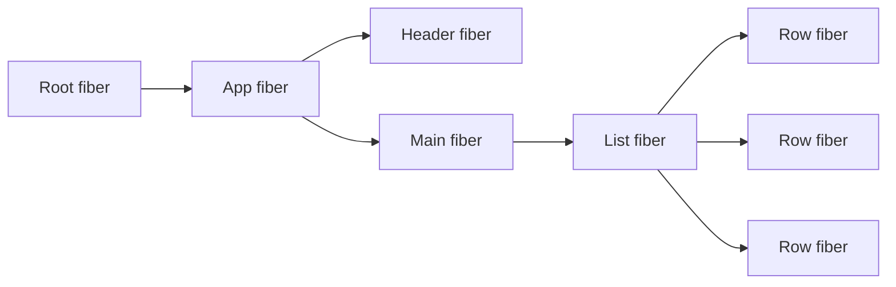
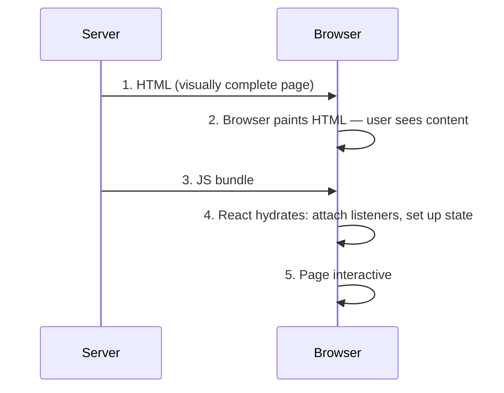

# React engine: Virtual DOM, reconciliation, Fiber, lanes, concurrency, hydration

React's job is to keep the UI in sync with state. The interesting question is **how**: when does a component render, how does React decide what changed, when does the user actually see the result. Senior interviews probe these mental models because every performance bug and hydration mismatch traces back to them.

## What "render" means in React



A React render is **just calling the component function**. It does not touch the DOM. It produces a new element tree (the "Virtual DOM"). React then **reconciles** — diffs against the previous tree — and **commits** only the actual changes to the real DOM.

The phases:

1. **Render phase** — pure, can be paused, restarted, abandoned. Your component code runs here.
2. **Commit phase** — synchronous, runs DOM mutations and effects. Cannot be interrupted.

This separation is the foundation for concurrent rendering. The render phase is **idempotent** because React may run it many times for the same update.

## The Virtual DOM and reconciliation

The Virtual DOM is **just a tree of plain JavaScript objects** describing what the UI should look like.

```jsx
<div className="box">
  <span>hi</span>
</div>

// becomes

{
  type: 'div',
  props: { className: 'box' },
  children: [
    { type: 'span', props: {}, children: ['hi'] }
  ]
}
```

When state changes, React calls the component again, gets a new tree, and diffs. The diffing rules are simple but important:

| Old type → New type      | What React does                               |
| ------------------------ | --------------------------------------------- |
| Same component type      | Update props, reuse instance, run hooks again |
| Different component type | Unmount old, mount new (state lost)           |
| Same DOM tag             | Update attributes, recurse on children        |
| Different DOM tag        | Tear down subtree, rebuild                    |

## Keys — identity, not order



The lesson: **keys must be stable identifiers tied to the data, not array index**. Use `array.map((item) => <Row key={item.id} item={item} />)`, not `<Row key={index} />`.

When does the bug bite? When the list **reorders** (sort, filter, drag-and-drop). With index keys, the form input state stays at index 0 even though item 0 is now a different row. Classic invisible bug — looks correct on first render, breaks on user interaction.

## Fiber and lanes — the engine that powers concurrency

Before React 16, reconciliation was a single recursive function. Once started, it had to finish — no way to pause for a higher-priority update. The browser stalled on big trees.

**Fiber** is a linked-list representation of the component tree where each node ("fiber") is a unit of work. React processes fibers in a loop that **yields to the browser** when needed and resumes later.



Each fiber stores:

- The component or DOM type.
- Current props and state.
- Pointers to parent, child, sibling.
- A linked list of pending hooks and updates.

**Lanes** are priority buckets. A click is `SyncLane`, a transition is `TransitionLane`, an idle update is `IdleLane`. When a high-priority update arrives mid-render, React abandons the in-flight low-priority work and starts the high-priority one. This is what makes `useTransition` cheap.

## Concurrent rendering — what changed

Modern React (18+) renders **concurrently by default** when you opt in via `createRoot`, `useTransition`, `Suspense`, etc. The key invariants this requires from your components:

1. **Components must be pure**. Render can run zero, one, or many times for the same update. No side effects in the render body.
2. **State updates batched across event boundaries**. `setState` inside `setTimeout`, promises, or async functions are also batched in React 18.
3. **Effects run after commit**. The DOM is updated; the user sees it; then `useEffect` runs.

Components must therefore avoid:

- Mutating refs during render.
- Setting state directly during render (without the special "update state during render" pattern, which itself signals refactor needed).
- Reading the DOM during render.
- Logging or analytics events during render.

```jsx
// BAD — side effect during render, can run many times under concurrent
function Cart({ items }) {
  analytics.track('cart_viewed', { count: items.length }) // ← runs every render
  return <Total items={items} />
}

// GOOD — side effect in effect, runs once per commit
function Cart({ items }) {
  useEffect(() => {
    analytics.track('cart_viewed', { count: items.length })
  }, [items.length])
  return <Total items={items} />
}
```

## Hydration — bridging server-rendered HTML

Server-rendered React produces HTML. Hydration is the process where React **attaches event listeners and sets up state** without rebuilding the DOM. The HTML is already there; React just takes ownership.



**Hydration mismatches** happen when the client renders different output than the server. Common causes:

- `Date.now()` or `Math.random()` during render — different values on server and client.
- Browser-only APIs read during render (`window.innerWidth`).
- Locale-dependent formatting differing between server timezone and browser.
- Conditional rendering on `typeof window !== 'undefined'`.

Fix: use `useEffect` for code that must run only on the client, or `useSyncExternalStore` for external stores. React 18+ recovers from mismatches by re-rendering the affected subtree but logs a warning.

## Selective hydration and Suspense

React 18 hydrates eagerly but **prioritises whatever the user interacts with first**. If a user clicks before hydration finishes, React drops the in-flight work and hydrates that subtree first.

`<Suspense>` boundaries become **hydration boundaries** — the parent can hydrate while the child is still loading data. This is the foundation of streaming SSR.

## Common mistakes

- **Mutating state directly**. `state.items.push(x); setState(state)` — React's diffing relies on referential changes. Always create a new object/array.
- **Using array index as key for reorderable lists**. Component state moves to wrong items.
- **Calling `setState` during render outside the supported pattern**. Infinite render loop.
- **Reading from refs to avoid re-render but expecting reactive behavior**. Refs are escape hatches; reading them does not subscribe to changes.
- **Long-running synchronous work inside the render body**. Blocks the UI even with concurrent React. Move expensive computation to a worker or memoize.
- **Effects that fight each other**. Two effects update overlapping state and trigger each other on every render. Refactor.

## Interview answers

_Q: What does the Virtual DOM actually do?_
A: It is a JavaScript representation of the UI that is cheap to create and diff. React compares new and previous trees, then patches only the differences to the real DOM. The win is that batching multiple state changes into one DOM update is cheaper than naive direct DOM manipulation, and the diff is in JavaScript memory.

_Q: When would you not use a list key?_
A: Always use a key for lists. The question is what to use. For static lists that never reorder or filter, the index works (and React even allows it). For anything dynamic — sortable, filterable, draggable — you need a stable id from the data itself.

_Q: How does Fiber differ from the pre-Fiber reconciler?_
A: Pre-Fiber was recursive and synchronous: once it started reconciling a tree, it could not pause. Fiber represents the tree as a linked list of work units; React processes them in a loop that yields to the browser. This enables priority-based scheduling, time-slicing, and concurrent rendering.

_Q: Why must components be pure under concurrent rendering?_
A: React may render the same component multiple times for the same update — to evaluate priorities, time-slice, or recover from concurrent state changes. Side effects in the render body (logging, mutations, network calls) can run zero, one, or many times. Putting them in `useEffect` makes them run exactly once per commit.

_Q: What causes a hydration mismatch?_
A: The component renders different output on the server and the client. Common culprits: time-based values, browser-only API reads, locale formatting, feature flags, or A/B test branches deciding before client-side data is available. Fix: keep the first render identical on both sides, run differences in `useEffect`, or use `useSyncExternalStore`.

_Q: Why does React batch state updates?_
A: To avoid wasted work. Three `setState` calls in one event handler should produce one render, not three. React 18 extends batching to async contexts (timeouts, promises). The result is fewer renders, fewer reconciliations, fewer DOM commits.

_Q: How does `useTransition` differ from `useDeferredValue`?_
A: `useTransition` wraps state updates and tells React they are low priority — urgent updates (clicks, typing) can interrupt them. `useDeferredValue` wraps a value (often a prop) and returns a delayed copy that lags behind during heavy renders. Use `useTransition` when you trigger the work; use `useDeferredValue` when the work is downstream and you cannot wrap the trigger.
