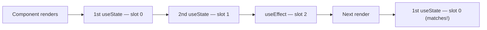
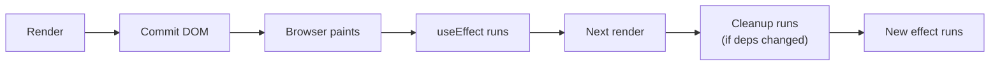

# Hooks: effects, refs, reducer, context, memoization

Hooks let function components hold state, run effects, and reuse logic. They replaced classes for almost all React code. Senior interviews probe whether you understand the **rules** (why hooks must be called in the same order every render) and the **timing** (when each hook fires relative to render and paint).

## Hook rules — and why they exist



React identifies hooks by **call order**, not name. The internal storage is a linked list, one node per hook call. Skip a `useState` on a re-render and the next hook reads the wrong slot — chaos.

Two hard rules:

1. **Always call hooks at the top level** — never inside `if`, loops, or after early returns.
2. **Only call hooks from React components or other hooks** — not from regular functions.

The eslint plugin `eslint-plugin-react-hooks` enforces these. Always run it.

## useState — the basic state cell

```jsx
const [count, setCount] = useState(0)

// Update with a value
setCount(5)

// Update based on previous (safe under batching)
setCount((c) => c + 1)
```

**Functional updates** (`setCount(c => c + 1)`) are required when the new state depends on the old. Without them, batching can make `setCount(count + 1)` called twice in a row only increment once — both calls captured the same stale `count`.

The initial value can be a function for **lazy initialisation**:

```jsx
const [items, setItems] = useState(() => loadFromLocalStorage()) // runs once
```

Without the function wrapper, `loadFromLocalStorage()` runs on every render — work React throws away.

## useEffect — sync with external systems

`useEffect` runs **after the commit** — the DOM is updated, the browser may have painted, then your effect runs.

```jsx
useEffect(() => {
  const id = setInterval(tick, 1000)
  return () => clearInterval(id) // cleanup runs before next effect or on unmount
}, [tick]) // dependency array
```



Use `useEffect` for:

- Subscribing to external sources (event listeners, web sockets, intervals).
- Synchronising state with localStorage or URL.
- Triggering imperative side effects (logging, analytics).

Do **not** use `useEffect` for:

- Computing derived state from props or other state — compute it during render.
- Resetting state when a prop changes — use the `key` prop or render-time comparison.
- Initialising a value — use lazy `useState`.

### useLayoutEffect

Runs **before paint**, between commit and the browser drawing. Same shape as `useEffect`. Use only for layout reads or DOM mutations that must finish before the user sees the next frame.

```jsx
useLayoutEffect(() => {
  const rect = ref.current.getBoundingClientRect()
  setHeight(rect.height)
}, [content])
```

`useEffect` is the default. `useLayoutEffect` blocks paint, so use it only when you must.

## useRef — the escape hatch

```jsx
const ref = useRef(null)

// As a DOM ref
<input ref={ref} />

// As a mutable value that does NOT trigger renders
const renderCount = useRef(0)
useEffect(() => { renderCount.current++ })

// As a stable callback ref
const stableHandler = useRef(handler)
useEffect(() => { stableHandler.current = handler })
```

`useRef` returns the **same object on every render**. Mutating `ref.current` does not re-render. Use it for:

- DOM nodes.
- Timer ids (`setTimeout`, `setInterval`).
- Mutable instance values that do not affect rendering.
- The "latest" pattern — `ref.current = latestValue` so an effect can read the freshest value without depending on it.

**Trap**: do not read `ref.current` during render and expect reactive behavior. Refs are not reactive.

## useReducer — state machines for complex logic

When state has many fields and transitions, a reducer is clearer than many `useState` calls.

```tsx
type State = { items: Item[]; status: 'idle' | 'loading' | 'error' }
type Action =
  | { type: 'fetch_started' }
  | { type: 'fetch_succeeded'; items: Item[] }
  | { type: 'fetch_failed' }

function reducer(state: State, action: Action): State {
  switch (action.type) {
    case 'fetch_started':
      return { ...state, status: 'loading' }
    case 'fetch_succeeded':
      return { items: action.items, status: 'idle' }
    case 'fetch_failed':
      return { ...state, status: 'error' }
  }
}

const [state, dispatch] = useReducer(reducer, { items: [], status: 'idle' })
```

The reducer is a **pure function**: same inputs, same output. Easy to test in isolation, easy to extend with new actions, easy to log all transitions.

## useContext — passing values through the tree

Context lets a value travel from a provider to any descendant without prop-drilling.

```tsx
type Theme = 'light' | 'dark'
const ThemeContext = createContext<Theme>('light')

function App() {
  const [theme, setTheme] = useState<Theme>('light')
  return (
    <ThemeContext.Provider value={theme}>
      <Toolbar />
    </ThemeContext.Provider>
  )
}

function ToolbarButton() {
  const theme = useContext(ThemeContext)
  return <button className={theme}>...</button>
}
```

**Cost**: every consumer re-renders when the provider's value changes. If the value is `{ user, setUser, settings }` and only `setUser` changes, every consumer re-renders even if they only use `user`.

**Mitigations**:

- **Split contexts** by what changes together — `UserContext`, `SettingsContext`.
- **Memoize the value** so it does not change reference on every render.
- For frequently-changing values, switch to a state library (Zustand, Jotai) that supports selectors.

```jsx
// BAD — new object every render → all consumers re-render
<MyContext.Provider value={{ a, b, c }}>...

// GOOD — stable reference
const value = useMemo(() => ({ a, b, c }), [a, b, c])
<MyContext.Provider value={value}>...
```

## useMemo and useCallback — performance, not correctness

Both cache a value across renders to avoid recomputation.

```jsx
const sorted = useMemo(() => sortLargeArray(items), [items])

const handleClick = useCallback((id) => {
  setItems((items) => items.filter((i) => i.id !== id))
}, [])
```

| Hook          | Caches               | Use when                                                      |
| ------------- | -------------------- | ------------------------------------------------------------- |
| `useMemo`     | A value              | Expensive computation, stable reference for memoised children |
| `useCallback` | A function reference | Passed to memoised children or as effect dep                  |

**They are not free**. Each call costs the equality check on dependencies. Wrapping every value in `useMemo` adds memory and slow checks for no benefit.

**Default to no memoization**. Add it when:

- A child is wrapped in `React.memo` and you pass it a callback.
- A heavy computation runs on every render and the inputs rarely change.
- A value is a dependency of `useEffect` and recreating it would re-run the effect.

React 19's compiler handles many of these automatically — the rule may shift to "trust the compiler" over time.

## Custom hooks — extract reusable logic

A custom hook is just a function whose name starts with `use` and which calls other hooks.

```jsx
function useDebounced<T>(value: T, ms: number): T {
  const [debounced, setDebounced] = useState(value)
  useEffect(() => {
    const id = setTimeout(() => setDebounced(value), ms)
    return () => clearTimeout(id)
  }, [value, ms])
  return debounced
}

// In a component
const debouncedQuery = useDebounced(query, 300)
```

Custom hooks **share logic, not state**. Each call gets its own state — two components calling `useDebounced` do not share the debounced value.

## Common mistakes

- **Forgetting cleanup in effects** — leaks event listeners, timers, websockets.
- **Stale closures** — function captured in `useEffect` references old state because it is not in the dep array. Run `eslint-plugin-react-hooks`.
- **Setting state in an effect that triggers another effect** — render loop. Refactor: derive state, or join effects.
- **Using `useRef` to hold state that affects rendering**. Refs do not re-render. Use `useState`.
- **Wrapping every callback in `useCallback`** without measuring. Adds overhead with no win.
- **Reading from context and using `useMemo` to bypass the re-render**. The component re-renders anyway when the context value changes; memoizing children does not help.
- **Setting state during render** to derive it from props. React calls this an anti-pattern; just compute it during render.

## Interview answers

_Q: Why must hooks be called in the same order every render?_
A: React identifies each hook by its call order, storing state in a linked list. Skipping a hook (via early return) shifts subsequent hooks to the wrong slot, reading the wrong state. The lint rule enforces this; without it, hooks would silently corrupt.

_Q: When does `useEffect` actually run?_
A: After the commit and the browser paint. The user sees the new DOM, then your effect runs. The previous effect's cleanup runs first if the dependency array changed. On unmount, only the cleanup runs.

_Q: What's the difference between `useEffect` and `useLayoutEffect`?_
A: `useEffect` runs after paint; `useLayoutEffect` runs before paint, blocking the browser from drawing. Use `useLayoutEffect` only for layout reads or DOM mutations that must finish before the user sees the frame. `useEffect` is the default.

_Q: When does context cause unnecessary re-renders?_
A: Whenever the provider's value changes by reference, every consumer re-renders. Most commonly, a parent re-renders and creates a new object literal `value={{ a, b }}`. Memoize the value with `useMemo` and split contexts by what changes together.

_Q: Why prefer functional updates in `setState`?_
A: They use the latest committed state, not the closure capture. Two `setCount(count + 1)` in a row both see the same `count`, so they both increment to the same value — the second is a no-op. `setCount(c => c + 1)` twice increments by 2.

_Q: How would you avoid a stale closure in an effect?_
A: Either include the variable in the dependency array (and let the effect re-run), or use a ref pattern: `const latestX = useRef(x); useEffect(() => { latestX.current = x })`, then read `latestX.current` inside the long-lived callback.

_Q: When does `React.memo` help?_
A: When a component is expensive to render and its props rarely change. `React.memo` shallow-compares props; if equal, it skips render. It's wasted overhead for cheap components or when props change every render anyway. Always measure before adding.
