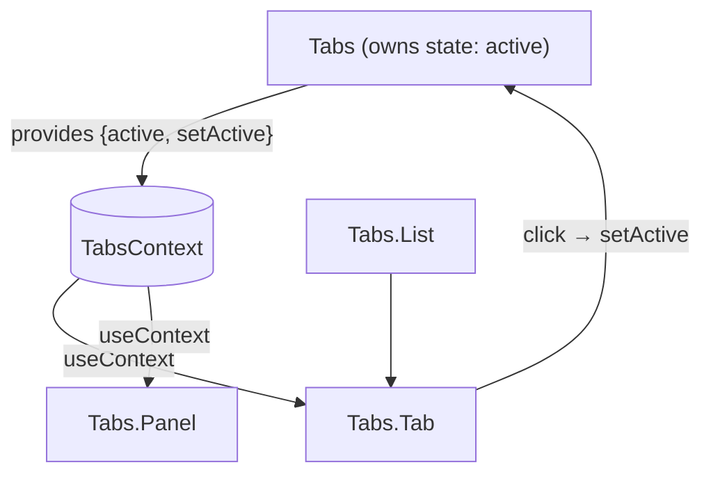

# Patterns: HOC, render props, compound components, controlled vs uncontrolled

React patterns are reusable ways to share behavior between components without copy-pasting code. Most of them came from the days before hooks. They still appear in big codebases, in libraries, and in interviews. Knowing them lets you read older code and pick the right tool when hooks are not enough.

## Why patterns matter

Imagine three components that all need to know the window size. Without patterns you copy the same `useEffect` into each. The code drifts. One file fixes a bug, the others keep it. Patterns give you one place to put the logic.

The four patterns below solve four different problems:

| Pattern                    | Problem it solves                                     | Today's replacement                 |
| -------------------------- | ----------------------------------------------------- | ----------------------------------- |
| Higher-order (HOC)         | Wrap a component to add behavior                      | Custom hook                         |
| Render props               | Let the parent customise what the child renders       | Custom hook + children-as-function  |
| Compound components        | Multiple components that work together as one feature | Still the best fit (Tabs, Select)   |
| Controlled vs uncontrolled | Who owns the form value: React or the DOM?            | Both still common; pick by use case |

## 1. Higher-order component (HOC)

A higher-order component is a function. It takes a component, returns a new component. The new component renders the old one with extra props.

```jsx
function withWindowSize(Component) {
  return function Wrapped(props) {
    const [size, setSize] = useState({ width: 0, height: 0 })
    useEffect(() => {
      const onResize = () => setSize({ width: window.innerWidth, height: window.innerHeight })
      onResize()
      window.addEventListener('resize', onResize)
      return () => window.removeEventListener('resize', onResize)
    }, [])
    return <Component {...props} windowSize={size} />
  }
}

// Usage
const ResponsiveCard = withWindowSize(Card)
```

**When you still see HOCs**: Redux's old `connect()`, `withRouter` from React Router v5, error boundaries from third-party libs. Most new code uses a hook instead:

```jsx
function useWindowSize() {
  const [size, setSize] = useState({ width: 0, height: 0 })
  useEffect(() => {
    const onResize = () => setSize({ width: window.innerWidth, height: window.innerHeight })
    onResize()
    window.addEventListener('resize', onResize)
    return () => window.removeEventListener('resize', onResize)
  }, [])
  return size
}
```

**Why hooks won**: HOCs add a wrapper to the React tree. Stack five HOCs and your DevTools shows `withA(withB(withC(...)))`. They also make TypeScript prop typing painful — generic component props get lost in the wrapping.

## 2. Render props

A render prop is a prop whose value is a function. The component calls that function and passes data into it. The parent decides what to render with that data.

```jsx
function MouseTracker({ render }) {
  const [pos, setPos] = useState({ x: 0, y: 0 })
  return (
    <div
      onMouseMove={(event) => setPos({ x: event.clientX, y: event.clientY })}
      style={{ height: 200 }}
    >
      {render(pos)}
    </div>
  )
}

// Usage — caller decides the look
;<MouseTracker
  render={({ x, y }) => (
    <p>
      Mouse at {x}, {y}
    </p>
  )}
/>
```

A common variant uses `children` as the function, so it reads more naturally:

```jsx
<MouseTracker>
  {({ x, y }) => (
    <p>
      Mouse at {x}, {y}
    </p>
  )}
</MouseTracker>
```

**When you still see render props**: Formik's `<Field>`, older Apollo `<Query>`, Downshift. Hooks replace most cases — you call the hook, you get the value, you render however you like.

## 3. Compound components

Compound components are a group of components that share state through React context. The parent owns the state. The children read from it.

The classic example is Tabs:

```jsx
const TabsContext = createContext(null)

function Tabs({ defaultValue, children }) {
  const [active, setActive] = useState(defaultValue)
  const value = useMemo(() => ({ active, setActive }), [active])
  return <TabsContext.Provider value={value}>{children}</TabsContext.Provider>
}

function TabList({ children }) {
  return <div role="tablist">{children}</div>
}

function Tab({ value, children }) {
  const { active, setActive } = useContext(TabsContext)
  const selected = active === value
  return (
    <button role="tab" aria-selected={selected} onClick={() => setActive(value)}>
      {children}
    </button>
  )
}

function TabPanel({ value, children }) {
  const { active } = useContext(TabsContext)
  if (active !== value) return null
  return <div role="tabpanel">{children}</div>
}

Tabs.List = TabList
Tabs.Tab = Tab
Tabs.Panel = TabPanel
```

Used like this — the API reads as one unit:

```jsx
<Tabs defaultValue="profile">
  <Tabs.List>
    <Tabs.Tab value="profile">Profile</Tabs.Tab>
    <Tabs.Tab value="settings">Settings</Tabs.Tab>
  </Tabs.List>
  <Tabs.Panel value="profile">Profile content</Tabs.Panel>
  <Tabs.Panel value="settings">Settings content</Tabs.Panel>
</Tabs>
```

How the data flows:



**Why this pattern is still the best fit**: the parent stays small, children stay focused, and consumers compose the markup naturally. Radix UI, shadcn/ui, Reach UI, and most modern libraries use it.

## 4. Controlled vs uncontrolled

This pattern is about who owns the form value.

**Controlled**: React state owns the value. Every keystroke goes through `onChange` and triggers a re-render.

```jsx
function ControlledInput() {
  const [name, setName] = useState('')
  return <input value={name} onChange={(event) => setName(event.target.value)} />
}
```

**Uncontrolled**: the DOM owns the value. React reads it through a ref, usually only on submit.

```jsx
function UncontrolledInput() {
  const ref = useRef(null)
  const onSubmit = (event) => {
    event.preventDefault()
    console.log('value:', ref.current.value)
  }
  return (
    <form onSubmit={onSubmit}>
      <input ref={ref} defaultValue="" />
      <button type="submit">Save</button>
    </form>
  )
}
```

| Concern                    | Controlled                        | Uncontrolled                        |
| -------------------------- | --------------------------------- | ----------------------------------- |
| Re-renders per keystroke   | Yes                               | No                                  |
| Live validation            | Easy (read state on every change) | Awkward (need refs and listeners)   |
| Disable submit until valid | Easy                              | Awkward                             |
| Big forms (50+ fields)     | Can feel slow without memoisation | Stays snappy by default             |
| Integration with libraries | React Hook Form, Formik           | React Hook Form's `register()` mode |

**Rule of thumb**: start controlled for small forms with live feedback. Switch to uncontrolled (or React Hook Form's uncontrolled mode) when the form is big and you only need the value on submit.

## Common mistakes

- **Re-creating an HOC inside `render`**. `withFoo(Component)` should run once at module scope, not on every render. Otherwise React unmounts and remounts the wrapped tree on every parent render.
- **Render-prop function defined inline causing re-renders**. The function is a new reference each render. If the child is wrapped in `React.memo`, the memo break. Wrap in `useCallback` if it matters.
- **Compound component used outside the provider**. `useContext(TabsContext)` returns the default value (often `null`) and the child crashes. Throw a clear error in the hook: `if (!ctx) throw new Error('Tab must be inside Tabs')`.
- **Switching a single input from uncontrolled to controlled**. React warns about it. Decide upfront. If the value can be `undefined`, fall back to `''` so it stays controlled.

## Interview answers

_Q: Why use compound components over a single configurable component?_
A: Configuration props grow without bound (`headerColor`, `tabSpacing`, `panelPadding`, ...). Compound components push composition out to the consumer, so they own the markup. The library only owns the state and behavior. The API stays small and the consumer keeps full layout control.

_Q: Are HOCs still useful in a hooks codebase?_
A: Rarely for new code. They are still useful for cross-cutting concerns that wrap rendering itself — error boundaries (a class-only feature until React 19's experimental hooks), feature flags that conditionally render a fallback tree, or lazy-loading wrappers. For most "share logic" cases, a hook is cleaner.

_Q: When would you pick an uncontrolled input over a controlled one?_
A: A large form where I do not need the value until submit, or a file input where the value is owned by the browser anyway. Also when integrating with non-React libraries that expect to write directly to the DOM. For everything else, controlled is the safer default.

_Q: What goes wrong if a compound component's children rearrange themselves into a non-Tabs parent (e.g. inside a Tooltip)?_
A: The child reads `useContext(TabsContext)` and finds either `null` or the wrong provider. The hook should throw a clear error so the bug surfaces at render time, not when the user clicks. This is one reason every shadcn primitive throws inside its `useXxxContext` hook.
