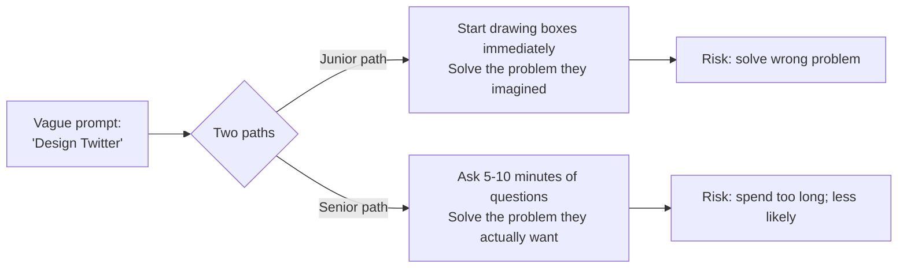
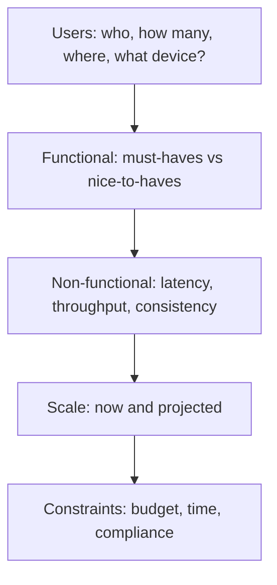

# Scoping & clarifying questions: requirements, constraints, assumptions in interviews

Senior candidates **do not start coding or designing immediately**. The first 5-10 minutes are about scoping. This is one of the cleanest signals separating juniors from seniors — and one of the easiest to fake yourself out of by jumping in too fast.

The interviewer is not testing whether you can solve the stated problem. They're testing whether you can identify **the right problem** to solve.

## Why scoping matters



Three things scoping buys:

1. **Aligns the conversation** — both you and interviewer agree on what's in scope.
2. **Demonstrates judgement** — picking the right questions is itself signal.
3. **Surfaces constraints** — interviewer often has implicit requirements they reveal only when asked.

## Coding round scoping

Before writing code, ask:

| Question                           | Why it matters                              |
| ---------------------------------- | ------------------------------------------- |
| "What are the input constraints?"  | Determines algorithm choice (n=10⁹ ≠ n=10²) |
| "Are there duplicates?"            | Affects hashmap vs set, indexes             |
| "Empty input — return what?"       | Edge case; clarify before coding            |
| "Negative numbers / zero allowed?" | Affects accumulators, boundary checks       |
| "Should the result be sorted?"     | Sort cost vs natural ordering               |
| "Is mutation allowed in place?"    | Space complexity                            |
| "What is the expected complexity?" | Reveals what the interviewer is looking for |
| "Single-threaded or concurrent?"   | Locks, atomic primitives                    |
| "Streaming / unbounded input?"     | Cannot use sort or full-scan algorithms     |

State assumptions out loud:

> "I'm going to assume the array fits in memory. If it didn't, I'd swap to external sort or streaming approach. OK?"

The interviewer either says "yes, that's fine" or "actually, what if it doesn't fit?" — both are useful signal.

## System design scoping

For 45-60 min system design, scope for 5-10 min before drawing.



### The senior scoping checklist

| Bucket               | Questions                                                                    |
| -------------------- | ---------------------------------------------------------------------------- |
| **Users**            | Who uses it? How many DAU? Where in the world? What devices?                 |
| **Functional scope** | What features in v1? What can defer to v2? Anything explicitly out of scope? |
| **Read/write ratio** | Read-heavy (Twitter feeds), write-heavy (logging), balanced?                 |
| **Latency**          | p50 target? p99 target? Real-time vs near-real-time?                         |
| **Consistency**      | Strong (banking) or eventual (likes)? Read-your-writes needed?               |
| **Geography**        | Single region or multi-region? Failover requirements?                        |
| **Compliance**       | PII? Payment data (PCI-DSS)? Health data (HIPAA)? Regional residency (GDPR)? |
| **Availability SLO** | 99.9%? 99.99%? Outage cost?                                                  |
| **Existing systems** | Are we integrating with existing services? Greenfield?                       |

You do not need every answer. Pick 5-7 most relevant to the problem, get answers, and **proceed clearly stating your assumptions**.

### Example scoping for "Design a chat system"

```
Me: Before designing, let me scope.
   - Users: how many DAU? Geographic spread?
Interviewer: 50M DAU, global.

Me: Functional:
   - 1:1 chat? Group chat? Both?
   - Group size cap?
   - Media (images, video) or text only for v1?
   - Read receipts, typing indicators, presence?
Interviewer: Both 1:1 and groups up to 200. Text only for v1. Read receipts and presence.

Me: Non-functional:
   - Latency target for send-to-receive?
   - Messages must be ordered? Per-chat or globally?
Interviewer: < 200 ms send-to-receive. Ordered per chat.

Me: Anything specific:
   - Encryption — E2E or server-side?
Interviewer: Not E2E for v1.

Me: Got it. So v1 is global text-only chat with 50M DAU, 1:1 + groups ≤ 200, < 200 ms latency, per-chat ordering, server-side encryption. Let me sketch...
```

That summary back to the interviewer is gold. It confirms alignment and gives them one last chance to add something.

## Behavioural scoping

Less obvious but equally important. When the interviewer says "tell me about a time...", clarify what they want.

> "Are you looking for cross-team collaboration, technical depth, or something else?"

This works because:

- You pick a story that fits exactly what they're scoring.
- You demonstrate self-awareness about what kind of competency they're testing.
- It shows you think about your audience.

Senior interviewers love this question. Juniors rarely ask.

## Avoiding scoping anti-patterns

| Anti-pattern                                                 | Better                                               |
| ------------------------------------------------------------ | ---------------------------------------------------- |
| 30 minutes of scoping; no design done                        | 5-10 min, then start sketching                       |
| Asking questions you can answer yourself ("Should it work?") | Ask only when the answer changes your design         |
| Asking yes/no questions only                                 | Open-ended where it matters ("How users access it?") |
| Not summarising back                                         | "Let me confirm: ..." before moving on               |
| Treating scoping as bureaucracy                              | Treat it as the first design step                    |

## When to skip scoping

- **Coding interviews on a clear LeetCode problem**: ask 1-2 clarifying questions, not 10. The problem is known; over-scoping wastes time.
- **Interviewer explicitly says "skip scoping"**: do as told.
- **Tight time**: 45-min coding round, 5 min scoping max.

Scoping should be **proportional to ambiguity**. Crystal-clear problem: 1 question. Vague open-ended ("design Uber"): 10 minutes.

## Common pitfalls

- **Asking too few questions**: jumping into a solution that misses key constraint.
- **Asking too many questions**: looks like stalling, not scoping.
- **Asking after committing**: design with assumption X, halfway through ask "is X true?", get "no it's not." Now half your design is wrong.
- **Ignoring the interviewer's hints**: if they say "let me give you a constraint: it must work offline" — that is a giant clue. Pivot immediately.
- **Treating scoping questions as scripted**: tailor them to the actual problem. A scope-by-rote question ("what's the read/write ratio?" on a problem with no read/write distinction) sounds canned.
- **Not summarising back**: silence between scoping and design is a missed alignment check.

## Interview answers

_Q: How long should I spend scoping in a 45-minute system design?_
A: 5-10 minutes. After that, the interviewer will move you on. The split: ~7 min scoping, ~25 min design, ~10 min deep-dive on a specific area, ~3 min wrap-up.

_Q: What if the interviewer is impatient with my scoping?_
A: Pivot. They might just want to see you design. "Got it. With those assumptions, let me start..." Match their pace.

_Q: How do I scope for a problem I've never seen?_
A: Apply the senior checklist (users, functional, non-functional, scale, constraints). Even unfamiliar problems fit the pattern. The first time you do "design a code review tool" you have no special knowledge, but the scoping checklist applies regardless.

_Q: Should I take notes during scoping?_
A: Yes — write the agreed scope at the top of the whiteboard or shared doc. You'll refer back to it often, and it's a visible artifact of your alignment with the interviewer.

_Q: What if the interviewer's answers contradict each other?_
A: Surface it: "You said low latency is critical and that we use multiple regions with strong consistency. Those pull in opposite directions — which one wins?" Forcing the trade-off back to them is itself a senior signal.

_Q: How do I scope behavioural questions without sounding evasive?_
A: One quick clarifier, then commit: "Are you looking for cross-team or within-team conflict?" Get answer, tell story. Don't pile on multiple clarifiers — that does sound evasive.

_Q: How do I tell scoping from stalling?_
A: Scoping leads to a decision point ("OK, given those constraints, here's my plan..."). Stalling produces more questions but no plan. If you've asked 5 questions and still feel lost, just commit: "Given what we have, I'll start with X. We can revise as we go."
